# 第一章：搭建整合环境

## 1. 搭建和测试SpringMVC的开发环境

1.整合说明：SSM整合可以使用多种方式，咱们会选择XML + 注解的方式

2.整合的思路

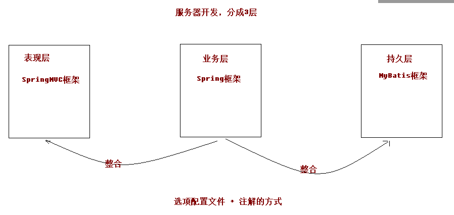

- 先搭建整合的环境
- 先把Spring的配置搭建完成
- 再使用Spring整合SpringMVC框架
- 最后使用Spring整合MyBatis框架

3.创建数据库和表结构

语句

```mysql
create database ssm;
use ssm;
create table account(
id int primary key auto_increment,
name varchar(20),
money double
);
```

4.创建maven的工程（这里是在已有的project中创建一个model）

- 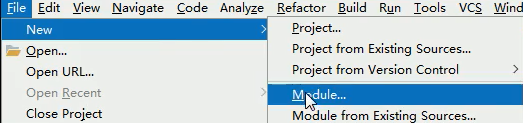
- 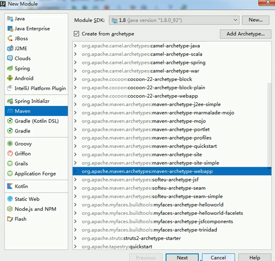
- 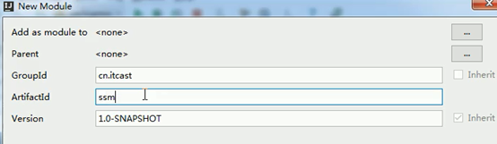
- 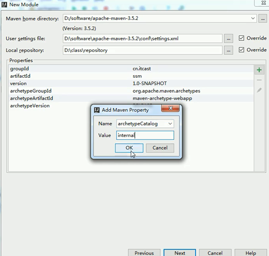

`archetypeCatalog     internal`

(上面一图：解决项目加载太慢问题)

- 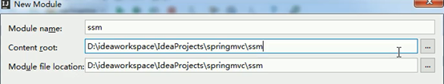


5. 在项目的pom.xml文件中引入坐标依赖

```xml
<properties>
   <project.build.sourceEncoding>UTF-8</project.build.sourceEncoding>
   <maven.compiler.source>1.8</maven.compiler.source>
   <maven.compiler.target>1.8</maven.compiler.target>
   <spring.version>5.0.2.RELEASE</spring.version>
   <slf4j.version>1.6.6</slf4j.version>
   <log4j.version>1.2.12</log4j.version>
   <mysql.version>5.1.6</mysql.version>
   <mybatis.version>3.4.5</mybatis.version>
 </properties>
 <dependencies>
   <!-- spring -->
   <dependency>
     <groupId>org.aspectj</groupId>
     <artifactId>aspectjweaver</artifactId>
     <version>1.6.8</version>
   </dependency>
   <dependency>
     <groupId>org.springframework</groupId>
     <artifactId>spring-aop</artifactId>
     <version>${spring.version}</version>
   </dependency>
   <dependency>
     <groupId>org.springframework</groupId>
     <artifactId>spring-context</artifactId>
     <version>${spring.version}</version>
   </dependency>
   <dependency>
     <groupId>org.springframework</groupId>
     <artifactId>spring-web</artifactId>
     <version>${spring.version}</version>
   </dependency>
   <dependency>
     <groupId>org.springframework</groupId>
     <artifactId>spring-webmvc</artifactId>
     <version>${spring.version}</version>
   </dependency>
   <dependency>
     <groupId>org.springframework</groupId>
     <artifactId>spring-test</artifactId>
     <version>${spring.version}</version>
   </dependency>
   <dependency>
     <groupId>org.springframework</groupId>
     <artifactId>spring-tx</artifactId>
     <version>${spring.version}</version>
   </dependency>
   <dependency>
     <groupId>org.springframework</groupId>
     <artifactId>spring-jdbc</artifactId>
     <version>${spring.version}</version>
   </dependency>
   <dependency>
     <groupId>junit</groupId>
     <artifactId>junit</artifactId>
     <version>4.12</version>
     <scope>compile</scope>
   </dependency>
   <dependency>
     <groupId>mysql</groupId>
     <artifactId>mysql-connector-java</artifactId>
     <version>${mysql.version}</version>
   </dependency>
   <dependency>
     <groupId>javax.servlet</groupId>
     <artifactId>servlet-api</artifactId>
     <version>2.5</version>
     <scope>provided</scope>
   </dependency>
   <dependency>
     <groupId>javax.servlet.jsp</groupId>
     <artifactId>jsp-api</artifactId>
     <version>2.0</version>
     <scope>provided</scope>
   </dependency>
   <dependency>
     <groupId>jstl</groupId>
     <artifactId>jstl</artifactId>
     <version>1.2</version>
   </dependency>
   <!-- log start -->
   <dependency>
     <groupId>log4j</groupId>
     <artifactId>log4j</artifactId>
     <version>${log4j.version}</version>
   </dependency>
   <dependency>
     <groupId>org.slf4j</groupId>
     <artifactId>slf4j-api</artifactId>
     <version>${slf4j.version}</version>
   </dependency>
   <dependency>
     <groupId>org.slf4j</groupId>
     <artifactId>slf4j-log4j12</artifactId>
     <version>${slf4j.version}</version>
   </dependency>
   <!-- log end -->
   <dependency>
     <groupId>org.mybatis</groupId>
     <artifactId>mybatis</artifactId>
     <version>${mybatis.version}</version>
   </dependency>
   <dependency>
     <groupId>org.mybatis</groupId>
     <artifactId>mybatis-spring</artifactId>
     <version>1.3.0</version>
   </dependency>
   <dependency>
     <groupId>c3p0</groupId>
     <artifactId>c3p0</artifactId>
     <version>0.9.1.2</version>
     <type>jar</type>
     <scope>compile</scope>
   </dependency>
 </dependencies>
 <build>
   <finalName>ssm</finalName>
   <pluginManagement><!-- lock down plugins versions to avoid using Maven defaults (may be moved to parent pom) -->
     <plugins>
       <plugin>
         <artifactId>maven-clean-plugin</artifactId>
         <version>3.1.0</version>
       </plugin>
       <!-- see http://maven.apache.org/ref/current/maven-core/default-bindings.html#Plugin_bindings_for_war_packaging -->
       <plugin>
         <artifactId>maven-resources-plugin</artifactId>
         <version>3.0.2</version>
       </plugin>
       <plugin>
         <artifactId>maven-compiler-plugin</artifactId>
         <version>3.8.0</version>
       </plugin>
       <plugin>
         <artifactId>maven-surefire-plugin</artifactId>
         <version>2.22.1</version>
       </plugin>
       <plugin>
         <artifactId>maven-war-plugin</artifactId>
         <version>3.2.2</version>
       </plugin>
       <plugin>
         <artifactId>maven-install-plugin</artifactId>
         <version>2.5.2</version>
       </plugin>
       <plugin>
         <artifactId>maven-deploy-plugin</artifactId>
         <version>2.8.2</version>
       </plugin>
     </plugins>
   </pluginManagement>
 </build>
```

 

6. 创建目录

- 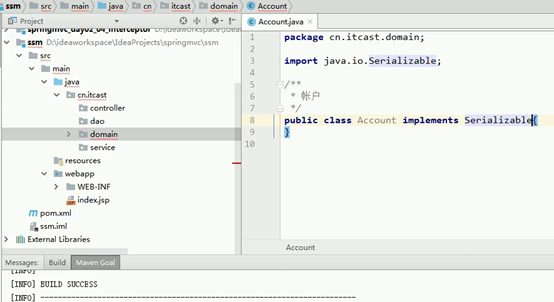

7. 编写实体类，在ssm_domain项目中编写

```java
package cn.itcast.domain;

import java.io.Serializable;

/**
 * 账户
 */

public class Account implements Serializable {

    private Integer id;
    private String name;
    private Double money;

    public Integer getId() {
        return id;
    }

    public void setId(Integer id) {
        this.id = id;
    }

    public String getName() {
        return name;
    }

    public void setName(String name) {
        this.name = name;
    }

    public Double getMoney() {
        return money;
    }

    public void setMoney(Double money) {
        this.money = money;
    }
}
```

8. 编写dao接口

```java
package cn.itcast.dao;

import cn.itcast.domain.Account;
import java.util.List;

/**
 * 账户dao接口
 */

public interface AccountDao {
    //查询所有账户
    public List<Account> findAll();
    //保存账户信息
    public void saveAccount(Account account);
}
```

9. 编写service接口和实现类

```java
package cn.itcast.service;


import cn.itcast.domain.Account;


import java.util.List;


public interface AccountService {

    //查询所有账户

    public List<Account> findAll();

    //保存账户信息

    public void saveAccount(Account account);

} 
```

---

```java
package cn.itcast.service.impl;

import cn.itcast.domain.Account;
import cn.itcast.service.AccountService;
import java.util.List;

public class AccountServiceImpl implements AccountService {
    public List<Account> findAll() {
        System.out.println("业务层：查询所有的账户信息...");
        return null;
    }

    public void saveAccount(Account account) {
        System.out.println("业务层：保存账户...");
    }
}
```

- 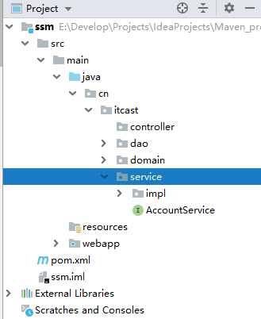

   

10. 编写web层controller

```java
package cn.itcast.controller;

/**
 * 账户web
 */
public class AccountController {

}
```

# 第二章：Spring框架代码的编写

------


## 1.搭建和测试Spring的开发环境

​	tips: 把service、dao这些全部都交给Ioc容器去管理（使用注解）

1. 在ssm_web项目中创建applicationContext.xml的配置文件，编写具体的配置信息。

```xml
<?xml version="1.0" encoding="UTF-8"?>
<beans xmlns="http://www.springframework.org/schema/beans"
     xmlns:xsi="http://www.w3.org/2001/XMLSchema-instance"
     xmlns:context="http://www.springframework.org/schema/context"
     xmlns:aop="http://www.springframework.org/schema/aop"
     xmlns:tx="http://www.springframework.org/schema/tx"
     xsi:schemaLocation="http://www.springframework.org/schema/beans
     http://www.springframework.org/schema/beans/spring-beans.xsd
     http://www.springframework.org/schema/context
     http://www.springframework.org/schema/context/spring-context.xsd
     http://www.springframework.org/schema/aop
     http://www.springframework.org/schema/aop/spring-aop.xsd
     http://www.springframework.org/schema/tx
     http://www.springframework.org/schema/tx/spring-tx.xsd">

    <!-- 开启注解扫描，要扫描的是service和dao层的注解，要忽略web层注解，因为web层的Controller让			SpringMVC框架
    	去管理 -->
    <context:component-scan base-package="cn.itcast">
     <!-- 配置要忽略的注解 -->
     <context:exclude-filter type="annotation"
     expression="org.springframework.stereotype.Controller"/>
    </context:component-scan>

</beans>
```

2. 在service的实现类(AccountServiceImpl)上加注解@Service("accountService")，相当于

		把service这个类交给了Ioc容器去管理。

3. 编写测试方法

   在cn.itcast下创建test目录

   ```java
   package cn.itcast.test;
   
   import cn.itcast.service.AccountService;
   import org.junit.Test;
   import org.springframework.context.ApplicationContext;
   import org.springframework.context.support.ClassPathXmlApplicationContext;
   
   public class TestSpring {
   
       @Test
       public void run1() {
           //加载配置文件
           ApplicationContext ac = new ClassPathXmlApplicationContext("classpath:applicationContext.xml");
           //获取对象
           AccountService as = (AccountService) ac.getBean("accountService");
           //调用方法
           as.findAll();
       }
   }
   ```

   ------

   运行测试方法，显示为绿色，有输出语句：“业务层：查询所有的账户信息...”，==说明 spring环境 搭建成功==。

   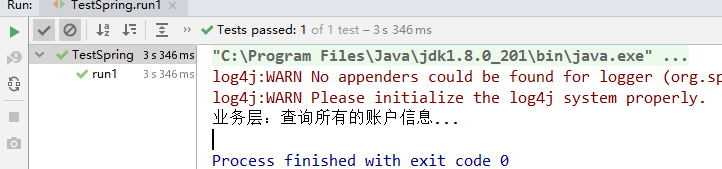

   警告没有log4j的配置文件，引入文件到resources目录即可。

   

# 第三章：Spring整合SpringMVC框架

------

## 1.搭建和测试SpringMVC的开发环境

1. 在web.xml中配置DispatcherServlet 前端控制器
2. 在web.xml中配置DispatcherServlet 过滤器解决中文乱码
   ```java
   <!DOCTYPE web-app PUBLIC
    "-//Sun Microsystems, Inc.//DTD Web Application 2.3//EN"
    "http://java.sun.com/dtd/web-app_2_3.dtd" >
   
   <web-app>
     <display-name>Archetype Created Web Application</display-name>
     
     <!-- 一. -->
     <!--1.配置前端控制器-->
     <servlet>
       <servlet-name>dispatcherServlet</servlet-name>
       <servlet-class>org.springframework.web.servlet.DispatcherServlet</servlet-class>
       <!--3.加载springmvc.xml配置文件-->
       <init-param>
         <param-name>contextConfigLocation</param-name>
         <param-value>classpath:springmvc.xml</param-value>
       </init-param>
       <!--4.启动服务器，创建该servlet-->
       <load-on-startup>1</load-on-startup>
     </servlet>
     <!--2.-->
     <servlet-mapping>
       <servlet-name>dispatcherServlet</servlet-name>
       <url-pattern>/</url-pattern>
     </servlet-mapping>
     
      <!-- 二. -->
     <!--5.解决中文乱码的过滤器-->
     <filter>
       <filter-name>characterEncodingFilter</filter-name>
       <filter-class>org.springframework.web.filter.CharacterEncodingFilter</filter-class>
       <!--7.设置具体的编码集-->
       <init-param>
         <param-name>encoding</param-name>
         <param-value>UTF-8</param-value>
       </init-param>
     </filter>
     <!--6./*表示什么都拦截-->
     <filter-mapping>
       <filter-name>characterEncodingFilter</filter-name>
       <url-pattern>/*</url-pattern>
     </filter-mapping>
   </web-app>
   
   ```

   3. 创建springmvc.xml配置文件

      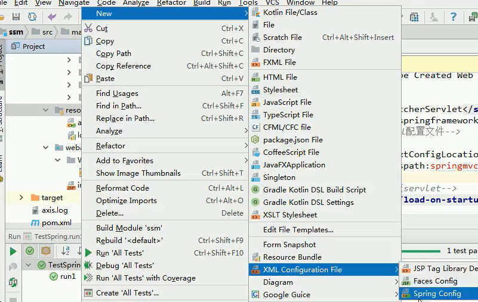

      ```xml
      <?xml version="1.0" encoding="UTF-8"?>
      <beans xmlns="http://www.springframework.org/schema/beans"
             xmlns:mvc="http://www.springframework.org/schema/mvc"
             xmlns:context="http://www.springframework.org/schema/context"
             xmlns:xsi="http://www.w3.org/2001/XMLSchema-instance"
             xsi:schemaLocation="
              http://www.springframework.org/schema/beans
              http://www.springframework.org/schema/beans/spring-beans.xsd
              http://www.springframework.org/schema/mvc
              http://www.springframework.org/schema/mvc/spring-mvc.xsd
              http://www.springframework.org/schema/context
              http://www.springframework.org/schema/context/spring-context.xsd">
          <!--开启注解扫描，只扫描Controller注解-->
          <context:component-scan base-package="cn.itcast">
              <context:include-filter type="annotation" expression="org.springframework.stereotype.Controller"/>
          </context:component-scan>
      
          <!--配置视图解析器对象-->
          <bean id="internalResourceViewResolver" class="org.springframework.web.servlet.view.InternalResourceViewResolver">
              <property name="prefix" value="/WEB-INF/pages"/>
              <property name="suffix" value=".jsp"/>
          </bean>
      
          <!--设置静态资源不过滤-->
          <mvc:resources location="/css/" mapping="/css/**" />
          <mvc:resources location="/images/" mapping="/images/**" />
          <mvc:resources location="/js/" mapping="/js/**" />
      
          <!--开启对springmvc注解的支持-->
          <mvc:annotation-driven/>
      </beans>
      ```

      4. 测试SpringMVC的框架搭建是否成功(配置文件配置完成，就可以发请求访问controller中的方法)

         删掉index.jsp，重新在webapp上创建index.jsp页面（重创原因：重新创建之前缺少文件内容）

         ```jsp
         <%--
           Created by IntelliJ IDEA.
           User: Administrator
           Date: 2019/3/23 0023
           Time: 22:39
           To change this template use File | Settings | File Templates.
         --%>
         <%@ page contentType="text/html;charset=UTF-8" language="java" %>
         <html>
         <head>
             <title>Title</title>
         </head>
         <body>
             <a href="account/findAll">测试</a>
         </body>
         </html>
         
         ```

         ------

         在controller中填写测试方法

         ```java
         package cn.itcast.controller;
         
         import org.springframework.stereotype.Controller;
         import org.springframework.web.bind.annotation.RequestMapping;
         
         /**
          * 账户web
          */
         @Controller
         @RequestMapping("/account")//一级目录
         public class AccountController {
         
             @RequestMapping("/findAll")//二级目录
             public String findAll() {
                 System.out.println("表现层：查询所有账户...");
                 return "list";
             }
         }
         
         ```

         ------

         在WEB-INF下创建pages目录，在pages下创建list.jsp页面 

         ```java
         <%--
           Created by IntelliJ IDEA.
           User: Administrator
           Date: 2019/3/23 0023
           Time: 22:50
           To change this template use File | Settings | File Templates.
         --%>
         <%@ page contentType="text/html;charset=UTF-8" language="java" %>
         <html>
         <head>
             <title>Title</title>
         </head>
         <body>
             <h3>查询所有账户</h3>
         </body>
         </html>
         
         ```

         ------

         部署项目：

         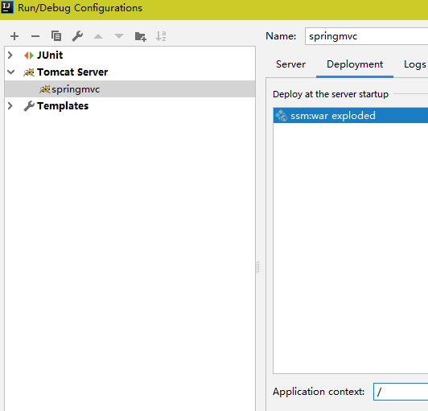

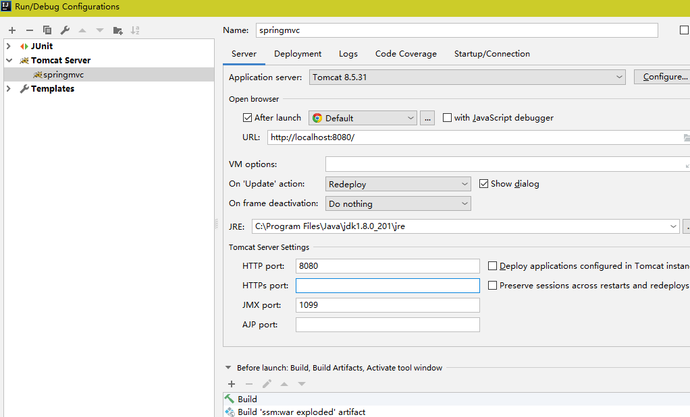

------

启动项目

- 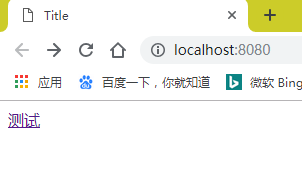

- 点击测试：

  

- 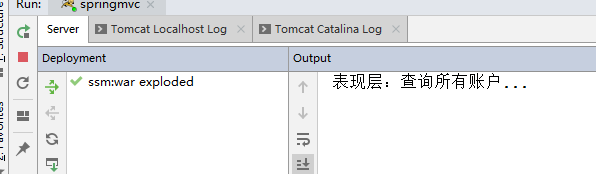

==说明springmvc环境搭建完成！==

------

## 2. Spring整合SpringMVC的框架

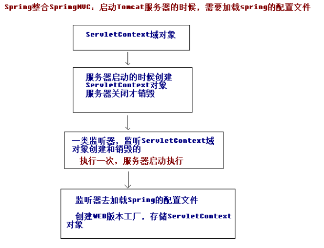

1. 目的：在controller中能成功的调用service对象中的方法。

2. 在项目启动的时候，就去加载applicationContext.xml的配置文件，在web.xml中配置
  ContextLoaderListener监听器（该监听器只能加载WEB-INF目录下的applicationContext.xml的配置文
  件）。

  tips: 这儿配置的是步骤三。

> ```xml
> <!DOCTYPE web-app PUBLIC
>  "-//Sun Microsystems, Inc.//DTD Web Application 2.3//EN"
>  "http://java.sun.com/dtd/web-app_2_3.dtd" >
> 
> <web-app>
>   <display-name>Archetype Created Web Application</display-name>
> 
>   <!-- 三. -->
>   <!--8.配置spring的监听器，默认只加载WEB-INF目录下的applicationContext.xml配置文件-->
>   <listener>
>     <listener-class>org.springframework.web.context.ContextLoaderListener</listener-class>
>   </listener>
>   <!--9.设置配置文件的路径-->
>   <context-param>
>     <param-name>contextConfigLocation</param-name>
>     <param-value>classpath:applicationContext.xml</param-value>
>   </context-param>
> 
>   <!--一.1.配置前端控制器-->
>   <servlet>
>     <servlet-name>dispatcherServlet</servlet-name>
>     <servlet-class>org.springframework.web.servlet.DispatcherServlet</servlet-class>
>     <!--3.加载springmvc.xml配置文件-->
>     <init-param>
>       <param-name>contextConfigLocation</param-name>
>       <param-value>classpath:springmvc.xml</param-value>
>     </init-param>
>     <!--4.启动服务器，创建该servlet-->
>     <load-on-startup>1</load-on-startup>
>   </servlet>
>   <!--2.-->
>   <servlet-mapping>
>     <servlet-name>dispatcherServlet</servlet-name>
>     <url-pattern>/</url-pattern>
>   </servlet-mapping>
> 
> 
>   <!--二.5.解决中文乱码的过滤器-->
>   <filter>
>     <filter-name>characterEncodingFilter</filter-name>
>     <filter-class>org.springframework.web.filter.CharacterEncodingFilter</filter-class>
>     <!--7.设置具体的编码集-->
>     <init-param>
>       <param-name>encoding</param-name>
>       <param-value>UTF-8</param-value>
>     </init-param>
>   </filter>
>   <!--6./*表示什么都拦截-->
>   <filter-mapping>
>     <filter-name>characterEncodingFilter</filter-name>
>     <url-pattern>/*</url-pattern>
>   </filter-mapping>
> </web-app>
> 
> ```

3. 在controller中注入service对象，调用service对象的方法进行测试

   ```java
   package cn.itcast.controller;
   
   import cn.itcast.service.AccountService;
   import org.springframework.beans.factory.annotation.Autowired;
   import org.springframework.stereotype.Controller;
   import org.springframework.web.bind.annotation.RequestMapping;
   
   /**
    * 账户web
    */
   @Controller
   @RequestMapping("/account")//一级目录
   public class AccountController {
   
       @Autowired //自动注入
       private AccountService accountService;
   
       @RequestMapping("/findAll")//二级目录
       public String findAll() {
           System.out.println("表现层：查询所有账户...");
   
           //调用service的方法
           accountService.findAll();
   
           return "/list";
       }
   }
   ```

重新测试项目：

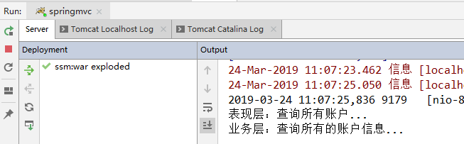

==spring整合springmvc成功。==他的方式就是：启动服务器加载spring的配置文件applicationContext.xml，然后在controller里面注入service对象就可以了。

------

# 第四章：Spring整合MyBatis框架

## 1. 搭建和测试MyBatis的环境

1. 在web项目中编写SqlMapConfig.xml的配置文件，编写核心配置文件

   ```xml
   <?xml version="1.0" encoding="UTF-8"?>
   <!DOCTYPE configuration
           PUBLIC "-//mybatis.org//DTD Config 3.0//EN"
           "http://mybatis.org/dtd/mybatis-3-config.dtd">
   <configuration>
       <!--配置环境-->
       <environments default="mysql">
           <environment id="mysql">
               <transactionManager type="JDBC"></transactionManager>
               <dataSource type="POOLED">
                   <property name="driver" value="com.mysql.jdbc.Driver"/>
                   <property name="url" value="jdbc:mysql:///ssm"/>
                   <property name="username" value="root"/>
                   <property name="password" value="root"/>
               </dataSource>
           </environment>
       </environments>
   
       <!--引入映射配置文件-->
       <mappers>
           <!--这是配置文件的方式<mapper resource="cn/itcast/dao/xxx.xml"></mapper>
               ，而现在使用的是注解
           -->
   
           <!--注解的方式：dao下的AccountDao接口可以被扫到<mapper 			   class="cn.itcast.dao.AccountDao"/>-->
   
           <!--cn.itcast.dao包下的所有接口可以被扫到-->
           <package name="cn.itcast.dao"></package>
       </mappers>
   </configuration>
   ```

2. 在AccountDao接口的方法上添加注解，编写SQL语句

   ```java
   package cn.itcast.dao;
   
   import cn.itcast.domain.Account;
   import org.apache.ibatis.annotations.Insert;
   import org.apache.ibatis.annotations.Select;
   
   import java.util.List;
   
   /**
    * 账户dao接口
    */
   public interface AccountDao {
   
       //查询所有账户
       @Select("select * from account")
       public List<Account> findAll();
   
       //保存账户信息
       @Insert("insert into account(name,money) values(#{name},#{money})")
       public void saveAccount(Account account);
   
   }
   ```

   3.编写测试的方法 ：创建TestMyBatis.java，给Account添加toString()方法，数据库中添加测试数据

   ```java
   package cn.itcast.test;
   
   import cn.itcast.dao.AccountDao;
   import cn.itcast.domain.Account;
   import org.apache.ibatis.io.Resources;
   import org.apache.ibatis.session.SqlSession;
   import org.apache.ibatis.session.SqlSessionFactory;
   import org.apache.ibatis.session.SqlSessionFactoryBuilder;
   import org.junit.Test;
   
   import java.io.IOException;
   import java.io.InputStream;
   import java.util.List;
   
   public class TestMyBatis {
   
       /**
        * 测试查询
        * @throws Exception
        */
       @Test
       public void run1() throws Exception {
           //加载配置文件
           InputStream in = Resources.getResourceAsStream("SqlMapConfig.xml");
           //创建SqlSessionFactory对象,构建者模式,他会构建一个SqlSessionFactory对象
           SqlSessionFactory sqlSessionFactory = new SqlSessionFactoryBuilder().build(in);
           //创建SqlSession对象
           SqlSession sqlSession = sqlSessionFactory.openSession();
           //获取到代理对象
           AccountDao dao = sqlSession.getMapper(AccountDao.class);
   
           //查询所有数据,不需要管事务
           List<Account> list = dao.findAll();
           for(Account account : list) {
               System.out.println(account);
           }
   
           //关闭资源
           sqlSession.close();
           in.close();
       }
   
       /**
        * 测试保存
        * @throws Exception
        */
       @Test
       public void run2() throws Exception {
           Account account = new Account();
           account.setName("熊大");
           account.setMoney(400d);//400d  money为Double类型
           //加载配置文件
           InputStream in = Resources.getResourceAsStream("SqlMapConfig.xml");
           //创建SqlSessionFactory对象,构建者模式,他会构建一个SqlSessionFactory对象
           SqlSessionFactory sqlSessionFactory = new SqlSessionFactoryBuilder().build(in);
           //创建SqlSession对象
           SqlSession sqlSession = sqlSessionFactory.openSession();
           //获取到代理对象
           AccountDao dao = sqlSession.getMapper(AccountDao.class);
   
           //保存账户,  增删改需要手动提交事务
           dao.saveAccount(account);
   
           //提交事务
           sqlSession.commit();
   
           //关闭资源
           sqlSession.close();
           in.close();
       }
   
   }
   ```

   运行程序：有打印数据，说明查询方法没有问题，数据库有数据，说明保存账户方法没有问题，增删改需要手动提交事务，查询不用管事务。==MyBatis环境搭建完成。==

   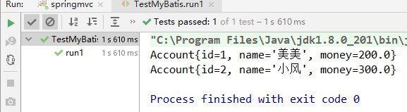

## 2. Spring整合MyBatis框架

//这是获取到的代理对象
`AccountDao dao = sqlSession.getMapper(AccountDao.class);`

思路: 想办法把代理对象存入Ioc容器，然后在service注入dao对象

1. 目的：把SqlMapConfig.xml配置文件中的内容配置到 applicationContext.xml 配置文件中。以后SqlSession全部由Spring容器来创建，有工厂可以创建SqlSession,有SqlSession可以创建代理对象，它可以把代理对象存储到Spring的容器里面去。如果dao和service放容器了，则可以完成正常的依赖注入。配置完成以后，删除SqlMapConfig.xml配置文件。

   ```xml
   <?xml version="1.0" encoding="UTF-8"?>
   <beans xmlns="http://www.springframework.org/schema/beans"
          xmlns:xsi="http://www.w3.org/2001/XMLSchema-instance"
          xmlns:context="http://www.springframework.org/schema/context"
          xmlns:aop="http://www.springframework.org/schema/aop"
          xmlns:tx="http://www.springframework.org/schema/tx"
          xsi:schemaLocation="http://www.springframework.org/schema/beans
       http://www.springframework.org/schema/beans/spring-beans.xsd
       http://www.springframework.org/schema/context
       http://www.springframework.org/schema/context/spring-context.xsd
       http://www.springframework.org/schema/aop
       http://www.springframework.org/schema/aop/spring-aop.xsd
       http://www.springframework.org/schema/tx
       http://www.springframework.org/schema/tx/spring-tx.xsd">
       <!-- 开启注解扫描，要扫描的是service和dao层的注解，要忽略web层注解，因为web层的Controller让        SpringMVC框架
          去管理 -->
       <context:component-scan base-package="cn.itcast">
           <context:exclude-filter type="annotation" expression="org.springframework.stereotype.Controller"></context:exclude-filter>
       </context:component-scan>
   
       <!--Spring整合MyBatis框架-->
       <!--配置c3p0连接池-->
       <bean id="dataSource" class="com.mchange.v2.c3p0.ComboPooledDataSource">
           <property name="driverClass" value="com.mysql.jdbc.Driver"/>
           <property name="jdbcUrl" value="jdbc:mysql:///ssm"/>
           <property name="user" value="root"/>
           <property name="password" value="root"/>
       </bean>
   
       <!--配置SqlSessionFactory工厂-->
       <bean id="sqlSessionFactory" class="org.mybatis.spring.SqlSessionFactoryBean">
           <property name="dataSource" ref="dataSource"/>
       </bean>
   
       <!--配置AccountDao接口所在包,也就是配置扫描dao的包-->
       <bean id="mapperScanner" class="org.mybatis.spring.mapper.MapperScannerConfigurer">
           <property name="basePackage" value="cn.itcast.dao"></property>
       </bean>
   
   </beans>
   ```

2. 在AccountDao接口中添加@Repository注解

   ```java
   package cn.itcast.dao;
   
   import cn.itcast.domain.Account;
   import org.apache.ibatis.annotations.Insert;
   import org.apache.ibatis.annotations.Select;
   import org.springframework.stereotype.Repository;
   
   import java.util.List;
   
   /**
    * 账户dao接口
    */
   @Repository
   public interface AccountDao {
   
       //查询所有账户
       @Select("select * from account")
       public List<Account> findAll();
   
       //保存账户信息
       @Insert("insert into account(name,money) values(#{name},#{money})")
       public void saveAccount(Account account);
   
   }
   ```

3. 在service中注入dao对象 @Autowired

   ```java
   package cn.itcast.service.impl;
   
   import cn.itcast.dao.AccountDao;
   import cn.itcast.domain.Account;
   import cn.itcast.service.AccountService;
   import org.springframework.beans.factory.annotation.Autowired;
   import org.springframework.stereotype.Service;
   
   import java.util.List;
   
   @Service("accountService")
   public class AccountServiceImpl implements AccountService {
   
       @Autowired
       private AccountDao accountDao;
   
       public List<Account> findAll() {
           System.out.println("业务层：查询所有的账户信息...");
           return null;
       }
   
       public void saveAccount(Account account) {
           System.out.println("业务层：保存账户...");
       }
   
   }
   ```

思路：从头把程序捋一捋：第一个，点击超链接请求的是controller，它里面注入service，直接调用service的方法

---

4.测试：

编写service的方法

```java
package cn.itcast.service.impl;

import cn.itcast.dao.AccountDao;
import cn.itcast.domain.Account;
import cn.itcast.service.AccountService;
import org.springframework.beans.factory.annotation.Autowired;
import org.springframework.stereotype.Service;

import java.util.List;

@Service("accountService")
public class AccountServiceImpl implements AccountService {

    @Autowired
    private AccountDao accountDao;

    public List<Account> findAll() {
        System.out.println("业务层：查询所有的账户信息...");
        return accountDao.findAll();
    }

    public void saveAccount(Account account) {
        System.out.println("业务层：保存账户...");
        accountDao.saveAccount(account);
    }

}
```

------

编写controller的方法

```java
package cn.itcast.controller;

import cn.itcast.domain.Account;
import cn.itcast.service.AccountService;
import org.springframework.beans.factory.annotation.Autowired;
import org.springframework.stereotype.Controller;
import org.springframework.ui.Model;
import org.springframework.web.bind.annotation.RequestMapping;

import java.util.List;

/**
 * 账户web
 */
@Controller
@RequestMapping("/account")//一级目录
public class AccountController {

    @Autowired //自动注入
    private AccountService accountService;

    @RequestMapping("/findAll")//二级目录
    public String findAll(Model model) {
        System.out.println("表现层：查询所有账户...");

        //调用service的方法
        List<Account> list = accountService.findAll();
        //存起来(添加Model，存起来)
        model.addAttribute("list", list);

        return "/list";
    }
}
```

------

编写list.jsp页面

```jsp
<%--
  Created by IntelliJ IDEA.
  User: Administrator
  Date: 2019/3/23 0023
  Time: 22:50
  To change this template use File | Settings | File Templates.
--%>
<%@ page contentType="text/html;charset=UTF-8" language="java" isELIgnored="false" %>
<%--引入jstl标签库--%>
<%@ taglib prefix="c" uri="http://java.sun.com/jsp/jstl/core" %>
<html>
<head>
    <title>Title</title>
</head>
<body>
    <h3>查询所有账户</h3>

    <c:forEach items="${list}" var="account">
        ${account.name}
        ${account.money}
    </c:forEach>
</body>
</html>
```

---

启动项目：


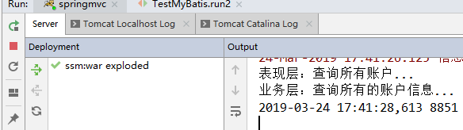

页面上数据可以查出来，控制台有两个调用。

------

5. 配置Spring的声明式事务管理（对service下的方法进行了事务管理）

   ```xml
   <?xml version="1.0" encoding="UTF-8"?>
   <beans xmlns="http://www.springframework.org/schema/beans"
          xmlns:xsi="http://www.w3.org/2001/XMLSchema-instance"
          xmlns:context="http://www.springframework.org/schema/context"
          xmlns:aop="http://www.springframework.org/schema/aop"
          xmlns:tx="http://www.springframework.org/schema/tx"
          xsi:schemaLocation="http://www.springframework.org/schema/beans
       http://www.springframework.org/schema/beans/spring-beans.xsd
       http://www.springframework.org/schema/context
       http://www.springframework.org/schema/context/spring-context.xsd
       http://www.springframework.org/schema/aop
       http://www.springframework.org/schema/aop/spring-aop.xsd
       http://www.springframework.org/schema/tx
       http://www.springframework.org/schema/tx/spring-tx.xsd">
       <!-- 开启注解扫描，要扫描的是service和dao层的注解，要忽略web层注解，因为web层的Controller让        SpringMVC框架
          去管理 -->
       <context:component-scan base-package="cn.itcast">
           <context:exclude-filter type="annotation" expression="org.springframework.stereotype.Controller"></context:exclude-filter>
       </context:component-scan>
   
       <!--Spring整合MyBatis框架-->
       <!--配置c3p0连接池-->
       <bean id="dataSource" class="com.mchange.v2.c3p0.ComboPooledDataSource">
           <property name="driverClass" value="com.mysql.jdbc.Driver"/>
           <property name="jdbcUrl" value="jdbc:mysql:///ssm"/>
           <property name="user" value="root"/>
           <property name="password" value="root"/>
       </bean>
   
       <!--配置SqlSessionFactory工厂-->
       <bean id="sqlSessionFactory" class="org.mybatis.spring.SqlSessionFactoryBean">
           <property name="dataSource" ref="dataSource"/>
       </bean>
   
       <!--配置AccountDao接口所在包,也就是配置扫描dao的包-->
       <bean id="mapperScanner" class="org.mybatis.spring.mapper.MapperScannerConfigurer">
           <property name="basePackage" value="cn.itcast.dao"></property>
       </bean>
   
       
       
      <!-- 配置Spring框架声明式事务管理 -->
       <!--1.配置事务管理器-->
       <bean id="transactionManager" class="org.springframework.jdbc.datasource.DataSourceTransactionManager">
           <property name="dataSource" value="dataSource"/>
       </bean>
   
       <!--2.配置事务通知-->
       <tx:advice id="txAdvice" transaction-manager="transactionManager">
           <tx:attributes>
               <tx:method name="find*" read-only="true"/>
               <tx:method name="*" isolation="DEFAULT"/>
           </tx:attributes>
       </tx:advice>
   
       <!--3.配置Aop增强-->
       <aop:config>
           <!--pointcut切入点的表达式：execution(* cn.itcast.service.impl.*ServiceImpl.*(..))
               public(可省略)， *(任意返回值)，cn.itcast.service.impl这个包下
               的所有*ServiceImpl类下的所有方法，任意类型个数的参数。都可以对它做增强。
           -->
           <aop:advisor advice-ref="txAdvice" pointcut="execution(* cn.itcast.service.impl.*ServiceImpl.*(..))"/>
       </aop:config>
   
   </beans>
   ```

---

编写index.jsp页面

```jsp
<%--
  Created by IntelliJ IDEA.
  User: Administrator
  Date: 2019/3/23 0023
  Time: 22:39
  To change this template use File | Settings | File Templates.
--%>
<%@ page contentType="text/html;charset=UTF-8" language="java" %>
<html>
<head>
    <title>Title</title>
</head>
<body>
    <a href="account/findAll">测试查询</a>

    <h3>测试保存</h3>

    <form action="account/save" method="post">
        姓名：<input type="text" name="name"><br/>
        金额：<input type="text" name="money"><br>
        <input type="submit" value="保存"><br/>
    </form>
</body>
</html>
```

---

编写AccountController的方法

```java
package cn.itcast.controller;

import cn.itcast.domain.Account;
import cn.itcast.service.AccountService;
import org.springframework.beans.factory.annotation.Autowired;
import org.springframework.stereotype.Controller;
import org.springframework.ui.Model;
import org.springframework.web.bind.annotation.RequestMapping;

import javax.servlet.http.HttpServletRequest;
import javax.servlet.http.HttpServletResponse;
import java.io.IOException;
import java.util.List;

/**
 * 账户web
 */
@Controller
@RequestMapping("/account")//一级目录
public class AccountController {

    @Autowired //自动注入
    private AccountService accountService;

    /**
     * 查找所有账户
     * @param model
     * @return
     */
    @RequestMapping("/findAll")//二级目录
    public String findAll(Model model) {
        System.out.println("表现层：查询所有账户...");

        //调用service的方法
        List<Account> list = accountService.findAll();
        //存起来(添加Model，存起来)
        model.addAttribute("list", list);

        return "/list";
    }

    /**
     * 保存账户
     * @param account
     * @return
     */
    @RequestMapping("/save")//二级目录
    public void save(Account account, HttpServletRequest request, HttpServletResponse response) throws IOException {
        accountService.saveAccount(account);
        response.sendRedirect(request.getContextPath() + "/account/findAll");
        return;
    }
}
```

---

页面获取到数据，数据库也有数据。说明事务没有问题。==spring整合MyBatis框架成功。==

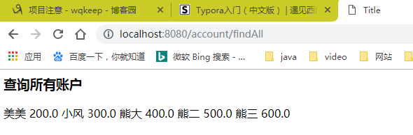

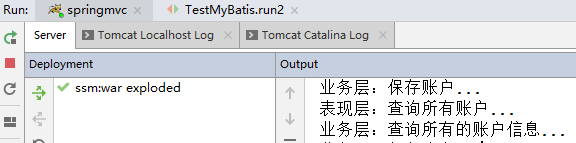

---

SSM整合完成。