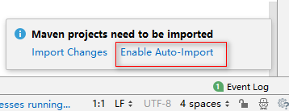
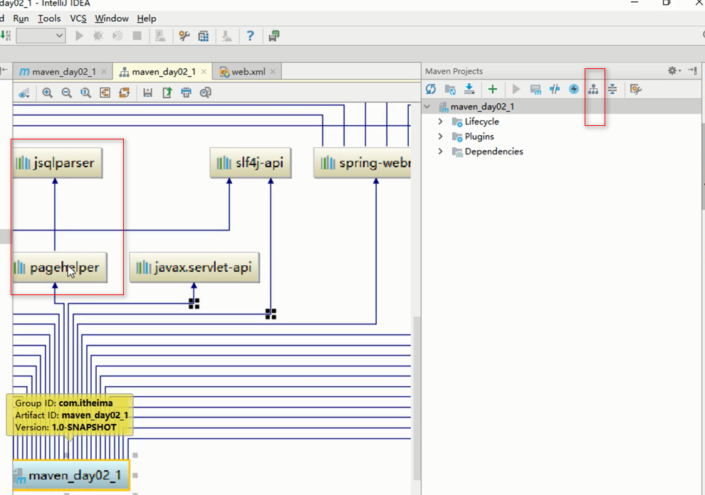
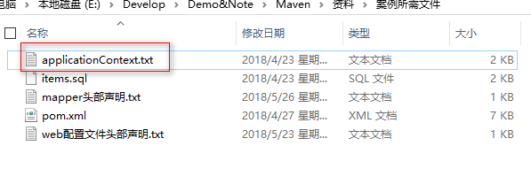
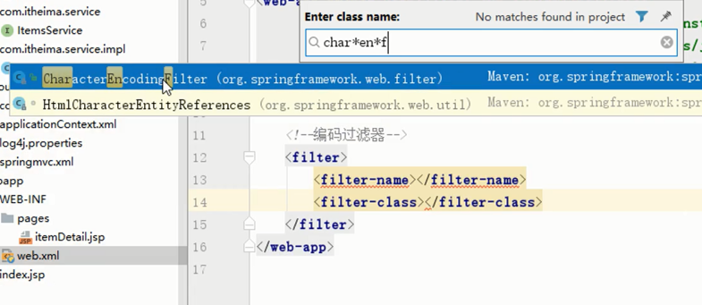
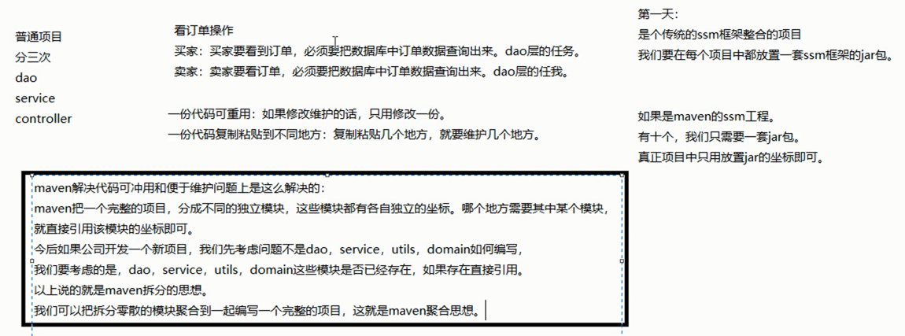
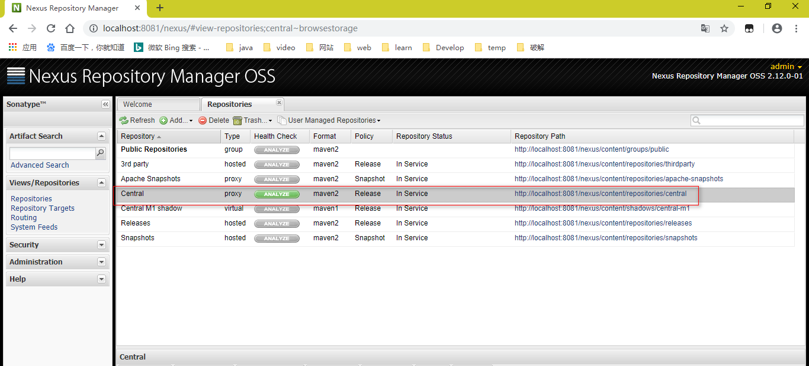
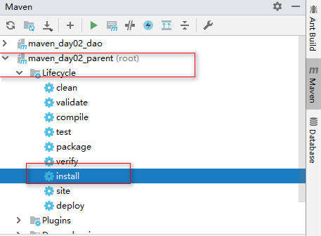
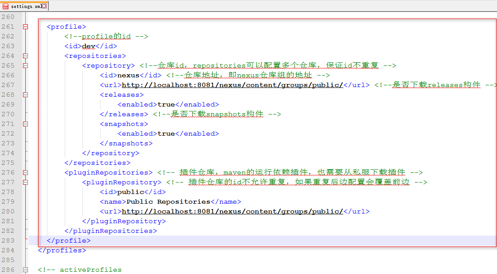
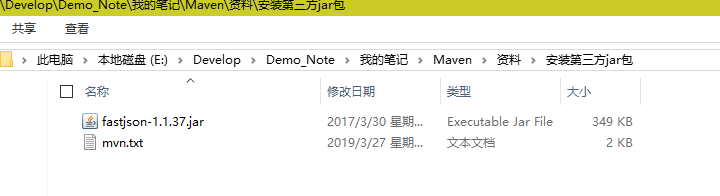

# 一. Maven基础知识回顾：

- Maven是一个项目管理工具。

- 依赖管理：Maven对项目中jar包的管理过程。传统工程我们直接把jar包放在项目中。

  ​		   Maven工程真正的jar包放置在仓库中，项目中只用放置jar包的坐标。

- 仓库的种类：本地仓库，远程仓库【私服】，中央仓库。

- 仓库之间的关系：当我们启动一个Maven工程的时候，Maven工程会通过pom文件中jar包的坐标去本地仓库中找对应jar包。默认情况下，如果本地仓库没有对应的jar包，Maven工程会自动去中央仓库下载jar包到本地仓库。在公司中，如果本地没有对应jar包，会先从私服下载jar包，如果私服没有jar包，可以从中央仓库下载，也可以从本地上传。

- 一键构建：Maven自身集成了Tomcat插件，可以对项目进行编译，测试，打包，安装，发布等操作。

------

1.Maven常用命令：

- clean：当我们构建项目的时候，我们首先要对项目之前有过的一些构建信息进行清理。
- compile：clean完成之后，我们可以对src_main_java下面的目录进行编译。
- test：编译测试代码。
- package：把本地的项目直接打包，把包打在了本地编译目录，也就是target目录下。
- install：把本地的项目安装到本地仓库。
- deploy：把本地做好的项目直接打包上传到私服，也就是如果从本地上传jar包到私服。

---

2.Maven的三套生命周期

- 清理声明周期（clean）
- 默认声明周期（compile，test，package，install，deploy）
- 站点生命周期（实际开发不多用）

---

3.Maven的好处

- 节省磁盘空间
- 可以一键构建
- 可以跨平台
- 应用在大型项目时可以提高开发效率

---

4.安装配置maven

注意：3.3+版本需要jdkj.7+以上的支持

---

5.坐标的书写规范

- groupId 公司或组织域名的倒序
- artifactId 项目名或模块名
- version 版本号

---

6.如何添加坐标

1. 在本地仓库中搜索
2. 互联网上搜，推荐网址 http://www.mvnrepository.com/

---

7.依赖范围

- Compile
- Test
- Runtime
- Provided

---

# 二. maven构建SSM工程[应用]

## 1.需求

​	实现SSM工程构建，规范依赖管理。场景：根据id展示商品信息

## 2.准备数据库环境

​	2.1 创建数据库“maven”


​	2.2 选中数据库，选中数据库选项，选中导入，选中执行sql脚本


## 3.创建一个maven工程

（不是maven工程拆分与聚合项目，此项目算是对三大框架整合的一个回顾）

​	3.1使用骨架创建maven工程


​	使用自己的maven软件和仓库


---

3.2选中允许自动导入

​	

等它创建成功


---

3.3打开所需资料，补齐web配置文件头部声明（因为自动生成不带声明）


------

3.4 删掉 pom.xml 中的一些多余代码


3.5 导入jar包，也就是在pom.xml中编写jar包坐标


打开资料中的pom.xml（里面有SSM三大框架的jar包坐标）文件，把里面的jar包坐标复制到项目中的pom.xml中。

---

## 4.项目中经常出现的问题

### 4.1 解决jar包冲突

```java
<!--
maven工程要导入jar包的坐标，就必须要考虑解决jar包冲突

   解决jar包冲突的方式一：
    第一声明优先原则：哪个jar包的坐标在靠上的位置，这个jar包就是先声明的。
    先声明的jar包坐标下的依赖包，可以优先进入项目中。

   maven导入jar包中的一些概念：
    直接依赖：项目中直接导入的jar包，就是该项目的直接依赖包。
    传递依赖：项目中没有直接导入的jar包，可以通过项目直接依赖jar包传递到项目中去。

   解决jar包冲突的方式二：
    路径近者优先原则。直接依赖路径比传递依赖路径近，那么最终项目进入的jar包会是路径近的直接依赖包。

   解决jar包冲突的方式三【推荐使用】：
    直接排除法。
    当我们要排除某个jar包下依赖包，在配置exclusions标签的时候，内部可以不写版本号。
    因为此时依赖包使用的版本和默认和本jar包一样。
    -->
```

```java
<!--
jar包冲突场景：例如公司中要求在项目中添加一个新技术，我们就需要添加一个jar包坐标，此时新添加的jar包坐标有可能造成项目的jar包冲突，此时我们需要点击Show Dependencies按钮，查看jar包依赖关系。

	(如下图)例如此时的新技术就是pagehelper，此时它的依赖包是jsqlparser，我们就要去项目中查看jsqlparser原本这个包的版本是啥，查看它有没有影响到，如果影响到了，用解决jar包冲突的方式三【推荐使用】： 直接排除法，配置exclusions标签把它干掉即可。但是如果不查看，如果这个包的版本低，它把我们使用的高版本给覆盖掉了，项目是有可能出问题的！
	-->
```



------

### 4.2 锁定jar包版本

```java
    <!--
    maven工程是可以分父子依赖关系的。
    凡是依赖别的项目后，拿到的别的项目的依赖包，都属于传递依赖。
    比如：当前A项目，被B项目依赖。那么我们A项目中所有jar包都会传递到B项目中。
    B项目开发者，如果再在B项目中导入一套ssm框架的jar包，对于B项目是直接依赖。
    那么直接依赖的jar包就会把我们A项目传递过去的jar包覆盖掉。
    为了防止以上情况的出现。我们可以把A项目中主要jar包的坐标锁住，那么其他依赖该项目的项目中，
    即便是有同名jar包直接依赖，也无法覆盖。
  <dependencyManagement>标签仅有锁定jar包的作用，并没有导入jar包的作用，所以下面的jar包导进去以后，	 	 要复制一份粘贴到上面，切记可不能剪切。
    -->
```

```xml
<?xml version="1.0" encoding="UTF-8"?>

<project xmlns="http://maven.apache.org/POM/4.0.0" xmlns:xsi="http://www.w3.org/2001/XMLSchema-instance"
  xsi:schemaLocation="http://maven.apache.org/POM/4.0.0 http://maven.apache.org/xsd/maven-4.0.0.xsd">
  <modelVersion>4.0.0</modelVersion>

  <groupId>com.itheima</groupId>
  <artifactId>maven_day02_1</artifactId>
  <version>1.0-SNAPSHOT</version>
  <packaging>war</packaging>

  <!-- 统一管理jar包版本 -->
  <properties>
    <!--tips: properties也就是一个map。为什么pom.xml文件中能写properties这种key，value形式
        的东西呢？xml文件中能写啥，与名字没有关系，是由上面的约束决定的
        -->
    <spring.version>5.0.2.RELEASE</spring.version>
    <slf4j.version>1.6.6</slf4j.version>
    <log4j.version>1.2.12</log4j.version>
    <shiro.version>1.2.3</shiro.version>
    <mysql.version>5.1.6</mysql.version>
    <mybatis.version>3.4.5</mybatis.version>
    <spring.security.version>5.0.1.RELEASE</spring.security.version>
  </properties>


    <!--
        maven工程是可以分父子依赖关系的。
        凡是依赖别的项目后，拿到的别的项目的依赖包，都属于传递依赖。
        比如：当前A项目，被B项目依赖。那么我们A项目中所有jar包都会传递到B项目中。
        B项目开发者，如果再在B项目中导入一套ssm框架的jar包，对于B项目是直接依赖。
        那么直接依赖的jar包就会把我们A项目传递过去的jar包覆盖掉。
        为了防止以上情况的出现。我们可以把A项目中主要jar包的坐标锁住，那么其他依赖该项目的项目中，
        即便是有同名jar包直接依赖，也无法覆盖。
       <dependencyManagement>标签仅有锁定jar包的作用，并没有导入jar包的作用，所以下面的jar包
        导进去以后，要复制一份粘贴到上面，切记可不能剪切。
    -->
  <!-- 锁定jar包版本 -->
  <dependencyManagement>
    <dependencies>
      <dependency>
        <groupId>org.springframework</groupId>
        <artifactId>spring-context</artifactId>
        <version>${spring.version}</version>
      </dependency>
      <dependency>
        <groupId>org.springframework</groupId>
        <artifactId>spring-web</artifactId>
        <version>${spring.version}</version>
      </dependency>
      <dependency>
        <groupId>org.springframework</groupId>
        <artifactId>spring-webmvc</artifactId>
        <version>${spring.version}</version>
      </dependency>
      <dependency>
        <groupId>org.springframework</groupId>
        <artifactId>spring-tx</artifactId>
        <version>${spring.version}</version>
      </dependency>
      <dependency>
        <groupId>org.springframework</groupId>
        <artifactId>spring-test</artifactId>
        <version>${spring.version}</version>
      </dependency>
      <dependency>
        <groupId>org.mybatis</groupId>
        <artifactId>mybatis</artifactId>
        <!--${mybatis.version}是xml配置文件中的EL表达式的key值,引用的是
            上面的“统一管理jar包版本”,key值可以随便写，但要有可读性。这样
            写，其意义是方便管理jar包版本，未来需要修改jar包版本，直接在“统
            一管理jar包版本”中修改即可。
        -->
        <version>${mybatis.version}</version>
      </dependency>
    </dependencies>
  </dependencyManagement>

  <!-- 项目依赖jar包 -->
  <dependencies>
    <!-- spring -->
    <dependency>
      <groupId>org.aspectj</groupId>
      <artifactId>aspectjweaver</artifactId>
      <version>1.6.8</version>
    </dependency>
    <dependency>
      <groupId>org.springframework</groupId>
      <artifactId>spring-aop</artifactId>
      <version>${spring.version}</version>
    </dependency>
    <dependency>
      <groupId>org.springframework</groupId>
      <artifactId>spring-context</artifactId>
      <version>${spring.version}</version>
    </dependency>
    <dependency>
      <groupId>org.springframework</groupId>
      <artifactId>spring-context-support</artifactId>
      <version>${spring.version}</version>
    </dependency>
    <dependency>
      <groupId>org.springframework</groupId>
      <artifactId>spring-web</artifactId>
      <version>${spring.version}</version>
    </dependency>
    <dependency>
      <groupId>org.springframework</groupId>
      <artifactId>spring-orm</artifactId>
      <version>${spring.version}</version>
    </dependency>
    <dependency>
      <groupId>org.springframework</groupId>
      <artifactId>spring-beans</artifactId>
      <version>${spring.version}</version>
    </dependency>
    <dependency>
      <groupId>org.springframework</groupId>
      <artifactId>spring-core</artifactId>
      <version>${spring.version}</version>
    </dependency>
    <dependency>
      <groupId>org.springframework</groupId>
      <artifactId>spring-test</artifactId>
      <version>${spring.version}</version>
    </dependency>
    <dependency>
      <groupId>org.springframework</groupId>
      <artifactId>spring-webmvc</artifactId>
      <version>${spring.version}</version>
    </dependency>
    <dependency>
      <groupId>org.springframework</groupId>
      <artifactId>spring-tx</artifactId>
      <version>${spring.version}</version>
    </dependency>
    <dependency>
      <groupId>junit</groupId>
      <artifactId>junit</artifactId>
      <version>4.12</version>
      <scope>compile</scope>
    </dependency>
    <dependency>
      <groupId>mysql</groupId>
      <artifactId>mysql-connector-java</artifactId>
      <version>${mysql.version}</version>
    </dependency>
    <dependency>
      <groupId>javax.servlet</groupId>
      <artifactId>javax.servlet-api</artifactId>
      <version>3.1.0</version>
      <scope>provided</scope>
    </dependency>
    <dependency>
      <groupId>javax.servlet.jsp</groupId>
      <artifactId>jsp-api</artifactId>
      <version>2.0</version>
      <scope>provided</scope>
    </dependency>
    <dependency>
      <groupId>jstl</groupId>
      <artifactId>jstl</artifactId>
      <version>1.2</version>
    </dependency>
    <!-- log start -->
    <dependency>
      <groupId>log4j</groupId>
      <artifactId>log4j</artifactId>
      <version>${log4j.version}</version>
    </dependency>
    <dependency>
      <groupId>org.slf4j</groupId>
      <artifactId>slf4j-api</artifactId>
      <version>${slf4j.version}</version>
    </dependency>
    <dependency>
      <groupId>org.slf4j</groupId>
      <artifactId>slf4j-log4j12</artifactId>
      <version>${slf4j.version}</version>
    </dependency>
    <!-- log end -->
    <dependency>
      <groupId>org.mybatis</groupId>
      <artifactId>mybatis</artifactId>
      <version>${mybatis.version}</version>
    </dependency>
    <dependency>
      <groupId>org.mybatis</groupId>
      <artifactId>mybatis-spring</artifactId>
      <version>1.3.0</version>
    </dependency>
    <dependency>
      <groupId>c3p0</groupId>
      <artifactId>c3p0</artifactId>
      <version>0.9.1.2</version>
      <type>jar</type>
      <scope>compile</scope>
    </dependency>
    <dependency>
      <groupId>com.github.pagehelper</groupId>
      <artifactId>pagehelper</artifactId>
      <version>5.1.2</version>
    </dependency>
    <dependency>
      <groupId>org.springframework.security</groupId>
      <artifactId>spring-security-web</artifactId>
      <version>${spring.security.version}</version>
    </dependency>
    <dependency>
      <groupId>org.springframework.security</groupId>
      <artifactId>spring-security-config</artifactId>
      <version>${spring.security.version}</version>
    </dependency>
    <dependency>
      <groupId>org.springframework.security</groupId>
      <artifactId>spring-security-core</artifactId>
      <version>${spring.security.version}</version>
    </dependency>
    <dependency>
      <groupId>org.springframework.security</groupId>
      <artifactId>spring-security-taglibs</artifactId>
      <version>${spring.security.version}</version>
    </dependency>
    <dependency>
      <groupId>com.alibaba</groupId>
      <artifactId>druid</artifactId>
      <version>1.0.9</version>
    </dependency>
  </dependencies>
  <!-- 添加tomcat7插件 -->
  <build>
    <plugins>
      <plugin>
        <groupId>org.apache.tomcat.maven</groupId>
        <artifactId>tomcat7-maven-plugin</artifactId>
        <version>2.2</version>
      </plugin>
    </plugins>
  </build>
</project>

```

------

正式进入项目代码的编写阶段

---


## 5.dao层代码

5.1 这个章节我们只写dao层代码，也就是我们只写MyBatis相关的代码，默认使用骨架创建的目录结构是不完整    		  的，我们需要把项目目录补充完整


---

5.2 创建domain目录，创建要实现的功能的dao的pojo实体类


---

5.3 使用MyBatis持久层框架，我们需要创建一个dao接口。


---

5.4 大家都知道，如果使用MyBatis持久层框架，我们将不用谢实现类，让MyBatis帮我们实现接口的代理对象，所以说我们在resources下面要创建一个跟接口在用一个包路径下面的一个包来放置我们的mapper映射文件。

创建ItemsDao.xml打开资料里面的“mapper头部声明.txt”，把内容复制到创建的Items.xml文件中。编写配置文件。注意创建目录的写法！！！

- 


---

创建spring的配置文件，applicationContext.xml，把资料里面的内容复制进去。





创建spring的配置文件，applicationContext.xml

```xml
<?xml version="1.0" encoding="UTF-8"?>
<beans xmlns="http://www.springframework.org/schema/beans"
       xmlns:xsi="http://www.w3.org/2001/XMLSchema-instance"
       xmlns:context="http://www.springframework.org/schema/context"
       xmlns:aop="http://www.springframework.org/schema/aop"
       xmlns:tx="http://www.springframework.org/schema/tx"
       xmlns:mvc="http://www.springframework.org/schema/mvc"
       xsi:schemaLocation="http://www.springframework.org/schema/beans
			    http://www.springframework.org/schema/beans/spring-beans.xsd
			    http://www.springframework.org/schema/context
			    http://www.springframework.org/schema/context/spring-context.xsd
			    http://www.springframework.org/schema/aop
			    http://www.springframework.org/schema/aop/spring-aop.xsd
			    http://www.springframework.org/schema/tx
			    http://www.springframework.org/schema/tx/spring-tx.xsd
			    http://www.springframework.org/schema/mvc
			    http://www.springframework.org/schema/mvc/spring-mvc.xsd">

    <!--dao配置文件开始-->

    <!--配置数据库连接池-->
    <bean id="dataSource" class="com.alibaba.druid.pool.DruidDataSource">
        <property name="driverClassName" value="com.mysql.jdbc.Driver" />
        <property name="url" value="jdbc:mysql://localhost:3306/maven" />
        <property name="username" value="root" />
        <property name="password" value="root" />
    </bean>

    <!--配置SqlSession对象的工厂-->
    <bean id="sqlSessionFactory" class="org.mybatis.spring.SqlSessionFactoryBean">
        <property name="dataSource" ref="dataSource"/>
        <!--扫描pojo包，给包下的所有pojo对象起别名-->
        <property name="typeAliasesPackage" value="com.itheima.domain"/>
    </bean>

    <!--扫描ItemsDao接口包路径,生成包下所有接口的代理对象，并且放入spring容器中
       先扫描这个包路径下所有的接口，接下来生成它的代理对象，最终放入到spring容器中
    -->
    <bean id="mapperScanner" class="org.mybatis.spring.mapper.MapperScannerConfigurer">
        <property name="basePackage" value="com.itheima.dao"></property>
    </bean>
    
    <!--dao配置文件结束-->

</beans>
```

---

测试：


------

为了能更清楚的看清楚细节，我们从资料里面，把log4j.properties放到resources目录下。


---

运行程序：


成功打印数据，==dao层代码编写完成。==

---

## 6.service层

业务层：除了处理业务逻辑，还要控制事务。

6.1 创建service目录，创建一个接口ItemsService


---

6.2 接下来我们秉承一个公司实际开发中的原则：自己写的类，尽量使用注解。如果是框架的类，尽量使用配置文件，这种配置文件和注解结合的方式

写接口的实现类


---

6.3 service层配置的编写（applicationContext.xml），我们使用面向切面的编程思想，配置spring声明式事务。

```xml
<?xml version="1.0" encoding="UTF-8"?>
<beans xmlns="http://www.springframework.org/schema/beans"
       xmlns:xsi="http://www.w3.org/2001/XMLSchema-instance"
       xmlns:context="http://www.springframework.org/schema/context"
       xmlns:aop="http://www.springframework.org/schema/aop"
       xmlns:tx="http://www.springframework.org/schema/tx"
       xmlns:mvc="http://www.springframework.org/schema/mvc"
       xsi:schemaLocation="http://www.springframework.org/schema/beans
			    http://www.springframework.org/schema/beans/spring-beans.xsd
			    http://www.springframework.org/schema/context
			    http://www.springframework.org/schema/context/spring-context.xsd
			    http://www.springframework.org/schema/aop
			    http://www.springframework.org/schema/aop/spring-aop.xsd
			    http://www.springframework.org/schema/tx
			    http://www.springframework.org/schema/tx/spring-tx.xsd
			    http://www.springframework.org/schema/mvc
			    http://www.springframework.org/schema/mvc/spring-mvc.xsd">

    <!--dao配置文件开始-->

    <!--配置数据库连接池-->
    <bean id="dataSource" class="com.alibaba.druid.pool.DruidDataSource">
        <property name="driverClassName" value="com.mysql.jdbc.Driver" />
        <property name="url" value="jdbc:mysql://localhost:3306/maven" />
        <property name="username" value="root" />
        <property name="password" value="root" />
    </bean>

    <!--配置SqlSession对象的工厂-->
    <bean id="sqlSessionFactory" class="org.mybatis.spring.SqlSessionFactoryBean">
        <property name="dataSource" ref="dataSource"/>
        <!--扫描pojo包，给包下的所有pojo对象起别名-->
        <property name="typeAliasesPackage" value="com.itheima.domain"/>
    </bean>

    <!--扫描ItemsDao接口包路径,生成包下所有接口的代理对象，并且放入spring容器中
       先扫描这个包路径下所有的接口，接下来生成它的代理对象，最终放入到spring容器中
    -->
    <bean id="mapperScanner" class="org.mybatis.spring.mapper.MapperScannerConfigurer">
        <property name="basePackage" value="com.itheima.dao "></property>
    </bean>

    <!--dao配置文件结束-->

    <!--service层配置文件开始-->

    <!--组件扫描配置-->
    <context:component-scan base-package="com.itheima.service"/>

    <!--aop面向切面编程，切面就是切入点和通知的组合-->
    <!--配置事务管理器-->
    <bean id="transactionManager" class="org.springframework.jdbc.datasource.DataSourceTransactionManager">
        <property name="dataSource" ref="dataSource"/>
    </bean>

    <!--配置事务的通知
        id可以随便取，默认id="transactionInterceptor"，我们可以取成advice
    -->
    <tx:advice id="advice">
        <tx:attributes>
            <!--所有保存方法都以save开头，save这种方法肯定是要走事务的
                所以我们选择propagation="REQUIRED"这样一个属性
            -->
            <tx:method name="save*" propagation="REQUIRED"/>
            <!--那么接下来我们约定，凡是更新都以update开头，要走事务-->
            <tx:method name="update*" propagation="REQUIRED"/>
            <!--凡是删除都以delete开头，要走事务-->
            <tx:method name="delete*" propagation="REQUIRED"/>
            <!--凡是查询都以find开头,不走事务，让它只读即可-->
            <tx:method name="find*" read-only="true"/>
            <!--上面那些是局部扫描，下面是全局扫描，尽可能避免全局扫描-->
            <tx:method name="*" propagation="REQUIRED"/>
        </tx:attributes>
    </tx:advice>
    
    <!--配置切面-->
    <aop:config>
        <!--配置切入点-->
        <aop:pointcut id="pointcut" expression="execution(* com.itheima.service.impl.*.*(..))"/>
        <!--把切入点和通知整到一起，变成一个切面-->
        <aop:advisor advice-ref="advice" pointcut-ref="pointcut"/>
    </aop:config>
    <!--service层配置文件结束-->
</beans>
```

---

6.4 测试：


运行程序：


结果正常输出，==service代码准确无误编写完成。==

---

## 7.Web层

7.1 创建controller目录，创建ItemsController。空着的地方一会补，jsp页面上是什么值，看情况填。


---

7.2 配置对应的配置文件，applicationContext.xml是spring相关的配置，现在我们使用的前端是springmvc，所以应该来一个springmvc的配置文件。在resources目录下创建springmvc.xml，从applicationContext.xml中拷贝约束。


```xml
<?xml version="1.0" encoding="UTF-8"?>
<beans xmlns="http://www.springframework.org/schema/beans"
       xmlns:xsi="http://www.w3.org/2001/XMLSchema-instance"
       xmlns:context="http://www.springframework.org/schema/context"
       xmlns:aop="http://www.springframework.org/schema/aop"
       xmlns:tx="http://www.springframework.org/schema/tx"
       xmlns:mvc="http://www.springframework.org/schema/mvc"
       xsi:schemaLocation="http://www.springframework.org/schema/beans
			    http://www.springframework.org/schema/beans/spring-beans.xsd
			    http://www.springframework.org/schema/context
			    http://www.springframework.org/schema/context/spring-context.xsd
			    http://www.springframework.org/schema/aop
			    http://www.springframework.org/schema/aop/spring-aop.xsd
			    http://www.springframework.org/schema/tx
			    http://www.springframework.org/schema/tx/spring-tx.xsd
			    http://www.springframework.org/schema/mvc
			    http://www.springframework.org/schema/mvc/spring-mvc.xsd">

    <!--组件扫描-->
    <context:component-scan base-package="com.itheima.controller"/>

    <!--处理器映射器，处理器适配器-->
    <mvc:annotation-driven/>

    <!--视图解析器-->
    <bean id="internalResourceViewResolver" class="org.springframework.web.servlet.view.InternalResourceViewResolver">
        <property name="prefix" value="/WEB-INF/pages"/>
        <property name="suffix" value=".jsp"/>
    </bean>

    <!--释放静态资源,假如我们现在mvc使用的是DispatcherServlet，它底层是servlet，那么我
        们servlet路径假如要配成"/"，那么你的意思就是拦截所有，但不能连js等静态资源也拦
        截，所以要释放静态资源。配置完成后，以后凡是碰见静态资源都会交给默认的servlet去
        处理，也就是我们之前写的HttpServlet，而不是DispatcherServlet。
    -->
    <mvc:default-servlet-handler/>
</beans>
```


---

7.3 WEB-INF下创建一个pages目录，从资料里面复制已经准备好的itemDetail.jsp页面到项目的pages目录下。然后在ItemsController中补充代码。


我们看到页面中的对象为item，所以我们在ItemsController中也这样写就好。


---

7.4 mvc相关配置也差不多了，最终我们是想把所有这些配置文件的资源一启动都交到servlet容器中，所以我们必须在 web.xml 中做一些配置。

搜索类的方法Ctrl + N。




配置 web.xml 配置文件

```xml
<!DOCTYPE web-app PUBLIC
 "-//Sun Microsystems, Inc.//DTD Web Application 2.3//EN"
 "http://java.sun.com/dtd/web-app_2_3.dtd" >

<web-app xmlns="http://java.sun.com/xml/ns/javaee"
         xmlns:xsi="http://www.w3.org/2001/XMLSchema-instance"
         xsi:schemaLocation="http://java.sun.com/xml/ns/javaee
          http://java.sun.com/xml/ns/javaee/web-app_3_0.xsd"
         version="3.0">

    <!--编码过滤器-->
    <filter>
        <filter-name>encodingFilter</filter-name>
        <filter-class>org.springframework.web.filter.CharacterEncodingFilter</filter-class>
        <!--设置编码-->
        <init-param>
            <param-name>encoding</param-name>
            <param-value>UTF-8</param-value>
        </init-param>
        <!--使用编码-->
        <init-param>
            <param-name>forceEncoding</param-name>
            <param-value>true</param-value>
        </init-param>
    </filter>
    <filter-mapping>
        <filter-name>encodingFilter</filter-name>
        <!--所有的地址全部拦截，都改成UTF-8-->
        <url-pattern>/*</url-pattern>
    </filter-mapping>

    <!--配置spring核心监听器-->
    <listener>
        <listener-class>org.springframework.web.context.ContextLoaderListener</listener-class>
    </listener>
    <!--重新指定spring配置文件路径
        spring默认监听器只能够监听WEB-INF下面名字叫applicationContext.xml
        的spring配置文件，我们现在的applicationContext.xml名称能对上，但是
        它并不在WEB-INF目录下，所以我们要重新指定spring配置文件路径
        -->
    <context-param>
        <param-name>contextConfigLocation</param-name>
        <param-value>classpath:applicationContext.xml</param-value>
    </context-param>

    <!--配置springmvc的核心servlet-->
    <servlet>
        <servlet-name>springmvc</servlet-name>
        <servlet-class>org.springframework.web.servlet.DispatcherServlet</servlet-class>
        <init-param>
            <param-name>contextConfigLocation</param-name>
            <param-value>classpath:springmvc.xml</param-value>
        </init-param>
        <!--配置如果多个servlet的时候首先加载-->
        <load-on-startup>1</load-on-startup>
    </servlet>
    <servlet-mapping>
        <servlet-name>springmvc</servlet-name>
        <!--这儿也可以写*.do，这样写连静态资源都不用释放-->
        <url-pattern>/</url-pattern>
    </servlet-mapping>
</web-app>
```

---

7.5  配置完成，意味着整个项目已经完成。

测试：我们直接使用maven内置的tomcat插件来运行这个项目。

双击tomcat7:run


复制链接：


打开浏览器，输入url


==整个项目准确无误的完成。==

---

# 三. 分模块构建工程[应用]

## 1.maven工程拆分与聚合的思想



有了maven工程拆分与聚合的思想后，我们把上面的项目拆成maven工程拆分与聚合的一种方式来开发，里面的代码不需要再写了，创建完成后把里面的代码拷贝过去即可。

---

## 2.建立maven父工程


---

用不用骨架都行，因为父工程只需要一个pom文件就可以了。（这儿不用）


为了粘贴代码方便，选择New Window


---

父工程作用：就是帮我们管理一下jar包坐标。

---

删除src目录，父工程创建完成


---

## 3.创建子模块

子模块在实际开发中会创建特别多，分特别细，但今天是演示，所以只创建三个，一个dao，一个service，一个controller，以后创建多个和现在创建三个的方法是一样的。

### 3.1创建dao子模块

由于这个模块与页面不需要交互，所以他就是一个java工程就可以了，所以就不用模板了。


---

### 3.2创建service子模块

创建过程和dao子模块相同。


next...finish。

---

### 3.3创建web(也就是controller)子模块

此时要与页面有交互，所以要用骨架。


next...finish。

---

因为使用了骨架，如果pom文件中多出了一些没用的信息，删除掉一些没用的。

删除后：


---

父工程每添加一个子模块，父工程的pom文件中，modules标签里面的值多出一条。


---

## 4.工程和模块区别，继承和依赖

```java
   <!--
    工程和模块的区别：
    工程不等于完整的项目，模块也不等于完整的项目，一个完整的项目看的是代码，代码完整，就可以说这是一个完整的项目
    和此项目是工程和模块没有关系。

    工程天生只能使用自己内部资源，工程天生是独立的。后天可以和其他工程或模块建立关联关系。
    模块天生不是独立的，模块天生是属于父工程的，模块一旦创建，所有父工程的资源都可以使用。

    父子工程之间，子模块天生继承父工程，可以使用父工程所有资源。
    子模块之间天生是没有任何关系的,可以建立关系。

    父子工程之间不用建立关系，继承关系是先天的，不需要手动建立。

    平级之间的引用叫依赖，依赖不是先天的，依赖是需要后天建立的。
    -->
```

父子工程之间不用建立关系，继承关系是先天的，不需要手动建立。子模块不需要引入父工程，子模块天生就和父工程有关系，可以直接使用它的东西。

平级之间的引用叫依赖，依赖不是先天的，依赖是需要后天建立的。平级需要建立关系，dao子模块需要引入到service子模块，service子模块需要引入到web子模块。	

跨项目使用：一个模块想用另一个项目中的模块。在公司中开发一个新的项目，之后就不用考虑dao，service，web咋写，只需要考虑被引用的那个项目（必须是父子模块已经分好的）有没有已经写好的模块，发现dao已经写好了，在新项目中添加一个它的dao的坐标就行了，前提是被引用的那个项目得打成包扔到仓库里面才行。

---

### 4.1平级之间建立依赖关系

4.1.1 service模块建立和dao子模块的依赖关系（service依赖dao了）

```xml
<?xml version="1.0" encoding="UTF-8"?>
<project xmlns="http://maven.apache.org/POM/4.0.0"
         xmlns:xsi="http://www.w3.org/2001/XMLSchema-instance"
         xsi:schemaLocation="http://maven.apache.org/POM/4.0.0 http://maven.apache.org/xsd/maven-4.0.0.xsd">
    <parent>
        <artifactId>maven_day02_parent</artifactId>
        <groupId>com.itheima</groupId>
        <version>1.0-SNAPSHOT</version>
    </parent>
    <modelVersion>4.0.0</modelVersion>

    <artifactId>maven_day02_service</artifactId>

    <!--建立和dao子模块的依赖关系-->
    <dependencies>
        <dependency>
            <groupId>com.itheima</groupId>
            <artifactId>maven_day02_dao</artifactId>
            <version>1.0-SNAPSHOT</version>
        </dependency>
    </dependencies>
</project>
```

---

4.1.2 web模块（也就是controller）建立和service子模块的依赖关系 ( web依赖service了 )

```xml
<?xml version="1.0" encoding="UTF-8"?>

<project xmlns="http://maven.apache.org/POM/4.0.0" xmlns:xsi="http://www.w3.org/2001/XMLSchema-instance"
         xsi:schemaLocation="http://maven.apache.org/POM/4.0.0 http://maven.apache.org/xsd/maven-4.0.0.xsd">
    <parent>
        <artifactId>maven_day02_parent</artifactId>
        <groupId>com.itheima</groupId>
        <version>1.0-SNAPSHOT</version>
    </parent>
    <modelVersion>4.0.0</modelVersion>

    <artifactId>maven_day02_web</artifactId>
    <packaging>war</packaging>

    <!--建立和service子模块的依赖关系-->
    <dependencies>
        <dependency>
            <groupId>com.itheima</groupId>
            <artifactId>maven_day02_service</artifactId>
            <version>1.0-SNAPSHOT</version>
        </dependency>
    </dependencies>
</project>
```

---

开发父子工程里面的代码：之前项目的代码已经开发完成，所以我们可以直接把之前项目的代码复制到新项目中。

pom文件中jar包的坐标

从资料里面打开pom.xml，复制其内容到项目中的 父工程 的pom文件中。

```xml
<?xml version="1.0" encoding="UTF-8"?>
<project xmlns="http://maven.apache.org/POM/4.0.0"
         xmlns:xsi="http://www.w3.org/2001/XMLSchema-instance"
         xsi:schemaLocation="http://maven.apache.org/POM/4.0.0 http://maven.apache.org/xsd/maven-4.0.0.xsd">
    <modelVersion>4.0.0</modelVersion>

    <groupId>com.itheima</groupId>
    <artifactId>maven_day02_parent</artifactId>
    <packaging>pom</packaging>
    <version>1.0-SNAPSHOT</version>
    <modules>
        <module>maven_day02_dao</module>
        <module>maven_day02_service</module>
        <module>maven_day02_web</module>
    </modules>

    <!-- 统一管理jar包版本 -->
    <properties>
        <spring.version>5.0.2.RELEASE</spring.version>
        <slf4j.version>1.6.6</slf4j.version>
        <log4j.version>1.2.12</log4j.version>
        <shiro.version>1.2.3</shiro.version>
        <mysql.version>5.1.6</mysql.version>
        <mybatis.version>3.4.5</mybatis.version>
        <spring.security.version>5.0.1.RELEASE</spring.security.version>
    </properties>

    <!-- 锁定jar包版本 -->
    <dependencyManagement>
        <dependencies>
            <dependency>
                <groupId>org.springframework</groupId>
                <artifactId>spring-context</artifactId>
                <version>${spring.version}</version>
            </dependency>
            <dependency>
                <groupId>org.springframework</groupId>
                <artifactId>spring-web</artifactId>
                <version>${spring.version}</version>
            </dependency>
            <dependency>
                <groupId>org.springframework</groupId>
                <artifactId>spring-webmvc</artifactId>
                <version>${spring.version}</version>
            </dependency>
            <dependency>
                <groupId>org.springframework</groupId>
                <artifactId>spring-tx</artifactId>
                <version>${spring.version}</version>
            </dependency>
            <dependency>
                <groupId>org.springframework</groupId>
                <artifactId>spring-test</artifactId>
                <version>${spring.version}</version>
            </dependency>
            <dependency>
                <groupId>org.mybatis</groupId>
                <artifactId>mybatis</artifactId>
                <version>${mybatis.version}</version>
            </dependency>
        </dependencies>
    </dependencyManagement>

    <!-- 项目依赖jar包 -->
    <dependencies>
        <!-- spring -->
        <dependency>
            <groupId>org.aspectj</groupId>
            <artifactId>aspectjweaver</artifactId>
            <version>1.6.8</version>
        </dependency>
        <dependency>
            <groupId>org.springframework</groupId>
            <artifactId>spring-aop</artifactId>
            <version>${spring.version}</version>
        </dependency>
        <dependency>
            <groupId>org.springframework</groupId>
            <artifactId>spring-context</artifactId>
            <version>${spring.version}</version>
        </dependency>
        <dependency>
            <groupId>org.springframework</groupId>
            <artifactId>spring-context-support</artifactId>
            <version>${spring.version}</version>
        </dependency>
        <dependency>
            <groupId>org.springframework</groupId>
            <artifactId>spring-web</artifactId>
            <version>${spring.version}</version>
        </dependency>
        <dependency>
            <groupId>org.springframework</groupId>
            <artifactId>spring-orm</artifactId>
            <version>${spring.version}</version>
        </dependency>
        <dependency>
            <groupId>org.springframework</groupId>
            <artifactId>spring-beans</artifactId>
            <version>${spring.version}</version>
        </dependency>
        <dependency>
            <groupId>org.springframework</groupId>
            <artifactId>spring-core</artifactId>
            <version>${spring.version}</version>
        </dependency>
        <dependency>
            <groupId>org.springframework</groupId>
            <artifactId>spring-test</artifactId>
            <version>${spring.version}</version>
        </dependency>
        <dependency>
            <groupId>org.springframework</groupId>
            <artifactId>spring-webmvc</artifactId>
            <version>${spring.version}</version>
        </dependency>
        <dependency>
            <groupId>org.springframework</groupId>
            <artifactId>spring-tx</artifactId>
            <version>${spring.version}</version>
        </dependency>
        <dependency>
            <groupId>junit</groupId>
            <artifactId>junit</artifactId>
            <version>4.12</version>
            <scope>compile</scope>
        </dependency>
        <dependency>
            <groupId>mysql</groupId>
            <artifactId>mysql-connector-java</artifactId>
            <version>${mysql.version}</version>
        </dependency>
        <dependency>
            <groupId>javax.servlet</groupId>
            <artifactId>javax.servlet-api</artifactId>
            <version>3.1.0</version>
            <scope>provided</scope>
        </dependency>
        <dependency>
            <groupId>javax.servlet.jsp</groupId>
            <artifactId>jsp-api</artifactId>
            <version>2.0</version>
            <scope>provided</scope>
        </dependency>
        <dependency>
            <groupId>jstl</groupId>
            <artifactId>jstl</artifactId>
            <version>1.2</version>
        </dependency>
        <!-- log start -->
        <dependency>
            <groupId>log4j</groupId>
            <artifactId>log4j</artifactId>
            <version>${log4j.version}</version>
        </dependency>
        <dependency>
            <groupId>org.slf4j</groupId>
            <artifactId>slf4j-api</artifactId>
            <version>${slf4j.version}</version>
        </dependency>
        <dependency>
            <groupId>org.slf4j</groupId>
            <artifactId>slf4j-log4j12</artifactId>
            <version>${slf4j.version}</version>
        </dependency>
        <!-- log end -->
        <dependency>
            <groupId>org.mybatis</groupId>
            <artifactId>mybatis</artifactId>
            <version>${mybatis.version}</version>
        </dependency>
        <dependency>
            <groupId>org.mybatis</groupId>
            <artifactId>mybatis-spring</artifactId>
            <version>1.3.0</version>
        </dependency>
        <dependency>
            <groupId>c3p0</groupId>
            <artifactId>c3p0</artifactId>
            <version>0.9.1.2</version>
            <type>jar</type>
            <scope>compile</scope>
        </dependency>
        <dependency>
            <groupId>com.github.pagehelper</groupId>
            <artifactId>pagehelper</artifactId>
            <version>5.1.2</version>
        </dependency>
        <dependency>
            <groupId>org.springframework.security</groupId>
            <artifactId>spring-security-web</artifactId>
            <version>${spring.security.version}</version>
        </dependency>
        <dependency>
            <groupId>org.springframework.security</groupId>
            <artifactId>spring-security-config</artifactId>
            <version>${spring.security.version}</version>
        </dependency>
        <dependency>
            <groupId>org.springframework.security</groupId>
            <artifactId>spring-security-core</artifactId>
            <version>${spring.security.version}</version>
        </dependency>
        <dependency>
            <groupId>org.springframework.security</groupId>
            <artifactId>spring-security-taglibs</artifactId>
            <version>${spring.security.version}</version>
        </dependency>
        <dependency>
            <groupId>com.alibaba</groupId>
            <artifactId>druid</artifactId>
            <version>1.0.9</version>
        </dependency>
    </dependencies>
    <!-- 添加tomcat7插件 -->
    <build>
        <plugins>
            <plugin>
                <groupId>org.apache.tomcat.maven</groupId>
                <artifactId>tomcat7-maven-plugin</artifactId>
                <version>2.2</version>
            </plugin>
        </plugins>
    </build>
</project>
```

---

4.1.3 传递依赖下来的包是否能用（了解即可）


---

## 5.在父子工程中填充代码

### 5.1 dao子模块

在resource目录下创建包的时候，写法：


在dao子模块中创建相应的目录，从之前做好的项目中拷贝所需要的代码和配置文件。


因为现在编写的是dao子模块的代码，所以复制过来的applicationContext.xml文件中只需要保留dao的部分即可。

为了加以区分，创建spring目录，把applicationContext.xml拖进去，给applicationContext.xml文件改名为applicationContext-dao.xml。


---

### 5.2 service子模块

因为service依赖于dao，所以此时dao有的service也有，service只需在它的基础之上进行其他类以及配置文件的编写即可。

在service子模块中创建相应的目录，从之前做好的项目中拷贝所需要的代码和配置文件。

因为现在编写的是service子模块的代码，所以复制过来的applicationContext.xml文件中只需要保留service的部分即可。

为了加以区分，创建spring目录，把applicationContext.xml拖进去，给applicationContext.xml文件改名为applicationContext-service.xml。


---

### 5.3 web子模块

web子模块目录不完整，补齐。


---

因为controller依赖于service，所以此时service有的controller也有，controller只需在它的基础之上进行其他类以及配置文件的编写即可。

在controller子模块中创建相应的目录，从之前做好的项目中拷贝所需要的代码和配置文件。

因为现在编写的是controller子模块的代码，所以已经没有applicationContext.xml文件了。

把log4j.properties和springmvc.xml复制过去。

这一层我们注意，我们还要把页面拿过来。

web.xml文件中的全部内容，复制过来。


resources目录就是classpath，在resources目录下新建一个applicationContext.xml文件，从之前的文件中拷贝约束进来，写相应的引入。

```xml
<?xml version="1.0" encoding="UTF-8"?>
<beans xmlns="http://www.springframework.org/schema/beans"
       xmlns:xsi="http://www.w3.org/2001/XMLSchema-instance"
       xmlns:context="http://www.springframework.org/schema/context"
       xmlns:aop="http://www.springframework.org/schema/aop"
       xmlns:tx="http://www.springframework.org/schema/tx"
       xmlns:mvc="http://www.springframework.org/schema/mvc"
       xsi:schemaLocation="http://www.springframework.org/schema/beans
			    http://www.springframework.org/schema/beans/spring-beans.xsd
			    http://www.springframework.org/schema/context
			    http://www.springframework.org/schema/context/spring-context.xsd
			    http://www.springframework.org/schema/aop
			    http://www.springframework.org/schema/aop/spring-aop.xsd
			    http://www.springframework.org/schema/tx
			    http://www.springframework.org/schema/tx/spring-tx.xsd
			    http://www.springframework.org/schema/mvc
			    http://www.springframework.org/schema/mvc/spring-mvc.xsd">

    <!--引入相应的配置文件-->
    <import resource="classpath:spring/applicationContext-dao.xml"/>
    <import resource="classpath:spring/applicationContext-service.xml"/>
</beans>
```

---

## 6.测试

maven工程拆分与聚合，测试方式有三种。前两种是maven自身集成的tomcat插件来测试的。

方式一：


没有问题。

---

方式二：

把父工程带三个子模块打包到本地仓库。


此刻本地仓库就有了父工程带三个子模块里面所有的jar包了。


没有问题。

---

方式三：使用本地安装的tomcat

设置tomcat


添加项目，选择热启动。


一样好使。

---

# 四. maven私服

## 1.了解私服

公司中的私服肯定是在私服服务器上。

私服默认账号密码：admin     admin123

仓库类型：   snapshot：测试版。releases：正式版，发行版。hosted：第三方。proxy：代理。

​		group：组。

---

第三方公司给你一个jar包，让你放仓库里边，就放在：


---

上传本地写的代码


---

中央仓库：



---

以后开发中，经常下jar包，传jar包的地址


---

在公司的时候不能直接打开公司的远程服务器，只能通过这个界面去访问了。


---

## 2.操作私服。

### 2.1 需求

比如说现在有一个需求，我们想把写的dao代码传到远程仓库，也就是传到私服上。


---

### 2.2分析

公司在自己的局域网内搭建自己的远程仓库服务器，称为私服，私服服务器即是公司内部的maven远程仓库，每个员工的电脑上安装maven软件并且连接私服服务器，员工将自己开发的项目打成jar并发布到私服服务器，其它项目组从私服服务器下载所依赖的构件（jar）。
私服还充当一个代理服务器，当私服上没有jar包会从互联网中央仓库自动下载，如下图：


### 2.3 登录私服

#### 2.2.1 第一步： 配置 maven环境

需要在客户端即部署ssm_dao工程的电脑上配置 maven环境，并修改 settings.xml 文件，配置连接私服的用户和密码 。
此用户名和密码用于私服校验，因为私服需要知道上传的账号和密码是否和私服中的账号和密码一致。


```xml
<server>
    <id>releases</id>
    <username>admin</username>
    <password>admin123</password>
    </server>
    <server>
	<id>snapshots</id>
	<username>admin</username>
	<password>admin123</password>
</server>
```

releases 连接发布版本项目仓库
snapshots 连接测试版本项目仓库


---

#### 2.2.2 第二步： 配置项目pom.xml

配置私服仓库的地址，本公司的自己的jar包会上传到私服的宿主仓库，根据工程的版本号决定上传到哪个宿主仓库，如果版本为release则上传到私服的release仓库，如果版本为snapshot则上传到私服的snapshot仓库


```xml
<distributionManagement>
    <repository>
        <id>releases</id>
        <url>http://localhost:8081/nexus/content/repositories/releases/</url>
    </repository>
    <snapshotRepository>
        <id>snapshots</id>
        <url>http://localhost:8081/nexus/content/repositories/snapshots/</url>
    </snapshotRepository>
</distributionManagement>
```

注意：pom.xml这里<id> 和 settings.xml 配置 <id> 对应！

---

在公司中ip地址是要改的，正式和测试不要混淆。


---

## 3.测试

将项目dao工程打成jar包发布到私服：

### 3.1 对ssm_dao工程执行deploy命令

执行项目的生命周期的deploy（证明周期的最后一站，执行它的时候前面的生命周期也都执行了）


---

根据本项目pom.xml中version定义决定发布到哪个仓库，如果version定义为snapshot，执行deploy后查看nexus的snapshot仓库，如果version定义为release则项目将发布到nexus的release仓库，本项目将发布到snapshot仓库：


也可以通过http方式查看：


点击网址：


---

### 3.2 从私服下载jar包

启动dao项目的时候，它会来这个地方找jar包：


---

测试能否下载jar包，所以先删除掉 itheima目录


启动项目：


项目启动失败！（找不到service，因为刚才删掉了）


---

为了见证dao能不能下载，把所有的全安装了。



安装完成后，itheima目录又有了。


---

测试dao，所以删除dao


启动项目：


项目启动失败（因为刚才已经删掉了dao）


---

#### 3.2.1 配置setting.xml

打开资料的 远程仓库配置.txt 文件，复制下载配置，到setting.xml相应位置.



```xml
<profile> 
		<!--profile的id -->
		<id>dev</id>
		<repositories>
			<repository> <!--仓库id，repositories可以配置多个仓库，保证id不重复 -->
				<id>nexus</id> <!--仓库地址，即nexus仓库组的地址 -->
				<url>http://localhost:8081/nexus/content/groups/public/</url> <!--是否下载releases构件 -->
				<releases>
					<enabled>true</enabled>
				</releases> <!--是否下载snapshots构件 -->
				<snapshots>
					<enabled>true</enabled>
				</snapshots>
			</repository>
		</repositories>
		<pluginRepositories> <!-- 插件仓库，maven的运行依赖插件，也需要从私服下载插件 -->
			<pluginRepository> <!-- 插件仓库的id不允许重复，如果重复后边配置会覆盖前边 -->
				<id>public</id>
				<name>Public Repositories</name>
				<url>http://localhost:8081/nexus/content/groups/public/</url>
			</pluginRepository>
		</pluginRepositories>
	</profile>
```

---

打开资料的 远程仓库配置.txt 文件，复制激活配置，到setting.xml相应位置.


```xml
<activeProfiles>
	<activeProfile>dev</activeProfile>
</activeProfiles>
```

注意：下面的dev要与上面的dev对上，否则不好使。

---

刷新项目，再次启动：


项目启动成功，成功从私服上下载了jar包，肯定是私服的，因为中央仓库不可能收录这些。


---

# 五. 把第三方jar包放入本地仓库或私服

## 1.把第三方jar包安装到本地仓库



打开mvn.txt

```txt
--安装第三方jar包到本地仓库

----进入jar包所在目录运行
mvn install:install-file -DgroupId=com.alibaba -DartifactId=fastjson -Dversion=1.1.37 -Dfile=fastjson-1.1.37.jar -Dpackaging=jar
----打开cmd直接运行（注意-Dfile是需要写fastjson-1.1.37.jar文件的所在目录）
mvn install:install-file -DgroupId=com.alibaba -DartifactId=fastjson -Dversion=1.1.37 -Dpackaging=jar -Dfile=E:\Develop\Demo_Note\我的笔记\Maven\资料\安装第三方jar包\fastjson-1.1.37.jar


--安装第三方jar包到私服

--在settings配置文件中添加登录私服第三方登录信息
<server>
<id>thirdparty</id>
<username>admin</username>
<password>admin123</password>
</server>
----进入jar包所在目录运行
mvn deploy:deploy-file -DgroupId=com.alibaba -DartifactId=fastjson -Dversion=1.1.37 -Dpackaging=jar -Dfile=fastjson-1.1.37.jar -Durl=http://localhost:8081/nexus/content/repositories/thirdparty/ -DrepositoryId=thirdparty
----打开cmd直接运行（注意-Dfile是需要写fastjson-1.1.37.jar文件的所在目录）
mvn deploy:deploy-file -DgroupId=com.alibaba -DartifactId=fastjson -Dversion=1.1.37 -Dpackaging=jar -Dfile=E:\Develop\Demo_Note\我的笔记\Maven\资料\安装第三方jar包\fastjson-1.1.37.jar -Durl=http://localhost:8081/nexus/content/repositories/thirdparty/ -DrepositoryId=thirdparty
```

---

采用打开cmd直接运行方式：


安装完成后：


---

## 2.把第三方jar包安装到私服

配置setting.xml配置文件

打开资料中mvn.txt文件，复制响应内容到setting.xml中。(登录第三方的配置文件)

```xml
<server>
    <id>thirdparty</id>
    <username>admin</username>
    <password>admin123</password>
</server>
```


---

打开mvn.txt文件，采用打开cmd直接运行方式：（编写完配置文件一定要保存后再运行项目）

（上面的id和下面的id要一致，否则不好使）


把第三方jar包安装到私服成功。


