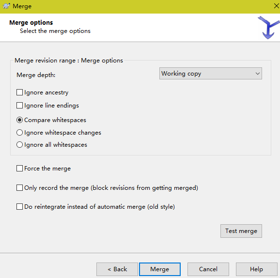

# 2 SVN使用

本章节主要介绍常用的svn工具，如window下svn服务器VisualSVN，客户端工具TortoiseSVN以及idea svn插件的
使用

## 2.1 服务器端VisualSVN安装与配置

### 2.1.2 VisualSVN安装与创建仓库

这个服务要开启 在开始运行中查找visualSVN Server Manager就可以打开图形化管理界面

### 2.1.3 VisualSVN创建工程目录

### 2.1.4 VisualSVN 权限控制

User name: admin    Password: admin

创建组

---

给指定仓库分配权限：（也就是谁能访问他）

---

访问我们创建的名为bos的库

---

## 2.2 客户端TortoiseSVN安装与使用

要选上这个选项：

 

### 2.2.3 Tortoise SVN 常用操作

#### 2.2.3.2 checkout

检出svn服务器上的项目（也就是down下来内容）

没有红色的字表示OK。注意：检出后会有
一个.svn隐藏目录

---

这表示小刘这个文件夹已经纳入了SVN的管理范围内。

---

#### 2.2.3.3 add

代表它添加到了我们的本地仓库

#### 2.2.3.4 commit

#### 2.2.3.9 冲突问题与解决

在开发中尽量避免冲突问题，方法：在每一次我们对代码进行修改之前，都进行update一下，先与我服务器上的代码就行同步，再去提交修改。（养成习惯）

---

### 2.3.2 IDEA 下SVN使用

#### 2.3.2.1 share project

 

---

#### 2.3.2.4 ignor

#### 2.3.2.5 解决冲突

---

# 3. SVN规范

## 3.1 SVN目录规范

重新创建一个库，这次选择第二项，着表示它会帮我们创建有trunk，branches，tags目录结构。

---

share project:

---

设置一些忽略信息：

---

提交：

---

## 3.2分支与标记

### 3.2.1.分支或标记规范

分支的定义规则: Project name+日期时间+功能点 

Tags的定义规则 Project name+版本号 版本号定义为三段数字 编号 xxx.xxx.xxx 第一个:革命性的产品升级版 第二个:新功能版 第三个:修正bug

### 3.2.2.打分支或标记

打分支 branches

---

刷新后：（tags打标记，也是一样的道理）

tags一般是只读，它代表的是发布的版本，所以我们不要进行改变。

---

## 3.3 主干与分支或标记的合并

### 3.3.1 主干合并到分支

我们打分支或者打表及以后，是可以把主干合并到分支，分支再合并发到主干，他们可以相互的去和，但是我们一般不去操作tags标记，tags标记一般代表着一个里程碑的结果，一般是只读的，所以一般不对它操作。

现在我们想让主干合并到分支，==首先保证主干是最新的(先update)==，在分支这边进行操作

---

点击Merge之前最好先 Test merge

点击Merge按钮后trunk所做的修改将同步到branch中。 

---

合并成功，有警告是因为分支上的代码变化了。

至此，branch 已经完全和 trunk 同步，合并发生在本地 working copy，只要你不提交就不会影响到 repository。

所以我们和合并操作后，处理好冲突（如果存在冲突）后，将代码提交到 repository。

---

注意事项：在合并的过程中不可避免的要产生冲突，这时候我们需要人为手动的解决冲突。

同样的道理，我们想把分支合并到主干也是一样的。

只要记住一点，合并之前保证本地代码和SVN的代码都是最新的，==先更新，再提交==，尽量减少冲突 

我们想让主干合并到分支，==首先保证主干是最新的(先update)==，在分支这边进行操作；

如果我们想让分支合并到主干，==首先保证分支是最新的(先update)==，在主干这边进行操作。