# 0.学习目标

- 独立编写数据导入功能
- 独立实现基本搜索
- 独立实现页面分页
- 独立实现结果排序


# 1.索引库数据导入

昨天我们学习了Elasticsearch的基本应用。今天就学以致用，搭建搜索微服务，实现搜索功能。

## 1.1.创建搜索服务

创建module：

 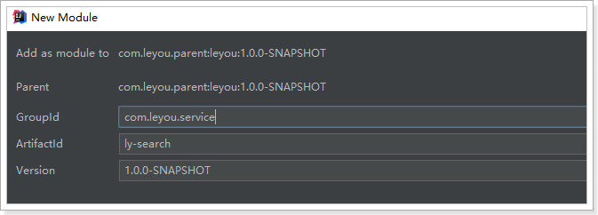

 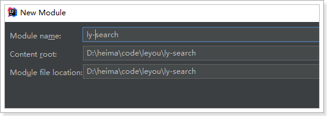

Pom文件：

```xml
<?xml version="1.0" encoding="UTF-8"?>
<project xmlns="http://maven.apache.org/POM/4.0.0"
         xmlns:xsi="http://www.w3.org/2001/XMLSchema-instance"
         xsi:schemaLocation="http://maven.apache.org/POM/4.0.0 http://maven.apache.org/xsd/maven-4.0.0.xsd">
    <parent>
        <artifactId>leyou</artifactId>
        <groupId>com.leyou.parent</groupId>
        <version>1.0.0-SNAPSHOT</version>
    </parent>
    <modelVersion>4.0.0</modelVersion>

    <groupId>com.leyou.service</groupId>
    <artifactId>ly-search</artifactId>


    <dependencies>
        <!--eureka-->
        <dependency>
            <groupId>org.springframework.cloud</groupId>
            <artifactId>spring-cloud-starter-netflix-eureka-client</artifactId>
        </dependency>
        <!--web-->
        <dependency>
            <groupId>org.springframework.boot</groupId>
            <artifactId>spring-boot-starter-web</artifactId>
        </dependency>
        <!--elasticsearch-->
        <dependency>
            <groupId>org.springframework.boot</groupId>
            <artifactId>spring-boot-starter-data-elasticsearch</artifactId>
        </dependency>
        <!--feign(用于服务间的远程调用)-->
        <dependency>
            <groupId>org.springframework.cloud</groupId>
            <artifactId>spring-cloud-starter-openfeign</artifactId>
        </dependency>
        <dependency>
            <groupId>org.springframework.boot</groupId>
            <artifactId>spring-boot-starter-test</artifactId>
        </dependency>
        <!--商品微服务的实体类-->
        <dependency>
            <groupId>com.leyou.service</groupId>
            <artifactId>ly-item-interface</artifactId>
            <version>1.0.0-SNAPSHOT</version>
        </dependency>
    </dependencies>
</project>
```

application.yml：

```yaml
server:
  port: 8084
spring:
  application:
    name: search-service
  data:
    elasticsearch:
      cluster-name: elasticsearch
      cluster-nodes: 192.168.50.128:9300
eureka:
  client:
    service-url:
      defaultZone: http://127.0.0.1:10086/eureka
    #以为search微服务要获取其他的微服务，所以把它的fetch调短一点，调为5秒，这样频率高些
    registry-fetch-interval-seconds: 5
  instance:
    #lease-renewal-interval-in-seconds: 5 # 每隔5秒发送一次心跳
    #lease-expiration-duration-in-seconds: 10 # 10秒不发送就过期
    prefer-ip-address: true
    ip-address: 127.0.0.1
    #instance-id: ${spring.application.name}:${server.port}
```

启动类：

```java
package com.leyou;

@SpringBootApplication
@EnableDiscoveryClient
@EnableFeignClients
public class LySearchApplication {
    public static void main(String[] args) {
        SpringApplication.run(LySearchApplication.class, args);
    }
}
```

## 1.2.索引库数据格式分析

接下来，我们需要商品数据导入索引库，便于用户搜索。

那么问题来了，我们有SPU和SKU，到底如何保存到索引库？

### 1.2.1.以结果为导向

大家来看下搜索结果页：


可以看到，每一个搜索结果都有至少1个商品，当我们选择大图下方的小图，商品会跟着变化。

因此，**搜索的结果是SPU，即多个SKU的集合**。

既然搜索的结果是SPU，那么我们索引库中存储的应该也是SPU，但是却需要包含SKU的信息。


### 1.2.2.需要什么数据

再来看看页面中有什么数据：

  


直观能看到的：图片、价格、标题、副标题   --->属于SKU数据（用来展示的数据）

暗藏的数据：spu的id，sku的id


另外，页面还有过滤条件：


这些过滤条件也都需要存储到索引库中，包括：

商品分类、品牌、可用来搜索的规格参数等

综上所述，我们需要的数据格式有：

spuId、SkuId、商品分类id、品牌id、图片、价格、商品的创建时间、sku信息集、可搜索的规格参数


### 1.2.3.最终的数据结构

我们创建一个类，封装要保存到索引库的数据，并设置映射属性：

```java
package com.leyou.search.pojo;

import org.springframework.data.annotation.Id;
import org.springframework.data.elasticsearch.annotations.Document;
import org.springframework.data.elasticsearch.annotations.Field;
import org.springframework.data.elasticsearch.annotations.FieldType;

@Data
@Document(indexName = "goods", type = "docs", shards = 1, replicas = 0)
public class Goods {
    @Id
    private Long id; // spuId

    @Field(type = FieldType.Text, analyzer = "ik_max_word")
    private String all; // 所有需要被搜索的信息，包含标题，分类，甚至品牌

    @Field(type = FieldType.Keyword, index = false)//不进行分词，不能进行搜索
    private String subTitle;// 卖点(鼠标放在商品上显示出来的数据)

    private Long brandId;// 品牌id
    private Long cid1;// 1级分类id
    private Long cid2;// 2级分类id
    private Long cid3;// 3级分类id
    private Date createTime;// 创建时间
    private Set<Long> price;// 价格

    @Field(type = FieldType.Keyword, index = false)
    private String skus;// sku信息的json结构
    private Map<String, Object> specs;// 可搜索的规格参数，key是参数名，值是参数值
}
```

一些特殊字段解释：

- all：用来进行全文检索的字段，里面包含标题、商品分类信息

- price：价格数组，是所有sku的价格集合。方便根据价格进行筛选过滤。（一个spu下可能有多个sku）

- skus：用于页面展示的sku信息，不索引，不搜索。包含skuId、image、price、title字段

- specs：所有规格参数的集合。key是参数名，值是参数值。

  例如：我们在specs中存储 内存：4G,6G，颜色为红色，转为json就是：

  ```json
  {
      "specs":{
          "内存":[4G,6G],
          "颜色":"红色"
      }
  }
  ```

  当存储到索引库时，elasticsearch会处理为两个字段：

  - specs.内存 ： [4G,6G]
  - specs.颜色：红色

  另外， 对于字符串类型，还会额外存储一个字段，这个字段不会分词，用作聚合。

  - specs.颜色.keyword：红色

## 1.3.商品微服务提供接口

索引库中的数据来自于数据库，我们不能直接去查询商品的数据库，因为真实开发中，每个微服务都是相互独立的，包括数据库也是一样。所以我们只能调用商品微服务提供的接口服务。

先思考我们需要的数据：

- SPU信息

- SKU信息

- SPU的详情

- 商品分类名称（拼接all字段）

- 规格参数key

- 品牌

  

再思考我们需要哪些服务：

- 第一：分批查询spu的服务，已经写过。
- 第二：根据spuId查询sku的服务，已经写过
- 第三：根据spuId查询SpuDetail的服务，已经写过
- 第四：根据商品分类id，查询商品分类名称，没写过
- 第五：规格参数，已经写过。
- 第六：品牌，没写过。


因此我们需要额外提供一个查询商品分类名称和查询品牌的接口。

### 1.3.1.商品分类名称查询

controller：

在CategoryController

```java
/**
     * 根据id的数组查询商品分类
     * @param ids
     * @return
     */
    @GetMapping("list/ids")
    public ResponseEntity<List<Category>> queryCategoryByIds(@RequestParam("ids") List<Long> ids){
        return ResponseEntity.ok(categoryService.queryByIds(ids));
    }
```

在BrandController

```java

    /**
     * 根据id查询品牌
     * @param id
     * @return
     */
    @GetMapping("{id}")
    public ResponseEntity<Brand> queryBrandById(@PathVariable("id") Long id){
        return ResponseEntity.ok(brandService.queryById(id));
    }
```

测试：OK!


### 1.3.2.编写FeignClient

#### 问题展现：

现在，我们要在搜索微服务调用商品微服务的接口。

第一步要引入商品微服务依赖：（已经引入）`ly-item-interface`。

第二步，编写FeignClient（有问题）

```java
@FeignClient(value = "item-service")
@RequestMapping("/goods")
public interface GoodsClient {

    /**
     * 分页查询商品
     * @param page
     * @param rows
     * @param saleable
     * @param key
     * @return
     */
    @GetMapping("/spu/page")
    ResponseEntity<PageResult<SpuBo>> querySpuByPage(
            @RequestParam(value = "page", defaultValue = "1") Integer page,
            @RequestParam(value = "rows", defaultValue = "5") Integer rows,
            @RequestParam(value = "saleable", defaultValue = "true") Boolean saleable,
            @RequestParam(value = "key", required = false) String key);

    /**
     * 根据spu商品id查询详情
     * @param id
     * @return
     */
    @GetMapping("/spu/detail/{id}")
    ResponseEntity<SpuDetail> querySpuDetailById(@PathVariable("id") Long id);

    /**
     * 根据spu的id查询sku
     * @param id
     * @return
     */
    @GetMapping("sku/list")
    ResponseEntity<List<Sku>> querySkuBySpuId(@RequestParam("id") Long id);
}
```

以上的这些代码直接从商品微服务中拷贝而来，完全一致。差别就是没有方法的具体实现。大家觉得这样有没有问题？


而FeignClient代码遵循SpringMVC的风格，因此与商品微服务的Controller完全一致。这样就存在一定的问题：

- 代码冗余。尽管不用写实现，只是写接口，但服务调用方要写与服务controller一致的代码，有几个消费者就要写几次。
- 增加开发成本。调用方还得清楚知道接口的路径，才能编写正确的FeignClient。


#### 解决方案：

因此，一种比较友好的实践是这样的：

- 我们的服务提供方不仅提供实体类，还要提供api接口声明
- 调用方不用自己编写接口方法声明，直接继承提供方给的Api接口即可，


第一步：服务的提供方在`ly-item-interface`中提供API接口，并编写接口声明：

  

商品分类服务接口：CategoryApi

```java
package com.leyou.item.api;

public interface CategoryApi {
    /**
     * 根据id的数组查询商品分类
     * @param ids
     * @return
     */
    @GetMapping("category/list/ids")
    List<Category> queryCategoryByIds(@RequestParam("ids")List<Long> ids);

    /**
     * 根据spuId查询下面的所有sku
     * @param spuId
     * @return
     */
    @GetMapping("category/sku/list")
    List<Sku> querySkuBySpuId(@RequestParam("id") Long spuId);
}

```

商品服务接口：GoodsApi

```java
package com.leyou.item.api;

public interface GoodsApi {

    /**
     * 分页查询SPU
     * @param page
     * @param rows
     * @param saleable
     * @param key
     * @return
     */
    @GetMapping("/spu/page")
    PageResult<Spu> querySpuByPage(
            @RequestParam(value = "page", defaultValue = "1") Integer page,
            @RequestParam(value = "rows", defaultValue = "5") Integer rows,
            @RequestParam(value = "saleable", required = false) Boolean saleable,
            @RequestParam(value = "key", required = false) String key
    );

    /**
     * 根据spu的id查询详情detail
     * @param spuId
     * @return
     */
    @GetMapping("/spu/detail/{id}")
    SpuDetail queryDetailById(@PathVariable("id") Long spuId);

}
```

品牌接口：BrandApi

```java
package com.leyou.item.api;

public interface BrandApi {

    /**
     * 根据id查询品牌
     * @param id
     * @return
     */
    @GetMapping("brand/{id}")
    Brand queryBrandById(@PathVariable("id") Long id);
}
```

规格接口：SpecificationApi

```java
package com.leyou.item.api;

public interface SpecificationApi {
    /**
     * 查询参数集合
     * @param gid 组id
     * @param cid 分类id
     * @param searching 是否搜索
     * @return
     */
    @GetMapping("spec/params")
    List<SpecParam> queryParamList(
            @RequestParam(value = "gid", required = false) Long gid,
            @RequestParam(value = "cid", required = false) Long cid,
            @RequestParam(value = "searching", required = false) Boolean searching
    );
}
```


需要在ly-item-interface中引入一些依赖：

```xml
<dependency>
    <groupId>org.springframework</groupId>
    <artifactId>spring-webmvc</artifactId>
</dependency>
<dependency>
    <groupId>com.leyou.common</groupId>
    <artifactId>ly-common</artifactId>
    <version>1.0.0-SNAPSHOT</version>
</dependency>
```


第二步：在调用方`ly-search`中编写FeignClient，但不要写方法声明了，直接继承`ly-item-interface`提供的api接口：

商品的FeignClient： 

GoodsClient

```java
package com.leyou.search.client;

@FeignClient(value = "item-service")
public interface GoodsClient extends GoodsApi {
}
```

商品分类的FeignClient：

CategoryClient

```java
package com.leyou.search.client;

@FeignClient("item-service")
public interface CategoryClient extends CategoryApi {
}
```

品牌接口：FeignClient：

BrandClient

```java
package com.leyou.search.client;

@FeignClient("item-service")
public interface BrandClient extends BrandApi {
}
```

规格接口：FeignClient：

SpecificationClient

```java
package com.leyou.search.client;

@FeignClient("item-service")
public interface SpecificationClient extends SpecificationApi {
}
```


是不是简单多了？

目录结构：

 

------

 


#### 测试

测试代码不变，但是实现方法变了。

引入springtest依赖：

```xml
<dependency>
    <groupId>org.springframework.boot</groupId>
    <artifactId>spring-boot-starter-test</artifactId>
    <scope>test</scope>
</dependency>
```

创建测试类：

在接口上按快捷键：`Ctrl + Shift + T`

 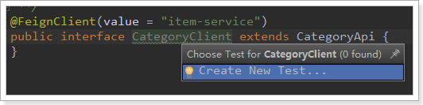

 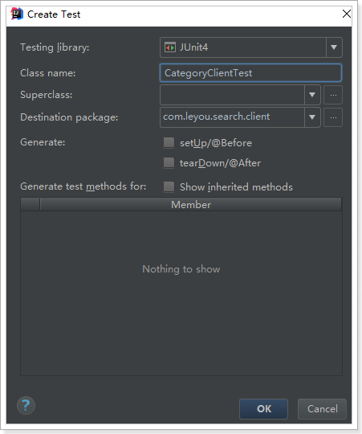

测试代码：

```java
package com.leyou.search.client;

@RunWith(SpringRunner.class)
@SpringBootTest
public class CategoryClientTest {

    @Autowired
    private CategoryClient categoryClient;

    @Test
    public void queryCategoryByIds(){
        List<Category> categories = categoryClient.queryCategoryByIds(Arrays.asList(1L, 2L, 3L));
        //断言
        Assert.assertEquals(3, categories.size());
        for (Category category : categories) {
            System.out.println("category = " + category);
        }
    }
}
```


结果：

  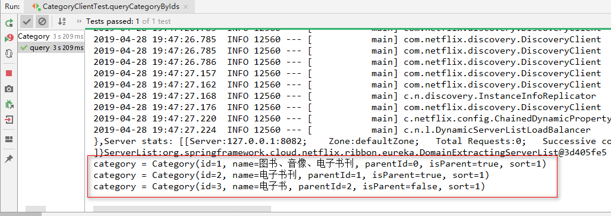


## 1.4.导入数据


### 1.4.1.创建GoodsRepository

java代码：

```java
package com.leyou.search.repository;

public interface GoodsRepository extends ElasticsearchRepository<Goods, Long> {
}
```


### 1.4.2.创建索引

我们新建一个测试类，在里面进行数据的操作：

```java
package com.leyou.search.repository;

@RunWith(SpringRunner.class)
@SpringBootTest
public class GoodsRepositoryTest {

    @Autowired
    private GoodsRepository goodsRepository;

    @Autowired
    private ElasticsearchTemplate template;

    @Test
    public void testCreateIndex(){
        //创建索引
        template.createIndex(Goods.class);
        //配置映射
        template.putMapping(Goods.class);
    }
}
```

 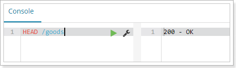


### 1.4.3.导入数据

导入数据其实就是查询数据，然后把查询到的Spu转变为Goods来保存，因此我们先编写一个SearchService，然后在里面定义一个方法， 把Spu转为Goods

在SearchService

```java
package com.leyou.search.service;

import com.leyou.common.utlis.JsonUtils;
import com.leyou.common.utlis.NumberUtils;

@Service
public class SearchService {

    @Autowired
    private CategoryClient categoryClient;

    @Autowired
    private BrandClient brandClient;

    @Autowired
    private SpecificationClient specificationClient;

    @Autowired
    private GoodsClient goodsClient;

    public Goods buildGoods(Spu spu){
        Long spuId = spu.getId();

        //查询分类名称
        List<Category> categories = categoryClient.queryCategoryByIds(
                Arrays.asList(spu.getCid1(), spu.getCid2(), spu.getCid3()));
        if (CollectionUtils.isEmpty(categories)){
            throw new LyException(ExceptionEnum.CATEGORY_NOT_FOUND);
        }
        List<String> names = categories.stream()
                .map(Category::getName).collect(Collectors.toList());

        //查询品牌
        Brand brand = brandClient.queryBrandById(spu.getBrandId());
        if (brand == null) {
            throw new LyException(ExceptionEnum.BRAND_NOT_FOUND);
        }

        //搜索字段
        String all = spu.getTitle() + StringUtils.join(names, " ") + brand.getName();

        //查询sku,取出所有价格
        List<Sku> skuList = goodsClient.querySkuBySpuId(spu.getId());
        if (CollectionUtils.isEmpty(skuList)){
            throw new LyException(ExceptionEnum.GOODS_SKU_NOT_FOUND);
        }
        //对sku进行处理， 因为sku的字段太多了，我们只需要id,title,image.price
        List<Map<String,Object>> skus = new ArrayList<>();
        //价格集合
        Set<Long> priceSet = new HashSet<>();
        for (Sku sku : skuList) {
            Map<String,Object> map = new HashMap<>();
            map.put("id", sku.getId());
            map.put("title", sku.getTitle());
            map.put("price", sku.getPrice());
            map.put("image", StringUtils.substringBefore(sku.getImages(), ","));
            skus.add(map);
            //处理价格
            priceSet.add(sku.getPrice());
        }

        //查询规格参数（specs规格参数的key在规格参数表）分类绑定的是cid3
        List<SpecParam> params = specificationClient.queryParamList(null, spu.getCid3(), true);
        if (CollectionUtils.isEmpty(params)){
            throw new LyException(ExceptionEnum.SPEC_PARAM_NOT_FOUND);
        }
        //查询商品详情（specs规格参数的value在商品详情表）
        SpuDetail spuDetail = goodsClient.queryDetailById(spuId);
        //获取通用规格参数(注意查看数据库中表数据的结构)
        Map<String, String> genericSpec = JsonUtils.toMap(spuDetail.getGenericSpec(), String.class, String.class);
        //获取特有规格参数(注意查看数据库中表数据的结构)
        Map<String, List<String>> specialSpec = JsonUtils
                .nativeRead(spuDetail.getSpecialSpec(), new TypeReference<Map<String, List<String>>>() {});
        //规格参数,key是规格参数的名字，值是规格参数的值
        Map<String,Object> specs = new HashMap<>();
        for (SpecParam param : params) {
            //规格名称
            String key = param.getName();
            Object value = "";
            //判断是否是通用规格
            if (param.getGeneric()){
                //获取到的通用和特有规格参数map的key都是String类型，所以我们这儿调用toString()来作转换
                value = genericSpec.get(param.getId().toString());
                //判断是否是数值类型
                if (param.getNumeric()){
                    //处理成段
                    value = chooseSegment(value.toString(), param);
                }
            }else{
                //获取到的特有规格map的值是一个集合类型，不是string类型，所以没有必要去处理成段
                value = specialSpec.get(param.getId().toString());
            }
            //存入map
            specs.put(key, value);
        }

        //构建Goods对象
        Goods goods = new Goods();
        goods.setBrandId(spu.getBrandId());
        goods.setCid1(spu.getCid1());
        goods.setCid2(spu.getCid2());
        goods.setCid3(spu.getCid3());
        goods.setCreateTime(spu.getCreateTime());
        goods.setId(spu.getId());
        goods.setAll(all); //  搜索字段，包含标题，分类，品牌，规格等
        goods.setPrice(priceSet); //  所有sku的价格集合
        goods.setSkus(JsonUtils.toString(skus)); //  所有sku的集合的json格式,目的是取出所有价格
        goods.setSpecs(specs); //  所有的可搜索的规格参数
        goods.setSubTitle(spu.getSubTitle());

        return goods;

    }

    /**
     * 分段处理
     * @param value
     * @param p
     * @return
     */
    private String chooseSegment(String value, SpecParam p) {
        //导入自己写的工具类
        double val = NumberUtils.toDouble(value);
        String result = "其它";
        // 保存数值段
        for (String segment : p.getSegments().split(",")) {
            String[] segs = segment.split("-");
            // 获取数值范围
            double begin = NumberUtils.toDouble(segs[0]);
            double end = Double.MAX_VALUE;
            if(segs.length == 2){
                end = NumberUtils.toDouble(segs[1]);
            }
            // 判断是否在范围内
            if(val >= begin && val < end){
                if(segs.length == 1){
                    result = segs[0] + p.getUnit() + "以上";
                }else if(begin == 0){
                    result = segs[1] + p.getUnit() + "以下";
                }else{
                    result = segment + p.getUnit();
                }
                break;
            }
        }
        return result;
    }
}
```

因为过滤参数中有一类比较特殊，就是数值区间：


所以我们在存入时要进行处理：SearchService中的一个方法

```java
 /**
     * 分段处理
     * @param value
     * @param p
     * @return
     */
private String chooseSegment(String value, SpecParam p) {
    double val = NumberUtils.toDouble(value);
    String result = "其它";
    // 保存数值段
    for (String segment : p.getSegments().split(",")) {
        String[] segs = segment.split("-");
        // 获取数值范围
        double begin = NumberUtils.toDouble(segs[0]);
        double end = Double.MAX_VALUE;
        if(segs.length == 2){
            end = NumberUtils.toDouble(segs[1]);
        }
        // 判断是否在范围内
        if(val >= begin && val < end){
            if(segs.length == 1){
                result = segs[0] + p.getUnit() + "以上";
            }else if(begin == 0){
                result = segs[1] + p.getUnit() + "以下";
            }else{
                result = segment + p.getUnit();
            }
            break;
        }
    }
    return result;
}
```


然后编写一个测试类，循环查询Spu，然后调用IndexService中的方法，把SPU变为Goods，然后写入索引库：

 ```java
  @Test
    public void loadData(){
        int page = 1;
        int rows = 100;//每页存100条
        int size = 0;
        do {
            //查询spu信息
            PageResult<Spu> result = goodsClient.querySpuByPage(page, rows, true, null);
            List<Spu> spuList = result.getItems();
            if (CollectionUtils.isEmpty(spuList)){
                break;
            }
            //构建goods，spu转为goods
            List<Goods> goodsList = spuList.stream().map(searchService::buildGoods).collect(Collectors.toList());
            //存入索引库
            goodsRepository.saveAll(goodsList);

            //翻页
            page++;
            size = spuList.size();
        } while (size == 100);
    }
 ```

目录结构：

 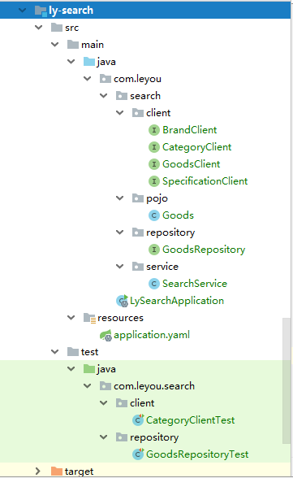 


通过kibana查询， 可以看到数据成功导入：

 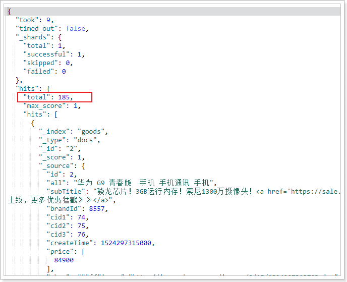


# 2.实现基本搜索

## 2.1.页面分析

### 2.1.1.页面跳转

在首页的顶部，有一个输入框：


当我们输入任何文本，点击搜索，就会跳转到搜索页`search.html`了：

并且将搜索关键字以请求参数携带过来：

 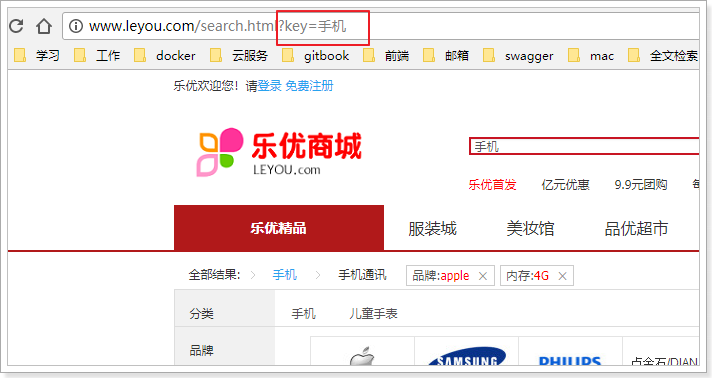


我们打开`search.html`，在最下面会有提前定义好的Vue实例：

```html
<script type="text/javascript">
    var vm = new Vue({
        el: "#searchApp",
        data: {
        },
        components:{
            // 加载页面顶部组件
            lyTop: () => import("./js/pages/top.js")
        }
    });
</script>
```

这个Vue实例中，通过import导入的方式，加载了另外一个js：top.js并作为一个局部组件。top其实是页面顶部导航组件，我们暂时不管

### 2.1.2.发起异步请求

要想在页面加载后，就展示出搜索结果。我们应该在页面加载时，获取地址栏请求参数，并发起异步请求，查询后台数据，然后在页面渲染。

我们在data中定义一个对象，记录请求的参数，

我们通过钩子函数created，在页面加载时获取请求参数，并记录下来，

然后发起请求，搜索数据。

```js
<script type="text/javascript">
    var vm = new Vue({
        el: "#searchApp",
        data: {
            //定义一个对象，记录请求的参数
            search:{}
        },
        created(){
            //获取请求参数
            const search = ly.parse(location.search.substring(1));
            this.search = search;
            //发起请求，发送后台
            this.loadData();
        },
        methods:{
            loadData() {
                //发送到后台
                ly.http.post("/search/page", this.search).then(resp => {
                    console.log(resp);
                }).catch(error => {

                })
            }
        },
        components:{
            lyTop: () => import("./js/pages/top.js")
        }
    });
</script>
```


- 我们这里使用`ly`是common.js中定义的工具对象。
- 这里使用的是post请求，这样可以携带更多参数，并且以json格式发送


测试：无效的跨域请求。

 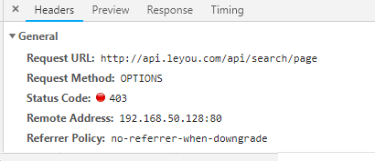

 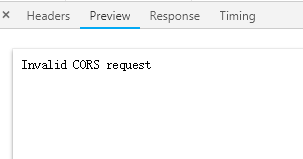


在ly-gateway微服务的跨域过滤器中添加允许的域：

 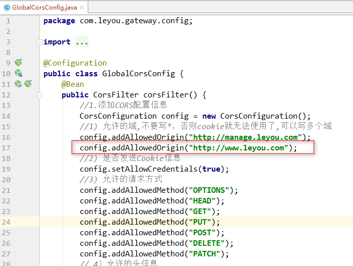


重启网关微服务。


刷新页面试试：

 （200，遇说明域检请求通过）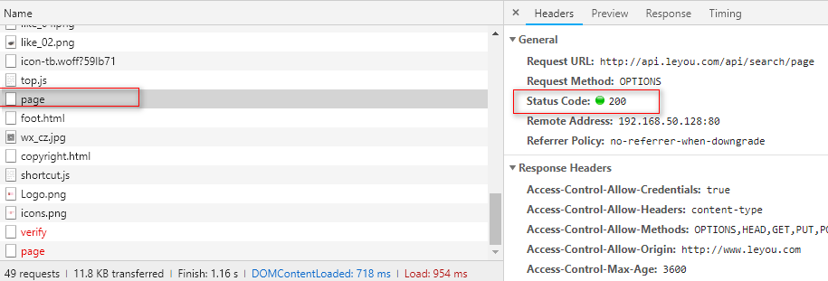

 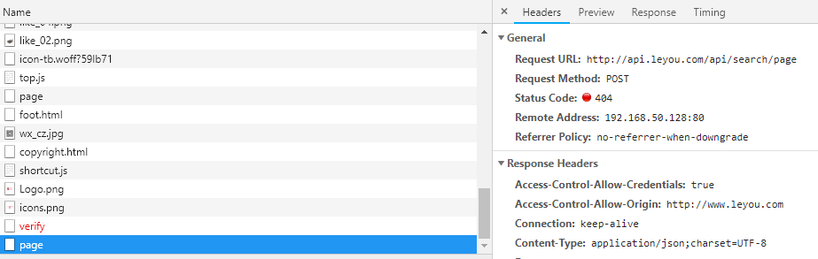

请求体：

 

因为后台没有提供接口，所以无法访问。没关系，接下来我们实现后台接口


## 2.2.后台提供搜索接口

在ly-gateway中添加路由：

```yaml
server:
  port: 10010
spring:
  application:
    name: api-gateway
eureka:
  client:
    service-url:
      defaultZone: http://127.0.0.1:10086/eureka
zuul:
  prefix: /api # 添加路由前缀
  routes:
    item-service: /item/** # 将商品微服务映射到/item/**
    【1】
    search-service: /search/** # 将商品微服务映射到/search/**
    【1】
    upload-service:
      path: /upload/**
      serviceId: upload-service
      strip-prefix: false
ribbon:
  ConnectTimeout: 1000 # 连接超时时间(ms)
  ReadTimeout: 3500 # 通信超时时间(ms)
  #重试功能可能导致添加两次的安全问题，所以我们设置为0关闭重试
  MaxAutoRetriesNextServer: 0 # 同一服务不同实例的重试次数
  MaxAutoRetries: 0 # 同一实例的重试次数
hystrix:
  command:
    default:
      execution:
        isolation:
          thread:
            timeoutInMillisecond: 5000 # 熔断超时时长：5000ms
```

重启网关微服务。


### 2.2.1.controller

首先分析几个问题：

- 请求方式：Post

- 请求路径：/search/page，不过前面的/search应该是网关的映射路径，因此真实映射路径page，代表分页查询

- 请求参数：json格式，目前只有一个属性：key,搜索关键字，但是搜索结果页一定是带有分页查询的，所以将来肯定会有page属性，因此我们可以用一个对象来接收请求的json数据：

  

  实体类：SearchRequest

  ```java
  package com.leyou.search.pojo;
  
  public class SearchRequest {
      private String key;// 搜索条件
  
      private Integer page;// 当前页
  
      private static final Integer DEFAULT_SIZE = 20;// 每页大小，不从页面接收，而是固定大小
      private static final Integer DEFAULT_PAGE = 1;// 默认页
  
      public String getKey() {
          return key;
      }
  
      public void setKey(String key) {
          this.key = key;
      }
  
      public Integer getPage() {
          if(page == null){
              return DEFAULT_PAGE;
          }
          // 获取页码时做一些校验，不能小于1
          return Math.max(DEFAULT_PAGE, page);
      }
  
      public void setPage(Integer page) {
          this.page = page;
      }
  
      public Integer getSize() {
          return DEFAULT_SIZE;
      }
  }
  ```

- 返回结果：作为分页结果，一般都两个属性：当前页数据、总条数信息，我们可以使用之前定义的PageResult<T>类


代码：SearchController

```java
package com.leyou.search.web;

import com.leyou.common.vo.PageResult;
import com.leyou.search.pojo.SearchRequest;

@RestController
public class SearchController {

    @Autowired
    private SearchService searchService;

    /**
     * 搜索功能
     * @param request
     * @return
     */
    @PostMapping("page")       //因为参数是json格式，所以用@RequestBody注解
    public ResponseEntity<PageResult<Goods>> search(@RequestBody SearchRequest request){
                                 // 注意是我们自己写的SearchRequest，别导错了
        return ResponseEntity.ok(searchService.search(request));

    }
}
```


### 2.2.2.service

在SearchService

```java
public PageResult<Goods> search(SearchRequest request) {
        int page = request.getPage() - 1;
        int size = request.getSize();

        //创建查询构建器
        NativeSearchQueryBuilder queryBuilder = new NativeSearchQueryBuilder();
        //0 结果过滤
        queryBuilder.withSourceFilter(new FetchSourceFilter(new String[]{"id", "subTitle", "skus"}, null));
        //1 分页
        queryBuilder.withPageable(PageRequest.of(page, size));
        //2 过滤
        queryBuilder.withQuery(QueryBuilders.matchQuery("all", request.getKey()));
        //3 查询
        Page<Goods> result = goodsRepository.search(queryBuilder.build());
        //4 解析结果
        long total = result.getTotalElements();
        int totalPages = result.getTotalPages();
        List<Goods> goodsList = result.getContent();
        return new PageResult<>(total, totalPages, goodsList);
    }
```

注意点：我们要设置SourceFilter，来选择要返回的结果，否则返回一堆多余没用的数据，影响查询效率。

### 2.2.3.测试

刷新页面测试：

 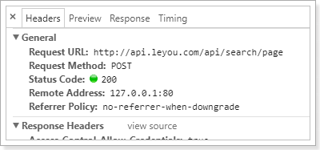 

 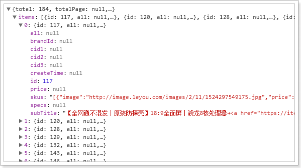

数据是查到了，但是因为我们只查询部分字段，所以结果json 数据中有很多null，这很不优雅。


解决办法很简单，在ly-search的 application.yml中添加一行配置，json处理时忽略空值：

```yaml
server:
  port: 8084
spring:
  application:
    name: search-service
  data:
    elasticsearch:
      cluster-name: elasticsearch
      cluster-nodes: 192.168.50.128:9300
  【1】
  jackson:
    default-property-inclusion: non_null    # 配置json处理时忽略空值
  【1】
eureka:
  client:
    service-url:
      defaultZone: http://127.0.0.1:10086/eureka
    #以为search微服务要获取其他的微服务，所以把它的fetch调短一点，调为5秒，这样频率高些
    registry-fetch-interval-seconds: 5
  instance:
    #lease-renewal-interval-in-seconds: 5 # 每隔5秒发送一次心跳
    #lease-expiration-duration-in-seconds: 10 # 10秒不发送就过期
    prefer-ip-address: true
    ip-address: 127.0.0.1
    #instance-id: ${spring.application.name}:${server.port}
```


### 目录结构：

 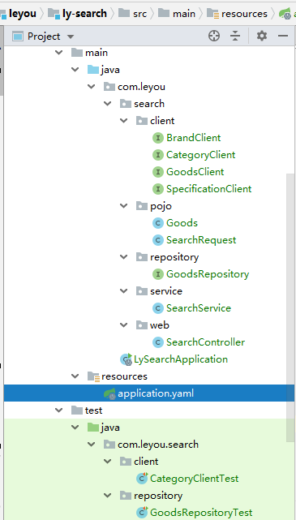


结果：很清爽，很优雅！

 


## 2.3.页面渲染

页面已经拿到了结果，接下来就要渲染样式了。

### 2.3.1.保存搜索结果

在search.html中

首先，在data中定义属性，保存搜索的结果：

 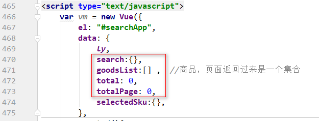

在`searchFromServer`的异步查询中，将结果赋值给`goodsList`：

 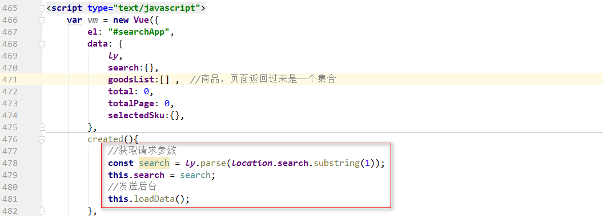

 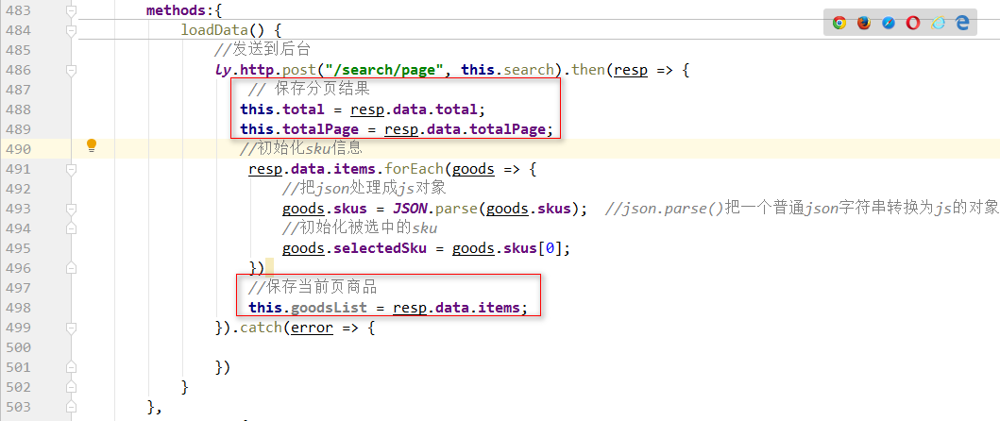


测试：

 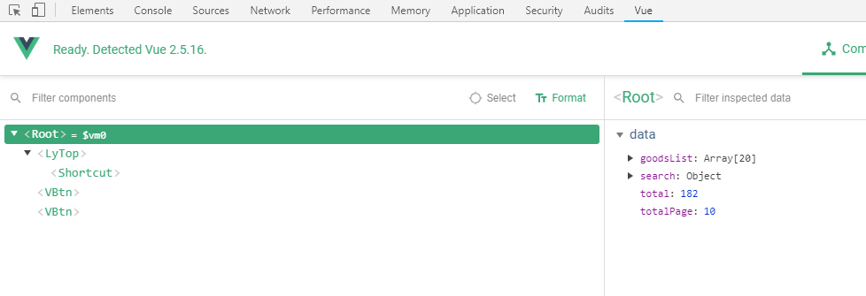


### 2.3.2.循环展示商品

在search.html的中部，有一个`div`，用来展示所有搜索到的商品：

 

可以看到，`div`中有一个无序列表`ul`，内部的每一个`li`就是一个商品spu了。

我们删除多余的，只保留一个`li`，然后利用vue的循环来展示搜索到的结果：

 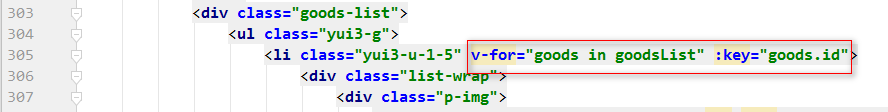

### 2.3.3.多sku展示

#### 分析

接下来展示具体的商品信息，来看图：

 

这里我们可以发现，一个商品位置，是多个sku的信息集合。**当用户鼠标选择某个sku，对应的图片、价格、标题会随之改变！**

我们先来实现sku的选择，才能去展示不同sku的数据。

 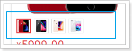

可以看到，在列表中默认第一个是被选中的，那我们就需要做两件事情：

- 记录当前被选中的是哪一个sku，记录在哪里比较合适呢？显然是遍历到的goods对象自己内部，因为每一个goods都会有自己的sku信息。
- 在搜索到数据时，先默认把第一个sku作为被选中的，记录下来

#### 初始化sku

我们在查询成功的回调函数中，对goods进行遍历，然后添加一个selected属性，保存被选中的sku：

  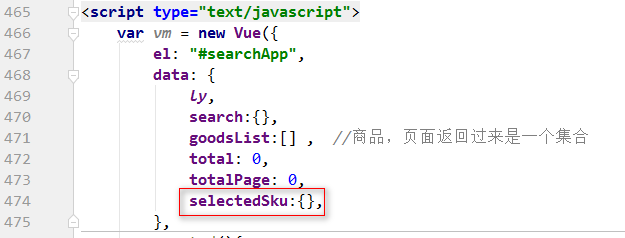

 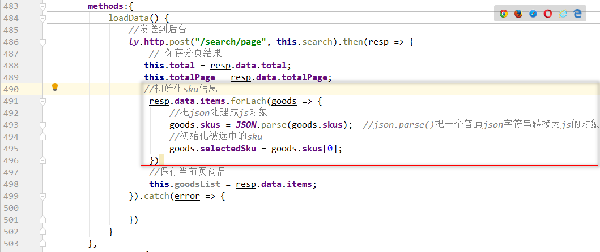

被选中的为第一个：

 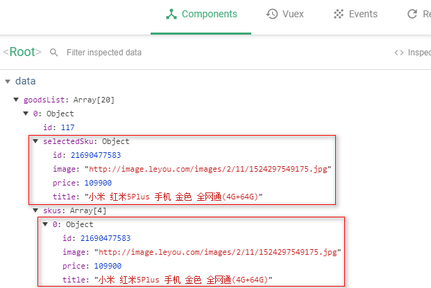


#### 多sku图片列表

接下来，我们看看多个sku的图片列表位置：

 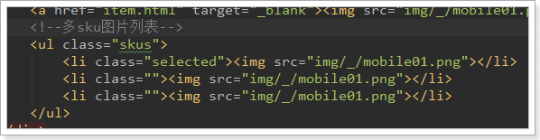

看到又是一个无序列表，这里我们也一样删掉多余的，保留一个`li`，需要注意选中的项有一个样式类：selected

我们的代码：

 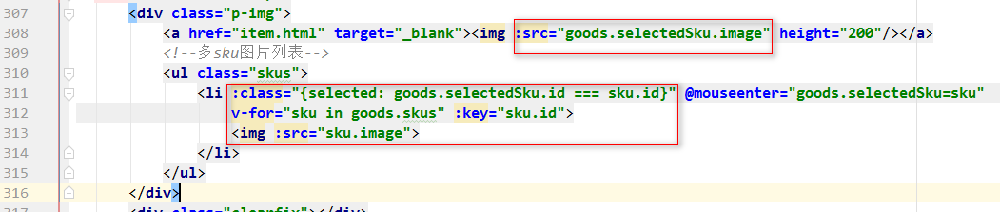

注意：

- class样式通过 goods.selectedSku的id是否与当前sku的id一致来判断
- 绑定了鼠标事件，鼠标进入后把当前sku赋值到goods.selectedSku


### 2.3.4.展示sku其它属性

现在，我们已经可以通过`goods.selected获取`用户选中的sku，那么我们就可以在页面展示了：

 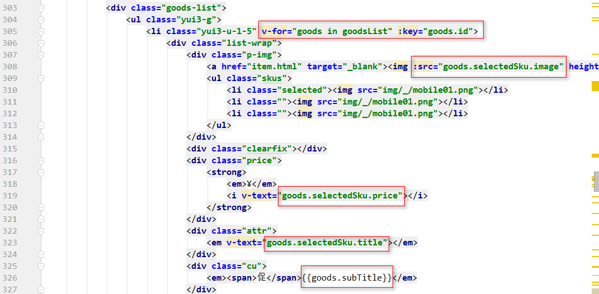


刷新页面：

 

看起来很完美是吧！

但其实有一些瑕疵

### 2.3.5.几个问题

#### 0）标题太长

标题title太长

修改search.html

 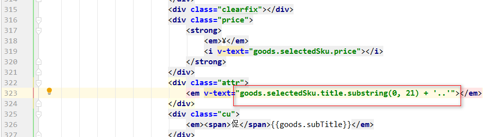

测试：

 


subTitle子标题太长

看到页面中子标题有标签，所以子标题不能用`v-text`，把它改成html

修改search.html

 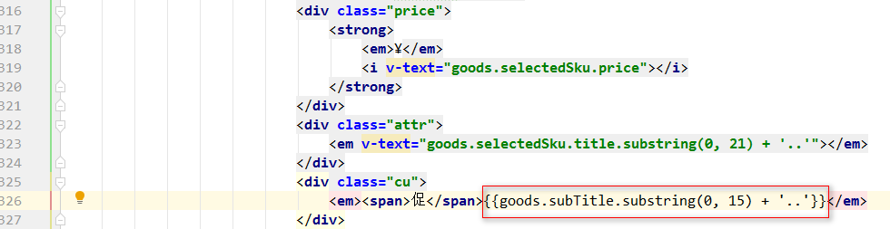

测试：

 

页面变得清爽，优雅！


#### 1）价格显示的是分

首先价格显示就不正确，我们数据库中存放的是以分为单位，所以这里要格式化。

在Vue范围内使用任何变量，都会默认去Vue实例中寻找，我们使用ly，但是Vue实例中没有这个变量。所以解决办法就是把ly记录到Vue实例：

 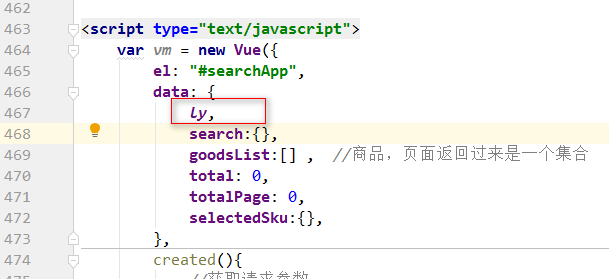

好在我们之前common.js中定义了工具类，可以帮我们转换。

改造：

 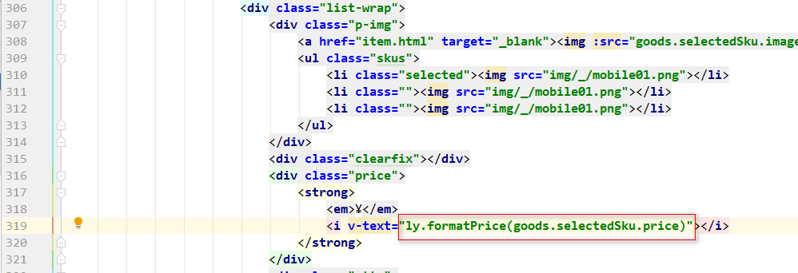


然后刷新页面：

 


#### 2）悬停展示所有内容

最好在加个悬停展示所有内容的效果


#### 3）sku点击不切换

还有一个错误比较隐蔽，不容易被发现。我们点击sku 的图片列表，发现没有任何变化。

这不科学啊，为什么？

通过控制台观察，发现数据其实是变化了，但是Vue却没有重新渲染视图。

这是因为Vue的自动渲染是基于对象的属性变化的。比如页面使用GoodsList进行渲染，如果GoodsList变化，或者其内部的任何子对象变化，都会Vue感知，从而从新渲染页面。

然而，这一切有一个前提，那就是当你第一次渲染时，对象中有哪些属性，Vue就只监视这些属性，后来添加的属性发生改变，是不会被监视到的。

而我们的goods对象中，本身是没有selected属性的，是我们后来才添加进去的：


这段代码稍微改造一下，即可：

 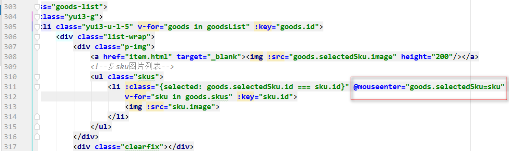

也就是说，我们先把selected属性初始化完毕，然后才把整个对象赋值给goodsList，这样，goodsList已初始化时就有selected属性，以后就会被正常监控了。

 


# 3.页面分页效果

刚才的查询中，我们默认了查询的页码和每页大小，因此所有的分页功能都无法使用，接下来我们一起看看分页功能条该如何制作。

这里要分两步，

- 第一步：如何生成分页条
- 第二步：点击分页按钮，我们做什么

## 3.1.如何生成分页条

先看下页面关于分页部分的代码：

 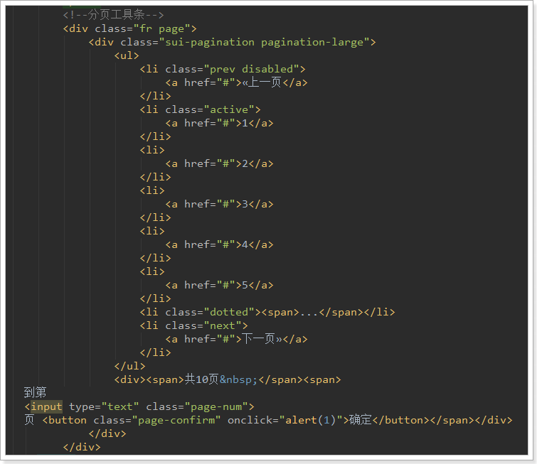

可以看到所有的分页栏内容都是写死的。

这儿运用短路或，如果search.page取出来有值，就是search.page，如果取出来没有值，就让它默认为 1.

需要注意的一个小细节，search.page是我们之前截取的，所以是一个String类型，而search.page应该是int类型，所以我们要记得转换。

 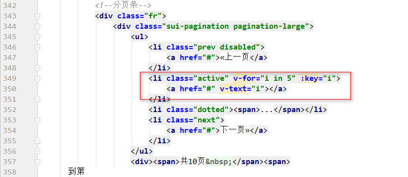

 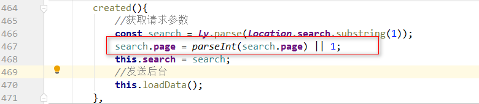

测试：

可以是可以，但当前页面的页码全部都被选中了。

 


修改：search.html

 如果页码是当前页才被选中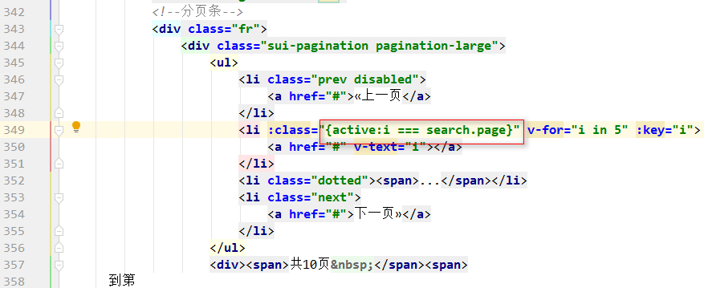


测试：

 


看起来是ok，但是我们page=4的时候，选中的页码虽然是4，但是选中应该是在中间，所以我们改变原来的写死的那些值。

 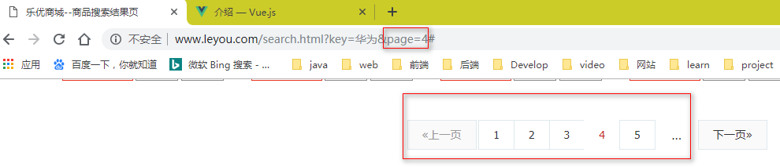


### 3.1.1.需要的数据

分页数据应该是根据**总页数**、**当前页**、**总条数**等信息来计算得出。

- 当前页：肯定是由页面来决定的，点击按钮会生成不同的页
- 总页数：需要后台传递给我们
- 总条数：需要后台传递给我们

我们首先在data中记录下这几个值：

 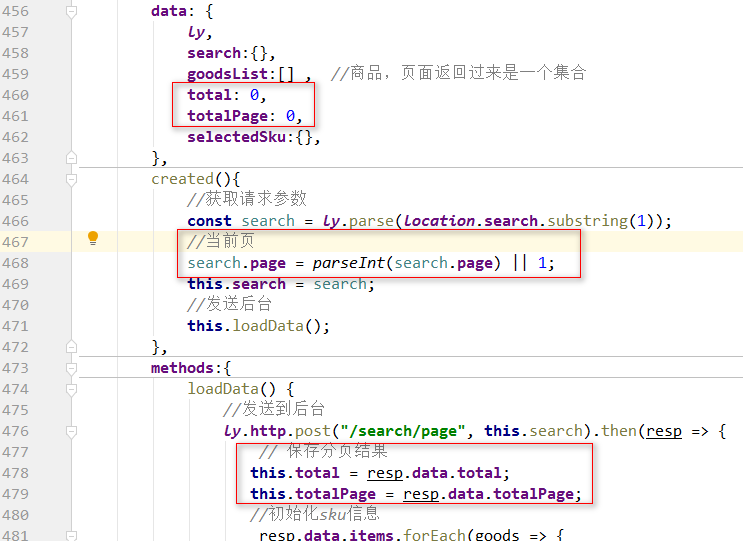


要注意：我们在created钩子函数中，会读取url路径的参数，然后赋值给this.total 和 this.totalPage 。如果是第一次请求页面，page是不存在的。因此为了避免page被覆盖，我们让它为 1 。


### 3.1.2.后台提供数据

后台返回的结果中，要包含total和totalPage，我们改造下刚才的接口：

在我们返回的PageResult对象中，其实是有totalPage字段的：

  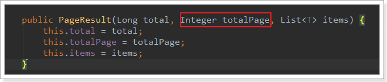

我们在返回时，把这个值填上：

 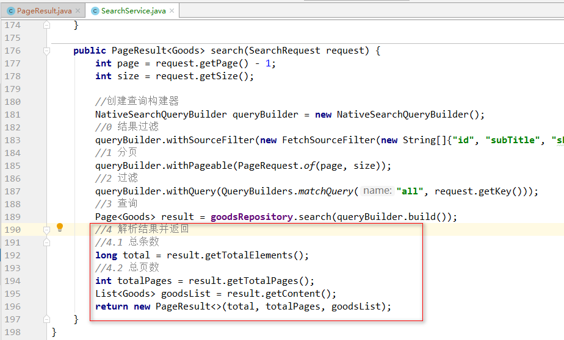

页面测试一下：

 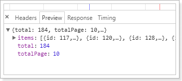

OK

### 3.1.3.页面计算分页条

首先，把后台提供的数据保存在data中（上面已经保存）：

然后看下我们要实现的效果：

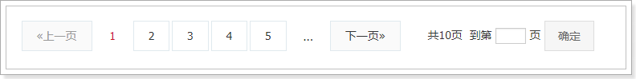

这里最复杂的是中间的1~5的分页按钮，它需要动态变化。

思路分析：

- 最多有5个按钮，因此我们可以用`v-for`循环从1到5即可，假如遍历得到的值为`i`
- 但是分页条不一定是从1开始：
  - 如果当前页值小于等于3的时候，分页条位置从1开始到5结束，页码就是遍历得到的`i`的值
  - 但是如果大于3，则不应该是`i`，而是要比`i`大了（page-3），所以就是`page-3 + i`

所以，我们的页面这样来做：

 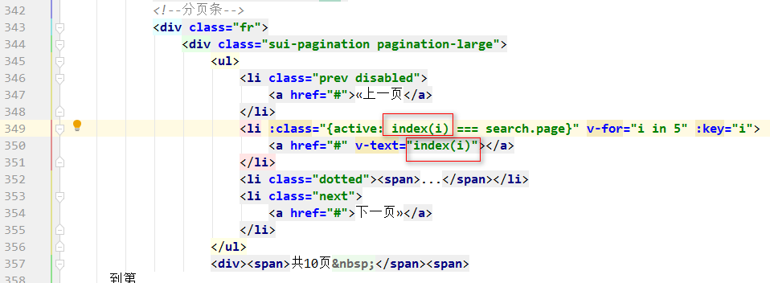

a标签中的分页数字通过`index`函数来计算，需要把`i`传递过去：

页码怎么算出来呢，我们需要定义一个`index`函数

 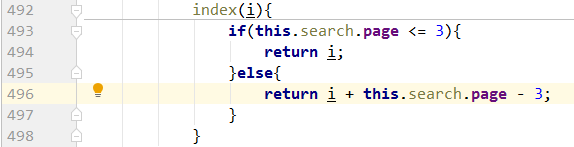

测试：

 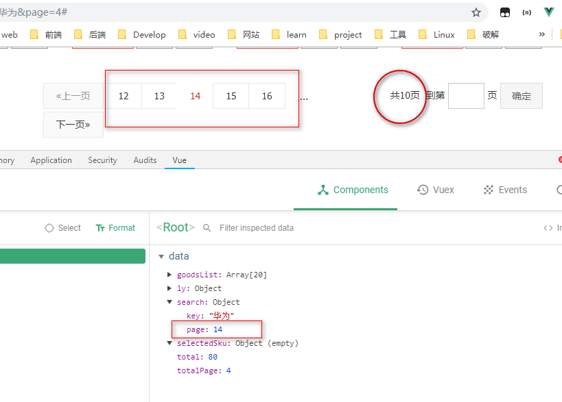

OK!但是我们的页码已经是14了，而总页码却还是10 。而且到了总页数，选中的页码就不应该还在中间了，应该向后移。我们就不应该遍历1到5，而是5到总页数，稍作改进：

修改：

 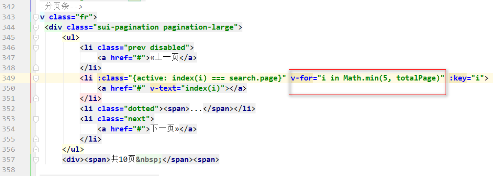

 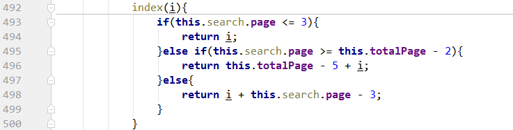


测试：ok！

 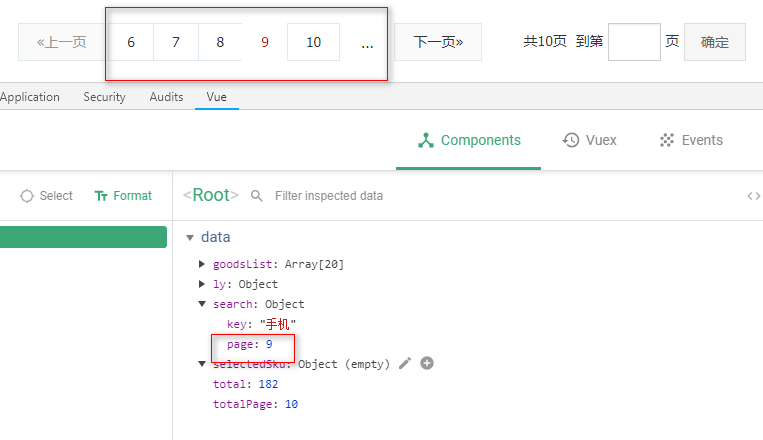


需要注意的是，如果总页数不足5页: 稍作改进：

 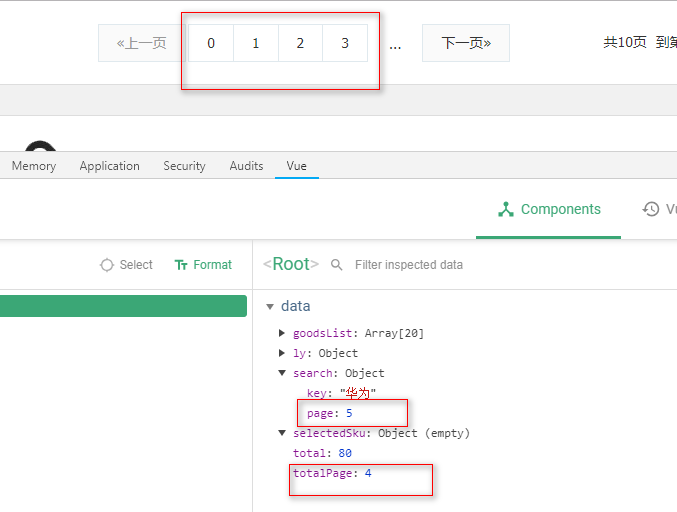

修改：

 

测试：

 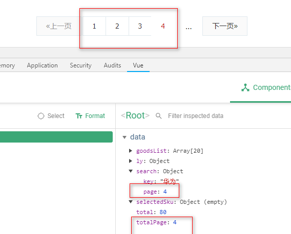


代码：

```js
index(i){
                if(this.search.page <= 3 ||  this.totalPage < 5){
                    // 当前页小于3 或 总页数小于5，则页码就是从 i 开始
                    return i;
                }else if(this.search.page >= this.totalPage - 2){
                    //当前页大于等于总页数-2，则页码从总页数-5+i开始
                    return this.totalPage - 5 + i;
                }else{
                    //否则，页码从i + this.search.page - 3开始
                    return i + this.search.page - 3;
                }
            }
```

但是现在还没有，点击按钮切换页码的功能，所以我们绑定点击事件：


## 3.2.点击分页做什么

点击分页按钮后，自然是要修改`page`的值

所以，我们在`上一页`、`下一页`按钮添加点击事件，对page进行修改，在数字按钮上绑定点击事件，点击直接修改page：

 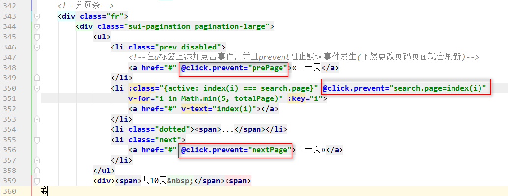


翻页事件的方法：

 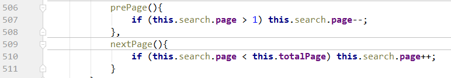


当前页等于1时，不可以上一页，禁用上一页按钮。当前页为totalPage时，不可以下一页：

 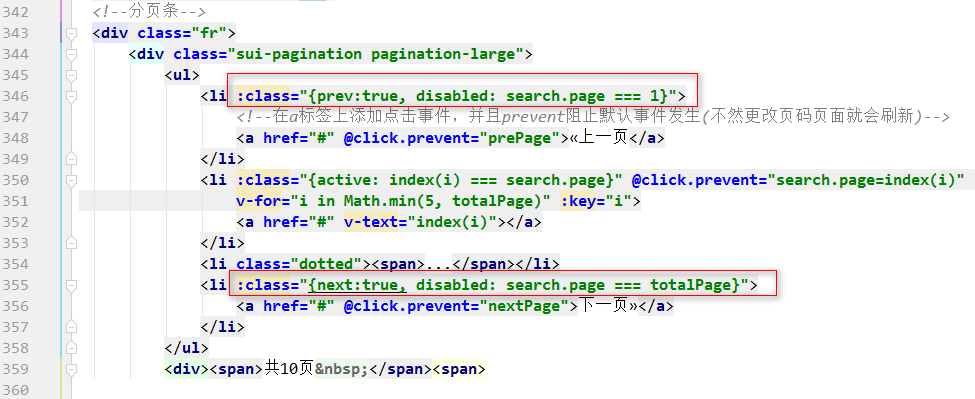

测试：OK！

 


把分页条那三个点控制一下：

 

修改：

 当前页+2还小于总页数的话就显示。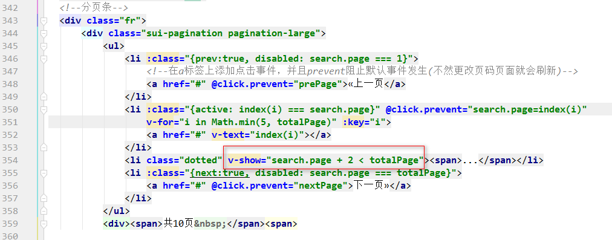

测试：OK!

 

 当前页+2还小于总页数的话就显示，并且总页数大于5 （两个同时满足）才应该显示点：

所以修改：

 

测试：

不足5页：

  

 超过5页：

 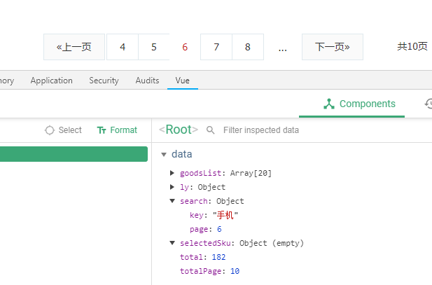


共多少页修改：

 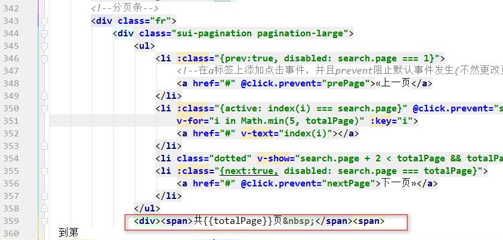

测试：OK！

 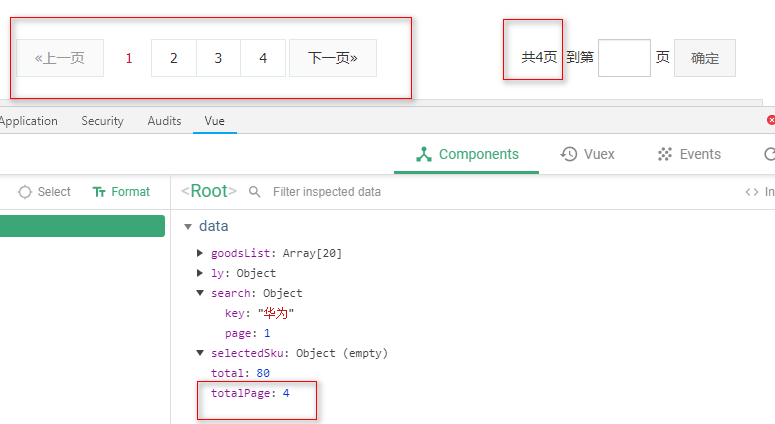


## 3.3.页面顶部分页条

在页面商品列表的顶部，也有一个分页条：

 

我们把这一部分，也加上点击事件：

 


测试：OK

 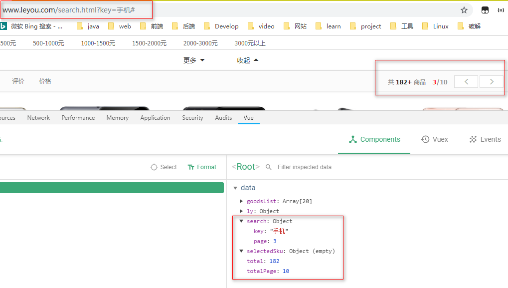


## 3.4.数据随页面变化

添加watch ：

 


测试：OK! 这样做是可以的，也是最简单的做法，这样做虽然功能可以实现，但是页面一刷新就会回到第一页。

------


**另外一种做法**：


当`page`发生变化，我们应该去后台重新查询数据。

不过，如果我们直接发起ajax请求，那么浏览器的地址栏中是不会有变化的，没有记录下分页信息。如果用户刷新页面，那么就会回到第一页。

这样不太友好，我们应该把**搜索条件记录在地址栏的查询参数中**。

因此，我们监听search的变化，然后把search的过滤字段拼接在url路径后：

 

刷新页面测试，然后就出现重大bug：页面无限刷新！为什么？


因为Vue实例初始化的钩子函数created中，我们读取请求参数，赋值给search的时候，也触发了watch监视！也就是说，每次页面创建完成，都会触发watch，然后就会去修改location.search路径，然后页面被刷新，再次触发created钩子，又触发watch，周而复始，死循环。


所以，我们需要在watch中进行监控，如果发现是第一次初始化，则不继续向下执行。

那么问题是，如何判断是不是第一次？

第一次初始化时，search中的key值肯定是空的，所以，我们这么做：

 

测试，再次刷新，OK了！

 


虽然一切OK了，但是我们每次点击下一页时会刷新页面，这样会降低效率。解决方法是使用nuxt服务端渲染，就可以解决，但是要做这件事情就会非常的麻烦，还有很多东西要整，而且这部分属于前端。要知道的是可以这么做。

需要优化的点就是加载，变成异步加载，刷新商品，但是不刷新上面的搜索条件，这样是最好的，但是一些前端的技术还没有学过。


# 4.排序(作业)

## 4.1.页面搜索排序条件

在搜索商品列表的顶部，有这么一部分内容：

 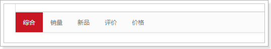

这是用来做排序的，默认按照综合排序。点击新品，应该按照商品创建时间排序，点击价格应该按照价格排序。因为我们没有统计销量和评价，这里咱们以`新品`和`价格`为例，进行讲解，做法是相通的。

排序需要知道两个内容：

- 排序的字段
- 排序的方式

  因此，我们首先在`search`中记录这两个信息，因为created钩子函数会对search进行覆盖，因此我们在钩子函数中对这两个信息进行初始化即可：

 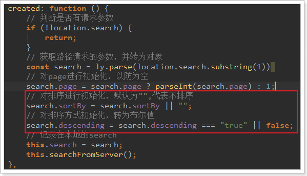

然后，在页面上给按钮绑定点击事件，修改`sortBy`和`descending`的值：

```vue
<!--排序字段-->
<ul class="sui-nav">
    <li :class="{active:!search.sortBy}" @click="search.sortBy=''">
        <a href="#">综合</a>
    </li>
    <li>
        <a href="#">销量</a>
    </li>
    <li @click="search.sortBy='createTime'" :class="{active: search.sortBy==='createTime'}">
        <a href="#">新品</a>
    </li>
    <li>
        <a href="#">评价</a>
    </li>
    <li @click="search.sortBy='price'; search.descending = !search.descending"
        :class="{active: search.sortBy==='price'}">
        <a href="#">
            价格
            <v-icon v-show="search.descending">arrow_drop_down</v-icon>
            <v-icon v-show="!search.descending">arrow_drop_up</v-icon>
        </a>
    </li>
</ul>
```

可以看到，页面请求参数中已经有了排序字段了：

 


## 4.2.后台添加排序逻辑


接下来，后台需要接收请求参数中的排序信息，然后在搜索中加入排序的逻辑。

现在，我们的请求参数对象`SearchRequest`中，只有page、key两个字段。需要进行扩展：

 


然后在搜索业务逻辑中，添加排序条件：


注意，因为我们存储在索引库中的的价格是一个数组，因此在按照价格排序时，会进行智能处理：

- 如果是价格降序，则会把数组中的最大值拿来排序
- 如果是价格升序，则会把数组中的最小值拿来排序


