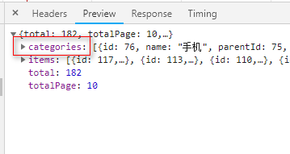
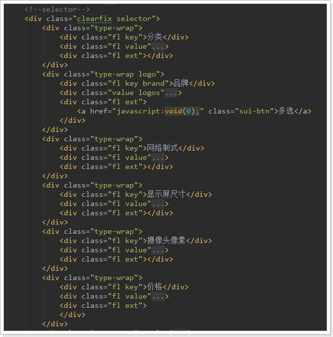
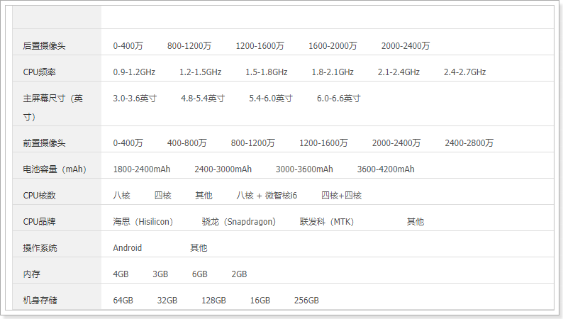
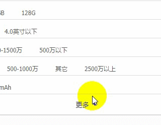
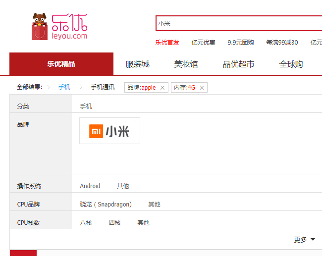
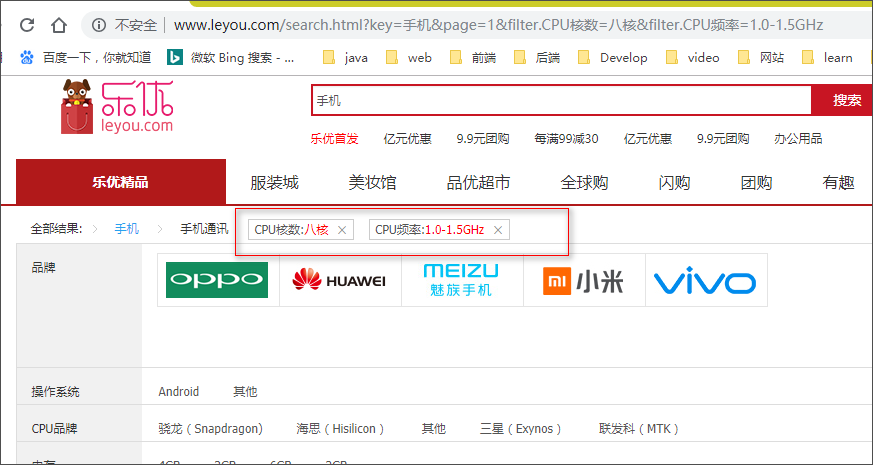
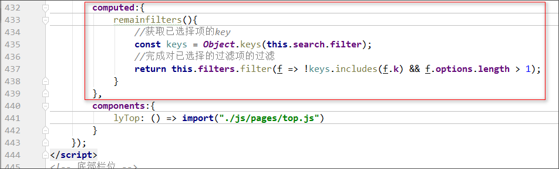

# Table of Contents

* [0.学习目标](#0学习目标)
* [1.过滤功能分析](#1过滤功能分析)
* [2.生成分类和品牌过滤](#2生成分类和品牌过滤)
  * [2.1.扩展返回的结果](#21扩展返回的结果)
  * [2.2.聚合商品分类和品牌](#22聚合商品分类和品牌)
    * [2.2.1.提供查询品牌接口](#221提供查询品牌接口)
    * [2.2.2.搜索功能改造](#222搜索功能改造)
  * [2.3.页面渲染数据](#23页面渲染数据)
    * [2.3.1.过滤参数数据结构](#231过滤参数数据结构)
    * [2.3.2.页面渲染数据](#232页面渲染数据)
* [3.生成规格参数过滤](#3生成规格参数过滤)
  * [3.1.谋而后动](#31谋而后动)
  * [3.3.实战](#33实战)
    * [3.3.1.扩展返回结果](#331扩展返回结果)
    * [3.3.2.判断是否需要聚合](#332判断是否需要聚合)
    * [3.3.3.获取需要聚合的规格参数](#333获取需要聚合的规格参数)
    * [3.3.4.聚合规格参数](#334聚合规格参数)
    * [3.3.5.解析聚合结果](#335解析聚合结果)
    * [3.3.6.最终的完整代码](#336最终的完整代码)
    * [3.3.7.测试结果：](#337测试结果：)
  * [3.4.页面渲染](#34页面渲染)
    * [3.4.1.渲染规格过滤条件](#341渲染规格过滤条件)
    * [3.4.2.展示或收起过滤条件](#342展示或收起过滤条件)
* [4.过滤条件的筛选](#4过滤条件的筛选)
  * [4.1.保存过滤项](#41保存过滤项)
    * [4.1.1.定义属性](#411定义属性)
    * [4.1.2.绑定点击事件](#412绑定点击事件)
  * [4.2.后台添加过滤条件](#42后台添加过滤条件)
    * [4.2.1.拓展请求对象](#421拓展请求对象)
    * [4.2.2.添加过滤条件](#422添加过滤条件)
  * [4.3.页面测试](#43页面测试)
* [5.页面展示选择的过滤项](#5页面展示选择的过滤项)
  * [5.1.商品分类面包屑](#51商品分类面包屑)
    * [5.1.1.提供查询分类接口](#511提供查询分类接口)
    * [5.1.2.页面展示面包屑](#512页面展示面包屑)
  * [5.2.其它过滤项](#52其它过滤项)
  * [5.3.隐藏已经选择的过滤项](#53隐藏已经选择的过滤项)
* [6.取消过滤项](#6取消过滤项)
* [7.优化](#7优化)


# 0.学习目标

- 了解过滤功能的基本思路
- 独立实现分类和品牌展示
- 了解规格参数展示
- 实现过滤条件筛选
- 实现已选过滤项回显
- 实现取消选择过滤项


# 1.过滤功能分析

首先看下页面要实现的效果：


整个过滤部分有3块：

- 顶部的导航，已经选择的过滤条件展示：
  - 商品分类面包屑，根据用户选择的商品分类变化
  - 其它已选择过滤参数
- 过滤条件展示，又包含3部分
  - 商品分类展示
  - 品牌展示
  - 其它规格参数
- 展开或收起的过滤条件的按钮


顶部导航要展示的内容跟用户选择的过滤条件有关。

- 比如用户选择了某个商品分类，则面包屑中才会展示具体的分类
- 比如用户选择了某个品牌，列表中才会有品牌信息。

所以，这部分需要依赖第二部分：过滤条件的展示和选择。因此我们先不着急去做。


展开或收起的按钮是否显示，取决于过滤条件现在有多少，如果有很多，那么就没必要展示。所以也是跟第二部分的过滤条件有关。

这样分析来看，我们必须先做第二部分：过滤条件展示。


# 2.生成分类和品牌过滤

先来看分类和品牌。在我们的数据库中已经有所有的分类和品牌信息。在这个位置，是不是把所有的分类和品牌信息都展示出来呢？

显然不是，用户搜索的条件会对商品进行过滤，而在搜索结果中，不一定包含所有的分类和品牌，直接展示出所有商品分类，让用户选择显然是不合适的。

无论是分类信息，还是品牌信息，都应该从搜索的结果商品中进行聚合得到。

## 2.1.扩展返回的结果

原来，我们返回的结果是PageResult对象，里面只有total、totalPage、items3个属性。但是现在要对商品分类和品牌进行聚合，数据显然不够用，我们需要对返回的结果进行扩展，添加分类和品牌的数据。

那么问题来了：以什么格式返回呢？

看页面：

 


分类：页面显示了分类名称，但背后肯定要保存id信息。所以至少要有id和name

品牌：页面展示的有logo，有文字，当然肯定有id，基本上是品牌的完整数据

我们新建一个类，继承PageResult，然后扩展两个新的属性：分类集合和品牌集合：

在ly-search微服务中添加实体类：建议都保留一个空参构造，因为在很多的序列化工具，比如界面处理时，它都会默认利用反射调用空参构造去构建对象，万一没有可能就会导致一些错误。

```java
package com.leyou.search.pojo;

import com.leyou.common.vo.PageResult;

@Data
public class SearchResult extends PageResult<Goods> {

    private List<Category> categories;
    private List<Brand> brands;

    public SearchResult() {
    }

    public SearchResult(Long total, Integer totalPage, List<Goods> items, List<Category> categories, List<Brand> brands) {
        super(total, totalPage, items);
        this.categories = categories;
        this.brands = brands;
    }
}
```


## 2.2.聚合商品分类和品牌

我们修改搜索的业务逻辑，对分类和品牌聚合。

因为索引库中只有id，所以我们根据id聚合，然后再根据id去查询完整数据。

所以，商品微服务需要提供一个接口：根据品牌id集合，批量查询品牌。

### 2.2.1.提供查询品牌接口

BrandApi

```java
package com.leyou.item.api;

@RequestMapping("brand")
public interface BrandApi {

    /**
     * 根据id查询品牌
     * @param id
     * @return
     */
    @GetMapping("{id}")
    Brand queryBrandById(@PathVariable("id") Long id);
【1】
    @GetMapping("list")
    List<Brand> queryBrandByIds(@RequestParam("ids") List<Long> ids);
【1】    
}

```

BrandController

```java
    /**
     * 根据多个id查询品牌
     * @param ids
     * @return
     */
    @GetMapping("list")
    public ResponseEntity<List<Brand>> queryBrandByIds(@RequestParam("ids") List<Long> ids){
        return ResponseEntity.ok(brandService.queryByIds(ids));
    }
```

BrandService

```java
    public List<Brand> queryByIds(List<Long> ids) {
        List<Brand> brands = brandMapper.selectByIdList(ids);
        if (CollectionUtils.isEmpty(brands)){
            throw new LyException(ExceptionEnum.BRAND_NOT_FOUND);
        }
        return brands;
    }
```

BrandMapper

继承我们写的BaseMapper即可，但需要注意的是要导入正确的包

```java
import com.leyou.common.mapper.BaseMapper;

public interface BrandMapper extends BaseMapper<Brand> {
```


### 2.2.2.搜索功能改造

BrandClient （之前已经添加，这里没有改动）

```java
@FeignClient("item-service")
public interface BrandClient extends BrandApi {
}
```


修改SearchService：

```java
package com.leyou.search.service;

@Slf4j
@Service
public class SearchService {

    @Autowired
    private CategoryClient categoryClient;

    @Autowired
    private BrandClient brandClient;

    @Autowired
    private SpecificationClient specificationClient;

    @Autowired
    private GoodsClient goodsClient;

    @Autowired
    private GoodsRepository goodsRepository;

    @Autowired
    private ElasticsearchTemplate template;

    public Goods buildGoods(Spu spu){
        Long spuId = spu.getId();

        //查询分类名称
        List<Category> categories = categoryClient.queryCategoryByIds(
                Arrays.asList(spu.getCid1(), spu.getCid2(), spu.getCid3()));
        if (CollectionUtils.isEmpty(categories)){
            throw new LyException(ExceptionEnum.CATEGORY_NOT_FOUND);
        }
        List<String> names = categories.stream()
                .map(Category::getName).collect(Collectors.toList());

        //查询品牌
        Brand brand = brandClient.queryBrandById(spu.getBrandId());
        if (brand == null) {
            throw new LyException(ExceptionEnum.BRAND_NOT_FOUND);
        }

        //搜索字段
        String all = spu.getTitle() + StringUtils.join(names, " ") + brand.getName();

        //查询sku,取出所有价格
        List<Sku> skuList = goodsClient.querySkuBySpuId(spu.getId());
        if (CollectionUtils.isEmpty(skuList)){
            throw new LyException(ExceptionEnum.GOODS_SKU_NOT_FOUND);
        }
        //对sku进行处理， 因为sku的字段太多了，我们只需要id,title,image.price
        List<Map<String,Object>> skus = new ArrayList<>();
        //价格集合
        Set<Long> priceSet = new HashSet<>();
        for (Sku sku : skuList) {
            Map<String,Object> map = new HashMap<>();
            map.put("id", sku.getId());
            map.put("title", sku.getTitle());
            map.put("price", sku.getPrice());
            map.put("image", StringUtils.substringBefore(sku.getImages(), ","));
            skus.add(map);
            //处理价格
            priceSet.add(sku.getPrice());
        }

        //查询规格参数（specs规格参数的key在规格参数表）分类绑定的是cid3
        List<SpecParam> params = specificationClient.queryParamList(null, spu.getCid3(), true);
        if (CollectionUtils.isEmpty(params)){
            throw new LyException(ExceptionEnum.SPEC_PARAM_NOT_FOUND);
        }
        //查询商品详情（specs规格参数的value在商品详情表）
        SpuDetail spuDetail = goodsClient.queryDetailById(spuId);
        //获取通用规格参数(注意查看数据库中表数据的结构)
        Map<String, String> genericSpec = JsonUtils.toMap(spuDetail.getGenericSpec(), String.class, String.class);
        //获取特有规格参数(注意查看数据库中表数据的结构)
        Map<String, List<String>> specialSpec = JsonUtils
                .nativeRead(spuDetail.getSpecialSpec(), new TypeReference<Map<String, List<String>>>() {});
        //规格参数,key是规格参数的名字，值是规格参数的值
        Map<String,Object> specs = new HashMap<>();
        for (SpecParam param : params) {
            //规格名称
            String key = param.getName();
            Object value = "";
            //判断是否是通用规格
            if (param.getGeneric()){
                //获取到的通用和特有规格参数map的key都是String类型，所以我们这儿调用toString()来作转换
                value = genericSpec.get(param.getId().toString());
                //判断是否是数值类型
                if (param.getNumeric()){
                    //处理成段
                    value = chooseSegment(value.toString(), param);
                }
            }else{
                //获取到的特有规格map的值是一个集合类型，不是string类型，所以没有必要去处理成段
                value = specialSpec.get(param.getId().toString());
            }
            //存入map
            specs.put(key, value);
        }

        //构建Goods对象
        Goods goods = new Goods();
        goods.setBrandId(spu.getBrandId());
        goods.setCid1(spu.getCid1());
        goods.setCid2(spu.getCid2());
        goods.setCid3(spu.getCid3());
        goods.setCreateTime(spu.getCreateTime());
        goods.setId(spu.getId());
        goods.setAll(all); //  搜索字段，包含标题，分类，品牌，规格等
        goods.setPrice(priceSet); //  所有sku的价格集合
        goods.setSkus(JsonUtils.toString(skus)); //  所有sku的集合的json格式,目的是取出所有价格
        goods.setSpecs(specs); //  所有的可搜索的规格参数
        goods.setSubTitle(spu.getSubTitle());

        return goods;

    }

    /**
     * 分段处理
     * @param value
     * @param p
     * @return
     */
    private String chooseSegment(String value, SpecParam p) {
        //导入自己写的工具类
        double val = NumberUtils.toDouble(value);
        String result = "其它";
        // 保存数值段
        for (String segment : p.getSegments().split(",")) {
            String[] segs = segment.split("-");
            // 获取数值范围
            double begin = NumberUtils.toDouble(segs[0]);
            double end = Double.MAX_VALUE;
            if(segs.length == 2){
                end = NumberUtils.toDouble(segs[1]);
            }
            // 判断是否在范围内
            if(val >= begin && val < end){
                if(segs.length == 1){
                    result = segs[0] + p.getUnit() + "以上";
                }else if(begin == 0){
                    result = segs[1] + p.getUnit() + "以下";
                }else{
                    result = segment + p.getUnit();
                }
                break;
            }
        }
        return result;
    }

    public PageResult<Goods> search(SearchRequest request) {
        String key = request.getKey();
        //判断是否有搜索条件，如果没有，直接返回null。不允许搜索全部商品
        if(StringUtils.isBlank(key)){
            return null;
        }

        int page = request.getPage() - 1;
        int size = request.getSize();

        //创建查询构建器
        NativeSearchQueryBuilder queryBuilder = new NativeSearchQueryBuilder();
        //0 结果过滤
        queryBuilder.withSourceFilter(new FetchSourceFilter(new String[]{"id", "subTitle", "skus"}, null));
        //1 分页
        queryBuilder.withPageable(PageRequest.of(page, size));
        //2 过滤
        queryBuilder.withQuery(QueryBuilders.matchQuery("all", key));

        //3 聚合分类和品牌
        //3.1 聚合分类
        String categoryAggName = "category_agg";
        queryBuilder.addAggregation(AggregationBuilders.terms(categoryAggName).field("cid3"));
        //3.2 聚合品牌
        String brandAggName = "brand_agg";
        queryBuilder.addAggregation(AggregationBuilders.terms(brandAggName).field("brandId"));

        //4 查询
        AggregatedPage<Goods> result = template.queryForPage(queryBuilder.build(), Goods.class);

        //5 解析结果并返回
        //5.1解析分页结果
        //5.1.1 总条数
        long total = result.getTotalElements();
        //5.1.2 总页数
        int totalPages = result.getTotalPages();
        List<Goods> goodsList = result.getContent();

        //5.2 解析聚合结果(分类和品牌的聚合结果)
        Aggregations aggs = result.getAggregations();
        List<Category> categorys = getCategorysAgg(aggs.get(categoryAggName));
        List<Brand> brands = getBrandsAgg(aggs.get(brandAggName));

        return new SearchResult(total, totalPages, goodsList, categorys, brands);
    }

    //因为获取到的field是Long类型，所以参数写成Aggregation的子类LongTerms
    private List<Brand> getBrandsAgg(LongTerms terms) {
        try {
            List<Long> ids = terms.getBuckets()
                    .stream().map(b -> b.getKeyAsNumber().longValue())
                    .collect(Collectors.toList());
            List<Brand> brands = brandClient.queryBrandByIds(ids);
            return brands;
        }catch (Exception e){
            //没有聚合到任何品牌返回null
            log.error("[搜索服务]查询品牌异常：", e);
            return null;
        }
    }

    private List<Category> getCategorysAgg(LongTerms terms) {
        try {
            List<Long> ids = terms.getBuckets()
                    .stream().map(b -> b.getKeyAsNumber().longValue())
                    .collect(Collectors.toList());
            List<Category> categories = categoryClient.queryCategoryByIds(ids);
            return categories;
        }catch (Exception e){
            //没有聚合到任何品牌返回null
            log.error("[搜索服务]查询分类异常：", e);
            return null;
        }
    }
}

```

 

 

重启商品微服务和搜索服务，测试：

 


期间出现的问题：接口路径写错。

截图中可以看到，只有categories却没有brands，我去查看IDEA的控制台也没有报错，但显然是未获取到Brands，返回了null导致的。

 

因为没有记录日志，所以无法看到出错信息，出了错都不知道为什么，所以还是要养成记录日志的好习惯。记录完日志后，异常很明显，轻松的解决了问题所在：BrandApi中接口路径写错。

添加后，重启商品微服务和搜索服务，测试，问题解决。


## 2.3.页面渲染数据

### 2.3.1.过滤参数数据结构

来看下页面的展示效果：

 

虽然分类、品牌内容都不太一样，但是结构相似，都是key和value的结构。

而且页面结构也极为类似：

 


所以，我们可以把所有的过滤条件放入一个`数组`中，然后在页面利用`v-for`遍历一次生成。

其基本结构是这样的：

```js
[
    {
        k:"过滤字段名",
        options:[{/*过滤字段值对象*/},{/*过滤字段值对象*/}]
    },
    {
        k:"过滤字段名",
        options:[{/*过滤字段值对象*/},{/*过滤字段值对象*/}]
    }
]
```

我们先在data中定义数组，等待组装过滤参数：

 

然后在查询搜索结果的回调函数中，对过滤参数进行封装：

 

然后刷新页面，通过浏览器工具，查看封装的结果：

 


### 2.3.2.页面渲染数据

首先看页面原来的代码：

 

我们注意到，虽然页面元素是一样的，但是品牌会比其它搜搜条件多出一些样式，因为品牌是以图片展示。需要进行特殊处理。数据展示是一致的，我们采用v-for处理：

 

结果：


# 3.生成规格参数过滤

## 3.1.谋而后动

有四个问题需要先思考清楚：

- 什么时候显示规格参数过滤？
- 如何知道哪些规格需要过滤？
- 要过滤的参数，其可选值是如何获取的？
- 规格过滤的可选值，其数据格式怎样的？


> 什么情况下显示有关规格参数的过滤？

如果用户尚未选择商品分类，或者聚合得到的分类数大于1，那么就没必要进行规格参数的聚合。因为不同分类的商品，其规格是不同的。

因此，我们在后台**需要对聚合得到的商品分类数量进行判断，如果等于1，我们才继续进行规格参数的聚合**。


> 如何知道哪些规格需要过滤？

我们不能把数据库中的所有规格参数都拿来过滤。因为并不是所有的规格参数都可以用来过滤，参数的值是不确定的。

值的庆幸的是，我们在设计规格参数时，已经标记了某些规格可搜索，某些不可搜索。

因此，一旦商品分类确定，我们就可以根据商品分类查询到其对应的规格，从而知道哪些规格要进行搜索。


> 要过滤的参数，其可选值是如何获取的？

虽然数据库中有所有的规格参数，但是不能把一切数据都用来供用户选择。

与商品分类和品牌一样，应该是从用户搜索得到的结果中聚合，得到与结果品牌的规格参数可选值。


> 规格过滤的可选值，其数据格式怎样的？

我们直接看页面效果：


我们之前存储时已经将数据分段，恰好符合这里的需求


## 3.3.实战

接下来，我们就用代码实现刚才的思路。

总结一下，应该是以下几步：

- 1）用户搜索得到商品，并聚合出商品分类
- 2）判断分类数量是否等于1，如果是则进行规格参数聚合
- 3）先根据分类，查找可以用来搜索的规格
- 4）在用户搜索结果的基础上，对规格参数进行聚合
- 5）将规格参数聚合结果整理后返回

 

### 3.3.1.扩展返回结果

返回结果中需要增加新数据，用来保存规格参数过滤条件。这里与前面的品牌和分类过滤的json结构类似：

```json
[
    {
        "k":"规格参数名",
        "options":["规格参数值","规格参数值"]
    },
    {
        "k":"规格参数名",
        "options":["规格参数值","规格参数值"]
    }
]
```

因此，在java中我们用List<Map<String,Object>>来表示。

实体类：SearchResult

```java
package com.leyou.search.pojo;

@Data
public class SearchResult extends PageResult<Goods> {

    private List<Category> categories;// 分类过滤条件

    private List<Brand> brands;// 品牌过滤条件
【1】
    private List<Map<String,Object>> specs; // 规格参数过滤条件
【1】
    public SearchResult() {
    }
【2】
    public SearchResult(Long total, Integer totalPage, List<Goods> items, List<Category> categories, List<Brand> brands, List<Map<String, Object>> specs) {
        super(total, totalPage, items);
        this.categories = categories;
        this.brands = brands;
        this.specs = specs;
    }
【2】
}
```


### 3.3.2.判断是否需要聚合

首先，在聚合得到商品分类后，判断分类的个数，如果是1个则进行规格聚合：

 

我们将聚合的代码抽取到了一个`buildSpecificationAgg`方法中。


### 3.3.3.获取需要聚合的规格参数

然后，我们需要根据商品分类，查询所有可用于搜索的规格参数：


要注意的是，这里我们需要根据cid查询规格，而规格参数接口需要从商品微服务提供

商品微服务：ly-item-interface中提供接口：

 

```java
package com.leyou.item.api;

public interface SpecificationApi {
    /**
     * 查询参数集合
     * @param gid 组id
     * @param cid 分类id
     * @param searching 是否搜索
     * @return
     */
    @GetMapping("spec/params")
    List<SpecParam> queryParamList(
            @RequestParam(value = "gid", required = false) Long gid,
            @RequestParam(value = "cid", required = false) Long cid,
            @RequestParam(value = "searching", required = false) Boolean searching
    );
}
```

搜索服务中调用：

 

```java
@FeignClient("item-service")
public interface SpecificationClient extends SpecificationApi {
}
```


### 3.3.4.聚合规格参数

因为规格参数保存时不做分词，因此其名称会自动带上一个.keyword后缀：


### 3.3.5.解析聚合结果


### 3.3.6.最终的完整代码

```java
package com.leyou.search.service;

@Slf4j
@Service
public class SearchService {

    @Autowired
    private CategoryClient categoryClient;

    @Autowired
    private BrandClient brandClient;

    @Autowired
    private SpecificationClient specificationClient;

    @Autowired
    private GoodsClient goodsClient;

    @Autowired
    private GoodsRepository goodsRepository;

    @Autowired
    private ElasticsearchTemplate template;

    public Goods buildGoods(Spu spu){
        Long spuId = spu.getId();

        //查询分类名称
        List<Category> categories = categoryClient.queryCategoryByIds(
                Arrays.asList(spu.getCid1(), spu.getCid2(), spu.getCid3()));
        if (CollectionUtils.isEmpty(categories)){
            throw new LyException(ExceptionEnum.CATEGORY_NOT_FOUND);
        }
        List<String> names = categories.stream()
                .map(Category::getName).collect(Collectors.toList());

        //查询品牌
        Brand brand = brandClient.queryBrandById(spu.getBrandId());
        if (brand == null) {
            throw new LyException(ExceptionEnum.BRAND_NOT_FOUND);
        }

        //搜索字段
        String all = spu.getTitle() + StringUtils.join(names, " ") + brand.getName();

        //查询sku,取出所有价格
        List<Sku> skuList = goodsClient.querySkuBySpuId(spu.getId());
        if (CollectionUtils.isEmpty(skuList)){
            throw new LyException(ExceptionEnum.GOODS_SKU_NOT_FOUND);
        }
        //对sku进行处理， 因为sku的字段太多了，我们只需要id,title,image.price
        List<Map<String,Object>> skus = new ArrayList<>();
        //价格集合
        Set<Long> priceSet = new HashSet<>();
        for (Sku sku : skuList) {
            Map<String,Object> map = new HashMap<>();
            map.put("id", sku.getId());
            map.put("title", sku.getTitle());
            map.put("price", sku.getPrice());
            map.put("image", StringUtils.substringBefore(sku.getImages(), ","));
            skus.add(map);
            //处理价格
            priceSet.add(sku.getPrice());
        }

        //查询规格参数（specs规格参数的key在规格参数表）分类绑定的是cid3
        List<SpecParam> params = specificationClient.queryParamList(null, spu.getCid3(), true);
        if (CollectionUtils.isEmpty(params)){
            throw new LyException(ExceptionEnum.SPEC_PARAM_NOT_FOUND);
        }
        //查询商品详情（specs规格参数的value在商品详情表）
        SpuDetail spuDetail = goodsClient.queryDetailById(spuId);
        //获取通用规格参数(注意查看数据库中表数据的结构)
        Map<String, String> genericSpec = JsonUtils.toMap(spuDetail.getGenericSpec(), String.class, String.class);
        //获取特有规格参数(注意查看数据库中表数据的结构)
        Map<String, List<String>> specialSpec = JsonUtils
                .nativeRead(spuDetail.getSpecialSpec(), new TypeReference<Map<String, List<String>>>() {});
        //规格参数,key是规格参数的名字，值是规格参数的值
        Map<String,Object> specs = new HashMap<>();
        for (SpecParam param : params) {
            //规格名称
            String key = param.getName();
            Object value = "";
            //判断是否是通用规格
            if (param.getGeneric()){
                //获取到的通用和特有规格参数map的key都是String类型，所以我们这儿调用toString()来作转换
                value = genericSpec.get(param.getId().toString());
                //判断是否是数值类型
                if (param.getNumeric()){
                    //处理成段
                    value = chooseSegment(value.toString(), param);
                }
            }else{
                //获取到的特有规格map的值是一个集合类型，不是string类型，所以没有必要去处理成段
                value = specialSpec.get(param.getId().toString());
            }
            //存入map
            specs.put(key, value);
        }

        //构建Goods对象
        Goods goods = new Goods();
        goods.setBrandId(spu.getBrandId());
        goods.setCid1(spu.getCid1());
        goods.setCid2(spu.getCid2());
        goods.setCid3(spu.getCid3());
        goods.setCreateTime(spu.getCreateTime());
        goods.setId(spu.getId());
        goods.setAll(all); //  搜索字段，包含标题，分类，品牌，规格等
        goods.setPrice(priceSet); //  所有sku的价格集合
        goods.setSkus(JsonUtils.toString(skus)); //  所有sku的集合的json格式,目的是取出所有价格
        goods.setSpecs(specs); //  所有的可搜索的规格参数
        goods.setSubTitle(spu.getSubTitle());

        return goods;

    }

    /**
     * 分段处理
     * @param value
     * @param p
     * @return
     */
    private String chooseSegment(String value, SpecParam p) {
        //导入自己写的工具类
        double val = NumberUtils.toDouble(value);
        String result = "其它";
        // 保存数值段
        for (String segment : p.getSegments().split(",")) {
            String[] segs = segment.split("-");
            // 获取数值范围
            double begin = NumberUtils.toDouble(segs[0]);
            double end = Double.MAX_VALUE;
            if(segs.length == 2){
                end = NumberUtils.toDouble(segs[1]);
            }
            // 判断是否在范围内
            if(val >= begin && val < end){
                if(segs.length == 1){
                    result = segs[0] + p.getUnit() + "以上";
                }else if(begin == 0){
                    result = segs[1] + p.getUnit() + "以下";
                }else{
                    result = segment + p.getUnit();
                }
                break;
            }
        }
        return result;
    }

    public PageResult<Goods> search(SearchRequest request) {
        String key = request.getKey();
        //判断是否有搜索条件，如果没有，直接返回null。不允许搜索全部商品
        if(StringUtils.isBlank(key)){
            return null;
        }

        int page = request.getPage() - 1;
        int size = request.getSize();

        //创建查询构建器
        NativeSearchQueryBuilder queryBuilder = new NativeSearchQueryBuilder();
        //0 结果过滤
        queryBuilder.withSourceFilter(new FetchSourceFilter(new String[]{"id", "subTitle", "skus"}, null));
        //1 分页
        queryBuilder.withPageable(PageRequest.of(page, size));
        //2 搜索条件
        QueryBuilder basicQuery = QueryBuilders.matchQuery("all", key);
        queryBuilder.withQuery(basicQuery);

        //3 聚合分类和品牌
        //3.1 聚合分类
        String categoryAggName = "category_agg";
        queryBuilder.addAggregation(AggregationBuilders.terms(categoryAggName).field("cid3"));
        //3.2 聚合品牌
        String brandAggName = "brand_agg";
        queryBuilder.addAggregation(AggregationBuilders.terms(brandAggName).field("brandId"));

        //4 查询
        AggregatedPage<Goods> result = template.queryForPage(queryBuilder.build(), Goods.class);

        //5 解析结果并返回
        //5.1解析分页结果
        //5.1.1 总条数
        long total = result.getTotalElements();
        //5.1.2 总页数
        int totalPages = result.getTotalPages();
        List<Goods> goodsList = result.getContent();

        //5.2 解析聚合结果(分类和品牌的聚合结果)
        Aggregations aggs = result.getAggregations();
        List<Category> categorys = getCategorysAgg(aggs.get(categoryAggName));
        List<Brand> brands = getBrandsAgg(aggs.get(brandAggName));
【1】
        //6 完成规格参数聚合
        List<Map<String,Object>> specs = null;
        if (categorys != null && categorys.size() == 1){
            //商品分类存在并且数量为1，可以聚合规格参数(在原来的基础上进行聚合)
            specs = buildSpecificationAgg(categorys.get(0).getId(), basicQuery);
        }

        return new SearchResult(total, totalPages, goodsList, categorys, brands, specs);
【1】
    }
【2】
    private List<Map<String, Object>> buildSpecificationAgg(Long cid, QueryBuilder basicQuery) {
        List<Map<String, Object>> specs = new ArrayList<>();
        //1 查询需要聚合的规格参数
        List<SpecParam> params = specificationClient.queryParamList(null, cid, true);
        //2 聚合
        NativeSearchQueryBuilder queryBuilder = new NativeSearchQueryBuilder();
        //2.1 带上查询条件(在原来的基础上进行聚合)
        queryBuilder.withQuery(basicQuery);
        //2.2 聚合
        for (SpecParam param : params) {
            String name = param.getName();
            //规格参数的名字一定不会重复，我们取规格参数的名字为聚合名
            queryBuilder.addAggregation(
                    AggregationBuilders.terms(name).field("specs."+name+".keyword"));

        }
        //3 获取结果
        AggregatedPage<Goods> result = template.queryForPage(queryBuilder.build(), Goods.class);

        //4 解析结果
        Aggregations aggs = result.getAggregations();
        //有几个param就有几个聚合,所以还需要遍历params
        for (SpecParam param : params) {
            //因为聚合的名字是param的名字，所以需要拿到param的名字才能知道聚合的名称
            String name = param.getName();
            //聚合的结果，我们统一使用的keyword，所以一定是字符串类型，所以可以转成StringTerms
            StringTerms terms = aggs.get(name);
            //获取待选项 ：从buckets(桶)里取出key
            List<String> options = terms.getBuckets()
                    .stream().map(b -> b.getKeyAsString()).collect(Collectors.toList());
            //准备map
            Map<String,Object> map = new HashMap<>();
            map.put("k", name);
            map.put("options", options);

            //把map放到结果里
            specs.add(map);
        }

        return specs;
    }
【2】
    //因为获取到的field是Long类型，所以参数写成Aggregation的子类LongTerms
    private List<Brand> getBrandsAgg(LongTerms terms) {
        try {
            List<Long> ids = terms.getBuckets()
                    .stream().map(b -> b.getKeyAsNumber().longValue())
                    .collect(Collectors.toList());
            List<Brand> brands = brandClient.queryBrandByIds(ids);
            return brands;
        }catch (Exception e){
            //没有聚合到任何品牌返回null
            log.error("[搜索服务]查询品牌异常：", e);
            return null;
        }
    }

    private List<Category> getCategorysAgg(LongTerms terms) {
        try {
            List<Long> ids = terms.getBuckets()
                    .stream().map(b -> b.getKeyAsNumber().longValue())
                    .collect(Collectors.toList());
            List<Category> categories = categoryClient.queryCategoryByIds(ids);
            return categories;
        }catch (Exception e){
            //没有聚合到任何品牌返回null
            log.error("[搜索服务]查询分类异常：", e);
            return null;
        }
    }
}

```


### 3.3.7.测试结果：


## 3.4.页面渲染

### 3.4.1.渲染规格过滤条件

首先把后台传递过来的specs添加到filters数组：

 

要注意：分类、品牌的option选项是对象，里面有name属性，而specs中的option是简单的字符串，所以需要进行封装，变为相同的结构：

 

  

最后的结果：

filters:array[ ]  从2 成为了12。

 

---


 

---





但是还有一件事情：有一些options里面有空字符串。

 

 

这是因为之前导数据忘了做非空判断了。

在前端渲染的时候处理，v-if=“o” 如果为true才执行，（ 空字符串为false ）这样就过滤掉了空字符串。

 

测试，OK!


### 3.4.2.展示或收起过滤条件

是不是感觉显示的太多了，我们可以通过按钮点击来展开和隐藏部分内容：

 

我们在data中定义变量，记录展开或隐藏的状态：

 

然后在按钮绑定点击事件，以改变showMore的取值：


在展示规格时，对show进行判断：如果角标i 小于等于5一定展示（默认展示前5条），大于5展不展示取决于showMore的值，为true展示，为false则不展示。

 

OK！

 

---

 


# 4.过滤条件的筛选

当我们点击页面的过滤项，要做哪些事情？

- 把过滤条件保存在search对象中（watch监控到search变化后就会发送到后台）
- 在页面顶部展示已选择的过滤项
- 把商品分类展示到顶部面包屑

## 4.1.保存过滤项

### 4.1.1.定义属性

要注意，在created构造函数中会对search进行初始化，所以要在构造函数中对filter进行初始化：

 

search.filter是一个对象，结构：

```js
{
    "过滤项名":"过滤项值"
}
```


### 4.1.2.绑定点击事件

给所有的过滤项绑定点击事件：


要注意，点击事件传2个参数：

- k：过滤项的key
- option：当前过滤项对象

在点击事件中，保存过滤项到`selectedFilter`：

 

另外，这里search对象中嵌套了filter对象，请求参数格式化时需要进行特殊处理，修改common.js中的一段代码：

 


我们刷新页面，点击CPU核数 “四核” ，点击后通过浏览器功能查看`search.filter`的属性变化：

 

并且，此时浏览器地址也发生了变化：

 

网络请求也正常发出：

 


## 4.2.后台添加过滤条件

既然请求已经发送到了后台，那接下来我们就在后台去添加这些条件：

### 4.2.1.拓展请求对象

我们需要在请求类：`SearchRequest`中添加属性，接收过滤属性。过滤属性都是键值对格式，但是key不确定，所以用一个map来接收即可。


### 4.2.2.添加过滤条件

目前，我们的基本查询是这样的：

```
QueryBuilders.matchQuery("all", key);
```


现在，我们要把页面传递的过滤条件也进入进去。

因此不能在使用普通的查询，而是要用到BooleanQuery，基本结构是这样的：

```json
GET /heima/_search
{
    "query":{
        "bool":{
        	"must":{ "match": { "title": "小米手机",operator:"and"}},
        	"filter":{
                "range":{"price":{"gt":2000.00,"lt":3800.00}}
        	}
        }
    }
}
```

所以，我们对原来的基本查询进行改造：

 

因为比较复杂，我们将其封装到一个方法中：

```java
private QueryBuilder buildBasicQuery(SearchRequest request) {
        //创建布尔查询
        BoolQueryBuilder queryBuilder = QueryBuilders.boolQuery();
        //查询条件
        queryBuilder.must(QueryBuilders.matchQuery("all", request.getKey()));
        //过滤条件
        Map<String, String> map = request.getFilter();
        for (Map.Entry<String, String> entry : map.entrySet()) {
            String key = entry.getKey();
            //不是商品分类和品牌key要特殊处理
            if (!"cid3".equals(key) && !"brandId".equals(key)){
                key = "specs." + key + ".keyword";
            }
            //添加过滤条件
            queryBuilder.filter(QueryBuilders.termQuery(key, entry.getValue()));
        }
        return queryBuilder;
    }
```

其它不变。

## 4.3.页面测试

 

接下来，我们点击几个过滤条件：

 


得到的结果：

 


虽然过滤条件只剩下选中的那几个，但是还是有点不妥，点过的和为选中的应该展示到别的地方或者取消展示。


# 5.页面展示选择的过滤项

## 5.1.商品分类面包屑

当用户选择一个商品分类以后，我们应该在过滤模块的上方展示一个面包屑，把三级商品分类都显示出来。

 

用户选择的商品分类就存放在`search.filter`中，但是里面只有第三级分类的id：cid3

我们需要根据它查询出所有三级分类的id及名称

### 5.1.1.提供查询分类接口

我们在商品微服务中提供一个根据三级分类id查询1~3级分类集合的方法：

> Controller

```java
   /**
     * 根据3级分类id，查询1~3级的分类
     * @param id
     * @return
     */
    @GetMapping("all/level/{cid3}")
    public ResponseEntity<List<Category>> queryBreads(@PathVariable("cid3") Long id){
        List<Category> list = categoryService.queryAllcategoryLevelByCid3(id);
        if (CollectionUtils.isEmpty(list)){
            throw new LyException(ExceptionEnum.CATEGORYLEVEL_NOT_FOUND);
        }
        return ResponseEntity.ok(list);
    }
```

> Service

```java
    public List<Category> queryAllcategoryLevelByCid3(Long id) {
        List<Category> categoryList = new ArrayList<>();
        Category category = categoryMapper.selectByPrimaryKey(id);
        while (category.getParentId() != 0){
            categoryList.add(category);
            category = categoryMapper.selectByPrimaryKey(category.getParentId());
        }
        categoryList.add(category);
        return categoryList;
    }
```

测试：

 

### 5.1.2.页面展示面包屑

后台提供了接口，下面的问题是，我们在哪里去查询接口？

大家首先想到的肯定是当用户点击以后。

 

但是我们思考一下：用户点击以后，就会重新发起请求，页面刷新，那么你渲染的结果就没了。

因此，应该是在页面重新加载完毕后，此时因为过滤条件中加入了商品分类的条件，所以查询的结果中只有1个分类。

我们判断商品分类是否只有1个，如果是，则查询三级商品分类，添加到面包屑即可。

 


渲染：

 


刷新页面：

 


## 5.2.其它过滤项

接下来，我们需要在页面展示用户已选择的过滤项，如图：


我们知道，所有已选择过滤项都保存在`search.filter`中，因此在页面遍历并展示即可。

但这里有个问题，filter中数据的格式：

 

基本有四类数据：

- 商品分类：这个不需要展示，分类展示在面包屑位置
- 品牌：这个要展示，但是其key和值不合适，我们不能显示一个id在页面。需要找到其name值
- 数值类型规格：这个展示的时候，需要把单位查询出来
- 非数值类型规格：这个直接展示其值即可

因此，我们在页面上这样处理：

 

- 判断如果 `k === 'cid3'`说明是商品分类，直接忽略
- 判断`k === 'brandId'`说明是品牌，页面显示品牌，其它规格则直接显示`k`的值
- 值的处理比较复杂，我们用一个方法`findValue(k, v)`来处理，调用时把`k`和`v`都传递

方法内部：

 

然后刷新页面，即可看到效果：




## 5.3.隐藏已经选择的过滤项

现在，我们已经实现了已选择过滤项的展示，但是你会发现一个问题：

已经选择的过滤项，在过滤列表中依然存在：


这些已经选择的过滤项，应该从列表中移除。

怎么做呢？

你必须先知道用户选择了什么。用户选择的项保存在`search.filter`中：

 

我们可以编写一个计算属性computed，把filters中的 已经被选择的key过滤掉：只要拿到key就已经知道谁被选择过了

Object中keys() 方法和 values() 方法的演示：

 

数组的过滤方法的演示：

 

 最后发现，还剩下一堆没选过的。但是都只有一个可选项，此时再过滤没有任何意义，应该隐藏，如果只剩下一个可选项，不显示。

不显示已经选择过的 和 没选过但是都只有一个可选项的。



然后页面不再直接遍历`filters`，而是遍历`remainFilters`  意为残留的filters


刷新页面：


已经没有选项可选，但是“更多”按钮还在，我们让他 大于5条才显示：

 

测试：OK！


# 6.取消过滤项

我们能够看到，每个过滤项后面都有一个小叉，当点击后，应该取消对应条件的过滤。

思路非常简单：

- 给小叉绑定点击事件
- 点击后把过滤项从`search.filter`中移除，页面会自动刷新，OK


> 绑定点击事件：


绑定点击事件时，把k传递过去，方便删除 

delete方法演示：

 

> 删除过滤项


# 7.优化

搜索系统需要优化的点：

- 查询规格参数部分可以添加缓存
- 聚合计算interval变化频率极低，所以可以设计为定时任务计算（周期为天），然后缓存起来。
- elasticsearch本身有查询缓存，可以不进行优化
- 商品图片应该采用缩略图，减少流量，提高页面加载速度
- 图片采用延迟加载
- 图片还可以采用CDN服务器
- sku信息应该在页面异步加载，而不是放到索引库


