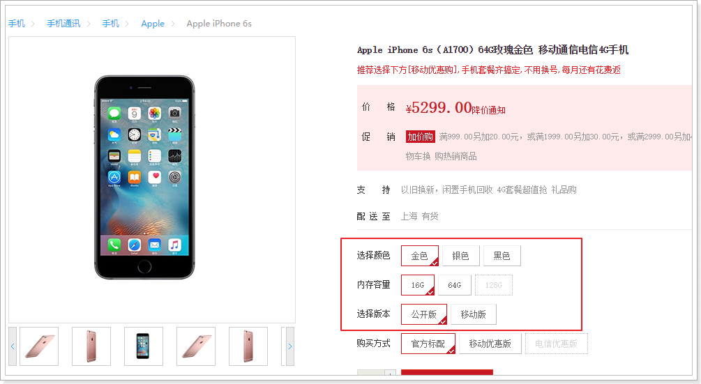
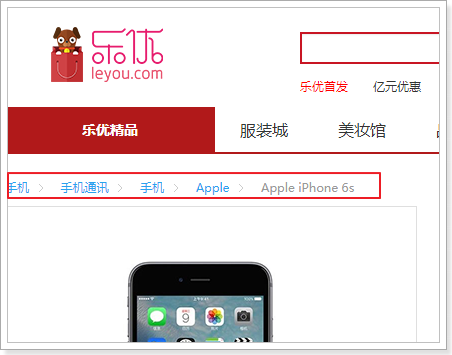
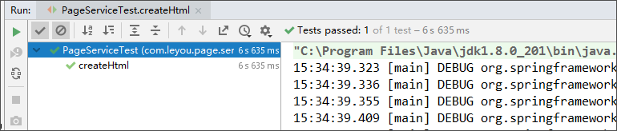

# Table of Contents

* [0.学习目标](#0学习目标)
* [1.商品详情](#1商品详情)
  * [1.1.Thymeleaf](#11thymeleaf)
  * [1.2.商品详情页服务](#12商品详情页服务)
    * [1.2.1.创建module](#121创建module)
    * [1.2.2.pom依赖](#122pom依赖)
    * [1.2.3.编写启动类：](#123编写启动类：)
    * [1.2.4.application.yml文件](#124applicationyml文件)
    * [1.2.5.页面模板：](#125页面模板：)
  * [1.3.页面跳转](#13页面跳转)
    * [1.3.1.修改页面跳转路径](#131修改页面跳转路径)
    * [1.3.2.nginx反向代理](#132nginx反向代理)
    * [1.3.3.编写跳转controller](#133编写跳转controller)
    * [1.3.4.测试](#134测试)
  * [1.4.封装模型数据](#14封装模型数据)
    * [1.4.1.商品微服务提供接口](#141商品微服务提供接口)
      * [查询spu接口](#查询spu接口)
      * [查询规格参数组](#查询规格参数组)
    * [1.4.2.创建FeignClient](#142创建feignclient)
    * [1.4.3.封装数据模型](#143封装数据模型)
    * [目录结构：](#目录结构：)
    * [1.4.4.页面测试数据](#144页面测试数据)
  * [1.5.渲染面包屑](#15渲染面包屑)
  * [1.6.渲染商品列表](#16渲染商品列表)
    * [1.6.1.副标题](#161副标题)
    * [1.6.2.渲染规格属性列表](#162渲染规格属性列表)
      * [初始化数据](#初始化数据)
      * [通过Vue渲染](#通过vue渲染)
    * [1.6.3.规格属性的筛选](#163规格属性的筛选)
      * [分析](#分析)
      * [页面改造](#页面改造)
    * [1.6.4.确定SKU](#164确定sku)
    * [1.6.5.渲染sku列表](#165渲染sku列表)
      * [图片列表](#图片列表)
      * [标题和价格](#标题和价格)
      * [完整效果](#完整效果)
  * [1.7.商品详情](#17商品详情)
    * [1.7.1.属性列表（作业）](#171属性列表（作业）)
    * [1.7.2.商品详情](#172商品详情)
  * [1.8.规格包装：](#18规格包装：)
    * [1.8.1.规格参数](#181规格参数)
    * [1.8.2.包装列表](#182包装列表)
  * [1.9.售后服务](#19售后服务)
* [2.页面静态化](#2页面静态化)
  * [2.1.简介](#21简介)
    * [2.1.1.问题分析](#211问题分析)
    * [2.1.2.什么是静态化](#212什么是静态化)
    * [2.1.3.如何实现静态化](#213如何实现静态化)
  * [2.2.Thymeleaf实现静态化](#22thymeleaf实现静态化)
    * [2.2.1.概念](#221概念)
    * [2.2.2.具体实现](#222具体实现)
    * [目录结构：](#目录结构：-1)
    * [2.2.3.什么时候创建静态文件](#223什么时候创建静态文件)
    * [2.2.4.重启测试：](#224重启测试：)
  * [2.3.nginx代理静态页面](#23nginx代理静态页面)
        * [nobody;](#nobody)
                  * [logs/error.log;](#logserrorlog)
                  * [logs/error.log  notice;](#logserrorlog--notice)
                  * [logs/error.log  info;](#logserrorlog--info)
      * [logs/nginx.pid;](#logsnginxpid)
                    * [main  '$remote_addr - $remote_user [$time_local] "$request" '](#main--remote_addr---remote_user-[time_local]-request-)
* ['$status $body_bytes_sent "$http_referer" '](#status-body_bytes_sent-http_referer-)
* ['"$http_user_agent" "$http_x_forwarded_for"';](#http_user_agent-http_x_forwarded_for)
                    * [logs/access.log  main;](#logsaccesslog--main)
                    * [on;](#on)
                                  * [0;](#0)
        * [on;](#on-1)
* [先找本地](#先找本地)
* [监听域名中带有group的，交给FastDFS模块处理](#监听域名中带有group的，交给fastdfs模块处理)
              * [koi8-r;](#koi8-r)
                    * [logs/host.access.log  main;](#logshostaccesslog--main)
                    * [404              /404.html;](#404--------------404html)
* [redirect server error pages to the static page /50x.html](#redirect-server-error-pages-to-the-static-page-50xhtml)
* [](#)
* [proxy the PHP scripts to Apache listening on 127.0.0.1:80](#proxy-the-php-scripts-to-apache-listening-on-12700180)
* [](#-1)
                * [~ \.php$ {](#-php-{)
* [proxy_pass   http://127.0.0.1;](#proxy_pass---http127001)
  * [](#-2)
* [pass the PHP scripts to FastCGI server listening on 127.0.0.1:9000](#pass-the-php-scripts-to-fastcgi-server-listening-on-1270019000)
* [](#-3)
                * [~ \.php$ {](#-php-{-1)
* [root           html;](#root-----------html)
* [fastcgi_pass   127.0.0.1:9000;](#fastcgi_pass---1270019000)
* [fastcgi_index  index.php;](#fastcgi_index--indexphp)
* [fastcgi_param  SCRIPT_FILENAME  /scripts$fastcgi_script_name;](#fastcgi_param--script_filename--scriptsfastcgi_script_name)
* [include        fastcgi_params;](#include--------fastcgi_params)
  * [](#-4)
* [deny access to .htaccess files, if Apache's document root](#deny-access-to-htaccess-files-if-apaches-document-root)
* [concurs with nginx's one](#concurs-with-nginxs-one)
* [](#-5)
                * [~ /\.ht {](#-ht-{)
* [deny  all;](#deny--all)
  * [](#-6)
* [another virtual host using mix of IP-, name-, and port-based configuration](#another-virtual-host-using-mix-of-ip--name--and-port-based-configuration)
* [](#-7)
            * [{](#{)
* [listen       8000;](#listen-------8000)
* [listen       somename:8080;](#listen-------somename8080)
* [server_name  somename  alias  another.alias;](#server_name--somename--alias--anotheralias)
* [location / {](#location--{)
* [root   html;](#root---html)
* [index  index.html index.htm;](#index--indexhtml-indexhtm)
* [}](#})
  * [](#-8)
* [HTTPS server](#https-server)
* [](#-9)
            * [{](#{-1)
* [listen       443 ssl;](#listen-------443-ssl)
* [server_name  localhost;](#server_name--localhost)
* [ssl_certificate      cert.pem;](#ssl_certificate------certpem)
* [ssl_certificate_key  cert.key;](#ssl_certificate_key--certkey)
* [ssl_session_cache    shared:SSL:1m;](#ssl_session_cache----sharedssl1m)
* [ssl_session_timeout  5m;](#ssl_session_timeout--5m)
* [ssl_ciphers  HIGH:!aNULL:!MD5;](#ssl_ciphers--highanullmd5)
* [ssl_prefer_server_ciphers  on;](#ssl_prefer_server_ciphers--on)
* [location / {](#location--{-1)
* [root   html;](#root---html-1)
* [index  index.html index.htm;](#index--indexhtml-indexhtm-1)
* [}](#}-1)
  * [](#-10)
  * [ly-page目录结构：](#ly-page目录结构：)
  * [2.4.静态页面的同步](#24静态页面的同步)


[TOC]


# 0.学习目标

- 了解Thymeleaf的基本使用
- 实现商品详情页的渲染
- 知道页面静态化的作用
- 实现页面静态化功能


# 1.商品详情

 

## 1.1.Thymeleaf

在商品详情页中，我们会使用到Thymeleaf来渲染页面，所以需要先了解Thymeleaf的语法。

详见课前资料中《Thymeleaf语法入门.md》


## 1.2.商品详情页服务

商品详情浏览量比较大，并发高，我们会独立开启一个微服务，用来展示商品详情。

### 1.2.1.创建module

商品的详情页服务，命名为：`ly-goods-page`

  

目录：

 

### 1.2.2.pom依赖

```XML
<?xml version="1.0" encoding="UTF-8"?>
<project xmlns="http://maven.apache.org/POM/4.0.0"
         xmlns:xsi="http://www.w3.org/2001/XMLSchema-instance"
         xsi:schemaLocation="http://maven.apache.org/POM/4.0.0 http://maven.apache.org/xsd/maven-4.0.0.xsd">
    <parent>
        <artifactId>leyou</artifactId>
        <groupId>com.leyou.parent</groupId>
        <version>1.0.0-SNAPSHOT</version>
    </parent>
    <modelVersion>4.0.0</modelVersion>

    <groupId>com.leyou.service</groupId>
    <artifactId>ly-page</artifactId>

    <dependencies>
        <dependency>
            <groupId>org.springframework.boot</groupId>
            <artifactId>spring-boot-starter-web</artifactId>
        </dependency>
        <dependency>
            <groupId>org.springframework.boot</groupId>
            <artifactId>spring-boot-starter-thymeleaf</artifactId>
        </dependency>
        <dependency>
            <groupId>org.springframework.cloud</groupId>
            <artifactId>spring-cloud-starter-netflix-eureka-client</artifactId>
        </dependency>
        <dependency>
            <groupId>org.springframework.cloud</groupId>
            <artifactId>spring-cloud-starter-openfeign</artifactId>
        </dependency>
        <dependency>
            <groupId>com.leyou.service</groupId>
            <artifactId>ly-item-interface</artifactId>
            <version>${leyou.latest.version}</version>
        </dependency>
    </dependencies>
</project>
```

### 1.2.3.编写启动类：

```java
@EnableDiscoveryClient
@EnableFeignClients
@SpringBootApplication
public class LyGoodsPage {
    public static void main(String[] args) {
        SpringApplication.run(LyGoodsPage.class, args);
    }
}
```

### 1.2.4.application.yml文件

```yaml
server:
  port: 8085
spring:
  application:
    name: page-service
  thymeleaf:
    cache: false
eureka:
  client:
    service-url:
      defaultZone: http://127.0.0.1:10086/eureka
  instance:
    lease-renewal-interval-in-seconds: 5 # 每隔5秒发送一次心跳
    lease-expiration-duration-in-seconds: 10 # 10秒不发送就过期
    prefer-ip-address: true
    ip-address: 127.0.0.1
    instance-id: ${spring.application.name}.${server.port}
```


### 1.2.5.页面模板：

我们从leyou-portal中复制item.html模板到当前项目resource目录下的template中：

 


## 1.3.页面跳转

### 1.3.1.修改页面跳转路径

首先我们需要修改搜索结果页的商品地址，目前所有商品的地址都是：http://www.leyou.com/item.html

 

我们应该跳转到对应的商品的详情页才对。

那么问题来了：商品详情页是一个SKU？还是多个SKU的集合？



通过详情页的预览，我们知道它是多个SKU的集合，即SPU。

所以，页面跳转时，我们应该携带SPU的id信息。

例如：http://www.leyou.com/item/2314123.html

这里就采用了路径占位符的方式来传递spu的id，我们打开`search.html`，修改其中的商品路径：

 

刷新页面后在看：

 

### 1.3.2.nginx反向代理

接下来，我们要把这个地址指向我们刚刚创建的服务：`ly-page`，其端口为8085

我们在nginx.conf中添加一段逻辑：

 

把以/item开头的请求，代理到我们的8085端口

测试：

 


### 1.3.3.编写跳转controller

在`ly-page`中编写controller，接收请求，并跳转到商品详情页：这里用@Controller，是因为@RestController会把返回结果当json处理，我们这里不用。

```java
package com.leyou.page.web;

@Controller
public class PageController {

    /**
     * 跳转到商品详情页
     * @param id
     * @param model
     * @return
     */
    @GetMapping("item/{id}.html")
    public String totalPage(@PathVariable("id") Long id, Model model){
        //准备模型数据


        //返回视图
        return "item";
    }
}
```

 

### 1.3.4.测试

启动`ly-page`，点击搜索页面商品，看是能够正常跳转：


现在看到的依然是静态的数据。我们接下来开始页面的渲染


## 1.4.封装模型数据

首先我们一起来分析一下，在这个页面中需要哪些数据

我们已知的条件是传递来的spu的id，我们需要根据spu的id查询到下面的数据：

- spu信息 （无）
- spu的详情 （有）
- spu下的所有sku （有）
- 品牌 （有）
- 商品三级分类 （有）
- 商品规格参数 （无）、规格参数组（有）

### 1.4.1.商品微服务提供接口

#### 查询spu接口

以上所需数据中，查询spu的接口目前还没有，我们需要在商品微服务中提供这个接口：

> GoodsApi

```java
/**
     * 根据spu的id查询spu
     * @param id
     * @return
     */
    @GetMapping("spu/{id}")
    Spu querySpuById(@PathVariable("id") Long id);
```

> GoodsController

```java
    /**
     * 根据spu的id查询spu
     * @param id
     * @return
     */
    @GetMapping("spu/{id}")
    public ResponseEntity<Spu> querySpuById(@PathVariable("id") Long id){
        return ResponseEntity.ok(goodsService.querySpuById(id));
    }
```

> GoodsService

```java
    public Spu querySpuById(Long id) {
        //查询spu
        Spu spu = spuMapper.selectByPrimaryKey(id);
        if (spu == null) {
            throw new LyException(ExceptionEnum.GOODS_NOT_FOUND);
        }

        //查询sku
        spu.setSkus(querySkuBySpuId(id));

        //查询detail
        spu.setSpuDetail(queryDetailById(id));

        return spu;
    }
```

#### 查询规格参数组

根据商品分类的id查组，规格参数永远和分类绑定，找到商品就能找到它的分类，找到分类就能找到它所属的组。

我们在页面展示规格时，需要按组展示：

 

组内有多个参数，为了方便展示。我们提供一个接口，查询规格组，同时在规格组中持有组内的所有参数。

> 拓展`SpecGroup`类：

我们在`SpecGroup`中添加一个`SpecParam`的集合，保存改组下所有规格参数

```java
@Data
@Table(name = "tb_spec_group")
public class SpecGroup {

    @Id
    @KeySql(useGeneratedKeys = true)
    private Long id;
    private Long cid;
    private String name;

    @Transient
    private List<SpecParam> params; // 该组下的所有规格参数集合
}
```

然后提供查询接口：

> SpecificationAPI：

```java
package com.leyou.item.api;

public interface SpecificationApi {
    /**
     * 查询参数集合
     * @param gid 组id
     * @param cid 分类id
     * @param searching 是否搜索
     * @return
     */
    @GetMapping("spec/params")
    List<SpecParam> queryParamList(
            @RequestParam(value = "gid", required = false) Long gid,
            @RequestParam(value = "cid", required = false) Long cid,
            @RequestParam(value = "searching", required = false) Boolean searching
    );
【1】
    /**
     * 根据分类查询规格参数组，及组内参数
     * @param cid
     * @return
     */
    @GetMapping("spec/group")
    List<SpecGroup> queryListByCid(@RequestParam("cid") Long cid);
【1】
}
```

> SpecificationController

```java
    /**
     * 根据分类查询规格参数组，及组内参数
     * @param cid
     * @return
     */
    @GetMapping("group")
    public ResponseEntity<List<SpecGroup>> queryListByCid(@RequestParam("cid") Long cid){
        return ResponseEntity.ok(specService.queryListByCid(cid));
    }
```

> SpecificationService

//查询当前分类下的参数时（查询到规格组的集合后，可以遍历规格组，来查询当前规格组下的参数，但是这样要查询很多次，要与数据库交互很多次。所以我们查询当前分类下的参数也是一样的效果，还减少了与数据库的交互，提高了效率）

```java
public List<SpecGroup> queryListByCid(Long cid) {
        //查询规格组
        List<SpecGroup> specGroups = queryGroupByCid(cid);
        //查询当前分类下的参数
        List<SpecParam> specParams = queryParamList(null, cid, null);

        //先把规格参数变成map，map的key是规格组id，map的值是组下的所有参数
        Map<Long, List<SpecParam>> specParamMap = new HashMap<>();

        //填充map
        for (SpecParam specParam : specParams) {
            if (!specParamMap.containsKey(specParam.getGroupId())){
                /*
                    这个组id在map中不存在，填充map，map的key是当前参数的规格组id，
                    map的值为新增一个list来准备存放组下的参数
                */
                specParamMap.put(specParam.getGroupId(), new ArrayList<>());
            }
            specParamMap.get(specParam.getGroupId()).add(specParam);
        }

        //填充specParam到specGroup
        for (SpecGroup specGroup : specGroups) {
            specGroup.setParams(specParamMap.get(specGroup.getId()));
        }
        return specGroups;
    }
```

在service中，我们调用之前编写过的方法，查询规格组，和规格参数，然后封装返回。


### 1.4.2.创建FeignClient

我们在`ly-page`服务中，创建FeignClient：(我们已经在ly-search中创建过了，直接拷贝过来即可)

 

BrandClient：

```java
@FeignClient("item-service")
public interface BrandClient extends BrandApi {
}
```

CategoryClient

```java
@FeignClient("item-service")
public interface CategoryClient extends CategoryApi {
}
```

GoodsClient:

```java
@FeignClient("item-service")
public interface GoodsClient extends GoodsApi {
}
```

SpecificationClient：

```java
@FeignClient("item-service")
public interface SpecificationClient extends SpecificationApi {
}
```


### 1.4.3.封装数据模型

我们创建一个PageService，在里面来封装数据模型。

 


> controller
>

在PageController中把数据放入model：

```java
package com.leyou.page.web;

@Controller //这里用@Controller，是因为@RestController会把返回结果当json处理，我们这里不用。
public class PageController {

    @Autowired
    private PageService pageService;

    /**
     * 跳转到商品详情页
     * @param spuId
     * @param model
     * @return
     */
    @GetMapping("item/{id}.html")
    public String totalPage(@PathVariable("id") Long spuId, Model model){
        Map<String,Object> attributes = pageService.loadModel(spuId);
        //准备模型数据
        model.addAllAttributes(attributes);

        //返回视图
        return "item";
    }
}
```


> Service代码

PageService代码

```java
package com.leyou.page.service;

@Service
public class PageService {

    @Autowired
    private BrandClient brandClient;

    @Autowired
    private CategoryClient categoryClient;

    @Autowired
    private GoodsClient goodsClient;

    @Autowired
    private SpecificationClient specificationClient;

    public Map<String, Object> loadModel(Long spuId) {
        Map<String, Object> model = new HashMap<>();
        //查询spu
        Spu spu = goodsClient.querySpuById(spuId);
        //查询skus
        List<Sku> skus = spu.getSkus();
        //查询详情detail
        SpuDetail detail = spu.getSpuDetail();
        //查询品牌brand
        Brand brand = brandClient.queryBrandById(spu.getBrandId());
        //查询商品分类categories
        List<Category> categories = categoryClient.queryCategoryByIds(
                Arrays.asList(spu.getCid1(), spu.getCid2(), spu.getCid3()));
        //查询规格参数specs
        List<SpecGroup> specs = specificationClient.queryListByCid(spu.getCid3());

        model.put("title", spu.getTitle());
        model.put("subTitle", spu.getSubTitle());
        model.put("skus", skus);
        model.put("detail", detail);
        model.put("brand", brand);
        model.put("categories", categories);
        model.put("specs", specs);
        return model;
    }
}
```

### 目录结构：

 


### 1.4.4.页面测试数据

 


## 1.5.渲染面包屑

在商品展示页的顶部，有一个商品分类、品牌、标题的面包屑

 

其数据有3部分：

- 商品分类
- 商品品牌
- spu标题

我们的模型中都有，所以直接渲染即可（页面37行开始）：

```html
<div class="crumb-wrap">
    <ul class="sui-breadcrumb">
        <li th:each="category : ${categories}">
            <a href="#" th:text="${category.name}">手机</a>
        </li>
        <li>
            <a href="#" th:text="${brand.name}">Apple</a>
        </li>
        <li class="active" th:text="${spu.title}">Apple iPhone 6s</li>
    </ul>
</div>
```

## 1.6.渲染商品列表

先看下整体效果：


这个部分需要渲染的数据有5块：

- sku图片
- sku标题
- 副标题
- sku价格
- 特有规格属性列表

其中，sku 的图片、标题、价格，都必须在用户选中一个具体sku后，才能渲染。而特有规格属性列表可以在spuDetail中查询到。而副标题则是在spu中，直接可以在页面渲染

因此，我们先对特有规格属性列表进行渲染。等用户选择一个sku，再通过js对其它sku属性渲染

### 1.6.1.副标题

副标题是在spu中，所以我们直接通过Thymeleaf渲染：

在第87行左右：

```html
<div class="news"><span th:utext="${spu.subTitle}"></span></div>
```

副标题中可能会有超链接，因此这里也用`th:utext`来展示，效果：

 


### 1.6.2.渲染规格属性列表

规格属性列表将来会有事件和动态效果。我们需要有js代码参与，不能使用Thymeleaf来渲染了。

因此，这里我们用vue，不过需要先把数据放到js对象中，方便vue使用

#### 初始化数据

我们在页面的`head`中，定义一个js标签，然后在里面定义变量，保存与sku相关的一些数据：

```html
<script th:inline="javascript">
    // sku集合
    const skus = /*[[${skus}]]*/ [];
    // 规格参数id与name对
	const paramMap = /*[[${paramMap}]]*/ {};
    // 特有规格参数集合
    const specialSpec = JSON.parse(/*[[${spuDetail.specialSpec}]]*/ "");
</script>
```

- specialSpec：这是SpuDetail中与唯一与Sku相关的数据

  因此我们并没有保存整个spuDetail，而是只保留了这个属性，而且需要手动转为js对象。

- paramMap：规格参数的id和name对，方便页面根据id获取参数名

- specialSpec：特有规格参数集合

我们来看下页面获取的数据：


#### 通过Vue渲染

我们把刚才获得的几个变量保存在Vue实例中：

 

然后在页面中渲染：

```html
<div id="specification" class="summary-wrap clearfix">
    <dl v-for="(v,k) in specialSpec" :key="k">
        <dt>
            <div class="fl title">
                <i v-text="paramMap[k]"></i>
            </div>
        </dt>
        <dd v-for="(o,j) in v" :key="j">
            <a href="javascript:;" class="selected">
                {{o}}<span  title="点击取消选择">&nbsp;</span>
            </a>
        </dd>
    </dl>
</div>
```

然后刷新页面查看：

 

数据成功渲染了。不过我们发现所有的规格都被勾选了。这是因为现在，每一个规格都有样式：`selected`，我们应该只选中一个，让它的class样式为selected才对！


那么问题来了，我们该如何确定用户选择了哪一个？


### 1.6.3.规格属性的筛选

#### 分析

规格参数的格式是这样的：

 

每一个规格项是数组中的一个元素，因此我们只要保存被选择的规格项的索引，就能判断哪个是用户选择的了！

我们需要一个对象来保存用户选择的索引，格式如下：

```js
{
    "4":0,
    "12":0,
    "13":0
}
```

但问题是，第一次进入页面时，用户并未选择任何参数。因此索引应该有一个默认值，我们将默认值设置为0。

我们在`head`的script标签中，对索引对象进行初始化：

 

然后在vue中保存：

 

#### 页面改造

我们在页面中，通过判断indexes的值来判断当前规格是否被选中，并且给规格绑定点击事件，点击规格项后，修改indexes中的对应值：

```html
<div id="specification" class="summary-wrap clearfix">
    <dl v-for="(v,k) in specTemplate" :key="k">
        <dt>
            <div class="fl title">
                <i v-text="k"></i>
            </div>
        </dt>
        <dd v-for="(o,j) in v" :key="j" @click="indexes[k]=j">
            <a href="javascript:;" :class="{selected: j === indexes[k]}">
                {{o}}<span v-show="j === indexes[k]" title="点击取消选择">&nbsp;</span>
            </a>
        </dd>
    </dl>
</div>
<div id="specification" class="summary-wrap clearfix">
    <dl v-for="(v,k) in specialSpec" :key="k">
        <dt>
            <div class="fl title">
                <i v-text="paramMap[k]"></i>
            </div>
        </dt>
        <dd v-for="(o,i) in v" :key="i">
            <a href="javascript:;" :class="{selected:i === indexes[k]}" @click="indexes[k] = i">
                {{o}}<span title="点击取消选择">&nbsp;</span>
            </a>
        </dd>
    </dl>
</div>
```


效果：

 

vue实例中的索引会随着你的点击而变化：

 

### 1.6.4.确定SKU

在我们设计sku数据的时候，就已经添加了一个字段：indexes：

 

这其实就是规格参数的索引组合。

而我们在页面中，用户点击选择规格后，就会把对应的索引保存起来：

 

因此，我们可以根据这个indexes来确定用户要选择的sku

我们在vue中定义一个计算属性，来计算与索引匹配的sku：

```js
computed:{
    sku(){
        const index = Object.values(this.indexes).join("_");
        return this.skus.find(s => s.indexes = index);
    }
}
```

在浏览器工具中查看：

 

### 1.6.5.渲染sku列表

既然已经拿到了用户选中的sku，接下来，就可以在页面渲染数据了

#### 图片列表

商品图片是一个字符串，以`,`分割，页面展示比较麻烦，所以我们编写一个计算属性，将图片字符串变成数组：

```js
images(){
    return this.sku.images ? this.sku.images.split(",") : ['']
}
```


页面改造：

 

效果：

 


#### 标题和价格

 


#### 完整效果


## 1.7.商品详情

商品详情页面如下图所示：


分成上下两部分：

- 上部：展示的是规格属性列表
- 下部：展示的是商品详情


### 1.7.1.属性列表（作业）

这部分内容与规格参数部分重复，我就不带大家做了，大家可以自己完成


### 1.7.2.商品详情

商品详情是HTML代码，我们不能使用 `th:text`，应该使用`th:utext`

在页面的第420行左右：

```html
<!--商品详情-->
<div class="intro-detail" th:utext="${spuDetail.description}">
</div>
```

最终展示效果：


## 1.8.规格包装：

规格包装分成两部分：

- 规格参数
- 包装列表

而且规格参数需要按照组来显示

### 1.8.1.规格参数

最终的效果：

 


我们模型中有一个groups，跟这个数据结果很像：

 

分成8个组，组内都有params，里面是所有的参数。不过，这些参数都没有值！

规格参数的值分为两部分：

- 通用规格参数：保存在SpuDetail中的genericSpec中
- 特有规格参数：保存在sku的ownSpec中

我们需要把这两部分值取出来，放到groups中。


因为sku是动态的，所以我们编写一个计算属性，来进行值的组合：

```js
groups(){
    groups.forEach(group => {
        group.params.forEach(param => {
            if(param.generic){
                // 通用属性，去spu的genericSpec中获取
                param.v = this.genericSpec[param.id] || '其它';
            }else{
                // 特有属性值，去SKU中获取
                param.v = JSON.parse(this.sku.ownSpec)[param.id]
            }
        })
    })
    return groups;
}
```

然后在页面渲染：

```html
<div class="Ptable">
    <div class="Ptable-item" v-for="group in groups" :key="group.name">
        <h3>{{group.name}}</h3>
        <dl>
            <div v-for="p in group.params">
                <dt>{{p.name}}</dt><dd>{{p.v + (p.unit || '')}}</dd>
            </div>
        </dl>
    </div>
</div>
```

### 1.8.2.包装列表

包装列表在商品详情中，我们一开始并没有赋值到Vue实例中，但是可以通过Thymeleaf来渲染

```html
<div class="package-list">
    <h3>包装清单</h3>
    <p th:text="${spuDetail.packingList}"></p>
</div>
```


最终效果：

 

 

## 1.9.售后服务

售后服务也可以通过Thymeleaf进行渲染：

```html
<div id="three" class="tab-pane">
    <p>售后保障</p>
    <p th:text="${spuDetail.afterService}"></p>
</div>
```

效果：

 


# 2.页面静态化

页面静态化是解决高并发的非常有效的手段。

## 2.1.简介

### 2.1.1.问题分析

现在，我们的页面是通过Thymeleaf模板引擎渲染后返回到客户端。在后台需要大量的数据查询，而后渲染得到HTML页面。会对数据库造成压力，并且请求的响应时间过长，并发能力不高。

大家能想到什么办法来解决这个问题？

首先我们能想到的就是缓存技术，比如之前学习过的Redis。不过Redis适合数据规模比较小的情况。假如数据量比较大，例如我们的商品详情页。每个页面如果10kb，100万商品，就是10GB空间，对内存占用比较大。此时就给缓存系统带来极大压力，如果缓存崩溃，接下来倒霉的就是数据库了。

所以缓存并不是万能的，某些场景需要其它技术来解决，比如静态化。

### 2.1.2.什么是静态化

静态化是指把动态生成的HTML页面变为静态内容保存，以后用户的请求到来，直接访问静态页面，不再经过服务的渲染。

而静态的HTML页面可以部署在nginx中，从而大大提高并发能力，减小tomcat压力。


目前的流程： Thymeleaf 作为一个模板引擎，当用户的请求到达后台的时候 ,Thymeleaf会把用户的请求接收到(PageController) ，然后查询数据，查完数据以后再去拿到模板item.html，再把model 中的数据 一 一 渲染到item.html， 渲染完成以后，它再把渲染得到的html 内容写到用户的response 当中，写到response 当中，自然就返回到了浏览器。


### 2.1.3.如何实现静态化

目前，静态化页面都是通过模板引擎来生成，而后保存到nginx服务器来部署。常用的模板引擎比如：

- Freemarker
- Velocity
- Thymeleaf

我们之前就使用的Thymeleaf，来渲染html返回给用户。Thymeleaf除了可以把渲染结果写入Response，也可以写到本地文件，从而实现静态化。

## 2.2.Thymeleaf实现静态化

### 2.2.1.概念

先说下Thymeleaf中的几个概念：

- Context：运行上下文
- TemplateResolver：模板解析器
- TemplateEngine：模板引擎

> Context

上下文： 用来保存模型数据，当模板引擎渲染时，可以从Context上下文中获取数据用于渲染。

当与SpringBoot结合使用时，我们放入Model的数据就会被处理到Context，作为模板渲染的数据使用。

> TemplateResolver

模板解析器：用来读取模板相关的配置，例如：模板存放的位置信息，模板文件名称，模板文件的类型等等。

当与SpringBoot结合时，TemplateResolver已经由其创建完成，并且各种配置也都有默认值，比如模板存放位置，其默认值就是：templates。比如模板文件类型，其默认值就是html。

> TemplateEngine

模板引擎：用来解析模板的引擎，需要使用到上下文、模板解析器。分别从两者中获取模板中需要的数据，模板文件。然后利用内置的语法规则解析，从而输出解析后的文件。来看下模板引起进行处理的函数：

```java
templateEngine.process("模板名", context, writer);
```

三个参数：

- 模板名称
- 上下文：里面包含模型数据
- writer：输出目的地的流

在输出时，我们可以指定输出的目的地，如果目的地是Response的流，那就是网络响应。如果目的地是本地文件，那就实现静态化了。

而在SpringBoot中已经自动配置了模板引擎，因此我们不需要关心这个。现在我们做静态化，就是把输出的目的地改成本地文件即可！

### 2.2.2.具体实现

引入test依赖

```yaml
<dependency>
    <groupId>org.springframework.boot</groupId>
    <artifactId>spring-boot-starter-test</artifactId>
</dependency>
```

Pageservice代码：

```java
package com.leyou.page.service;

import com.leyou.item.pojo.*;
import com.leyou.page.client.BrandClient;
import com.leyou.page.client.CategoryClient;
import com.leyou.page.client.GoodsClient;
import com.leyou.page.client.SpecificationClient;
import lombok.extern.slf4j.Slf4j;
import org.springframework.beans.factory.annotation.Autowired;
import org.springframework.stereotype.Service;
import org.thymeleaf.TemplateEngine;
import org.thymeleaf.context.Context;

import java.io.File;
import java.io.PrintWriter;
import java.util.Arrays;
import java.util.HashMap;
import java.util.List;
import java.util.Map;

@Slf4j
@Service
public class PageService {

    @Autowired
    private BrandClient brandClient;

    @Autowired
    private CategoryClient categoryClient;

    @Autowired
    private GoodsClient goodsClient;

    @Autowired
    private SpecificationClient specificationClient;

    @Autowired
    private TemplateEngine templateEngine;

    /**
     * 加载所需的数据
     * @param spuId
     * @return
     */
    public Map<String, Object> loadModel(Long spuId) {
        Map<String, Object> model = new HashMap<>();
        //查询spu
        Spu spu = goodsClient.querySpuById(spuId);
        //查询skus
        List<Sku> skus = spu.getSkus();
        //查询详情detail
        SpuDetail detail = spu.getSpuDetail();
        //查询品牌brand
        Brand brand = brandClient.queryBrandById(spu.getBrandId());
        //查询商品分类categories
        List<Category> categories = categoryClient.queryCategoryByIds(
                Arrays.asList(spu.getCid1(), spu.getCid2(), spu.getCid3()));
        //查询规格参数specs
        List<SpecGroup> specs = specificationClient.queryListByCid(spu.getCid3());

        model.put("title", spu.getTitle());
        model.put("subTitle", spu.getSubTitle());
        model.put("skus", skus);
        model.put("detail", detail);
        model.put("brand", brand);
        model.put("categories", categories);
        model.put("specs", specs);
        return model;
    }
【1】
    /**
     * 创建html页面
     * @param spuId
     */
    public void createHtml(Long spuId){
        //创建上下文(数据)(导入thymeleaf包)
        Context context = new Context();
        //把数据加入上下文
        context.setVariables(loadModel(spuId));
        //创建输出流，关联到一个临时文件
        File dest = new File("E:/Develop/Projects/IdeaProjects/leyou_upload", spuId + ".html");
        //1.8新特性try，好处是流可以自动释放
        try(PrintWriter writer = new PrintWriter(dest, "UTF-8")){
            //生成HTML（文件）
            templateEngine.process("item", context, writer);
        }catch(Exception e){
            log.error("[静态页服务] 生成静态页异常!", e);
        }
    }
    
 【1】
}

```


编写一个测试类：

 

```java
package com.leyou.page.service;

@RunWith(SpringRunner.class)
@SpringBootTest
public class PageServiceTest {

    @Autowired
    private PageService pageService;

    @Test
    public void createHtml() {
        pageService.createHtml(141L);
    }
}
```

### 目录结构：

 

测试：OK 没问题

 

 


打开看看：依然不太行，因为没有样式。

 


我们的nginx 在虚拟机，很尴尬，所以这样写，静态页面也需要手动上传。

==从这儿到2.3.的笔记，我们暂时没用到，直接跳到看2.3.nginx代理静态页面。==

---


PageService 完整代码：

```java
package com.leyou.page.service;

@Slf4j
@Service
public class PageService {

    @Autowired
    private BrandClient brandClient;

    @Autowired
    private CategoryClient categoryClient;

    @Autowired
    private GoodsClient goodsClient;

    @Autowired
    private SpecificationClient specificationClient;

    @Autowired
    private TemplateEngine templateEngine;
    
    @Value("${ly.thymeleaf.destPath}")
    private String destPath;// 加载application.yml中的数据，D:/heima/nginx-1.12.2/html

    /**
     * 加载所需的数据
     * @param spuId
     * @return
     */
    public Map<String, Object> loadModel(Long spuId) {
        Map<String, Object> model = new HashMap<>();
        //查询spu
        Spu spu = goodsClient.querySpuById(spuId);
        //查询skus
        List<Sku> skus = spu.getSkus();
        //查询详情detail
        SpuDetail detail = spu.getSpuDetail();
        //查询品牌brand
        Brand brand = brandClient.queryBrandById(spu.getBrandId());
        //查询商品分类categories
        List<Category> categories = categoryClient.queryCategoryByIds(
                Arrays.asList(spu.getCid1(), spu.getCid2(), spu.getCid3()));
        //查询规格参数specs
        List<SpecGroup> specs = specificationClient.queryListByCid(spu.getCid3());

        model.put("title", spu.getTitle());
        model.put("subTitle", spu.getSubTitle());
        model.put("skus", skus);
        model.put("detail", detail);
        model.put("brand", brand);
        model.put("categories", categories);
        model.put("specs", specs);
        return model;
    }

    /**
     * 创建html页面
     * @param spuId
     */
    public void createHtml(Long spuId){
        //创建上下文(数据)(导入thymeleaf包)
        Context context = new Context();
        //把数据加入上下文
        context.setVariables(loadModel(spuId));
        
        // 创建输出流，关联到一个临时文件
        File temp = new File(id + ".html");
        // 目标页面文件
        File dest = createPath(id);
        // 备份原页面文件
        File bak = new File(id + "_bak.html");
        //1.8新特性try，好处是流可以自动释放
        try (PrintWriter writer = new PrintWriter(temp, "UTF-8")) {
            // 利用thymeleaf模板引擎生成 静态页面HTML文件
            templateEngine.process("item", context, writer);

            if (dest.exists()) {
                // 如果目标文件已经存在，先备份
                dest.renameTo(bak);
            }
            // 将新页面覆盖旧页面
            FileCopyUtils.copy(temp,dest);
            // 成功后将备份页面删除
            bak.delete();
        } catch (IOException e) {
            // 失败后，将备份页面恢复
            bak.renameTo(dest);
            // 重新抛出异常，声明页面生成失败
            throw new Exception(e);
            //记录日志
            log.error("[静态页服务] 生成静态页异常!", e);
        } finally {
            // 删除临时页面
            if (temp.exists()) {
                temp.delete();
            }
        }
        
    }
    
    
    private File createPath(Long id) {
        if (id == null) {
            return null;
        }
        File dest = new File(this.destPath);
        if (!dest.exists()) {
            dest.mkdirs();
        }
        return new File(dest, id + ".html");
    }

    /**
     * 判断某个商品的页面是否存在
     * @param id
     * @return
     */
    public boolean exists(Long id){
        return this.createPath(id).exists();
    }

    /**
     * 异步创建html页面
     * @param id
     */
    public void syncCreateHtml(Long id){
        ThreadUtils.execute(() -> {
            try {
                createHtml(id);
            } catch (Exception e) {
                e.printStackTrace();
            }
        });
    }
}
```

在application.yml中配置生成静态文件的目录：

```yaml
ly:
  thymeleaf:
    destPath: D:/heima/nginx-1.12.2/html/item //静态页存放位置
```

线程工具类：

```java
public class ThreadUtils {

    private static final ExecutorService es = Executors.newFixedThreadPool(10);

    public static void execute(Runnable runnable) {
        es.submit(runnable);
    }
}
```

### 2.2.3.什么时候创建静态文件

我们编写好了创建静态文件的service，那么问题来了：什么时候去调用它呢

想想这样的场景：

假如大部分的商品都有了静态页面。那么用户的请求都会被nginx拦截下来，根本不会到达我们的`ly-page`服务。只有那些还没有页面的请求，才可能会到达这里。

因此，如果请求到达了这里，我们除了返回页面视图外，还应该创建一个静态页面，那么下次就不会再来麻烦我们了。

所以，我们在PageController中添加逻辑，去生成静态html文件：

```java
@Controller //这里用@Controller，是因为@RestController会把返回结果当json处理，我们这里不用。
public class PageController {

    @Autowired
    private PageService pageService;

    /**
     * 跳转到商品详情页
     * @param spuId
     * @param model
     * @return
     */
    @GetMapping("item/{id}.html")
    public String totalPage(@PathVariable("id") Long spuId, Model model){
        //// 加载所需的数据
        Map<String,Object> attributes = pageService.loadModel(spuId);
        //准备模型数据
        model.addAllAttributes(attributes);

        // 判断是否需要生成新的页面
        if(!this.fileService.exists(spuId)){
            this.fileService.syncCreateHtml(spuId);
        }
        //返回视图
        return "item";
    }
}
```

注意：生成html 的代码不能对用户请求产生影响，所以这里我们使用额外的线程进行异步创建。


### 2.2.4.重启测试：

访问一个商品详情，然后查看nginx目录：

 


## 2.3.nginx代理静态页面

在filezilla 中给虚拟机 /opt/nginx/html/目录下创建/item目录，用来存放静态页面，把我们刚才得到的141.html 文件放入。这时候访问是依然访问不到的。

 

接下来，我们修改nginx.conf，让它对商品请求进行监听，指向本地静态页面，如果本地没找到，才进行反向代理：

```nginx

#user  nobody;
worker_processes  1;

#error_log  logs/error.log;
#error_log  logs/error.log  notice;
#error_log  logs/error.log  info;

#pid        logs/nginx.pid;


events {
    worker_connections  1024;
}


http {
    include       mime.types;
    default_type  application/octet-stream;
	client_max_body_size 10m;   		#限制上传文件大小
    #log_format  main  '$remote_addr - $remote_user [$time_local] "$request" '
    #                  '$status $body_bytes_sent "$http_referer" '
    #                  '"$http_user_agent" "$http_x_forwarded_for"';

    #access_log  logs/access.log  main;

    sendfile        on;
    #tcp_nopush     on;

    #keepalive_timeout  0;
    keepalive_timeout  65;

    #gzip  on;
	server {
        listen       80;
        server_name  www.leyou.com;
        
        proxy_set_header X-Forwarded-Host $host;
        proxy_set_header X-Forwarded-Server $host;
        proxy_set_header X-Forwarded-For $proxy_add_x_forwarded_for;
	【1】	
		location /item {
			# 先找本地
			root html;
			if (!-f $request_filename) { #请求的文件不存在，就反向代理
				proxy_pass http://192.168.1.105:8085;
				break;
			}
		}
   【1】     
    	location / {
            proxy_pass http://192.168.1.105:9002; #主机地址 下的9002端口
            proxy_connect_timeout 600;
            proxy_read_timeout 600;
        }    
    }
	server {
        listen       9001;
        server_name  manage.leyou.com;
        
    	location / {
            proxy_pass http://192.168.1.105:9001; #主机地址 下的9001端口
        }    
    }
	server {
        listen       80;
        server_name  manage.leyou.com;
        
        proxy_set_header X-Forwarded-Host $host;
        proxy_set_header X-Forwarded-Server $host;
        proxy_set_header X-Forwarded-For $proxy_add_x_forwarded_for;
        
    	location / {
            proxy_pass http://192.168.1.105:9001; #主机地址 下的9001端口
            proxy_connect_timeout 600;
            proxy_read_timeout 600;
        }    
    }
    server {
        listen       80;
        server_name  api.leyou.com;
        
        proxy_set_header X-Forwarded-Host $host;
        proxy_set_header X-Forwarded-Server $host;
        proxy_set_header X-Forwarded-For $proxy_add_x_forwarded_for;
		
		location /api/upload {
			rewrite "^/(.*)$" /zuul/$1;
		}

    	location / {
            proxy_pass http://192.168.1.105:10010; #主机地址 下的10010端口
            proxy_connect_timeout 600;
            proxy_read_timeout 600;
        } 
    }
	server {
        listen       80;
        server_name  image.leyou.com;

    	# 监听域名中带有group的，交给FastDFS模块处理
        location ~/group([0-9])/ {
            ngx_fastdfs_module;
        }

        location / {
            root   /leyou/static;
            index  index.html index.htm;
        }

        error_page   500 502 503 504  /50x.html;
        location = /50x.html {
            root   html;
        }
    }
    server {
        listen       80;
        server_name  localhost;

        #charset koi8-r;

        #access_log  logs/host.access.log  main;

        location / {
            root   html;
            index  index.html index.htm;
        }

        #error_page  404              /404.html;

        # redirect server error pages to the static page /50x.html
        #
        error_page   500 502 503 504  /50x.html;
        location = /50x.html {
            root   html;
        }

        # proxy the PHP scripts to Apache listening on 127.0.0.1:80
        #
        #location ~ \.php$ {
        #    proxy_pass   http://127.0.0.1;
        #}

        # pass the PHP scripts to FastCGI server listening on 127.0.0.1:9000
        #
        #location ~ \.php$ {
        #    root           html;
        #    fastcgi_pass   127.0.0.1:9000;
        #    fastcgi_index  index.php;
        #    fastcgi_param  SCRIPT_FILENAME  /scripts$fastcgi_script_name;
        #    include        fastcgi_params;
        #}

        # deny access to .htaccess files, if Apache's document root
        # concurs with nginx's one
        #
        #location ~ /\.ht {
        #    deny  all;
        #}
    }


    # another virtual host using mix of IP-, name-, and port-based configuration
    #
    #server {
    #    listen       8000;
    #    listen       somename:8080;
    #    server_name  somename  alias  another.alias;

    #    location / {
    #        root   html;
    #        index  index.html index.htm;
    #    }
    #}


    # HTTPS server
    #
    #server {
    #    listen       443 ssl;
    #    server_name  localhost;

    #    ssl_certificate      cert.pem;
    #    ssl_certificate_key  cert.key;

    #    ssl_session_cache    shared:SSL:1m;
    #    ssl_session_timeout  5m;

    #    ssl_ciphers  HIGH:!aNULL:!MD5;
    #    ssl_prefer_server_ciphers  on;

    #    location / {
    #        root   html;
    #        index  index.html index.htm;
    #    }
    #}

}

```

停掉ly-page微服务，重启nginx （nginx -s reload），测试141.html页面：

 

发现请求速度得到了极大提升：访问速度提升了10倍，说明并发能力也提升了10倍，状态码为304说明还可以缓存。


## ly-page目录结构：

 


## 2.4.静态页面的同步

我们生成静态页，是通过测试类来生成的，生成页实在本地的，没有上传到nginx 显然是不行的！

我们将来万全可以把ly-page微服务 和nginx 部署在一起，当我们生成静态页时，直接生成在nginx指定目录就可以了，这样就无需进行手动上传静态页了。

 
