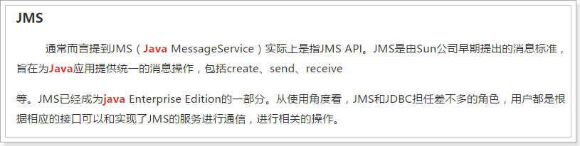
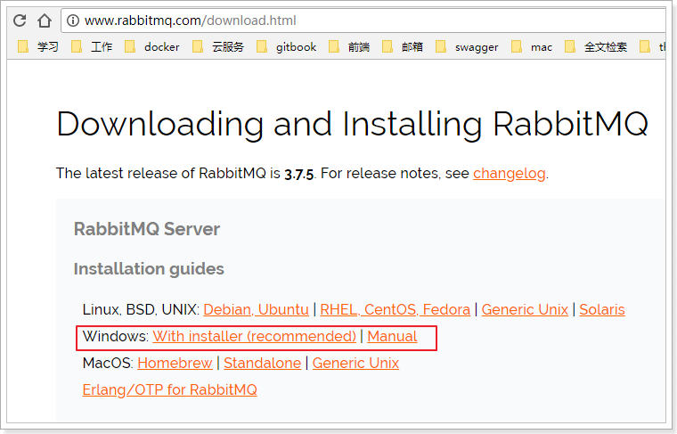
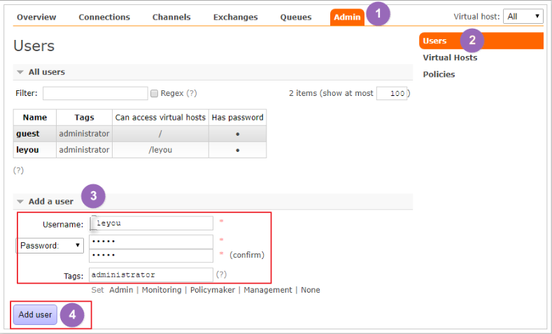
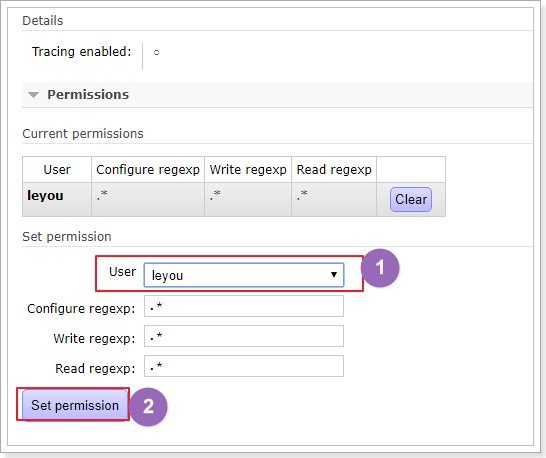
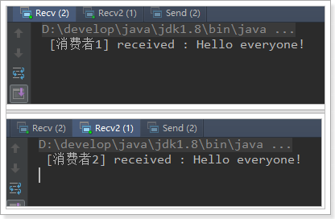
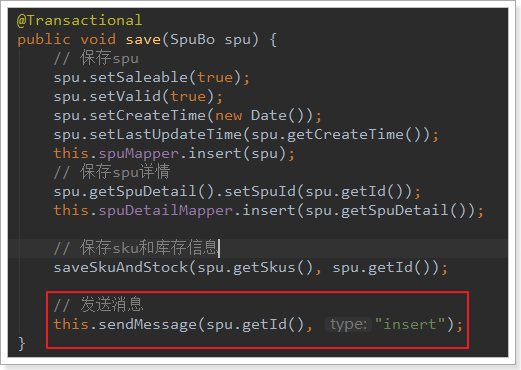
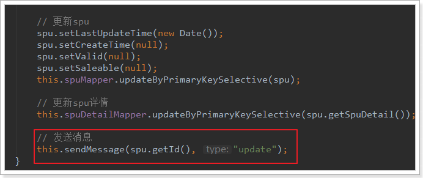
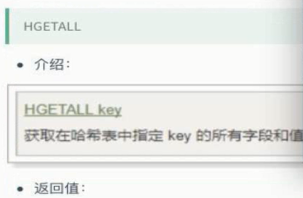

# Table of Contents

* [0.学习目标](#0学习目标)
* [1.RabbitMQ](#1rabbitmq)
  * [1.1.搜索与商品服务的问题](#11搜索与商品服务的问题)
  * [1.2.消息队列（MQ）](#12消息队列（mq）)
    * [1.2.1.什么是消息队列](#121什么是消息队列)
    * [1.2.2.AMQP和JMS](#122amqp和jms)
    * [1.2.3.常见MQ产品](#123常见mq产品)
    * [1.2.4.RabbitMQ](#124rabbitmq)
  * [1.3.下载和安装](#13下载和安装)
    * [1.3.1.下载](#131下载)
    * [1.3.2.安装](#132安装)
    * [0.安装文件准备](#0安装文件准备)
    * [1.安装Erlang](#1安装erlang)
    * [2.安装RabbitMQ](#2安装rabbitmq)
      * [2.1.安装](#21安装)
      * [2.2.修改配置文件](#22修改配置文件)
      * [2.3.设置开机启动](#23设置开机启动)
      * [2.4.启动命令](#24启动命令)
      * [2.5.开启web管理界面](#25开启web管理界面)
      * [2.6.开放端口](#26开放端口)
    * [3.管理界面介绍](#3管理界面介绍)
      * [3.1.主页](#31主页)
      * [3.2.添加用户](#32添加用户)
      * [3.3.创建虚拟主机（Virtual Hosts）](#33创建虚拟主机（virtual-hosts）)
  * [1.4.五种消息模型](#14五种消息模型)
    * [1.4.1.导入demo工程](#141导入demo工程)
    * [1.4.2.基本消息模型](#142基本消息模型)
      * [说明](#说明)
      * [生产者](#生产者)
      * [web控制台查看消息](#web控制台查看消息)
      * [消费者获取消息](#消费者获取消息)
      * [消费者的消息确认机制(Acknowlage)](#消费者的消息确认机制acknowlage)
    * [1.4.3.work消息模型](#143work消息模型)
      * [说明](#说明-1)
      * [生产者](#生产者-1)
      * [消费者1](#消费者1)
      * [消费者2](#消费者2)
      * [能者多劳](#能者多劳)
    * [1.4.4.订阅模型分类](#144订阅模型分类)
    * [1.4.5.订阅模型-Fanout](#145订阅模型-fanout)
      * [流程说明](#流程说明)
      * [生产者](#生产者-2)
      * [消费者1](#消费者1-1)
      * [消费者2](#消费者2-1)
      * [测试](#测试)
    * [1.4.6.订阅模型-Direct](#146订阅模型-direct)
      * [说明](#说明-2)
      * [生产者](#生产者-3)
      * [消费者1](#消费者1-2)
      * [消费者2](#消费者2-2)
      * [测试](#测试-1)
    * [1.4.7.订阅模型-Topic](#147订阅模型-topic)
      * [说明](#说明-3)
      * [生产者](#生产者-4)
      * [消费者1](#消费者1-3)
      * [消费者2](#消费者2-3)
  * [1.5.持久化](#15持久化)
    * [交换机持久化](#交换机持久化)
    * [队列持久化](#队列持久化)
    * [消息持久化](#消息持久化)
* [2.Spring AMQP](#2spring-amqp)
  * [2.1.简介](#21简介)
  * [2.2.依赖和配置](#22依赖和配置)
  * [2.3.监听者](#23监听者)
  * [2.4.AmqpTemplate](#24amqptemplate)
  * [2.5.测试代码](#25测试代码)
* [3.数据同步，项目改造](#3数据同步，项目改造)
  * [3.1.思路分析](#31思路分析)
  * [3.2.发送消息](#32发送消息)
    * [3.2.1.引入依赖](#321引入依赖)
    * [3.2.2.配置文件](#322配置文件)
    * [3.2.3.改造GoodsService](#323改造goodsservice)
  * [3.3.搜索服务接收消息](#33搜索服务接收消息)
    * [3.3.1.引入依赖](#331引入依赖)
    * [3.3.2.添加配置](#332添加配置)
    * [3.3.3.编写监听器](#333编写监听器)
    * [3.3.4.编写创建和删除索引方法](#334编写创建和删除索引方法)
  * [3.4.静态页服务接收消息](#34静态页服务接收消息)
    * [3.4.1.引入依赖](#341引入依赖)
    * [3.4.2.添加配置](#342添加配置)
    * [3.4.3.编写监听器](#343编写监听器)
    * [3.4.4.添加删除页面方法](#344添加删除页面方法)
  * [3.5.测试](#35测试)
    * [查看RabbitMQ控制台](#查看rabbitmq控制台)
    * [查看数据](#查看数据)
    * [修改商品](#修改商品)
    * [再次查看数据](#再次查看数据)
* [4.Redis回顾](#4redis回顾)
  * [2.2.2.为什么选择Redis](#222为什么选择redis)
  * [2.2.3.redis安装和配置](#223redis安装和配置)
    * [1.安装](#1安装)
    * [2.配置](#2配置)
        * [127.0.0.1 # 将这行代码注释。监听所有的ip地址，默认为0.0.0.0外网可以访问](#127001--将这行代码注释。监听所有的ip地址，默认为0000外网可以访问)
    * [3.启动或停止](#3启动或停止)
    * [4.设置开机启动](#4设置开机启动)
                * [](#)
* [chkconfig:   2345 90 10](#chkconfig---2345-90-10)
* [description:  Redis is a persistent key-value database](#description--redis-is-a-persistent-key-value-database)
  * [2.3.Redis指令](#23redis指令)
    * [2.3.1通用指令](#231通用指令)
    * [2.3.2.字符串指令](#232字符串指令)
    * [2.3.3.hash结构指令](#233hash结构指令)
  * [2.4.Redis的持久化](#24redis的持久化)
  * [2.5.SpringDataRedis](#25springdataredis)
    * [5.2.2.Spring Data Redis](#522spring-data-redis)
    * [5.2.3.RedisTemplate基本操作](#523redistemplate基本操作)
                  * [](#-1)
    * [5.2.4.StringRedisTemplate](#524stringredistemplate)
    * [5.2.5.测试](#525测试)
                  * [](#-2)


[TOC]


# 0.学习目标

- 了解常见的MQ产品
- 了解RabbitMQ的5种消息模型
- 会使用Spring AMQP
- 利用MQ实现搜索和静态页的数据同步


==此时虚拟机的IP地址从192.168.50.128更改为为192.168.1.128==

# 1.RabbitMQ

## 1.1.搜索与商品服务的问题

目前我们已经完成了商品详情和搜索系统的开发。我们思考一下，是否存在问题？

- 商品的原始数据保存在数据库中，增删改查都在数据库中完成。
- 搜索服务数据来源是索引库，如果数据库商品发生变化，索引库数据不能及时更新。
- 商品详情做了页面静态化，静态页面数据也不会随着数据库商品发生变化。

如果我们在后台修改了商品的价格，搜索页面和商品详情页显示的依然是旧的价格，这样显然不对。该如何解决？


这里有两种解决方案：

- 方案1：每当后台对商品做增删改操作，同时要修改索引库数据及静态页面

  

- 方案2：搜索服务和商品页面服务对外提供操作接口，后台在商品增删改后，调用接口


以上两种方式都有同一个严重问题：就是代码耦合，后台服务中需要嵌入搜索和商品页面服务，违背了微服务的`独立`原则。

所以，我们会通过另外一种方式来解决这个问题：消息队列

## 1.2.消息队列（MQ）

### 1.2.1.什么是消息队列

消息队列，即MQ，Message 。


消息队列是典型的：生产者、消费者模型。生产者不断向消息队列中生产消息，消费者不断的从队列中获取消息。因为消息的生产和消费都是异步的，而且只关心消息的发送和接收，没有业务逻辑的侵入，这样就实现了生产者和消费者的解耦。

结合前面所说的问题：

- 商品服务对商品增删改以后，无需去操作索引库或静态页面，只是发送一条消息，也不关心消息被谁接收。
- 搜索服务和静态页面服务接收消息，分别去处理索引库和静态页面。

如果以后有其它系统也依赖商品服务的数据，同样监听消息即可，商品服务无需任何代码修改。


### 1.2.2.AMQP和JMS

MQ是消息通信的模型，并发具体实现。现在实现MQ的有两种主流方式：AMQP、JMS。





两者间的区别和联系：

- JMS是定义了统一的接口，来对消息操作进行统一；AMQP是通过规定协议来统一数据交互的格式
- JMS限定了必须使用Java语言；AMQP只是协议，不规定实现方式，因此是跨语言的。
- JMS规定了两种消息模型；而AMQP的消息模型更加丰富


### 1.2.3.常见MQ产品


- ActiveMQ：基于JMS

- RabbitMQ：基于AMQP协议，erlang语言开发，稳定性好
- RocketMQ：基于JMS，阿里巴巴产品，目前交由Apache基金会
- Kafka：分布式消息系统，高吞吐量

### 1.2.4.RabbitMQ

RabbitMQ是基于AMQP的一款消息管理系统

官网： http://www.rabbitmq.com/

官方教程：http://www.rabbitmq.com/getstarted.html


 

RabbitMQ基于Erlang语言开发：


## 1.3.下载和安装

### 1.3.1.下载

官网下载地址：http://www.rabbitmq.com/download.html

 

目前最新版本是：3.7.5

我们的课程中使用的是：3.4.1版本

课前资料提供了安装包：

  

### 1.3.2.安装

详见课前资料中的：

 


CentOS6安装rabbit.mq

### 0.安装文件准备

首先将课前资料提供的安装包上传到 `/home/leyou/mq`目录：

 

这个是RabbitMQ的安装包：

  


### 1.安装Erlang

安装包：

 

我们并没有提供Erlang安装包，直接采用yum仓库安装：

```
yum install esl-erlang_17.3-1~centos~6_amd64.rpm -y
yum install esl-erlang-compat-R14B-1.el6.noarch.rpm -y
```


### 2.安装RabbitMQ

#### 2.1.安装

进入文件所在目录:

```sh
cd /home/leyou/mq
```

然后输入命令：

```sh
 rpm -ivh rabbitmq-server-3.4.1-1.noarch.rpm
```


#### 2.2.修改配置文件

将配置文件模板复制到etc目录：

```sh
cp /usr/share/doc/rabbitmq-server-3.4.1/rabbitmq.config.example /etc/rabbitmq/rabbitmq.config
```

通过vim命令编辑：

```sh
vim /etc/rabbitmq/rabbitmq.config
```

修改下面内容：

 

**注意要去掉后面的逗号和前面的%%**


#### 2.3.设置开机启动

输入下面命令

```sh
chkconfig rabbitmq-server on
```

#### 2.4.启动命令

通过下面命令来控制RabbitMQ：

```sh
service rabbitmq-server start  //手动启动
service rabbitmq-server stop	//手动停止
service rabbitmq-server restart //重启
```


正常启动是非常快的，**如果**很慢（慢会导致超时），则需要修改host ：

```
vim /etc/hosts
```

修改内容，百度。


#### 2.5.开启web管理界面

RabbitMQ提供了用来管理的控制界面，十分方便，不过默认是关闭的。

我们通过命令开启web管理插件：

```sh
rabbitmq-plugins enable rabbitmq_management

```

然后重启RabbitMQ：

```sh
service rabbitmq-server restart

```


#### 2.6.开放端口

RabbitMQ默认使用15672端口进行web访问，我们开启防火墙端口：

```sh
/sbin/iptables -I INPUT -p tcp --dport 15672 -j ACCEPT
/etc/rc.d/init.d/iptables save

```


然后在主机中通过地址：http://192.168.1.128:15672即可访问到管理界面


### 3.管理界面介绍

第一次访问需要登录，默认的账号密码为：`guest/guest`

#### 3.1.主页

 


- connections：无论生产者还是消费者，都需要与RabbitMQ建立连接后才可以完成消息的生产和消费，在这里可以查看连接情况
- channels：通道，建立连接后，会形成通道，消息的投递获取依赖通道。
- Exchanges：交换机，用来实现消息的路由
- Queues：队列，即消息队列，消息存放在队列中，等待消费，消费后被移除队列。

端口：

​     

#### 3.2.添加用户



上面的Tags选项，其实是指定用户的角色，可选的有以下几个：

- 超级管理员(administrator)

  可登陆管理控制台，可查看所有的信息，并且可以对用户，策略(policy)进行操作。

- 监控者(monitoring)

  可登陆管理控制台，同时可以查看rabbitmq节点的相关信息(进程数，内存使用情况，磁盘使用情况等)

- 策略制定者(policymaker)

  可登陆管理控制台, 同时可以对policy进行管理。但无法查看节点的相关信息(上图红框标识的部分)。

- 普通管理者(management)

  仅可登陆管理控制台，无法看到节点信息，也无法对策略进行管理。

- 其他

  无法登陆管理控制台，通常就是普通的生产者和消费者。

#### 3.3.创建虚拟主机（Virtual Hosts）

为了让各个用户可以互不干扰的工作，RabbitMQ添加了虚拟主机（Virtual Hosts）的概念。其实就是一个独立的访问路径，不同用户使用不同路径，各自有自己的队列、交换机，互相不会影响。


创建好虚拟主机，我们还要给用户添加访问权限：

点击添加好的虚拟主机：


进入虚拟主机设置界面：

 


## 1.4.五种消息模型

RabbitMQ提供了6种消息模型，但是第6种其实是RPC，并不是MQ，因此不予学习。那么也就剩下5种。

但是其实3、4、5这三种都属于订阅模型，只不过进行路由的方式不同。


### 1.4.1.导入demo工程

我们通过一个demo工程来了解下RabbitMQ的工作方式：

导入工程：

 

导入后：

 


### 1.4.2.基本消息模型

#### 说明

官方文档说明：

> RabbitMQ是一个消息的代理者（Message Broker）：它接收消息并且传递消息。
>
> 你可以认为它是一个邮局：当你投递邮件到一个邮箱，你很肯定邮递员会终究会将邮件递交给你的收件人。与此类似，RabbitMQ 可以是一个邮箱、邮局、同时还有邮递员。
>
> 不同之处在于：RabbitMQ不是传递纸质邮件，而是二进制的数据

基本消息模型图：

 

在上图的模型中，有以下概念：

- P：生产者，也就是要发送消息的程序
- C：消费者：消息的接受者，会一直等待消息到来。
- queue：消息队列，图中红色部分。类似一个邮箱，可以缓存消息；生产者向其中投递消息，消费者从其中取出消息。

#### 生产者

连接工具类：

```java
package cn.itcast.rabbitmq.util;

import com.rabbitmq.client.ConnectionFactory;
import com.rabbitmq.client.Connection;

public class ConnectionUtil {
    /**
     * 建立与RabbitMQ的连接
     * @return
     * @throws Exception
     */
    public static Connection getConnection() throws Exception {
        //定义连接工厂
        ConnectionFactory factory = new ConnectionFactory();
        //设置服务地址
        factory.setHost("192.168.1.128");
        //端口
        factory.setPort(5672);
        //设置账号信息，用户名、密码、vhost
        factory.setVirtualHost("/leyou");
        factory.setUsername("leyou");
        factory.setPassword("leyou");
        // 通过工程获取连接
        Connection connection = factory.newConnection();
        return connection;
    }

}
```


生产者发送消息：

```java
public class Send {

    private final static String QUEUE_NAME = "simple_queue";

    public static void main(String[] argv) throws Exception {
        // 获取到连接
        Connection connection = ConnectionUtil.getConnection();
        // 从连接中创建通道，使用通道才能完成消息相关的操作
        Channel channel = connection.createChannel();
        // 声明（创建）队列
        channel.queueDeclare(QUEUE_NAME, false, false, false, null);
        // 消息内容
        String message = "Hello World!";
        // 向指定的队列中发送消息
        channel.basicPublish("", QUEUE_NAME, null, message.getBytes());
        
        System.out.println(" [x] Sent '" + message + "'");

        //关闭通道和连接
        channel.close();
        connection.close();
    }
}
```

控制台：

 

#### web控制台查看消息

进入队列页面，可以看到新建了一个队列：simple_queue


点击队列名称，进入详情页，可以查看消息：

 

在控制台查看消息并不会将消息消费，所以消息还在。


#### 消费者获取消息

```java
public class Recv {
    private final static String QUEUE_NAME = "simple_queue";

    public static void main(String[] argv) throws Exception {
        // 获取到连接
        Connection connection = ConnectionUtil.getConnection();
        // 创建通道
        Channel channel = connection.createChannel();
        // 声明队列
        channel.queueDeclare(QUEUE_NAME, false, false, false, null);
        // 定义队列的消费者
        DefaultConsumer consumer = new DefaultConsumer(channel) {
            // 获取消息，并且处理，这个方法类似事件监听，如果有消息的时候，会被自动调用
            @Override
            public void handleDelivery(String consumerTag, Envelope envelope, BasicProperties properties,
                    byte[] body) throws IOException {
                // body 即消息体
                String msg = new String(body);
                System.out.println(" [x] received : " + msg + "!");
            }
        };
        // 监听队列，第二个参数：是否自动进行消息确认。
        channel.basicConsume(QUEUE_NAME, true, consumer);
    }
}
```

控制台：

 

这个时候，队列中的消息就没了：


#### 消费者的消息确认机制(Acknowlage)

通过刚才的案例可以看出，消息一旦被消费者接收，队列中的消息就会被删除。

那么问题来了：RabbitMQ怎么知道消息被接收了呢？

这就要通过消息确认机制（Acknowlege）来实现了。当消费者获取消息后，会向RabbitMQ发送回执ACK，告知消息已经被接收。不过这种回执ACK分两种情况：

- 自动ACK：消息一旦被接收，消费者自动发送ACK
- 手动ACK：消息接收后，不会发送ACK，需要手动调用

大家觉得哪种更好呢？

这需要看消息的重要性：

- 如果消息不太重要，丢失也没有影响，那么自动ACK会比较方便
- 如果消息非常重要，不容丢失。那么最好在消费完成后手动ACK，否则接收消息后就自动ACK，RabbitMQ就会把消息从队列中删除。如果此时消费者宕机，那么消息就丢失了。

我们之前的测试都是自动ACK的，如果要手动ACK，需要改动我们的代码：

```java
public class Recv2 {
    private final static String QUEUE_NAME = "simple_queue";

    public static void main(String[] argv) throws Exception {
        // 获取到连接
        Connection connection = ConnectionUtil.getConnection();
        // 创建通道
        final Channel channel = connection.createChannel();
        // 声明队列
        channel.queueDeclare(QUEUE_NAME, false, false, false, null);
        // 定义队列的消费者
        DefaultConsumer consumer = new DefaultConsumer(channel) {
            // 获取消息，并且处理，这个方法类似事件监听，如果有消息的时候，会被自动调用
            @Override
            public void handleDelivery(String consumerTag, Envelope envelope, BasicProperties properties,
                    byte[] body) throws IOException {
                // body 即消息体
                String msg = new String(body);
                System.out.println(" [x] received : " + msg + "!");
                // 手动进行ACK
                channel.basicAck(envelope.getDeliveryTag(), false);
            }
        };
        // 监听队列，第二个参数false，手动进行ACK
        channel.basicConsume(QUEUE_NAME, false, consumer);
    }
}
```

注意到最后一行代码：

```java
channel.basicConsume(QUEUE_NAME, false, consumer);
```

如果第二个参数为true，则会自动进行ACK；如果为false，则需要手动ACK。方法的声明：


### 1.4.3.work消息模型

#### 说明

在刚才的基本模型中，一个生产者，一个消费者，生产的消息直接被消费者消费。比较简单。

Work queues，也被称为（Task queues），任务模型。

当消息处理比较耗时的时候，可能生产消息的速度会远远大于消息的消费速度。长此以往，消息就会堆积越来越多，无法及时处理。此时就可以使用work 模型：**让多个消费者绑定到一个队列，共同消费队列中的消息**。队列中的消息一旦消费，就会消失，因此任务是不会被重复执行的。

 

角色：

- P：生产者：任务的发布者
- C1：消费者，领取任务并且完成任务，假设完成速度较慢
- C2：消费者2：领取任务并完成任务，假设完成速度快


#### 生产者

生产者与案例1中的几乎一样：

```java
public class Send {
    private final static String QUEUE_NAME = "test_work_queue";

    public static void main(String[] argv) throws Exception {
        // 获取到连接
        Connection connection = ConnectionUtil.getConnection();
        // 获取通道
        Channel channel = connection.createChannel();
        // 声明队列
        channel.queueDeclare(QUEUE_NAME, false, false, false, null);
        // 循环发布任务
        for (int i = 0; i < 50; i++) {
            // 消息内容
            String message = "task .. " + i;
            channel.basicPublish("", QUEUE_NAME, null, message.getBytes());
            System.out.println(" [x] Sent '" + message + "'");

            Thread.sleep(i * 2);
        }
        // 关闭通道和连接
        channel.close();
        connection.close();
    }
}
```

不过这里我们是循环发送50条消息。

#### 消费者1


#### 消费者2


与消费者1基本类似，就是没有设置消费耗时时间。

这里是模拟有些消费者快，有些比较慢。


接下来，两个消费者一同启动，然后发送50条消息：


可以发现，两个消费者各自消费了25条消息，而且各不相同，这就实现了任务的分发。


#### 能者多劳

刚才的实现有问题吗？

- 消费者1比消费者2的效率要低，一次任务的耗时较长
- 然而两人最终消费的消息数量是一样的
- 消费者2大量时间处于空闲状态，消费者1一直忙碌

现在的状态属于是把任务平均分配，正确的做法应该是消费越快的人，消费的越多。

怎么实现呢？

我们可以修改设置，让消费者同一时间只接收一条消息，这样处理完成之前，就不会接收更多消息，就可以让处理快的人，接收更多消息 ：


再次测试：


### 1.4.4.订阅模型分类

订阅模型示意图：

 

前面2个案例中，只有3个角色：

- P：生产者，也就是要发送消息的程序
- C：消费者：消息的接受者，会一直等待消息到来。
- queue：消息队列，图中红色部分。类似一个邮箱，可以缓存消息；生产者向其中投递消息，消费者从其中取出消息。

而在订阅模型中，多了一个exchange角色，而且过程略有变化：

- P：生产者，也就是要发送消息的程序，但是不再发送到队列中，而是发给X（交换机）
- C：消费者，消息的接受者，会一直等待消息到来。
- Queue：消息队列，接收消息、缓存消息。
-  Exchange：交换机，图中的X。一方面，接收生产者发送的消息。另一方面，知道如何处理消息，例如递交给某个特别队列、递交给所有队列、或是将消息丢弃。到底如何操作，取决于Exchange的类型。Exchange有以下3种类型：
  - Fanout：广播，将消息交给所有绑定到交换机的队列
  - Direct：定向，把消息交给符合指定routing key 的队列
  - Topic：通配符，把消息交给符合routing pattern（路由模式） 的队列

**Exchange（交换机）只负责转发消息，不具备存储消息的能力**，因此如果没有任何队列与Exchange绑定，或者没有符合路由规则的队列，那么消息会丢失！


### 1.4.5.订阅模型-Fanout

Fanout，也称为广播。

#### 流程说明

流程图：

 

在广播模式下，消息发送流程是这样的：

- 1）  可以有多个消费者
- 2）  每个**消费者有自己的queue**（队列）
- 3）  每个**队列都要绑定到Exchange**（交换机）
- 4）  **生产者发送的消息，只能发送到交换机**，交换机来决定要发给哪个队列，生产者无法决定。
- 5）  交换机把消息发送给绑定过的所有队列
- 6）  队列的消费者都能拿到消息。实现一条消息被多个消费者消费


#### 生产者

两个变化：

- 1）  声明Exchange，不再声明Queue
- 2）  发送消息到Exchange，不再发送到Queue

```java
public class Send {

    private final static String EXCHANGE_NAME = "fanout_exchange_test";

    public static void main(String[] argv) throws Exception {
        // 获取到连接
        Connection connection = ConnectionUtil.getConnection();
        // 获取通道
        Channel channel = connection.createChannel();
        
        // 声明exchange，指定类型为fanout
        channel.exchangeDeclare(EXCHANGE_NAME, "fanout");
        
        // 消息内容
        String message = "Hello everyone";
        // 发布消息到Exchange
        channel.basicPublish(EXCHANGE_NAME, "", null, message.getBytes());
        System.out.println(" [生产者] Sent '" + message + "'");

        channel.close();
        connection.close();
    }
}
```

#### 消费者1

```java
public class Recv {
    private final static String QUEUE_NAME = "fanout_exchange_queue_1";

    private final static String EXCHANGE_NAME = "fanout_exchange_test";

    public static void main(String[] argv) throws Exception {
        // 获取到连接
        Connection connection = ConnectionUtil.getConnection();
        // 获取通道
        Channel channel = connection.createChannel();
        // 声明队列
        channel.queueDeclare(QUEUE_NAME, false, false, false, null);

        // 绑定队列到交换机
        channel.queueBind(QUEUE_NAME, EXCHANGE_NAME, "");

        // 定义队列的消费者
        DefaultConsumer consumer = new DefaultConsumer(channel) {
            // 获取消息，并且处理，这个方法类似事件监听，如果有消息的时候，会被自动调用
            @Override
            public void handleDelivery(String consumerTag, Envelope envelope, BasicProperties properties,
                    byte[] body) throws IOException {
                // body 即消息体
                String msg = new String(body);
                System.out.println(" [消费者1] received : " + msg + "!");
            }
        };
        // 监听队列，自动返回完成
        channel.basicConsume(QUEUE_NAME, true, consumer);
    }
}
```

要注意代码中：**队列需要和交换机绑定**

#### 消费者2

```java
public class Recv2 {
    private final static String QUEUE_NAME = "fanout_exchange_queue_2";

    private final static String EXCHANGE_NAME = "fanout_exchange_test";

    public static void main(String[] argv) throws Exception {
        // 获取到连接
        Connection connection = ConnectionUtil.getConnection();
        // 获取通道
        Channel channel = connection.createChannel();
        // 声明队列
        channel.queueDeclare(QUEUE_NAME, false, false, false, null);

        // 绑定队列到交换机
        channel.queueBind(QUEUE_NAME, EXCHANGE_NAME, "");
        
        // 定义队列的消费者
        DefaultConsumer consumer = new DefaultConsumer(channel) {
            // 获取消息，并且处理，这个方法类似事件监听，如果有消息的时候，会被自动调用
            @Override
            public void handleDelivery(String consumerTag, Envelope envelope, BasicProperties properties,
                    byte[] body) throws IOException {
                // body 即消息体
                String msg = new String(body);
                System.out.println(" [消费者2] received : " + msg + "!");
            }
        };
        // 监听队列，手动返回完成
        channel.basicConsume(QUEUE_NAME, true, consumer);
    }
}
```


#### 测试

我们运行两个消费者，然后发送1条消息：

 

### 1.4.6.订阅模型-Direct

#### 说明

在Fanout模式中，一条消息，会被所有订阅的队列都消费。但是，在某些场景下，我们希望不同的消息被不同的队列消费。这时就要用到Direct类型的Exchange。

 在Direct模型下：

- 队列与交换机的绑定，不能是任意绑定了，而是要指定至少一个`RoutingKey`（路由key）
- 消息的发送方在 向 Exchange发送消息时，也必须指定消息的 `RoutingKey`。
- Exchange不再把消息交给每一个绑定的队列，而是根据消息的`Routing Key`进行判断，只有队列的`Routingkey`与消息的 `Routing key`完全一致，才会接收到消息


流程图：

 

图解：

- P：生产者，向Exchange发送消息，发送消息时，会指定一个routing key。
- X：Exchange（交换机），接收生产者的消息，然后把消息递交给 与routing key完全匹配的队列
- C1：消费者，其所在队列指定了需要routing key 为 error 的消息
- C2：消费者，其所在队列指定了需要routing key 为 info、error、warning 的消息

#### 生产者

此处我们模拟商品的增删改，发送消息的RoutingKey分别是：insert、update、delete

```java
public class Send {
    private final static String EXCHANGE_NAME = "direct_exchange_test";

    public static void main(String[] argv) throws Exception {
        // 获取到连接
        Connection connection = ConnectionUtil.getConnection();
        // 获取通道
        Channel channel = connection.createChannel();
        // 声明exchange，指定类型为direct
        channel.exchangeDeclare(EXCHANGE_NAME, "direct");
        // 消息内容
        String message = "商品新增了， id = 1001";
        // 发送消息，并且指定routing key 为：insert ,代表新增商品
        channel.basicPublish(EXCHANGE_NAME, "insert", null, message.getBytes());
        System.out.println(" [商品服务：] Sent '" + message + "'");

        channel.close();
        connection.close();
    }
}
```

#### 消费者1

我们此处假设消费者1只接收两种类型的消息：更新商品和删除商品。

```java
public class Recv {
    private final static String QUEUE_NAME = "direct_exchange_queue_1";
    private final static String EXCHANGE_NAME = "direct_exchange_test";

    public static void main(String[] argv) throws Exception {
        // 获取到连接
        Connection connection = ConnectionUtil.getConnection();
        // 获取通道
        Channel channel = connection.createChannel();
        // 声明队列
        channel.queueDeclare(QUEUE_NAME, false, false, false, null);
        
        // 绑定队列到交换机，同时指定需要订阅的routing key。假设此处需要update和delete消息
        channel.queueBind(QUEUE_NAME, EXCHANGE_NAME, "update");
        channel.queueBind(QUEUE_NAME, EXCHANGE_NAME, "delete");

        // 定义队列的消费者
        DefaultConsumer consumer = new DefaultConsumer(channel) {
            // 获取消息，并且处理，这个方法类似事件监听，如果有消息的时候，会被自动调用
            @Override
            public void handleDelivery(String consumerTag, Envelope envelope, BasicProperties properties,
                    byte[] body) throws IOException {
                // body 即消息体
                String msg = new String(body);
                System.out.println(" [消费者1] received : " + msg + "!");
            }
        };
        // 监听队列，自动ACK
        channel.basicConsume(QUEUE_NAME, true, consumer);
    }
}
```


#### 消费者2

我们此处假设消费者2接收所有类型的消息：新增商品，更新商品和删除商品。

```java
public class Recv2 {
    private final static String QUEUE_NAME = "direct_exchange_queue_2";
    private final static String EXCHANGE_NAME = "direct_exchange_test";

    public static void main(String[] argv) throws Exception {
        // 获取到连接
        Connection connection = ConnectionUtil.getConnection();
        // 获取通道
        Channel channel = connection.createChannel();
        // 声明队列
        channel.queueDeclare(QUEUE_NAME, false, false, false, null);
        
        // 绑定队列到交换机，同时指定需要订阅的routing key。订阅 insert、update、delete
        channel.queueBind(QUEUE_NAME, EXCHANGE_NAME, "insert");
        channel.queueBind(QUEUE_NAME, EXCHANGE_NAME, "update");
        channel.queueBind(QUEUE_NAME, EXCHANGE_NAME, "delete");

        // 定义队列的消费者
        DefaultConsumer consumer = new DefaultConsumer(channel) {
            // 获取消息，并且处理，这个方法类似事件监听，如果有消息的时候，会被自动调用
            @Override
            public void handleDelivery(String consumerTag, Envelope envelope, BasicProperties properties,
                    byte[] body) throws IOException {
                // body 即消息体
                String msg = new String(body);
                System.out.println(" [消费者2] received : " + msg + "!");
            }
        };
        // 监听队列，自动ACK
        channel.basicConsume(QUEUE_NAME, true, consumer);
    }
}
```


#### 测试

我们分别发送增、删、改的RoutingKey，发现结果：

 


### 1.4.7.订阅模型-Topic

#### 说明

`Topic`类型的`Exchange`与`Direct`相比，都是可以根据`RoutingKey`把消息路由到不同的队列。只不过`Topic`类型`Exchange`可以让队列在绑定`Routing key` 的时候使用通配符！


`Routingkey` 一般都是有一个或多个单词组成，多个单词之间以”.”分割，例如： `item.insert`

 通配符规则：

​         `#`：匹配一个或多个词

​         `*`：匹配不多不少恰好1个词

举例：

​         `audit.#`：能够匹配`audit.irs.corporate` 或者 `audit.irs`

​         `audit.*`：只能匹配`audit.irs`

图示：

 

解释：

- 红色Queue：绑定的是`usa.#` ，因此凡是以 `usa.`开头的`routing key` 都会被匹配到
- 黄色Queue：绑定的是`#.news` ，因此凡是以 `.news`结尾的 `routing key` 都会被匹配

#### 生产者

使用topic类型的Exchange，发送消息的routing key有3种： `item.isnert`、`item.update`、`item.delete`：

```java
public class Send {
    private final static String EXCHANGE_NAME = "topic_exchange_test";

    public static void main(String[] argv) throws Exception {
        // 获取到连接
        Connection connection = ConnectionUtil.getConnection();
        // 获取通道
        Channel channel = connection.createChannel();
        // 声明exchange，指定类型为topic
        channel.exchangeDeclare(EXCHANGE_NAME, "topic");
        // 消息内容
        String message = "新增商品 : id = 1001";
        // 发送消息，并且指定routing key 为：insert ,代表新增商品
        channel.basicPublish(EXCHANGE_NAME, "item.insert", null, message.getBytes());
        System.out.println(" [商品服务：] Sent '" + message + "'");

        channel.close();
        connection.close();
    }
}
```

#### 消费者1

我们此处假设消费者1只接收两种类型的消息：更新商品和删除商品

```java
public class Recv {
    private final static String QUEUE_NAME = "topic_exchange_queue_1";
    private final static String EXCHANGE_NAME = "topic_exchange_test";

    public static void main(String[] argv) throws Exception {
        // 获取到连接
        Connection connection = ConnectionUtil.getConnection();
        // 获取通道
        Channel channel = connection.createChannel();
        // 声明队列
        channel.queueDeclare(QUEUE_NAME, false, false, false, null);
        
        // 绑定队列到交换机，同时指定需要订阅的routing key。需要 update、delete
        channel.queueBind(QUEUE_NAME, EXCHANGE_NAME, "item.update");
        channel.queueBind(QUEUE_NAME, EXCHANGE_NAME, "item.delete");

        // 定义队列的消费者
        DefaultConsumer consumer = new DefaultConsumer(channel) {
            // 获取消息，并且处理，这个方法类似事件监听，如果有消息的时候，会被自动调用
            @Override
            public void handleDelivery(String consumerTag, Envelope envelope, BasicProperties properties,
                    byte[] body) throws IOException {
                // body 即消息体
                String msg = new String(body);
                System.out.println(" [消费者1] received : " + msg + "!");
            }
        };
        // 监听队列，自动ACK
        channel.basicConsume(QUEUE_NAME, true, consumer);
    }
}
```


#### 消费者2

我们此处假设消费者2接收所有类型的消息：新增商品，更新商品和删除商品。

```java
/**
 * 消费者2
 */
public class Recv2 {
    private final static String QUEUE_NAME = "topic_exchange_queue_2";
    private final static String EXCHANGE_NAME = "topic_exchange_test";

    public static void main(String[] argv) throws Exception {
        // 获取到连接
        Connection connection = ConnectionUtil.getConnection();
        // 获取通道
        Channel channel = connection.createChannel();
        // 声明队列
        channel.queueDeclare(QUEUE_NAME, false, false, false, null);
        
        // 绑定队列到交换机，同时指定需要订阅的routing key。订阅 insert、update、delete
        channel.queueBind(QUEUE_NAME, EXCHANGE_NAME, "item.*");

        // 定义队列的消费者
        DefaultConsumer consumer = new DefaultConsumer(channel) {
            // 获取消息，并且处理，这个方法类似事件监听，如果有消息的时候，会被自动调用
            @Override
            public void handleDelivery(String consumerTag, Envelope envelope, BasicProperties properties,
                    byte[] body) throws IOException {
                // body 即消息体
                String msg = new String(body);
                System.out.println(" [消费者2] received : " + msg + "!");
            }
        };
        // 监听队列，自动ACK
        channel.basicConsume(QUEUE_NAME, true, consumer);
    }
}
```

## 1.5.持久化

如何避免消息丢失？

1）  消费者的ACK机制。可以防止消费者丢失消息。

2）  但是，如果在消费者消费之前，MQ就宕机了，消息就没了。


是可以将消息进行持久化呢？

 要将消息持久化，前提是：队列、Exchange都持久化

### 交换机持久化

 

### 队列持久化

 

### 消息持久化


  


# 2.Spring AMQP

## 2.1.简介

Sprin有很多不同的项目，其中就有对AMQP的支持：


Spring AMQP的页面：<http://projects.spring.io/spring-amqp/> 


注意这里一段描述：

​                                                         

​         Spring-amqp是对AMQP协议的抽象实现，而spring-rabbit 是对协议的具体实现，也是目前的唯一实现。底层使用的就是RabbitMQ。


## 2.2.依赖和配置

添加AMQP的启动器：

```xml
<dependency>
    <groupId>org.springframework.boot</groupId>
    <artifactId>spring-boot-starter-amqp</artifactId>
</dependency>
```

在`application.yml`中添加RabbitMQ地址：

```yaml
spring:
  rabbitmq:
    host: 192.168.56.101
    username: leyou
    password: leyou
    virtual-host: /leyou
```

## 2.3.监听者

在SpringAmqp中，对消息的消费者进行了封装和抽象，一个普通的JavaBean中的普通方法，只要通过简单的注解，就可以成为一个消费者。

```java
@Component
public class Listener {

    @RabbitListener(bindings = @QueueBinding(
            value = @Queue(value = "spring.test.queue", durable = "true"),
            exchange = @Exchange(
                    value = "spring.test.exchange",
                    ignoreDeclarationExceptions = "true",
                    type = ExchangeTypes.TOPIC
            ),
            key = {"#.#"}))
    public void listen(String msg){
        System.out.println("接收到消息：" + msg);
    }
}
```

- `@Componet`：类上的注解，注册到Spring容器
- `@RabbitListener`：方法上的注解，声明这个方法是一个消费者方法，需要指定下面的属性：
  - `bindings`：指定绑定关系，可以有多个。值是`@QueueBinding`的数组。`@QueueBinding`包含下面属性：
    - `value`：这个消费者关联的队列。值是`@Queue`，代表一个队列
    - `exchange`：队列所绑定的交换机，值是`@Exchange`类型
    - `key`：队列和交换机绑定的`RoutingKey`

类似listen这样的方法在一个类中可以写多个，就代表多个消费者。


## 2.4.AmqpTemplate

Spring最擅长的事情就是封装，把他人的框架进行封装和整合。

Spring为AMQP提供了统一的消息处理模板：AmqpTemplate，非常方便的发送消息，其发送方法：


红框圈起来的是比较常用的3个方法，分别是：

- 指定交换机、RoutingKey和消息体
- 指定消息
- 指定RoutingKey和消息，会向默认的交换机发送消息


## 2.5.测试代码

```java
@RunWith(SpringRunner.class)
@SpringBootTest(classes = Application.class)
public class MqDemo {

    @Autowired
    private AmqpTemplate amqpTemplate;

    @Test
    public void testSend() throws InterruptedException {
        String msg = "hello, Spring boot amqp";
        this.amqpTemplate.convertAndSend("spring.test.exchange","a.b", msg);
        // 等待10秒后再结束
        Thread.sleep(10000);
    }
}
```

运行后查看日志：


# 3.数据同步，项目改造

接下来，我们就改造项目，实现搜索服务、商品静态页的数据同步。

我们的商品微服务成为消息的发送方，静态页服务和搜索微服务成为消息的接收方。

## 3.1.思路分析

> 发送方：商品微服务

- 什么时候发？

  当商品服务对商品进行写操作：增、删、改的时候，需要发送一条消息，通知其它服务。

- 发送什么内容？

  对商品的增删改时其它服务可能需要新的商品数据，但是如果消息内容中包含全部商品信息，数据量太大，而且并不是每个服务都需要全部的信息。因此我们**只发送商品id**，其它服务可以根据id查询自己需要的信息。

> 接收方：搜索微服务、静态页微服务

- 接收消息后如何处理？
  - 搜索微服务：
    - 增/改：添加新的数据到索引库
    - 删：删除索引库数据
  - 静态页微服务：
    - 增：创建新的静态页
    - 删：删除原来的静态页
    - 改：创建新的静态页并删除原来的

## 3.2.发送消息

我们先在商品微服务`ly-item-service`中实现发送消息。

### 3.2.1.引入依赖

```xml
<dependency>
    <groupId>org.springframework.boot</groupId>
    <artifactId>spring-boot-starter-amqp</artifactId>
</dependency>
```

### 3.2.2.配置文件

我们在application.yml中添加一些有关RabbitMQ的配置：

```yaml
spring:
  rabbitmq:
    host: 192.168.1.128
    username: leyou
    password: leyou
    virtual-host: /leyou
    template:  #给AmqpTemplate来用的
      retry:    #重试
        enabled: true
        initial-interval: 10000ms  #初始化的重试周期
        max-interval: 300000ms  #重试周期越来越长，但不会超过最大的重试周期
        multiplier: 2  #倍数，如果失败会2倍初始化的重试周期再试
      exchange: ly.item.exchange #默认交换机
    publisher-confirms: true  #开启生产者确认
```

- template：有关`AmqpTemplate`的配置
  - retry：失败重试
    - enabled：开启失败重试
    - initial-interval：第一次重试的间隔时长
    - max-interval：最长重试间隔，超过这个间隔将不再重试
    - multiplier：下次重试间隔的倍数，此处是2即下次重试间隔是上次的2倍
  - exchange：缺省的交换机名称，此处配置后，发送消息如果不指定交换机就会使用这个
- publisher-confirms：生产者确认机制，确保消息会正确发送，如果发送失败会有错误回执，从而触发重试

### 3.2.3.改造GoodsService

封装一个发送消息到mq的方法：

```java
@Autowired
private AmqpTemplate amqpTemplate;

private void sendMessage(Long id, String type){
    // 发送消息
    try {
        this.amqpTemplate.convertAndSend("item." + type, id);
    } catch (Exception e) {
        logger.error("{}商品消息发送异常，商品id：{}", type, id, e);
    }
}
```

- 这里没有指定交换机，因此默认发送到了配置中的：`ly.item.exchange`

注意：这里要把所有异常都try起来，不能让消息的发送影响到正常的业务逻辑


然后在新增的时候调用：

 

修改的时候调用：

 


## 3.3.搜索服务接收消息

搜索服务接收到消息后要做的事情：ly-search

- 增：添加新的数据到索引库
- 删：删除索引库数据
- 改：修改索引库数据

因为索引库的新增和修改方法是合二为一的，因此我们可以将这两类消息一同处理，删除另外处理。

### 3.3.1.引入依赖

```xml
<dependency>
    <groupId>org.springframework.boot</groupId>
    <artifactId>spring-boot-starter-amqp</artifactId>
</dependency>
```

### 3.3.2.添加配置

消息的接收方不需要配template

```yaml
spring:
  rabbitmq:
    host: 192.168.1.128
    username: leyou
    password: leyou
    virtual-host: /leyou
```

这里只是接收消息而不发送，所以不用配置template相关内容。

### 3.3.3.编写监听器

 

代码：

```java
package com.leyou.search.mq;

@Component  //普通类注入到spring要用component注解
public class ItemListener {

    @Autowired
    private SearchService searchService;

    /**
     * 处理insert和update的消息
     *
     * @param spuId
     * @throws Exception
     */
    @RabbitListener(bindings = @QueueBinding(
            value = @Queue(name = "search.item.insert.queue", durable = "true"),
            exchange = @Exchange(name = "ly.item.exchange", type = ExchangeTypes.TOPIC),
            key = {"item.insert", "item.update"}
    ))
    public void listenerInsertOrUpdate(Long spuId){
        if (spuId == null){
            return;
        }
        //处理消息,对索引库进行新增或修改
        searchService.createOrUpdateIndex(spuId);
    }

    /**
     * 处理delete的消息
     *
     * @param spuId
     */
    @RabbitListener(bindings = @QueueBinding(
            value = @Queue(name = "search.item.delete.queue", durable = "true"),
            exchange = @Exchange(name = "ly.item.exchange", type = ExchangeTypes.TOPIC),
            key = {"item.delete"}
    ))
    public void listenerDelete(Long spuId){
        if (spuId == null){
            return;
        }
        //处理消息,对索引库进行删除
        searchService.deleteIndex(spuId);
    }
}
```


### 3.3.4.编写创建和删除索引方法

这里因为要创建和删除索引，我们需要在SearchService中拓展两个方法，创建和删除索引：

 

```java
    public void createOrUpdateIndex(Long spuId) {
        //查询spu
        Spu spu = goodsClient.querySpuById(spuId);
        //构建goods
        Goods goods = buildGoods(spu);
        //存入索引库
        goodsRepository.save(goods);
    }

    public void deleteIndex(Long spuId) {
        //从索引库中删除
        goodsRepository.deleteById(spuId);
    }
```

创建索引的方法可以从之前导入数据的测试类中拷贝和改造。

测试：

 

 


## 3.4.静态页服务接收消息

商品静态页服务接收到消息后的处理：

- 增：创建新的静态页
- 删：删除原来的静态页
- 改：创建新的静态页并删除原来的

不过，我们编写的创建静态页的方法也具备覆盖以前页面的功能，因此：增和改的消息可以放在一个方法中处理，删除消息放在另一个方法处理。

### 3.4.1.引入依赖

```xml
<dependency>
    <groupId>org.springframework.boot</groupId>
    <artifactId>spring-boot-starter-amqp</artifactId>
</dependency>
```

### 3.4.2.添加配置

```yaml
spring:
  rabbitmq:
    host: 192.168.1.128
    username: leyou
    password: leyou
    virtual-host: /leyou
```

这里只是接收消息而不发送，所以不用配置template相关内容。


### 3.4.3.编写监听器

 

代码：

```java
package com.leyou.page.mq;

@Component  //普通类注入到spring要用component注解
public class ItemListener {

    @Autowired
    private PageService pageService;

    /**
     * 处理insert和update的消息
     *
     * @param spuId
     * @throws Exception
     */
    @RabbitListener(bindings = @QueueBinding(
            value = @Queue(name = "page.item.insert.queue", durable = "true"),
            exchange = @Exchange(name = "ly.item.exchange", type = ExchangeTypes.TOPIC),
            key = {"item.insert", "item.update"}
    ))
    public void listenerInsertOrUpdate(Long spuId){
        if (spuId == null){
            return;
        }
        //处理消息,创建静态页
        pageService.createHtml(spuId);
    }

    /**
     * 处理delete的消息
     *
     * @param spuId
     */
    @RabbitListener(bindings = @QueueBinding(
            value = @Queue(name = "page.item.delete.queue", durable = "true"),
            exchange = @Exchange(name = "ly.item.exchange", type = ExchangeTypes.TOPIC),
            key = {"item.delete"}
    ))
    public void listenerDelete(Long spuId){
        if (spuId == null){
            return;
        }
        //处理消息,删除静态页
        pageService.deleteHtml(spuId);
    }
}
```

### 3.4.4.添加删除页面方法

修改pageService，添加删除页面deleteHtml方法，修改createHtml方法

 

```java
    /**
     * 删除html静态页面
     * @param spuId
     */
    public void deleteHtml(Long spuId) {
        //创建输出流，关联到一个临时文件
        File dest = new File("E:/Develop/Projects/IdeaProjects/leyou_upload", spuId + ".html");

        if (dest.exists()){
            dest.delete();
        }
    }
```

```java
 /**
     * 创建html静态页面
     * @param spuId
     */
    public void createHtml(Long spuId){
        //创建上下文(数据)(导入thymeleaf包)
        Context context = new Context();
        //把数据加入上下文
        context.setVariables(loadModel(spuId));
        //创建输出流，关联到一个临时文件
        File dest = new File("E:/Develop/Projects/IdeaProjects/leyou_upload", spuId + ".html");
【1】
        if (dest.exists()){
            dest.delete();
        }
【1】
        //1.8新特性try，好处是流可以自动释放
        try(PrintWriter writer = new PrintWriter(dest, "UTF-8")){
            //生成HTML（文件）
            templateEngine.process("item", context, writer);
        }catch(Exception e){
            log.error("[静态页服务] 生成静态页异常!", e);
        }
    }
```


## 3.5.测试

### 查看RabbitMQ控制台

重新启动项目，并且登录RabbitMQ管理界面：http://192.168.56.101:15672

可以看到，交换机已经创建出来了：

 

队列也已经创建完毕：

 

并且队列都已经绑定到交换机：

 

### 查看数据

我们搜索下手机：


商品详情页：


### 修改商品

然后在管理后台修改商品：

我们修改以下内容：

标题改成6.1

 


商品详情加点文字：

 

价格改为3999

 

### 再次查看数据


tips： 将来部署项目，要先把测试代码删掉，或者注释掉。


# 4.Redis回顾

 

 

网站：

[官网](http://redis.io) ：http://redis.io

[中文网站](www.redis.cn)：www.redis.cn

 

 

## 2.2.2.为什么选择Redis

  

 

## 2.2.3.redis安装和配置

### 1.安装

- 下载安装包
  上次课前资料提供的安装包，或者:[官网下载](https://redis.io/download)
  建议上传到我们的home下：/home/leyou/
- 解压

```shell
 cd /home/leyou
 tar -xvf redis-4.0.9.tar.gz
```

删除文件：

```
rm -rf redis-4.0.9.tar.gz
```


- 编译安装

```shell
 mv redis-4.0.9 redis  #修改文件夹名字
 cd redis
 make && make install
```

### 2.配置

修改安装目录下的redis.conf文件

```shell
vim redis.conf
```

修改以下配置：

```shell
#bind 127.0.0.1 # 将这行代码注释。监听所有的ip地址，默认为0.0.0.0外网可以访问
protected-mode no # 把yes改成no，允许外网访问
daemonize yes # 把no改成yes，后台运行
```

### 3.启动或停止

redis提供了服务端命令和客户端命令：

- redis-server 服务端命令，可以包含以下参数：
  start 启动  redis-server redis.conf
  stop 停止	killall redis-server

  ps -ef | grep redis  查看所有相关redis的进程

- redis-cli 客户端控制台，包含参数：

  redis-cli    默认为localhost下的6379端口

  redis-cli -h xxx   指定服务端地址，缺省值是127.0.0.1
  redis-cli -p xxx   指定服务端端口，缺省值是6379

### 4.设置开机启动

1) 输入命令，新建文件（所有的开机启动脚本都可以放到/etc/init.d/ 这个目录下）

```sh
vim /etc/init.d/redis
```

输入下面内容： 注意配置信息，粘贴之前先进入编辑模式，否则配置文件就会不完整。

```sh
#!/bin/sh
# chkconfig:   2345 90 10
# description:  Redis is a persistent key-value database
PATH=/usr/local/bin:/sbin:/usr/bin:/bin  #安装路径

REDISPORT=6379	#端口
EXEC=/usr/local/bin/redis-server
REDIS_CLI=/usr/local/bin/redis-cli

PIDFILE=/var/run/redis.pid

CONF="/home/leyou/redis/redis.conf"	#redis配置文件的地址

case "$1" in  
    start)  
        if [ -f $PIDFILE ]  
        then  
                echo "$PIDFILE exists, process is already running or crashed"  
        else  
                echo "Starting Redis server..."  
                $EXEC $CONF  
        fi  
        if [ "$?"="0" ]   
        then  
              echo "Redis is running..."  
        fi  
        ;;  
    stop)  
        if [ ! -f $PIDFILE ]  
        then  
                echo "$PIDFILE does not exist, process is not running"  
        else  
                PID=$(cat $PIDFILE)  
                echo "Stopping ..."  
                $REDIS_CLI -p $REDISPORT SHUTDOWN  
                while [ -x ${PIDFILE} ]  
               do  
                    echo "Waiting for Redis to shutdown ..."  
                    sleep 1  
                done  
                echo "Redis stopped"  
        fi  
        ;;  
   restart|force-reload)  
        ${0} stop  
        ${0} start  
        ;;  
  *)  
    echo "Usage: /etc/init.d/redis {start|stop|restart|force-reload}" >&2  
        exit 1  
esac

```

然后保存退出

注意：以下信息需要根据安装目录进行调整：

> EXEC=/usr/local/bin/redis-server # 执行脚本的地址
>
> REDIS_CLI=/usr/local/bin/redis-cli # 客户端执行脚本的地址
>
> PIDFILE=/var/run/redis.pid # 进程id文件地址
>
> CONF="/usr/local/src/redis-3.0.2/redis.conf" #配置文件地址

2）设置权限

```sh
chmod 755 /etc/init.d/redis
```


3）启动测试

```sh
/etc/init.d/redis start
```

启动成功会提示如下信息：

```
Starting Redis server...
Redis is running...

```


4）设置开机自启动

```sh
chkconfig --add /etc/init.d/redis
chkconfig redis on

```

测试：

 


## 2.3.Redis指令

### 2.3.1通用指令

 

 

 

==生产环境一定禁用 keys，非常占用cpu==


 

 


 


 

 -2 代表死亡

如果不设置，默认为最长，永久存活，显示为 -1。


 

 

 

 


 

 

 


> select  X    切换库，共16个库[0~15]，默认是0库，生产环境不用，我们要设置为只有一个库

 

 

保存退出

关闭redis，重新启动

 


连接客户端，切换库-->报错，因为只剩下 0 库了

 


### 2.3.2.字符串指令

 

 

 

### 2.3.3.hash结构指令

 

 

 

 

 

 

 

 

 

 


 


 

 

 


## 2.4.Redis的持久化

 

 

 

 

拔高课程文件夹有视频讲解。


## 2.5.SpringDataRedis

 

### 5.2.2.Spring Data Redis

官网：<http://projects.spring.io/spring-data-redis/>

                                    

Spring Data Redis，是Spring Data 家族的一部分。 对Jedis客户端进行了封装，与spring进行了整合。可以非常方便的来实现redis的配置和操作。 

### 5.2.3.RedisTemplate基本操作

 

- redisTemplate.opsForValue() ：操作字符串
- redisTemplate.opsForHash() ：操作hash
- redisTemplate.opsForList()：操作list
- redisTemplate.opsForSet()：操作set
- redisTemplate.opsForZSet()：操作zset

其它一些通用命令，如expire，可以通过redisTemplate.xx()来直接调用

5种结构：

- String：等同于java中的，`Map<String,String>`

- list：等同于java中的`Map<String,List<String>>`

- set：等同于java中的`Map<String,Set<String>>`

- sort_set：可排序的set

- hash：等同于java中的：`Map<String,Map<String,String>>

  

demo:

 

 

 

 

 


把SpringBoot的依赖修改成2.0.4

 

修改配置文件后缀为yaml

 


由于文件夹目录太深了，所以修改目录结构：

 


- 

 

 

 目录结构

 

application.yaml

 ```yaml
spring:
  redis:
    host: 192.168.1.128
    #端口默认为6379
 ```


```java
package com.leyou.demo.redisdemo;

import org.springframework.data.redis.core.StringRedisTemplate;

@RunWith(SpringRunner.class)
@SpringBootTest
public class RedisDemoApplicationTests {

    @Autowired
    private StringRedisTemplate redisTemplate;//自动序列化成字符串类型

    @Test
    public void contextLoads() {
        redisTemplate.opsForValue().set("test", "hello,world");
        String test = redisTemplate.opsForValue().get("test");
        System.out.println("test = " + test);
    }

}
```

测试：

 

 


```java
package com.leyou.demo.redisdemo;

@RunWith(SpringRunner.class)
@SpringBootTest
public class RedisDemoApplicationTests {

    @Autowired
    private StringRedisTemplate redisTemplate;//自动序列化成字符串类型

    @Test
    public void contextLoads() {
        redisTemplate.opsForValue().set("test", "hello,world");
        String test = redisTemplate.opsForValue().get("test");
        System.out.println("test = " + test);

        BoundHashOperations<String, Object, Object> hashOps = redisTemplate.boundHashOps("user:123");
        hashOps.put("name", "Rose");
        hashOps.put("age", "24");

        System.out.println(hashOps.get("name"));
        System.out.println(hashOps.get("age"));

        Map<Object, Object> entries = hashOps.entries();
        System.out.println("entries = " + entries);

    }

}
```

测试：

 

 


### 5.2.4.StringRedisTemplate

RedisTemplate在创建时，可以指定其泛型类型：

- K：代表key 的数据类型
- V: 代表value的数据类型

注意：这里的类型不是Redis中存储的数据类型，而是Java中的数据类型，RedisTemplate会自动将Java类型转为Redis支持的数据类型：字符串、字节、二二进制等等。


不过RedisTemplate默认会采用JDK自带的序列化（Serialize）来对对象进行转换。生成的数据十分庞大，因此一般我们都会指定key和value为String类型，这样就由我们自己把对象序列化为json字符串来存储即可。


因为大部分情况下，我们都会使用key和value都为String的RedisTemplate，因此Spring就默认提供了这样一个实现： 

### 5.2.5.测试

我们在项目中编写一个测试案例：

首先在项目中引入Redis启动器：

```xml
<dependency>
    <groupId>org.springframework.boot</groupId>
    <artifactId>spring-boot-starter-data-redis</artifactId>
</dependency>
```

然后在配置文件中指定Redis地址：

```yaml
spring:
  redis:
    host: 192.168.1.128
    #端口默认为6379
```

然后就可以直接注入`StringRedisTemplate`对象了：

```java
@RunWith(SpringRunner.class)
@SpringBootTest(classes = LyUserService.class)
public class RedisTest {

    @Autowired
    private StringRedisTemplate redisTemplate;

    @Test
    public void testRedis() {
        // 存储数据
        this.redisTemplate.opsForValue().set("key1", "value1");
        // 获取数据
        String val = this.redisTemplate.opsForValue().get("key1");
        System.out.println("val = " + val);
    }

    @Test
    public void testRedis2() {
        // 存储数据，并指定剩余生命时间,5小时
        this.redisTemplate.opsForValue().set("key2", "value2",
                5, TimeUnit.HOURS);
    }

    @Test
    public void testHash(){
        BoundHashOperations<String, Object, Object> hashOps =
                this.redisTemplate.boundHashOps("user");
        // 操作hash数据
        hashOps.put("name", "jack");
        hashOps.put("age", "21");

        // 获取单个数据
        Object name = hashOps.get("name");
        System.out.println("name = " + name);

        // 获取所有数据
        Map<Object, Object> map = hashOps.entries();
        for (Map.Entry<Object, Object> me : map.entrySet()) {
            System.out.println(me.getKey() + " : " + me.getValue());
        }
    }
}
```

