[TOC]


# 阿里短信服务

## 4.1.demo

注册页面上有短信发送的按钮，当用户点击发送短信，我们需要生成验证码，发送给用户。我们将使用阿里提供的阿里大于来实现短信发送。

参考课前资料的《阿里短信.md》学习demo入门


### 1、开通阿里云

#### 1.1 注册登录

访问阿里云主页：[阿里云](https://www.aliyun.com/)


注册：

 

登录：

 

进入云通信：

 

进入短信服务控制台：


选择：已阅读协议，然后立即开通


然后在控制台，即可查看新手帮助：


 


#### 1.2 完整流程

查看新手帮助的完整流程：


申请短信服务我们已经完成，下一步就是创建应用：


#### 1.3 创建AccessKey

首先，生成AccessKey：

 

点击后，进入新的帮助页面：

 

 

操作步骤：

- 登录[RAM管理控制台](https://ram.console.aliyun.com/)。

  

- 在左侧导航栏，单击**用户管理**。

  

  然后点击新建用户：

   

- 填写信息，点击确定：

  

- 在验证手机成功：

  

- 在弹出的对话框中，展开**AccessKey详情**查看查看AcessKeyId和AccessKeySecret。然后单击**保存AK信息**，下载AccessKey信息。

  

#### 1.4 给用户授权

点击右侧的用户授权：


然后添加短信授权：


#### 1.5 创建短信签名

短信签名就是短信内容头部的标签，标注短信发送者的身份。

点击管理界面的签名管理：


点击添加签名：

 

填写信息后点击确定，进入审核状态：


#### 1.6 申请模板

在右侧点击模板管理：然后添加模板


填写模板信息：

 


进入审核状态：


### 2、java客户端

我们通过官网提供的帮助来完成java客户端学习：

 

#### 2.1.下载SDK工具包


下载完成后得到压缩包：

 

解压后目录结构：

 

它这里提供的案例代码比较老，jdk版本也比较低。

#### 2.2.安装SDK

我们需要把api_SDK中的两个依赖装入本地maven中，进入api_sdk目录，有两个项目需要处理：

 


然后进入到项目根目录：

 

打开cmd命令行，输入命令：

```powershell
mvn install -Dmaven.test.skip=true -Dgpg.skip=true
```

然后进入另一个项目，上面的操作执行一遍

#### 2.3.demo

建议大家直接使用课前资料提供的demo工程：

 

导入到idea中：

 

#### 2.3.1.填写AccessKey：


这里要填写刚刚申请的AccessKey的id和secret：

#### 2.3.2.填写电话及短信模板

 

这里要修改3个地方：

- phoneNumber：发送的目标手机
- signName：签名名称，这个去控制台查看
- templateCode：模板id，也去控制台查看

运行main函数测试：

 

短信发送成功了：


效果：

 


## 4.2.创建短信微服务

因为系统中不止注册一个地方需要短信发送，因此我们将短信发送抽取为微服务：`ly-sms`，凡是需要的地方都可以使用。

另外，因为短信发送API调用时长的不确定性，为了提高程序的响应速度，短信发送我们都将采用异步发送方式，即：

- 短信服务监听MQ消息，收到消息后发送短信。
- 其它服务要发送短信时，通过MQ通知短信微服务。

### 4.2.1.创建module

### 4.2.2.pom

```xml
<?xml version="1.0" encoding="UTF-8"?>
<project xmlns="http://maven.apache.org/POM/4.0.0"
         xmlns:xsi="http://www.w3.org/2001/XMLSchema-instance"
         xsi:schemaLocation="http://maven.apache.org/POM/4.0.0 http://maven.apache.org/xsd/maven-4.0.0.xsd">
    <parent>
        <artifactId>leyou</artifactId>
        <groupId>com.leyou.parent</groupId>
        <version>1.0.0-SNAPSHOT</version>
    </parent>
    <modelVersion>4.0.0</modelVersion>

    <groupId>com.leyou.service</groupId>
    <artifactId>ly-sms</artifactId>

    <dependencies>
        <dependency>
            <groupId>com.aliyun</groupId>
            <artifactId>aliyun-java-sdk-core</artifactId>
            <version>4.0.6</version>
        </dependency>
        <dependency>
            <groupId>com.aliyun</groupId>
            <artifactId>aliyun-java-sdk-dysmsapi</artifactId>
            <version>1.1.0</version>
        </dependency>
        <dependency>
            <groupId>org.springframework.boot</groupId>
            <artifactId>spring-boot-starter-amqp</artifactId>
        </dependency>
        <dependency>
            <groupId>com.leyou.common</groupId>
            <artifactId>ly-common</artifactId>
            <version>1.0.0-SNAPSHOT</version>
        </dependency>
        <dependency>
            <groupId>org.springframework.boot</groupId>
            <artifactId>spring-boot-starter-test</artifactId>
        </dependency>
    </dependencies>
</project>
```


### 4.2.3.编写启动类

```java
@SpringBootApplication
public class LySmsApplication {
    public static void main(String[] args) {
        SpringApplication.run(LySmsApplication.class, args);
    }
}
```


### 4.2.4.编写application.yml

```yaml
server:
  port: 8086
spring:
  application:
    name: sms-service
  rabbitmq:
    host: 192.168.1.128
    username: leyou
    password: leyou
    virtual-host: /leyou
```

## 4.3.编写短信工具类

### 4.3.1.属性抽取

我们首先把一些常量抽取到application.yml中：

```yaml
ly:
  sms:
    accessKeyId: LTAIVWBqw3SzGFJV # 你自己的accessKeyId
    accessKeySecret: VYoLOaR8g2TPzgzLNOmNB8FMzKS55r # 你自己的AccessKeySecret
    signName: 乐优商城 # 签名名称
    verifyCodeTemplate: SMS_165119279 # 模板名称
```

然后注入到属性类中：SmsProperties

```java
package com.leyou.sms.config;

@Data
@ConfigurationProperties(prefix = "ly.sms") //自动读取以ly.sms打头的属性
public class SmsProperties {
    String accessKeyId;

    String accessKeySecret;

    String signName;

    String verifyCodeTemplate;
}
```


### 4.3.2.工具类

我们把阿里提供的demo进行简化和抽取，封装一个工具类：

```java
package com.leyou.sms.utils;

@Slf4j
@Component
@EnableConfigurationProperties(SmsProperties.class)
public class SmsUtils {

    @Autowired
    private SmsProperties prop;

    //产品名称:云通信短信API产品,开发者无需替换
    static final String product = "Dysmsapi";
    //产品域名,开发者无需替换
    static final String domain = "dysmsapi.aliyuncs.com";


    public SendSmsResponse sendSms(String phoneNumber, String signName, String templateCode, String templateParam){

        try {
            //可自助调整超时时间
            System.setProperty("sun.net.client.defaultConnectTimeout", "10000");
            System.setProperty("sun.net.client.defaultReadTimeout", "10000");

            //初始化acsClient,暂不支持region化
            IClientProfile profile = DefaultProfile.getProfile("cn-hangzhou", prop.getAccessKeyId(), prop.getAccessKeySecret());
            DefaultProfile.addEndpoint("cn-hangzhou", "cn-hangzhou", product, domain);
            IAcsClient acsClient = new DefaultAcsClient(profile);

            //组装请求对象-具体描述见控制台-文档部分内容
            SendSmsRequest request = new SendSmsRequest();
            request.setMethod(MethodType.POST);
            //必填:待发送手机号
            request.setPhoneNumbers(phoneNumber);
            //必填:短信签名-可在短信控制台中找到
            request.setSignName(signName);
            //必填:短信模板-可在短信控制台中找到
            request.setTemplateCode(templateCode);
            //可选:模板中的变量替换JSON串,如模板内容为"亲爱的${name},您的验证码为${code}"时,此处的值为
            request.setTemplateParam(templateParam);

            //hint 此处可能会抛出异常，注意catch
            SendSmsResponse sendSmsResponse = acsClient.getAcsResponse(request);

            if (!"OK".equals(sendSmsResponse.getCode())) {
                log.info("[短信服务] 发送短信失败, phoneNumber:{}, 原因:{}", phoneNumber, sendSmsResponse.getMessage());
            }

            return sendSmsResponse;
        } catch(Exception e){
            log.error("[短信服务] 发送短信异常，手机号码:{}", phoneNumber, e);
            return null;
        }
    }
}

```


## 4.4.编写消息监听器

接下来，编写消息监听器，当接收到消息后，我们发送短信。

```java
package com.leyou.sms.mq;

@Slf4j
@Component  //普通类注入到spring要用component注解
@EnableConfigurationProperties(SmsProperties.class)
public class SmsListener {

    @Autowired
    private SmsUtils smsUtils;

    @Autowired
    private SmsProperties prop;

    /**
     * 发送短信验证码
     * @param msg
     */
    @RabbitListener(bindings = @QueueBinding(
            value = @Queue(name = "sms.verify.code.queue", durable = "true"),
            exchange = @Exchange(name = "ly.sms.exchange", type = ExchangeTypes.TOPIC),
            key = "sms.verify.code"
    ))
    public void listenerVerifyCode(Map<String, String> msg){
        if (CollectionUtils.isEmpty(msg)){
            return;
        }

        String phone = msg.remove("phone");
        if (StringUtils.isBlank(phone)){
            return;
        }

        //发送短信
        smsUtils.sendSms(phone, prop.getSignName(), prop.getVerifyCodeTemplate(), JsonUtils.toString(msg));

        //发送短信日志
        log.info("[短信服务] 发送短信验证码，手机号:{}", phone);
    }
}

```


我们注意到，消息体是一个Map，里面有两个属性：

- phone：电话号码
- code：短信验证码


## 单元测试：

```java
package com.leyou;

import java.util.HashMap;
import java.util.Map;

@RunWith(SpringRunner.class)
@SpringBootTest
public class SmsTest {
    @Autowired
    private AmqpTemplate amqpTemplate;

    @Test
    public void testSend() throws InterruptedException {
        Map<String, String> msg = new HashMap<>();
        msg.put("phone", "15735049792");
        msg.put("code", "54321");
        amqpTemplate.convertAndSend("ly.sms.exchange", "sms.verify.code", msg);

        Thread.sleep(10000L);
    }
}

```


## 目录结构：

 


## 4.5.启动

启动项目，然后查看RabbitMQ控制台，发现交换机已经创建：

 

队列也已经创建：

 

并且绑定：

 


同时，手机上成功收到验证码短信。


## 限流及写入redis

限流问题：一段时间内用户不能发送太多条短信验证码，否则阿里云账户就会限流。我们在 工具类SmsUtils 中写限制用户一分钟内只能发送一条短信的代码，因为将来的每个需要发送短信通知的微服务都要调用工具类SmsUtils 。


引入redis 依赖：

```yaml
<dependency>
    <groupId>org.springframework.boot</groupId>
    <artifactId>spring-boot-starter-data-redis</artifactId>
</dependency>
```

在application.yaml中添加配置

```
spring:
  redis:
    host: 192.168.1.128
```


修改  SmsUtils

并将发送短信记录的日志代码从 SmsListener剪切到 SmsUtils，这样才会准确，发送短信成功后才会记录日志。

```java
package com.leyou.sms.utils;

@Slf4j
@Component
@EnableConfigurationProperties(SmsProperties.class)
public class SmsUtils {

    @Autowired
    private SmsProperties prop;

    @Autowired
    private StringRedisTemplate redisTemplate;

    //产品名称:云通信短信API产品,开发者无需替换
    static final String product = "Dysmsapi";
    //产品域名,开发者无需替换
    static final String domain = "dysmsapi.aliyuncs.com";

    //给手机号加一个前缀，因为其他微服务也可能把手机号写入redis，避免冲突
    private static final String KEY_PREFIX = "sms:phone:";
    private static final long SMS_MIN_INTERVAL_IN_MILLIS = 60000;


    public SendSmsResponse sendSms(String phoneNumber, String signName, String templateCode, String templateParam){
        String key = KEY_PREFIX + phoneNumber;
        // TODO 按照手机号限流
        //读取时间
        String lastTime = redisTemplate.opsForValue().get(key);
        if (StringUtils.isNotBlank(lastTime)){
            Long last = Long.valueOf(lastTime);
            if (System.currentTimeMillis() - last < SMS_MIN_INTERVAL_IN_MILLIS){
                log.info("[短信服务] 发送短信频率过高，被拦截，手机号码:{}", phoneNumber);
                return null;
            }
        }

        try {
            //可自助调整超时时间
            System.setProperty("sun.net.client.defaultConnectTimeout", "10000");
            System.setProperty("sun.net.client.defaultReadTimeout", "10000");

            //初始化acsClient,暂不支持region化
            IClientProfile profile = DefaultProfile.getProfile("cn-hangzhou", prop.getAccessKeyId(), prop.getAccessKeySecret());
            DefaultProfile.addEndpoint("cn-hangzhou", "cn-hangzhou", product, domain);
            IAcsClient acsClient = new DefaultAcsClient(profile);

            //组装请求对象-具体描述见控制台-文档部分内容
            SendSmsRequest request = new SendSmsRequest();
            request.setMethod(MethodType.POST);
            //必填:待发送手机号
            request.setPhoneNumbers(phoneNumber);
            //必填:短信签名-可在短信控制台中找到
            request.setSignName(signName);
            //必填:短信模板-可在短信控制台中找到
            request.setTemplateCode(templateCode);
            //可选:模板中的变量替换JSON串,如模板内容为"亲爱的${name},您的验证码为${code}"时,此处的值为
            request.setTemplateParam(templateParam);

            //hint 此处可能会抛出异常，注意catch
            SendSmsResponse sendSmsResponse = acsClient.getAcsResponse(request);

            if (!"OK".equals(sendSmsResponse.getCode())) {
                log.info("[短信服务] 发送短信失败, phoneNumber:{}, 原因:{}", phoneNumber, sendSmsResponse.getMessage());
            }

            //发送短信成功后,记录日志日志
            log.info("[短信服务] 发送短信验证码，手机号:{}", phoneNumber);
            //发送短信成功后，写入redis,指定生存时间为1分钟
            redisTemplate.opsForValue().set(key, String.valueOf(System.currentTimeMillis()), 1, TimeUnit.MINUTES);

            return sendSmsResponse;
        } catch(Exception e){
            log.error("[短信服务] 发送短信异常，手机号码:{}", phoneNumber, e);
            return null;
        }
    }
}
```

### 测试：

手机成功接收到短信

手机号码成功写入redis，生存时间为1分钟

 


1分钟内如果再次运行程序（再次发短信），短信将被拦截：


# 0.学习目标

- 了解面向接口开发方式
- 实现数据校验功能
- 实现短信发送功能
- 实现注册功能
- 实现根据用户名和密码查询用户功能


# 1.创建用户中心

用户搜索到自己心仪的商品，接下来就要去购买，但是购买必须先登录。所以接下来我们编写用户中心，实现用户的登录和注册功能。

用户中心的提供的服务：

- 用户的注册
- 用户登录
- 用户个人信息管理
- 用户地址管理
- 用户收藏管理
- 我的订单
- //优惠券管理

这里我们暂时先实现基本的：`注册和登录`功能，其它功能大家可以自行补充完整。

因为用户中心的服务其它微服务也会调用，因此这里我们做聚合：

- ly-user：父工程，包含2个子工程：
  - ly-user-interface：实体及接口
  - ly-user-service：业务和服务

## 1.1.创建父module

创建

 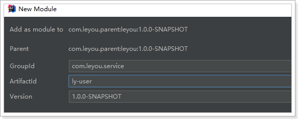

位置：

 

pom:

```xml
<?xml version="1.0" encoding="UTF-8"?>
<project xmlns="http://maven.apache.org/POM/4.0.0"
         xmlns:xsi="http://www.w3.org/2001/XMLSchema-instance"
         xsi:schemaLocation="http://maven.apache.org/POM/4.0.0 http://maven.apache.org/xsd/maven-4.0.0.xsd">
    <parent>
        <artifactId>leyou</artifactId>
        <groupId>com.leyou.parent</groupId>
        <version>1.0.0-SNAPSHOT</version>
    </parent>
    <modelVersion>4.0.0</modelVersion>

    <groupId>com.leyou.service</groupId>
    <artifactId>ly-user</artifactId>
    <!--父Mudole打包方式为pom-->
    <packaging>pom</packaging>

</project>
```


## 1.2.创建ly-user-interface

创建module：

 

 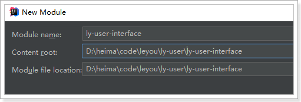


## 1.3.创建ly-user-service

创建module

 

 

pom

```xml
<?xml version="1.0" encoding="UTF-8"?>
<project xmlns="http://maven.apache.org/POM/4.0.0"
         xmlns:xsi="http://www.w3.org/2001/XMLSchema-instance"
         xsi:schemaLocation="http://maven.apache.org/POM/4.0.0 http://maven.apache.org/xsd/maven-4.0.0.xsd">
    <parent>
        <artifactId>ly-user</artifactId>
        <groupId>com.leyou.service</groupId>
        <version>1.0.0-SNAPSHOT</version>
    </parent>
    <modelVersion>4.0.0</modelVersion>

    <groupId>com.leyou.service</groupId>
    <artifactId>ly-user-service</artifactId>

    <dependencies>
        <dependency>
            <groupId>org.springframework.boot</groupId>
            <artifactId>spring-boot-starter-web</artifactId>
        </dependency>
        <dependency>
            <groupId>org.springframework.cloud</groupId>
            <artifactId>spring-cloud-starter-netflix-eureka-client</artifactId>
        </dependency>
        <!-- 通用Mapper启动器 -->
        <dependency>
            <groupId>tk.mybatis</groupId>
            <artifactId>mapper-spring-boot-starter</artifactId>
        </dependency>
        <!-- mysql驱动 -->
        <dependency>
            <groupId>mysql</groupId>
            <artifactId>mysql-connector-java</artifactId>
        </dependency>
        <dependency>
            <groupId>com.leyou.service</groupId>
            <artifactId>ly-user-interface</artifactId>
            <version>${leyou.latest.version}</version>
        </dependency>
    </dependencies>
</project>
```


启动类

```java
package com.leyou;

@SpringBootApplication
@EnableDiscoveryClient //Eureka
@MapperScan("com.leyou.user.mapper") //通用mapper
public class LyUserApplication {
    public static void main(String[] args) {
        SpringApplication.run(LyUserApplication.class,args);
    }
}
```

创建com.leyou.user.mapper包

 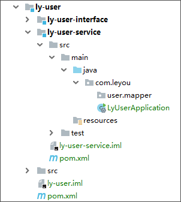


配置：

```yaml
server:
  port: 8087
spring:
  application:
    name: user-service
  datasource:
    url: jdbc:mysql://127.0.0.1:3306/yun6
    username: root
    password: 123456
    driver-class-name: com.mysql.jdbc.Driver
eureka:
  client:
    service-url:
      defaultZone: http://127.0.0.1:10086/eureka
  instance:
    prefer-ip-address: true
    ip-address: 127.0.0.1
    #instance-id: ${eureka.instance.ip-address}.${server.port}
    #lease-renewal-interval-in-seconds: 3
    #lease-expiration-duration-in-seconds: 10

mybatis:
  type-aliases-package: com.leyou.user.pojo
```

创建com.leyou.item.pojo包

 


父工程ly-user的pom：

```xml
<?xml version="1.0" encoding="UTF-8"?>
<project xmlns="http://maven.apache.org/POM/4.0.0"
         xmlns:xsi="http://www.w3.org/2001/XMLSchema-instance"
         xsi:schemaLocation="http://maven.apache.org/POM/4.0.0 http://maven.apache.org/xsd/maven-4.0.0.xsd">
    <parent>
        <artifactId>leyou</artifactId>
        <groupId>com.leyou.parent</groupId>
        <version>1.0.0-SNAPSHOT</version>
    </parent>
    <modelVersion>4.0.0</modelVersion>

    <groupId>com.leyou.service</groupId>
    <artifactId>ly-user</artifactId>
    <!--父Module打包方式为pom-->
    <packaging>pom</packaging>
    <modules>
        <module>ly-user-interface</module>
        <module>ly-user-service</module>
    </modules>

</project>
```


## 1.4.添加网关路由

我们修改`ly-gateway`，添加路由规则，对`ly-user-service`进行路由:

 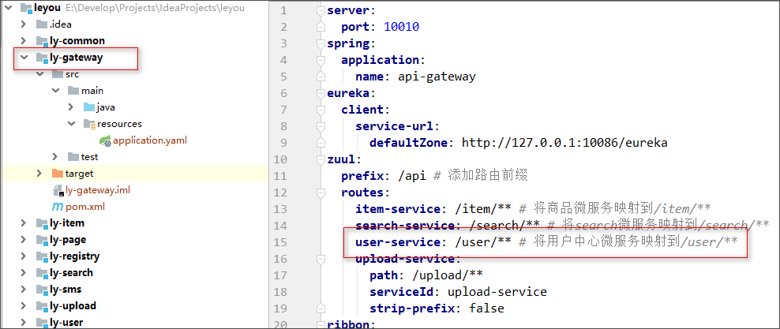


# 2.后台功能准备

## 2.1.接口文档

 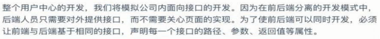

现在假设项目经理已经设计好了接口文档，详见：《用户中心接口说明.md》


我们将根据文档直接编写后台功能，不关心页面实现。


## 2.2.数据结构

```mysql
CREATE TABLE `tb_user` (
  `id` bigint(20) NOT NULL AUTO_INCREMENT,
  `username` varchar(50) NOT NULL COMMENT '用户名',
  `password` varchar(32) NOT NULL COMMENT '密码，加密存储',
  `phone` varchar(20) DEFAULT NULL COMMENT '注册手机号',
  `created` datetime NOT NULL COMMENT '创建时间',
  `salt` varchar(32) NOT NULL COMMENT '密码加密的salt值',
  PRIMARY KEY (`id`),
  UNIQUE KEY `username` (`username`) USING BTREE
) ENGINE=InnoDB AUTO_INCREMENT=28 DEFAULT CHARSET=utf8 COMMENT='用户表';
```

数据结构比较简单，因为根据用户名查询的频率较高，所以我们给用户名创建了索引

## 2.3.基本代码

在ly-user-interface中引入依赖：

```xml
<?xml version="1.0" encoding="UTF-8"?>
<project xmlns="http://maven.apache.org/POM/4.0.0"
         xmlns:xsi="http://www.w3.org/2001/XMLSchema-instance"
         xsi:schemaLocation="http://maven.apache.org/POM/4.0.0 http://maven.apache.org/xsd/maven-4.0.0.xsd">
    <parent>
        <artifactId>ly-user</artifactId>
        <groupId>com.leyou.service</groupId>
        <version>1.0.0-SNAPSHOT</version>
    </parent>
    <modelVersion>4.0.0</modelVersion>

    <groupId>com.leyou.service</groupId>
    <artifactId>ly-user-interface</artifactId>

    <dependencies>
        <!--通用mapper的包-->
        <dependency>
            <groupId>tk.mybatis</groupId>
            <artifactId>mapper-core</artifactId>
            <version>1.0.4</version>
        </dependency>
        <!--jackson-->
        <dependency>
            <groupId>com.fasterxml.jackson.core</groupId>
            <artifactId>jackson-annotations</artifactId>
            <version>2.9.0</version>
            <scope>compile</scope>
        </dependency>
    </dependencies>
</project>

```


### 实体类

```java
@Table(name = "tb_user")
@Data
public class User {
    @Id
    @GeneratedValue(strategy = GenerationType.IDENTITY)
    private Long id;

    private String username;// 用户名

    @JsonIgnore  //不想向外暴露的属性
    private String password;// 密码

    private String phone;// 电话

    private Date created;// 创建时间

    @JsonIgnore
    private String salt;// 密码的盐值
}
```

注意：为了安全考虑。这里对password和salt添加了注解@JsonIgnore，这样在json序列化时，就不会把password和salt返回。


### mapper

```java
package com.leyou.user.mapper;

public interface UserMapper extends Mapper<User> {
}

```


### Service

```java
package com.leyou.user.service;

@Service
public class UserService {

    @Autowired
    private UserMapper userMapper;
}
```

### controller

```java
package com.leyou.user.web;

@RestController
public class UserController {
    
    @Autowired
    private UserService userService;
}

```

### 目录结构

 


# 3.数据验证功能

## 3.1.接口说明：

实现用户数据的校验，主要包括对：手机号、用户名的唯一性校验。

### 接口路径

```
GET /check/{data}/{type}
```

### 参数说明：

| 参数 | 说明                                   | 是否必须 | 数据类型 | 默认值 |
| ---- | -------------------------------------- | -------- | -------- | ------ |
| data | 要校验的数据                           | 是       | String   | 无     |
| type | 要校验的数据类型：1，用户名；2，手机； | 否       | Integer  | 无     |

### 返回结果：

返回布尔类型结果：

- true：可用
- false：不可用

状态码：

- 200：校验成功
- 400：参数有误
- 500：服务器内部异常


## 3.2.controller

因为有了接口，我们可以不关心页面，所有需要的东西都一清二楚：

- 请求方式：GET
- 请求路径：/check/{param}/{type}
- 请求参数：param,type
- 返回结果：true或false

```java
package com.leyou.user.web;

@RestController
public class UserController {

    @Autowired
    private UserService userService;

    /**
     * 校验数据是否可用
     * @param data
     * @param type
     * @return
     */
    @GetMapping("/check/{data}/{type}")
    public ResponseEntity<Boolean> checkData(
            @PathVariable("data") String data, @PathVariable("type") Integer type){
        //因为get请求所以返回ok
        return ResponseEntity.ok(userService.checkData(data, type));
    }
}
```

## 3.3.Service

在ly-user-service导入包

```
        <dependency>
            <groupId>com.leyou.common</groupId>
            <artifactId>ly-common</artifactId>
            <version>1.0.0-SNAPSHOT</version>
        </dependency>
```


```java
package com.leyou.user.service;

@Service
public class UserService {

    @Autowired
    private UserMapper userMapper;

    public Boolean checkData(String data, Integer type) {
        //判断数据类型
        User record = new User();
        switch (type){
            case 1:
                record.setUsername(data);
                break;
            case 2:
                record.setPhone(data);
                break;
            default:
                throw new LyException(ExceptionEnum.INVALID_USER_DATA_TYPE);
        }
        return userMapper.selectCount(record) == 0;
    }
}
```

## 3.4.测试

我们在数据库插入一条假数据：

 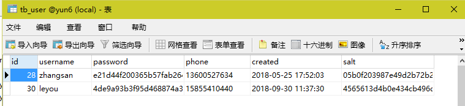

然后在浏览器调用接口，测试：

 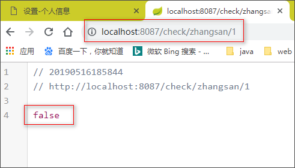

 

 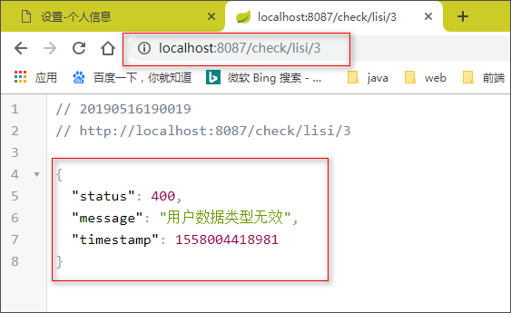


# 4.发送短信功能

短信微服务已经准备好，我们就可以继续编写用户中心接口了。

## 5.1.接口说明

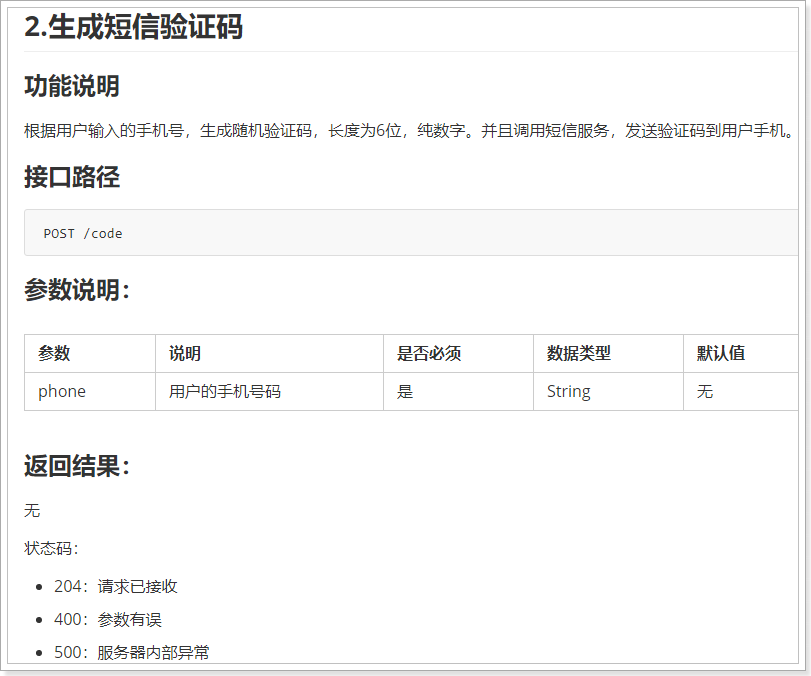


这里的业务逻辑是这样的：

- 1）我们接收页面发送来的手机号码
- 2）生成一个随机验证码
- 3）将验证码保存在服务端
- 4）发送短信，将验证码发送到用户手机


流程：前端微服务把手机号传到用户微服务，用户微服务拿到手机号以后生成验证码，并且把手机号和验证码一起发给我们的短信微服务，短信微服务发送短信到用户手机。


那么问题来了：验证码保存在哪里呢？

验证码有一定有效期，一般是5分钟，我们可以利用Redis的过期机制来保存。


## 5.3.controller

```java
package com.leyou.user.web;

@RestController
public class UserController {

    @Autowired
    private UserService userService;

    /**
     * 校验数据是否可用
     * @param data
     * @param type
     * @return
     */
    @GetMapping("/check/{data}/{type}")
    public ResponseEntity<Boolean> checkData(
            @PathVariable("data") String data, @PathVariable("type") Integer type){
        //因为get请求所以返回ok
        return ResponseEntity.ok(userService.checkData(data, type));
    }
【1】
    /**
     * 发送短信验证码
     * @param phone
     * @return
     */
    @PostMapping("code")
    public ResponseEntity<Void> sendCode(@RequestParam("phone") String phone){
        userService.sendCode(phone);
        //build()表示无返回值
        return ResponseEntity.status(HttpStatus.NO_CONTENT).build();
    }
    【1】
}

```

## 5.4.service

这里的逻辑会稍微复杂：

- 生成随机验证码
- 将验证码保存到Redis中，用来在注册的时候验证
- 发送验证码到`ly-sms`服务，发送短信

因此，我们需要引入Redis和AMQP：在ly-user-service中

```xml
<dependency>
    <groupId>org.springframework.boot</groupId>
    <artifactId>spring-boot-starter-data-redis</artifactId>
</dependency>
<dependency>
    <groupId>org.springframework.boot</groupId>
    <artifactId>spring-boot-starter-amqp</artifactId>
</dependency>
```

添加RabbitMQ和Redis配置：

```yaml
server:
  port: 8087
spring:
  application:
    name: user-service
  datasource:
    url: jdbc:mysql://127.0.0.1:3306/yun6
    username: root
    password: 123456
    driver-class-name: com.mysql.jdbc.Driver
    【1】
  rabbitmq:
    host: 192.168.1.128
    username: leyou
    password: leyou
    virtual-host: /leyou
  redis:
    host: 192.168.1.128
    【1】
eureka:
  client:
    service-url:
      defaultZone: http://127.0.0.1:10086/eureka
  instance:
    prefer-ip-address: true
    ip-address: 127.0.0.1
    #instance-id: ${eureka.instance.ip-address}.${server.port}
    #lease-renewal-interval-in-seconds: 3
    #lease-expiration-duration-in-seconds: 10
mybatis:
  type-aliases-package: com.leyou.user.pojo
  【2】
#抽取的配置文件
ly:
  user:
    exchange: ly.sms.exchange #发送短信交换机
    routingKey: sms.verify.code #发送短信的routingKey
    timeout: 5  #发送短信成功后，保存到redis,指定生存时间为5分钟
  【2】
```


另外还要用到工具类，生成6位随机码，这个我们封装到了`ly-common`中，因此需要引入依赖：

```xml
<dependency>
    <groupId>com.leyou.common</groupId>
    <artifactId>ly-common</artifactId>
    <version>${leyou.latest.version}</version>
</dependency>
```

生成随机码的工具：（直接调用工具类即可，0~10位）

```java
/**
 * 生成指定位数的随机数字
 * @param len 随机数的位数
 * @return 生成的随机数
 */
public static String generateCode(int len){
    len = Math.min(len, 8);
    int min = Double.valueOf(Math.pow(10, len - 1)).intValue();
    int num = new Random().nextInt(
        Double.valueOf(Math.pow(10, len + 1)).intValue() - 1) + min;
    return String.valueOf(num).substring(0,len);
}
```


Service代码：

```java
package com.leyou.user.service;

@Service
@EnableConfigurationProperties(UserProperties.class)
public class UserService {

    @Autowired
    private UserMapper userMapper;

    @Autowired
    private AmqpTemplate amqpTemplate;

    @Autowired
    private StringRedisTemplate redisTemplate;

    @Autowired
    private UserProperties prop;

    //生成user服务中phone的前缀
    private static final String KEY_PREFIX = "user:verify:phone:";

    public Boolean checkData(String data, Integer type) {
        //判断数据类型
        User record = new User();
        switch (type){
            case 1:
                record.setUsername(data);
                break;
            case 2:
                record.setPhone(data);
                break;
            default:
                throw new LyException(ExceptionEnum.INVALID_USER_DATA_TYPE);
        }
        return userMapper.selectCount(record) == 0;
    }
【1】
    public void sendCode(String phone) {
        //生成准备在redis中查询的key
        String key = KEY_PREFIX + phone;

        //生成验证码
        String verifyCode = NumberUtils.generateCode(6);

        Map<String, String> msg = new HashMap<>();
        msg.put("phone", phone);
        msg.put("code", verifyCode);

        //发送验证码
        amqpTemplate.convertAndSend(prop.getExchange(), prop.getRoutingKey(), msg);

        //发送短信成功后，保存到redis,指定生存时间为5分钟
        redisTemplate.opsForValue().set(key, verifyCode, prop.getTimeout(), TimeUnit.MINUTES);
    }
  【1】
}

```

注意：要设置短信验证码在Redis的缓存时间为5分钟


配置文件的抽取实体类：

```java
package com.leyou.user.config;

@Data
@ConfigurationProperties(prefix = "ly.user") //自动读取配置文件中前缀为ly.user的属性
public class UserProperties {
    private String exchange;
    private String routingKey;
    private int timeout;
}
```


## 目录结构：

 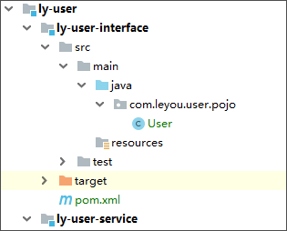

 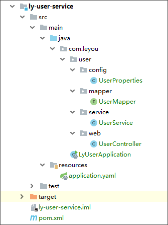


## 5.5.测试：OK

通过Insomnia发送请求试试：

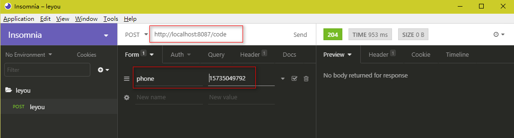

查看IDEA控制台：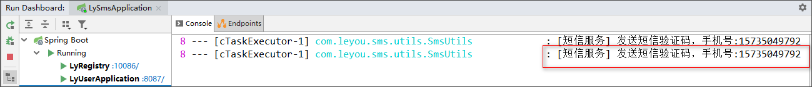


查看Redis中的数据：

==生产环境中切记**不能**使用keys *==

 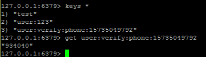

查看短信：

 手机收到的短信验证码为：934040


# 5.注册功能

## 6.1.接口说明

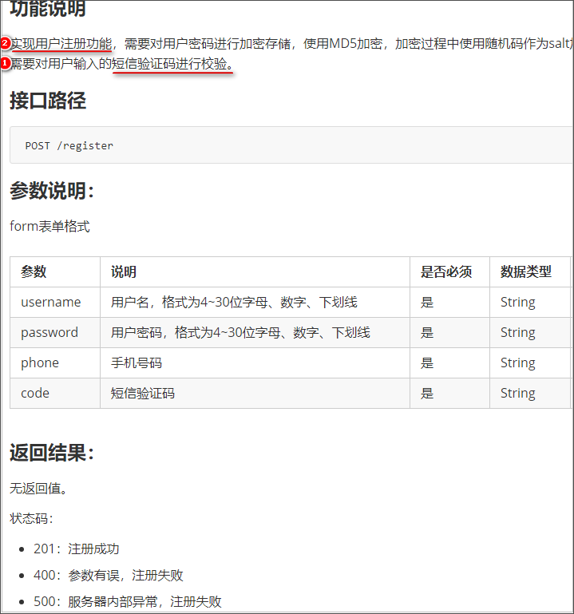

## 6.2.controller

```java
    /**
     * 注册
     * @param user
     * @param code
     * @return
     */
    @PostMapping("register")        //code是另外加的参数
    public ResponseEntity<Void> register(User user, @RequestParam("code") String code){
        userService.register(user, code);
        return ResponseEntity.status(HttpStatus.CREATED).build();
    }
```

## 6.3.service

引入MD5加密依赖

```
      <dependency>
          <groupId>commons-codec</groupId>
          <artifactId>commons-codec</artifactId>
      </dependency>
```


基本逻辑：

- 1）从redis中取出验证码

- 2）校验验证码

- 3）生成盐

- 4）保存盐到user，为了用户下次登录校验密码

- 5）对密码加密（MD5），加密后的密码保存到user

- 6）补充user其它字段(id可以自增长，所以不需要补充)，将user写入数据库

  

```java
    public void register(User user, String code) {
        //从redis中取出验证码
        String cacheCode = redisTemplate.opsForValue().get(KEY_PREFIX + user.getPhone());

        //校验验证码
        if (!StringUtils.equals(code, cacheCode)){
            throw new LyException(ExceptionEnum.INVALID_VERIFY_CODE);
        }

        //生成盐
        String salt = CodecUtils.generateSalt();
        //保存盐到user，为了用户下次登录校验密码
        user.setSalt(salt);

        //对密码加密（MD5），加密后的密码保存到user
        user.setPassword(CodecUtils.md5Hex(user.getPassword(), salt));

        //补充user其它字段(id可以自增长，所以不需要补充)，将user写入数据库
        user.setCreated(new Date());
        userMapper.insert(user);
    }
```

## 6.4.测试

注册页面填写信息测试（手机收到的验证码为545442）

 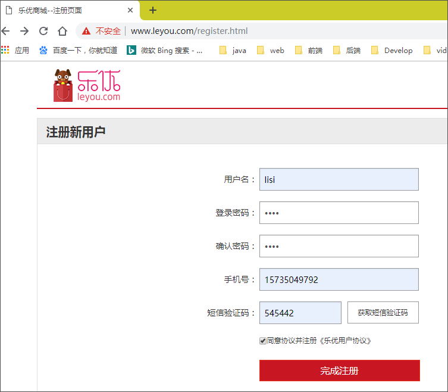

查看数据库：

 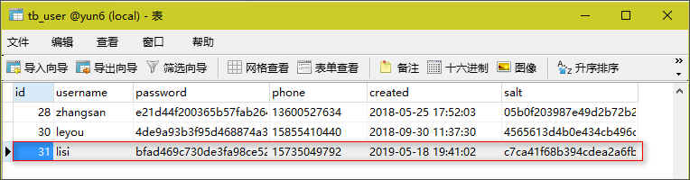

查看redis

 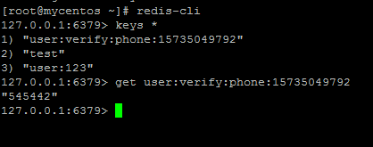


## 6.5.服务端数据校验

刚才虽然实现了注册，但是服务端并没有进行数据校验，而前端的校验是很容易被有心人绕过的。所以我们必须在后台添加数据校验功能：

我们这里会使用Hibernate-Validator框架完成数据校验：

而SpringBoot的web启动器中已经集成了相关依赖：

 

### 6.5.1.什么是Hibernate Validator

Hibernate Validator是Hibernate提供的一个开源框架，使用注解方式非常方便的实现服务端的数据校验。

官网：http://hibernate.org/validator/


**hibernate Validator** 是 Bean Validation 的参考实现 。

Hibernate Validator 提供了 JSR 303 规范中所有内置 constraint（约束） 的实现，除此之外还有一些附加的 constraint。

在日常开发中，Hibernate Validator经常用来验证bean的字段，基于注解，方便快捷高效。

### 6.5.2.Bean校验的注解

常用注解如下：

| **Constraint**                                     | **详细信息**                                                 |
| -------------------------------------------------- | ------------------------------------------------------------ |
| **@Valid**                                         | 被注释的元素是一个对象，需要检查此对象的所有字段值           |
| **@Null**                                          | 被注释的元素必须为 null                                      |
| **@NotNull**                                       | 被注释的元素必须不为 null                                    |
| **@AssertTrue**                                    | 被注释的元素必须为 true                                      |
| **@AssertFalse**                                   | 被注释的元素必须为 false                                     |
| **@Min(value)**                                    | 被注释的元素必须是一个数字，其值必须大于等于指定的最小值     |
| **@Max(value)**                                    | 被注释的元素必须是一个数字，其值必须小于等于指定的最大值     |
| **@DecimalMin(value)**                             | 被注释的元素必须是一个数字，其值必须大于等于指定的最小值     |
| **@DecimalMax(value)**                             | 被注释的元素必须是一个数字，其值必须小于等于指定的最大值     |
| **@Size(max,   min)**                              | 被注释的元素的大小必须在指定的范围内                         |
| **@Digits   (integer, fraction)**                  | 被注释的元素必须是一个数字，其值必须在可接受的范围内         |
| **@Past**                                          | 被注释的元素必须是一个过去的日期                             |
| **@Future**                                        | 被注释的元素必须是一个将来的日期                             |
| **@Pattern(value)**                                | 被注释的元素必须符合指定的正则表达式                         |
| **@Email**                                         | 被注释的元素必须是电子邮箱地址                               |
| **@Length**                                        | 被注释的字符串的大小必须在指定的范围内                       |
| **@NotEmpty**                                      | 被注释的字符串的必须非空                                     |
| **@Range**                                         | 被注释的元素必须在合适的范围内                               |
| **@NotBlank**                                      | 被注释的字符串的必须非空                                     |
| **@URL(protocol=,host=,   port=,regexp=, flags=)** | 被注释的字符串必须是一个有效的url                            |
| **@CreditCardNumber**                              | 被注释的字符串必须通过Luhn校验算法，银行卡，信用卡等号码一般都用Luhn计算合法性 |

### 6.5.3.给User添加校验

我们在`ly-user-interface`中添加Hibernate-Validator依赖：

```xml
        <dependency>
            <groupId>org.hibernate.validator</groupId>
            <artifactId>hibernate-validator</artifactId>
        </dependency>
```


我们在User对象的部分属性上添加注解：

```java
package com.leyou.user.pojo;

@Table(name = "tb_user")
@Data
public class User {
    @Id
    @KeySql(useGeneratedKeys = true)
    private Long id;

    @NotEmpty(message = "用户名不能为空")
    @Length(min = 4, max = 32, message = "用户名长度必须在4~32位")
    private String username;// 用户名


    @Length(min = 4, max = 32, message = "密码长度必须在4~32位")
    @JsonIgnore  //不想向外暴露的属性
    private String password;// 密码

    @Pattern(regexp = "^(13[0-9]|14[579]|15[0-3,5-9]|16[6]|17[0135678]|18[0-9]|19[89])\\d{8}$", message = "手机号格式不正确")
    private String phone;// 电话

    private Date created;// 创建时间

    @JsonIgnore
    private String salt;// 密码的盐值
}
```


**之前代码中的手机号都可以加上一个正则表达式校验手机号，这样代码更规范**

### 6.5.4.在controller上进行控制

在controller中只需要给User添加 @Valid注解即可。

 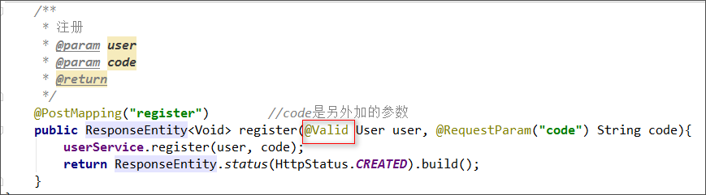


### 6.5.5.测试

我们故意填错，然后SpringMVC会自动返回错误信息：

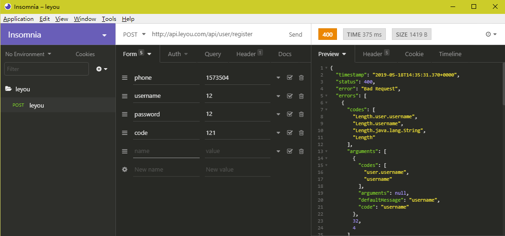

 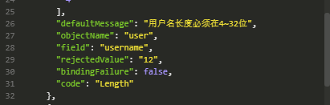

 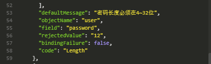

 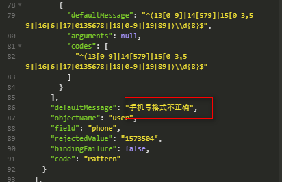


基本信息格式填对：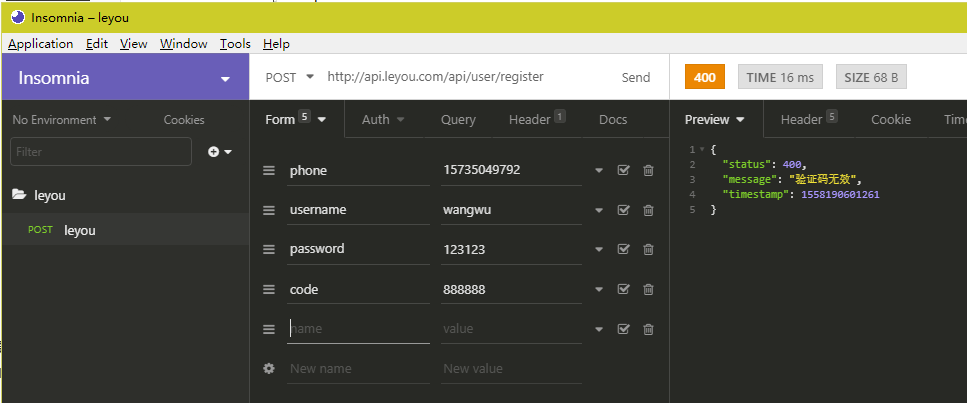


2019年5月18日22:51:55...

### 自定义返回结果(错误信息)

（处理不处理都行，目前我们不需要这样做(不需要手动处理返回结果)，因为前端已经返回了友好的错误信息。只需要给User后面添加 BindingResult result 参数即可，当springMVC看到BindingResult对象时，它就知道不需要帮你进行处理返回值了）

SpringMVC自动返回的右侧的错误信息，有些太多。如果你不想要这个结果，也可以进行自己处理，在controller中只需要给User后面添加 BindingResult result 参数即可，这样，当springMVC看到BindingResult对象时，它就知道不需要帮你进行处理返回结果了，而是你自己处理。

 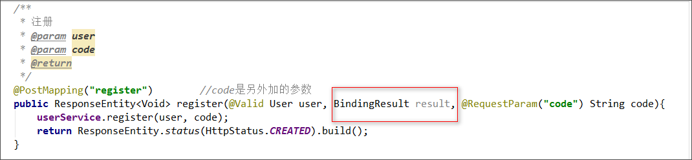


这样一来，无论User校验成功或失败，它都不会报错，都会继续进入register() 方法执行，因此我们要进行手动进行判断。

controller

```java
/**
     * 注册
     * @param user
     * @param code
     * @return
     */
    @PostMapping("register")        //code是另外加的参数
    public ResponseEntity<Void> register(@Valid User user, BindingResult result, @RequestParam("code") String code){
        /*
        if (result.hasFieldErrors()){
                //getFieldErrors()得到的是一个List，所以我们用stream()进行处理。getDefaultMessage()中的
                //DefaultMessage就是我们在User中加的message。然后我们进行收集，collect(Collectors.joining())
                //会把一个集合自动转为字符串，这儿自定义的分隔符为"|" 。
            throw new RuntimeException(result.getFieldErrors().stream()
                    .map(e -> e.getDefaultMessage()).collect(Collectors.joining("|")));
        }
        */
        userService.register(user, code);
        return ResponseEntity.status(HttpStatus.CREATED).build();
    }
```


测试：

 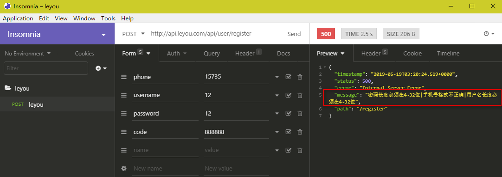

只不过异常对象还不是我们的对象，如果返回我们自己的对象，可以返回LyException。

目前我们不需要这样做，因为前端已经返回了友好的错误信息。


# 6.根据用户名和密码查询用户

## 7.1.接口说明

### 功能说明

查询功能，根据参数中的用户名和密码查询指定用户（为登录做准备）

### 接口路径

```
GET /query
```

### 参数说明：

form表单格式

| 参数     | 说明                                     | 是否必须 | 数据类型 | 默认值 |
| -------- | ---------------------------------------- | -------- | -------- | ------ |
| username | 用户名，格式为4~30位字母、数字、下划线   | 是       | String   | 无     |
| password | 用户密码，格式为4~30位字母、数字、下划线 | 是       | String   | 无     |

### 返回结果：

用户的json格式数据（等同于返回一个对象，对象自然就变成json了，springMVC会自动帮我们把对象序列化成json，那也就是说返回结果其实就是一个用户的对象，这儿是User对象）

```json
{
    "id": 6572312,
    "username":"test",
    "phone":"13688886666",
    "created": 1342432424
}
```


状态码：

- 200：注册成功
- 400：用户名或密码错误
- 500：服务器内部异常，注册失败

## 7.2.controller

```java
package com.leyou.user.web;

import com.leyou.user.pojo.User;
import com.leyou.user.service.UserService;
import org.springframework.beans.factory.annotation.Autowired;
import org.springframework.http.HttpStatus;
import org.springframework.http.ResponseEntity;
import org.springframework.validation.BindingResult;
import org.springframework.web.bind.annotation.*;

import javax.validation.Valid;
import java.util.stream.Collectors;

@RestController
public class UserController {

    @Autowired
    private UserService userService;

    /**
     * 校验数据是否可用
     * @param data
     * @param type
     * @return
     */
    @GetMapping("/check/{data}/{type}")
    public ResponseEntity<Boolean> checkData(
            @PathVariable("data") String data, @PathVariable("type") Integer type){
        //因为get请求所以返回ok
        return ResponseEntity.ok(userService.checkData(data, type));
    }

    /**
     * 发送短信验证码
     * @param phone
     * @return
     */
    @PostMapping("code")
    public ResponseEntity<Void> sendCode(@RequestParam("phone") String phone){
        userService.sendCode(phone);
        //build()表示无返回值
        return ResponseEntity.status(HttpStatus.NO_CONTENT).build();
    }

    /**
     * 注册
     * @param user
     * @param code
     * @return
     */
    @PostMapping("register")        //code是另外加的参数
    public ResponseEntity<Void> register(@Valid User user, BindingResult result, @RequestParam("code") String code){
        /*
        if (result.hasFieldErrors()){
                //getFieldErrors()得到的是一个List，所以我们用stream()进行处理。getDefaultMessage()中的
                //DefaultMessage就是我们在User中加的message。然后我们进行收集，collect(Collectors.joining())
                //会把一个集合自动转为字符串，这儿自定义的分隔符为"|" 。
            throw new RuntimeException(result.getFieldErrors().stream()
                    .map(e -> e.getDefaultMessage()).collect(Collectors.joining("|")));
        }
        */
        userService.register(user, code);
        return ResponseEntity.status(HttpStatus.CREATED).build();
    }
【1】
    /**
     * 根据用户名密码查询用户
     * @param username
     * @param password
     * @return
     */
    @GetMapping("/query")
    public ResponseEntity<User> queryUserByUsernameAndPassword(
            @RequestParam("username") String username,
            @RequestParam("password") String password
    ){
        return ResponseEntity.ok(userService.queryUserByUsernameAndPassword(username, password));
    }
    【1】
}

```

## 7.3.service

```java
package com.leyou.user.service;

@Service
@EnableConfigurationProperties(UserProperties.class)
public class UserService {

    @Autowired
    private UserMapper userMapper;

    @Autowired
    private AmqpTemplate amqpTemplate;

    @Autowired
    private StringRedisTemplate redisTemplate;

    @Autowired
    private UserProperties prop;

    //生成user服务中phone的前缀
    private static final String KEY_PREFIX = "user:verify:phone:";

    public Boolean checkData(String data, Integer type) {
        //判断数据类型
        User record = new User();
        switch (type){
            case 1:
                record.setUsername(data);
                break;
            case 2:
                record.setPhone(data);
                break;
            default:
                throw new LyException(ExceptionEnum.INVALID_USER_DATA_TYPE);
        }
        return userMapper.selectCount(record) == 0;
    }

    public void sendCode(String phone) {
        //生成准备在redis中查询的key
        String key = KEY_PREFIX + phone;

        //生成验证码
        String verifyCode = NumberUtils.generateCode(6);

        Map<String, String> msg = new HashMap<>();
        msg.put("phone", phone);
        msg.put("code", verifyCode);

        //发送验证码
        amqpTemplate.convertAndSend(prop.getExchange(), prop.getRoutingKey(), msg);

        //发送短信成功后，保存到redis,指定生存时间为5分钟
        redisTemplate.opsForValue().set(key, verifyCode, prop.getTimeout(), TimeUnit.MINUTES);
    }

    public void register(User user, String code) {
        //从redis中取出验证码
        String cacheCode = redisTemplate.opsForValue().get(KEY_PREFIX + user.getPhone());

        //校验验证码
        if (!StringUtils.equals(code, cacheCode)){
            throw new LyException(ExceptionEnum.INVALID_VERIFY_CODE);
        }

        //生成盐
        String salt = CodecUtils.generateSalt();
        //保存盐到user，为了用户下次登录校验密码
        user.setSalt(salt);

        //对密码加密（MD5），加密后的密码保存到user
        user.setPassword(CodecUtils.md5Hex(user.getPassword(), salt));

        //补充user其它字段(id可以自增长，所以不需要补充)，将user写入数据库
        user.setCreated(new Date());
        userMapper.insert(user);
    }
【1】
    public User queryUserByUsernameAndPassword(String username, String password) {
        //查询用户(这里只根据username查询最好，以为无法同时使用password查询)
        User record = new User();
        record.setUsername(username);
        User user = userMapper.selectOne(record);

        //校验用户是否存在
        if (user == null) {
            throw new LyException(ExceptionEnum.INVALID_USERNAME_PASSWORD);
        }

        //用户存在，然后校验密码
        if (!StringUtils.equals(user.getPassword(), CodecUtils.md5Hex(password, user.getSalt()))){
            throw new LyException(ExceptionEnum.INVALID_USERNAME_PASSWORD);
        }

        //用户名和密码正确，返回用户
        return user;
    }
    【1】
}

```

要注意，查询时也要对密码进行加密后判断是否一致。

## 7.4.测试

数据库中：

 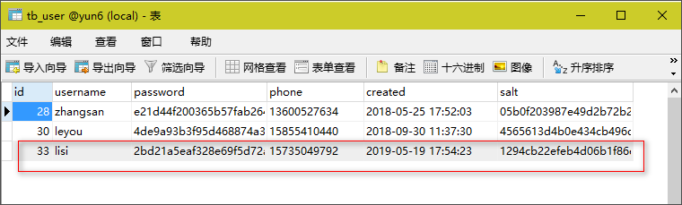

我们通过浏览器测试：正确输入用户信息

 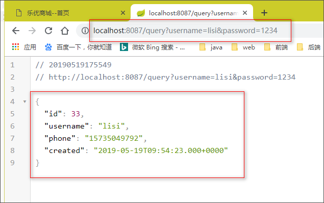

 故意输错密码：

 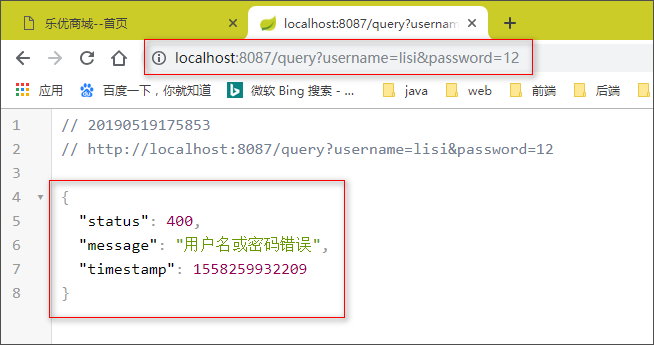


# 7.在注册页进行测试

在注册页填写信息：

 

提交发现页面自动跳转到了登录页，查看数据库：

 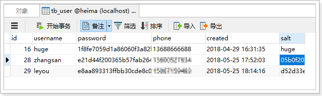

注册功能完成。


