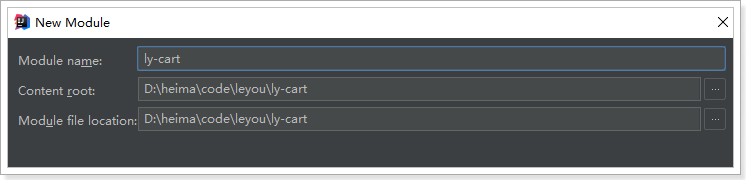
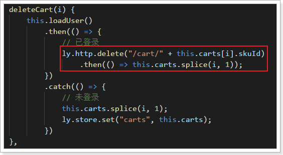

# Table of Contents

* [0.学习目标](#0学习目标)
* [1.购物车功能分析](#1购物车功能分析)
  * [2.1.需求](#21需求)
  * [2.2.业务分析](#22业务分析)
  * [2.3.流程图：](#23流程图：)
* [2.未登录购物车](#2未登录购物车)
  * [3.1.准备](#31准备)
    * [3.1.1购物车的数据结构](#311购物车的数据结构)
    * [3.1.2.web本地存储](#312web本地存储)
      * [什么是web本地存储？](#什么是web本地存储？)
      * [LocalStorage的用法](#localstorage的用法)
    * [3.1.3.获取num](#313获取num)
  * [3.2.添加购物车](#32添加购物车)
    * [3.2.1.点击事件](#321点击事件)
    * [3.2.2.获取数量，添加购物车](#322获取数量，添加购物车)
  * [3.3.查询购物车](#33查询购物车)
    * [3.3.1.校验用户登录](#331校验用户登录)
    * [3.3.2.查询购物车](#332查询购物车)
    * [3.5.2.渲染到页面](#352渲染到页面)
  * [3.6.修改数量](#36修改数量)
  * [3.7.删除商品](#37删除商品)
  * [3.8.选中商品](#38选中商品)
    * [3.8.1.选中一个](#381选中一个)
    * [3.8.2.初始化全选](#382初始化全选)
    * [3.8.4.总价格](#384总价格)
  * [后端：](#后端：)
    * [controller:](#controller)
    * [Mapper：](#mapper：)
    * [service:](#service)
    * [测试：](#测试：)
* [3.搭建购物车服务](#3搭建购物车服务)
  * [1.1.创建module](#11创建module)
  * [1.2.pom依赖](#12pom依赖)
  * [1.3.配置文件](#13配置文件)
  * [1.4.启动类](#14启动类)
  * [1.5.路由](#15路由)
* [4.已登录购物车](#4已登录购物车)
  * [4.1.添加登录校验](#41添加登录校验)
    * [4.1.1.引入JWT相关依赖](#411引入jwt相关依赖)
    * [4.1.2.配置公钥](#412配置公钥)
    * [4.1.3.加载公钥](#413加载公钥)
    * [4.1.4.编写拦截器](#414编写拦截器)
    * [4.1.5.配置拦截器](#415配置拦截器)
  * [4.2.后台购物车设计](#42后台购物车设计)
    * [数据结构设计](#数据结构设计)
    * [实体类](#实体类)
  * [4.3.添加商品到购物车](#43添加商品到购物车)
    * [4.3.1.页面发起请求：](#431页面发起请求：)
    * [4.3.2.后台添加购物车](#432后台添加购物车)
      * [controller](#controller-1)
      * [Service](#service-1)
    * [4.3.3.测试：](#433测试：)
    * [当前目录结构：](#当前目录结构：)
  * [4.4.查询购物车](#44查询购物车)
    * [4.4.1.页面发起请求](#441页面发起请求)
    * [4.4.2.后台实现](#442后台实现)
    * [4.4.3.测试](#443测试)
  * [4.5.修改商品数量](#45修改商品数量)
    * [4.5.1.页面发起请求](#451页面发起请求)
    * [4.5.2.后台实现](#452后台实现)
    * [测试：](#测试：-1)
  * [4.6.删除购物车商品](#46删除购物车商品)
    * [4.6.1.页面发起请求](#461页面发起请求)
    * [4.6.2.后台实现](#462后台实现)
    * [当前目录：](#当前目录：)
    * [测试：](#测试：-2)
* [5.我的乐优->我的收藏功能（未做）](#5我的乐优-我的收藏功能（未做）)
* [6.登录后购物车合并（未做）](#6登录后购物车合并（未做）)
* [7.优惠券功能（未做）](#7优惠券功能（未做）)


# 0.学习目标

 


# 1.购物车功能分析

## 2.1.需求

需求描述：

- 用户可以在登录状态下将商品添加到购物车
  - 放入数据库
  - 放入redis（采用）
- 用户可以在未登录状态下将商品添加到购物车
  - 放入localstorage
- 用户可以使用购物车一起结算下单
- 用户可以查询自己的购物车
- 用户可以在购物车中可以修改购买商品的数量。
- 用户可以在购物车中删除商品。
- 在购物车中展示商品优惠信息
- 提示购物车商品价格变化
- 对商品结算下单


## 2.2.业务分析

 


## 2.3.流程图：


这幅图主要描述了两个功能：新增商品到购物车、查询购物车。

新增商品：

- 判断是否登录
  - 是：则添加商品到后台Redis中
  - 否：则添加商品到本地的Localstorage

无论哪种新增，完成后都需要查询购物车列表：

- 判断是否登录
  - 否：直接查询localstorage中数据并展示
  - 是：已登录，则需要先看本地是否有数据，
    - 有：需要提交到后台添加到redis，合并数据，而后查询
    - 否：直接去后台查询redis，而后返回


# 2.未登录购物车

## 3.1.准备

（我直接拷贝已经完成的cart.html购物车页面，开始做后端部分）

### 3.1.1购物车的数据结构

首先分析一下未登录购物车的数据结构。

我们看下页面展示需要什么数据：


因此每一个购物车信息，都是一个对象，包含：

```js
{
    skuId:2131241,
    title:"小米6",
    image:"",
    price:190000,
    num:1,
    ownSpec:"{"机身颜色":"陶瓷黑尊享版","内存":"6GB","机身存储":"128GB"}"
}
```

另外，购物车中不止一条数据，因此最终会是对象的数组。即：

```js
[
    {...},{...},{...}
]
```


### 3.1.2.web本地存储

知道了数据结构，下一个问题，就是如何保存购物车数据。前面我们分析过，可以使用Localstorage来实现。Localstorage是web本地存储的一种，那么，什么是web本地存储呢？

#### 什么是web本地存储？


web本地存储主要有两种方式：

- LocalStorage：localStorage 方法存储的数据没有时间限制。第二天、第二周或下一年之后，数据依然可用。 
- SessionStorage：sessionStorage 方法针对一个 session 进行数据存储。当用户关闭浏览器窗口后，数据会被删除。 


#### LocalStorage的用法

语法非常简单：

 

```js
localStorage.setItem("key","value"); // 存储数据
localStorage.getItem("key"); // 获取数据
localStorage.removeItem("key"); // 删除数据
```

注意：**localStorage和SessionStorage都只能保存字符串**。

不过，在我们的common.js中，已经对localStorage进行了简单的封装：

 


示例：

 

 

### 3.1.3.获取num

添加购物车需要知道购物的数量，所以我们需要获取数量大小。我们在Vue中定义num，保存数量：

 

然后将num与页面的input框绑定，同时给`+`和`-`的按钮绑定事件：


编写事件：

 


## 3.2.添加购物车

### 3.2.1.点击事件

我们看下商品详情页：


现在点击加入购物车会跳转到购物车成功页面。

不过我们不这么做，我们绑定点击事件，然后实现添加购物车功能。


addCart方法中判断用户的登录状态：

 


### 3.2.2.获取数量，添加购物车

```js
addCart(){
    // 判断登录状态
    ly.http.get("/auth/verify")
        .then(resp => {

    })
        .catch(() => {
        // 未登录，添加到localstorage
        // 1、查询本地购物车
        const carts = ly.store.get("carts") || [];
        let cart = carts.find(c => c.skuId === this.sku.id);
        // 2、判断是否存在
        if(cart){
            // 3、存在，改数量
            cart.num += this.num;
        }else {
            // 4、不存在，新增
            cart = {
                skuId: this.sku.id,
                title: this.sku.title,
                image: this.images[0],
                price: this.sku.price,
                num: this.num,
                ownSpec: JSON.stringify(this.ownSpec)
            };
            carts.push(cart);
        }
        // 把carts写回localstorage
        ly.store.set("carts", carts);

        // 跳转
        window.location.href = "http://www.leyou.com/cart.html";
    });
}
```

结果：

 

添加完成后，页面会跳转到购物车结算页面：cart.html


## 3.3.查询购物车

### 3.3.1.校验用户登录

因为会多次校验用户登录状态，因此我们封装一个校验的方法：

在common.js中：

 


### 3.3.2.查询购物车

页面加载时，就应该去查询购物车。

```java
var cartVm = new Vue({
    el: "#cartApp",
    data: {
        ly,
        carts: [],// 购物车数据
    },
    created() {
        this.loadCarts();
    },
    methods: {
        loadCarts() {
            // 先判断登录状态
            ly.verifyUser()
                .then(() => {
                    // 已登录

                })
                .catch(() => {
                    // 未登录
                    this.carts = ly.store.get("carts") || [];
                    this.selected = this.carts;
                })
                }
    }
    components: {
        shortcut: () => import("/js/pages/shortcut.js")
    }
})
```

刷新页面，查看控制台Vue实例：

 


### 3.5.2.渲染到页面

接下来，我们在页面中展示carts的数据：

页面位置：

 


修改后：


要注意，价格的展示需要进行格式化，这里使用的是我们在common.js中定义的formatPrice方法：

 


效果：


## 3.6.修改数量

我们给页面的 `+` 和 `-`绑定点击事件，修改num 的值：


两个事件：

```js
increment(c) {
    c.num++;
    ly.verifyUser()
        .then(() => {
            // TODO 已登录，向后台发起请求
        })
        .catch(() => {
            // 未登录，直接操作本地数据
            ly.store.set("carts", this.carts);
    })
},
decrement(c) {
    if (c.num <= 1) {
        return;
    }
    c.num--;
    this.verifyUser()
        .then(() => {
        // TODO 已登录，向后台发起请求
        })
        .catch(() => {
            // 未登录，直接操作本地数据
            ly.store.set("carts", this.carts);
        })
},
```


## 3.7.删除商品

给删除按钮绑定事件：

 


点击事件中删除商品：

```js
deleteCart(i) {
    this.verifyUser()
        .then(() => {
            // 已登录
        })
        .catch(() => {
            // 未登录
            this.carts.splice(i, 1);
            ly.store.set("carts", this.carts);
        })
}
```


## 3.8.选中商品

在页面中，每个购物车商品左侧，都有一个复选框，用户可以选择部分商品进行下单，而不一定是全部：

 

我们定义一个变量，记录所有被选中的商品：

 


### 3.8.1.选中一个

我们给商品前面的复选框与selected绑定，并且指定其值为当前购物车商品：


### 3.8.2.初始化全选

我们在加载完成购物车查询后，初始化全选：

 


### 3.8.4.总价格

然后编写一个计算属性，计算出选中商品总价格：

```js
computed: {
    totalPrice() {
        return this.selected.map(c => c.num * c.price).reduce((p1, p2) => p1 + p2, 0);
    }
}
```

在页面中展示总价格：


效果：


## 后端：

我们直接跳过前端部分，把把已经写好的item.html 页面拷贝到门户项目中，覆盖原有的item.html ， 刷新页面。选两件商品添加购物车：

查看：有一条

再选一个商品，点击添加购物车

 

查看：

 

刷新刚才的购物车页面，发现挂了，我们添加的两款手机并没有显示出来！

 

 

点击上面的状态码为404的请求：我们去实现它。

 


### controller:

找到item商品微服务的GoodsController

```java
 /**
     * 根据sku的id集合查询所有sku
     * @param ids
     * @return
     */
    @GetMapping("/sku/list/ids")
    public ResponseEntity<List<Sku>> querySkuBySpuId(@RequestParam("ids") List<Long> ids){
        return ResponseEntity.ok(goodsService.querySkuByIds(ids));
    }
```


### Mapper：

我们先去把SkuMapper继承我们自己写好的BaseMapper，因为我们根据sku的id集合查询所有sku（返回的是sku的集合），只有继承了我们自己写好的BaseMapper，才能使用selectByIdList()查询方法，返回所有的sku。注意：一定要引入我们自己的BaseMapper 的包。

 


### service:

找到item商品微服务的GoodsService，查询sku的集合以后，我们还需要把库存查出来，但查询库存的代码我们之前已经写过了，这里又要用到，所以我们把之前查询库存的代码封装成一个方法调用即可。（ctrl+alt+M）

```java
 public List<Sku> querySkuByIds(List<Long> ids) {
        List<Sku> skus = skuMapper.selectByIdList(ids);
        if (CollectionUtils.isEmpty(skus)){
            throw new LyException(ExceptionEnum.GOODS_SKU_NOT_FOUND);
        }
        loadStackInSku(ids, skus);

        return skus;
    }

    /**
     * 根据sku查询库存
     * @param ids
     * @param skus
     */
    private void loadStackInSku(List<Long> ids, List<Sku> skus) {
        //查询库存
        List<Stock> stockList = stockMapper.selectByIdList(ids);
        if (CollectionUtils.isEmpty(stockList)) {
            throw new LyException(ExceptionEnum.GOODS_STOCK_NOT_FOUND);
        }
        //我们把stock变成一个map，其key是sku的id，值是库存值
        Map<Long, Integer> stockMap = stockList.stream()
                .collect(Collectors.toMap(Stock::getSkuId, Stock::getStock));
        skus.forEach(s -> s.setStock(stockMap.get(s.getId())));
    }
```


### 测试：

重启商品微服务，刷新刚才的购物车页面，Ok完美

 

 

库存也查出来了：

 

并且修改数量等功能也是OK的，JS已经全部写好了：

 

并且它是有价格变化的，我们拷贝好skuid去数据库表查询到商品，修改价格（2199改成2888，贵了）保存并刷新，再来看页面：

 

 


未登录购物车功能完成。


# 3.搭建购物车服务

## 1.1.创建module




## 1.2.pom依赖

```xml
<?xml version="1.0" encoding="UTF-8"?>
<project xmlns="http://maven.apache.org/POM/4.0.0"
         xmlns:xsi="http://www.w3.org/2001/XMLSchema-instance"
         xsi:schemaLocation="http://maven.apache.org/POM/4.0.0 http://maven.apache.org/xsd/maven-4.0.0.xsd">
    <parent>
        <artifactId>leyou</artifactId>
        <groupId>com.leyou.parent</groupId>
        <version>1.0.0-SNAPSHOT</version>
    </parent>
    <modelVersion>4.0.0</modelVersion>

    <groupId>com.leyou.service</groupId>
    <artifactId>ly-cart</artifactId>

    <dependencies>
        <dependency>
            <groupId>org.springframework.boot</groupId>
            <artifactId>spring-boot-starter-web</artifactId>
        </dependency>
        <dependency>
            <groupId>org.springframework.cloud</groupId>
            <artifactId>spring-cloud-starter-netflix-eureka-client</artifactId>
        </dependency>
        <dependency>
            <groupId>org.springframework.boot</groupId>
            <artifactId>spring-boot-starter-data-redis</artifactId>
        </dependency>
    </dependencies>
</project>
```

## 1.3.配置文件

```yaml
server:
  port: 8089
spring:
  application:
    name: cart-service
  redis:
    host: 192.168.1.128
eureka:
  client:
    service-url:
      defaultZone: http://127.0.0.1:10086/eureka
      registry-fetch-interval-seconds: 5 #拉取服务列表时长(这儿不需要调别的服务，不设置也行)
  instance:
    prefer-ip-address: true
    ip-address: 127.0.0.1
```

## 1.4.启动类

```java
package com.leyou;

@SpringBootApplication
@EnableDiscoveryClient  //eureka
public class LyCartApplication {
    public static void main(String[] args) {
        SpringApplication.run(LyCartApplication.class, args);
    }
}
```

## 1.5.路由

**加入到网关的路由里面（==注意不要忘了==）**ly-gateway

 


# 4.已登录购物车

登录，再次添加购物车，发现：报错，这是因为它发起了一次请求到后台。

 

 

 


接下来，我们完成已登录购物车。

在刚才的未登录购物车编写时，我们已经预留好了编写代码的位置，逻辑也基本一致。

## 4.1.添加登录校验

购物车系统只负责登录状态的购物车处理，因此需要添加登录校验，我们通过JWT鉴权即可实现。

### 4.1.1.引入JWT相关依赖

我们引入之前写的鉴权工具：`ly-auth-common`

```xml
        <dependency>
            <groupId>com.leyou.service</groupId>
            <artifactId>ly-auth-common</artifactId>
            <version>1.0.0-SNAPSHOT</version>
        </dependency>
        <dependency>
            <groupId>com.leyou.common</groupId>
            <artifactId>ly-common</artifactId>
            <version>1.0.0-SNAPSHOT</version>
        </dependency>
```

### 4.1.2.配置公钥

```yaml
ly:
  jwt:
    pubKeyPath: E:/auth/rsa/rsa.pub # 公钥地址
    cookieName: LY_TOKEN # cookie的名称
```

### 4.1.3.加载公钥

 

代码：

```java
package com.leyou.gateway.config;

import com.leyou.auth.utils.RsaUtils;
import lombok.Data;
import lombok.extern.slf4j.Slf4j;
import org.springframework.boot.context.properties.ConfigurationProperties;
import javax.annotation.PostConstruct;
import java.security.PublicKey;

@Data
@Slf4j
@ConfigurationProperties(prefix = "ly.jwt")
public class JwtProperties {

    private String pubKeyPath; //公钥
    private String cookieName; //cookie名称

    private PublicKey publicKey; //公钥

    //对象一旦实例化后，就应该读取公钥和私钥
    @PostConstruct //加上这个注解：构造函数执行完毕以后执行
    public void init() throws Exception {
        //读取公钥和私钥
        this.publicKey = RsaUtils.getPublicKey(pubKeyPath);
    }
}

```


### 4.1.4.编写拦截器

因为很多接口都需要进行登录，我们直接编写SpringMVC拦截器，进行统一登录校验。同时，我们还要把解析得到的用户信息保存起来，以便后续的接口可以使用。

 


我们使用线程域ThreadLocal 传递userinfo，只有在同一线程才能取到，否则根本取不到：

代码：

```java
package com.leyou.cart.interceptor;

/**
 * 解析登录用户
 */
@Slf4j
public class UserInterceptor implements HandlerInterceptor {

    private JwtProperties jwtProp;

    // 定义一个线程域，存放登录用户
    private static final ThreadLocal<UserInfo> tl = new ThreadLocal<>();

    public UserInterceptor(JwtProperties jwtProp) {
        this.jwtProp = jwtProp;
    }

    @Override
    public boolean preHandle(HttpServletRequest request, HttpServletResponse response, Object handler) {
        //获取cookie中的token
        String token = CookieUtils.getCookieValue(request, jwtProp.getCookieName());
        if (StringUtils.isBlank(token)){
            //获取token失败，说明未登录,返回403
            throw new LyException(ExceptionEnum.UN_AUTHORIZED);
        }

        try {
            //有token，解析token，证明已经登录
            UserInfo userInfo = JwtUtils.getInfoFromToken(token, jwtProp.getPublicKey());

            //将userInfo放入线程域传递
            request.setAttribute("userInfo", userInfo);

            //放行
            return true;
        } catch (Exception e) {
            log.error("[购物车服务] 解析用户身份失败", e);
            return false;
        }
    }

    @Override
    public void afterCompletion(HttpServletRequest request, HttpServletResponse response, Object handler, Exception ex) throws Exception {
        //最后用完数据一定要清空
        tl.remove();
    }
    
    //获取线程域中的userInfo
    public static UserInfo getUserInfo(){
        return tl.get();
    }
}

```

注意：

- 这里我们使用了`ThreadLocal`来存储查询到的用户信息，线程内共享，因此请求到达`Controller`后可以共享User
- 并且对外提供了静态的方法：`getUserInfo()`来获取User信息


### 4.1.5.配置拦截器

配置SpringMVC，需要写一个类MvcConfig使拦截器生效：

 

```java
package com.leyou.cart.config;

@Configuration
@EnableConfigurationProperties(JwtProperties.class)
public class MvcConfig implements WebMvcConfigurer {

    @Autowired
    private JwtProperties jwtProp;

    //添加拦截器，使拦截器生效，拦截所有路径为"/**"的请求
    @Override
    public void addInterceptors(InterceptorRegistry registry) {
        registry.addInterceptor(new UserInterceptor(jwtProp)).addPathPatterns("/**");
    }
}

```


## 4.2.后台购物车设计

### 数据结构设计

当用户登录时，我们需要把购物车数据保存到后台，可以选择保存在数据库。但是购物车是一个读写频率很高的数据。因此我们这里选择读写效率比较高的Redis作为购物车存储。

Redis有5种不同数据结构，这里选择哪一种比较合适呢？

- 首先不同用户应该有独立的购物车，因此购物车应该以用户的作为key来存储，Value是用户的所有购物车信息。这样看来基本的`k-v`结构就可以了。
- 但是，我们对购物车中的商品进行增、删、改操作，基本都需要根据商品id进行判断，为了方便后期处理，我们的购物车也应该是`k-v`结构，key是商品id，value才是这个商品的购物车信息。

综上所述，我们的购物车结构是一个双层Map：Map<String,Map<String,String>>

- 第一层Map，Key是用户id
- 第二层Map，Key是购物车中商品id，值是购物车数据

### 实体类

后台的购物车结构与前台是一样的：

```java
package com.leyou.cart.pojo;

import lombok.Data;

@Data
public class Cart {
    private Long skuId;// 商品id
    private String title;// 标题
    private String image;// 图片
    private Long price;// 加入购物车时的价格
    private Integer num;// 购买数量
    private String ownSpec;// 商品规格参数
}
```


## 4.3.添加商品到购物车

### 4.3.1.页面发起请求：

已登录情况下，向后台添加购物车：

 

**这里发起的是Json请求。那么我们后台也要以json接收。**

### 4.3.2.后台添加购物车

#### controller

先分析一下：

- 请求方式：新增，肯定是Post

- 请求路径：/cart ，这个其实是Zuul路由的路径，我们可以不管

- 请求参数：Json对象，包含skuId和num属性

  

- 返回结果：无

```java
package com.leyou.cart.web;

@RestController
public class CartController {

    @Autowired
    private CartService cartService;

    /**
     * 新增购物车
     * @param cart
     * @return
     */
    @PostMapping
    public ResponseEntity<Void> addCart(@RequestBody Cart cart){
        cartService.addCart(cart);
        return ResponseEntity.status(HttpStatus.CREATED).build();
    }
}

```

#### Service

这里我们不访问数据库，而是直接操作Redis。基本思路：

- 先查询之前的购物车数据
- 判断要添加的商品是否存在
  - 存在：则直接修改数量后写回Redis
  - 不存在：新建一条数据，然后写入Redis

代码：

```java
package com.leyou.cart.service;

@Service
public class CartService {

    @Autowired
    private StringRedisTemplate redisTemplate;

    //key的前缀
    private static final String KEY_PREFIX = "cart:user:id:";

    public void addCart(Cart cart) {
        //获取登录用户
        UserInfo userInfo = UserInterceptor.getUserInfo();
        //key
        String key = KEY_PREFIX + userInfo.getId();

        //hashKey
        String hashKey = cart.getSkuId().toString();

        //记录当前购物车的num
        Integer num = cart.getNum();
        
		//获取登录用户的所有购物车
        BoundHashOperations<String, Object, Object> operation = redisTemplate.boundHashOps(key);
        //判断当前购物车商品是否存在
        if (operation.hasKey(hashKey)) {
            //是，拿到商品，修改数量
            String json = operation.get(hashKey).toString();
            cart = JsonUtils.toBean(json, Cart.class);
            cart.setNum(cart.getNum() + num);
        }
            //写回redis(存进去是json，取出来还是json)
            operation.put(hashKey, JsonUtils.toString(cart));
    }
}

```


### 4.3.3.测试：

先登录，然后添加一个商品到购物车：

 

我们查看redis：OK

 

再添加刚才那个商品到购物车，OK，已登录购物车新增功能完成：

 


但是我们去购物车页面查看是查不到的！这是因为已登录购物车的查询功能还未完成。

 

 


### 当前目录结构：

 


 


## 4.4.查询购物车

### 4.4.1.页面发起请求

 


### 4.4.2.后台实现

> Controller

```java
    /**
     * 查询购物车列表
     *
     * @return
     */
    @GetMapping("list")
    public ResponseEntity<List<Cart>> queryCartList(){
        return ResponseEntity.ok(cartService.queryCartList());
    }
```

> Service

```java
public List<Cart> queryCartList() {
        //获取登录用户
        UserInfo userInfo = UserInterceptor.getUserInfo();
        //key
        String key = KEY_PREFIX + userInfo.getId();
        if (!redisTemplate.hasKey(key)){
            //key不存在,返回404
            throw new LyException(ExceptionEnum.CART_NOT_FOUND);
        }

        //获取登录用户的所有购物车
        BoundHashOperations<String, Object, Object> operation = redisTemplate.boundHashOps(key);

        /*
            查询购物车数据
            redis里存的key是用户id，值是一个map，这个map的key是商品id，值
            是购物车对象Cart，所以我们需要的是map的所有的值，所以用values()即可。
            List<Object> values = operation.values();我们获取到的是一个Object对象
            的集合，而我们需要的是List<Cart>，所以我们用流转换一下即可。
         */
        List<Cart> cartList = operation.values().stream()
                .map(o -> JsonUtils.toBean(o.toString(), Cart.class))
                .collect(Collectors.toList());

        return cartList;
    }
```


如果为查询到某商品，说明此商品已经下架了，所以应该提示用户：该商品已下架。然后点击“清除下跪商品”应该清除所有的已下架商品才对。（未做）

 


### 4.4.3.测试

OK


此时加入购物车和查询购物车都完成了。接下来我们做修改数量的请求，前台JS已经做了，我们来实现做后台。

 

修改数量请求参数：

 


无返回值。（增删改不怎么需要返回值）


## 4.5.修改商品数量

### 4.5.1.页面发起请求

 

在increment() 和decrement() 中，一开始就应该判断该商品的库存情况，才能修改商品的数量。之前我们已经查出了商品的库存情况（未做）

 


### 4.5.2.后台实现

> Controller

```java
    /**
     * 修改购物车的商品数量
     * @param skuId 当前商品的skuId
     * @param num 修改之后的总数量
     * @return
     */
    @PutMapping
    public ResponseEntity<Void> updateCartNum(@RequestParam("id") Long skuId, @RequestParam("num") Integer num){
        cartService.updateCartNum(skuId, num);
        return ResponseEntity.status(HttpStatus.NO_CONTENT).build();
    }
```

> Service

```java
public void updateCartNum(Long skuId, Integer num) {
        //获取登录用户
        UserInfo userInfo = UserInterceptor.getUserInfo();
        //key
        String key = KEY_PREFIX + userInfo.getId();
        //hashKey
        String hashKey = skuId.toString();

        if (!redisTemplate.hasKey(key)){
            //key表示redis中的用户，key不存在,返回404
            throw new LyException(ExceptionEnum.CART_NOT_FOUND);
        }

        //获取登录用户的所有购物车
        BoundHashOperations<String, Object, Object> operation = redisTemplate.boundHashOps(key);

        //判断是否存在,理论上讲，页面上有的商品redis中一定有。
        if (!operation.hasKey(hashKey)){
            //redis中用户的购物车中的skuId不存在,返回404
            throw new LyException(ExceptionEnum.CART_NOT_FOUND);
        }
        /*
            查询得到购物车对象,注意：skuId需要转为字符串,得到的对象再转换为字符串json类
            型，通过JsonUtils获取到Cart对象
         */
        Cart cart = JsonUtils.toBean(operation.get(hashKey).toString(), Cart.class);
        //修改最终商品数量
        cart.setNum(num);

        //写回redis, key为商品id的字符串形式，值为：将购物车对象序列化
        operation.put(hashKey, JsonUtils.toString(cart));
    }
```

### 测试：

 OK，修改数量成功.

查询redis 也没问题。


接下来我们完成删除购物车商品的请求：

 


## 4.6.删除购物车商品

### 4.6.1.页面发起请求

 

注意：后台成功响应后，要把页面的购物车中数据也删除

后面跟着一个参数：skuId

### 4.6.2.后台实现

> Controller

```java
/**
     * 根据skuId删除购物车中对应商品
     * @param skuId
     * @return
     */
    @DeleteMapping("{skuId}")
    public ResponseEntity<Void> deleteCart(@PathVariable("skuId") Long skuId){
        cartService.deleteCart(skuId);
        return ResponseEntity.status(HttpStatus.NO_CONTENT).build();
    }
```


> Service

```java
 public void deleteCart(Long skuId) {
        //获取登录用户
        UserInfo userInfo = UserInterceptor.getUserInfo();
        //key
        String key = KEY_PREFIX + userInfo.getId();
        //删除
        redisTemplate.opsForHash().delete(key, skuId.toString());
    }
```


### 当前目录：

 


### 测试：

OK，删除到只剩一个了。

  

查看redis：OK，redis中该用户只剩一个商品了。

 


# 5.我的乐优->我的收藏功能（未做）

 在购物车页面，点击“移到我的关注”，即可把此商品添加到”我的乐优“页面的“我的收藏”选项中，但要自己设计表：我的收藏表，数据结构和购物车的基本相似，但是不用存num。”我的收藏“中的数据需要存入数据库。这里面展示的是之前收藏过的所有商品。

 

 


# 6.登录后购物车合并（未做）

当跳转到购物车页面，查询购物车列表前，需要判断用户登录状态，

- 如果登录：
  - 首先检查用户的LocalStorage中是否有购物车信息，
  - 如果有，则提交到后台保存到已登录用户的redis中，
  - 清空LocalStorage(删除本地购物车)
- 如果未登录，直接查询即可

 


​	这儿视频中提示：我们在前台查询出的购物车是一个集合，发送到后台接收的时候也应该是一个集合接收，然后把商品遍历取出后，一起整，这样比较好。（也就是将这个集合发送到后台）

 	而截图中，是将购物车遍历后一 一发送到后台。

​	具体怎么操作？有待开发！


# 7.优惠券功能（未做）

​	我们这儿的优惠功能是假的，此功能并**不好做，优惠券功能应该是一个独立的微服务**，麻烦之处在于优惠的条件。

​	优惠条件有很多种：第1，用户的权限限制（哪些用户可以用，哪些用户你能用；第2，对商品的限制（哪些商品可以用，哪些商品不能用）；第3，对价格的限制（满足特定的购买条件，比如满500减免100，比如买三件商品减免100）；第4，店铺的限制（哪些店铺可用，哪些店铺不可用）。优惠的条件不一样，优惠的方案也不一样，可以打折，可以总价钱满减，可以每件商品满减。

​	优惠再加上商品的组合，你需要对这些条件进行判断，哪些优惠可以用，哪些优惠不可用。相当复杂，所以优惠券功能应该是一个独立的微服务，完成对优惠规则的定制，定制好优惠规则后，满足即可展示，不满足不展示。

​	这仅仅是展示部分，麻烦的是结算的时候，去算优惠券（比如用户组合购买了三件商品，使用了满减100的优惠券，后来用户退了其中一件，这时候优惠券该怎么算呢）这都是规则。

​	真正的业务，如果要去实现，需要考虑很多的细节。

 
