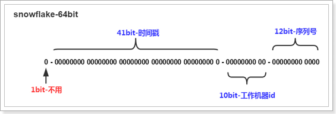
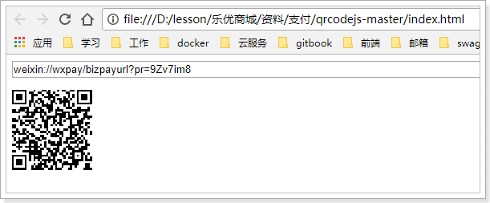
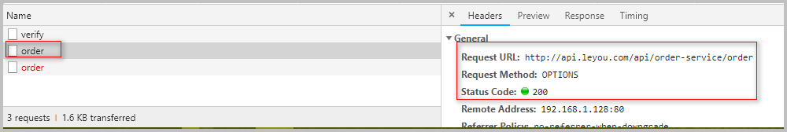
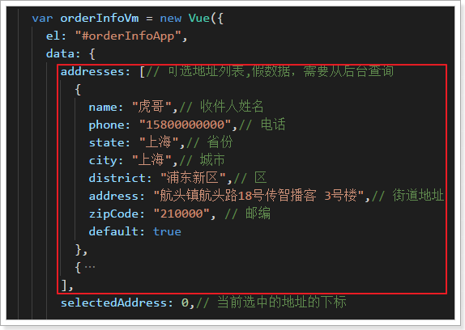
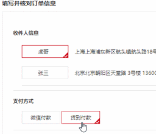
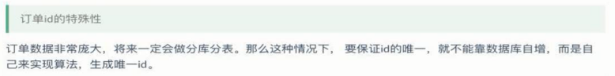
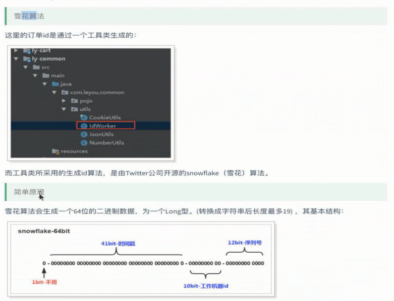
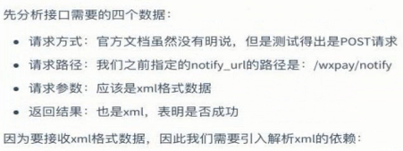
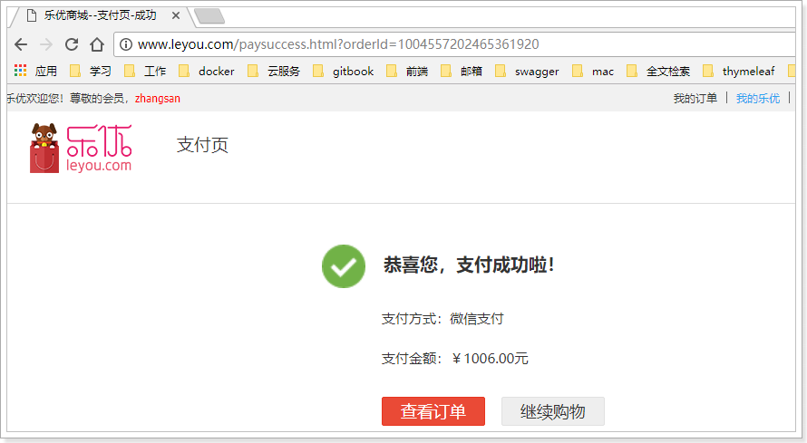

# Table of Contents

* [0.学习目标](#0学习目标)
* [1.创建订单微服务](#1创建订单微服务)
  * [1.1.搭建服务](#11搭建服务)
    * [依赖：](#依赖：)
    * [配置文件：](#配置文件：)
                    * [](#)
    * [启动类：](#启动类：)
    * [解析登录用户所需配置，实体类](#解析登录用户所需配置，实体类)
    * [配置网关：](#配置网关：)
    * [当前目录：](#当前目录：)
    * [拦截器：UserInterceptor](#拦截器：userinterceptor)
    * [MvcConfig: 使拦截器生效](#mvcconfig-使拦截器生效)
  * [1.2.数据结构：](#12数据结构：)
    * [表：](#表：)
    * [实体类：](#实体类：)
  * [1.3.测试接口](#13测试接口)
    * [1.3.1.创建订单接口](#131创建订单接口)
      * [数据准备：](#数据准备：)
      * [生成ID的方式](#生成id的方式)
      * [完整代码](#完整代码)
    * [1.3.2.查询订单接口](#132查询订单接口)
      * [接口说明：](#接口说明：)
      * [测试：](#测试：)
      * [代码：](#代码：)
    * [1.3.3.更新订单状态](#133更新订单状态)
      * [接口说明](#接口说明)
      * [测试：](#测试：-1)
      * [代码：](#代码：-1)
    * [1.3.4.分页查询订单](#134分页查询订单)
      * [接口说明](#接口说明-1)
      * [测试：](#测试：-2)
      * [代码：](#代码：-2)
    * [1.3.5.生成微信付款链接](#135生成微信付款链接)
      * [接口说明：](#接口说明：-1)
      * [测试：](#测试：-3)
      * [代码：](#代码：-3)
      * [微信支付工具](#微信支付工具)
    * [1.3.6.查询支付状态](#136查询支付状态)
      * [接口说明](#接口说明-2)
      * [代码](#代码)
      * [未付款时查询](#未付款时查询)
      * [付款](#付款)
      * [付款后查询](#付款后查询)
* [2.订单结算页](#2订单结算页)
  * [2.1.页面跳转](#21页面跳转)
    * [支付方式：](#支付方式：)
  * [2.2.收货人信息（作业）](#22收货人信息（作业）)
  * [2.3.支付方式](#23支付方式)
  * [2.4.商品清单](#24商品清单)
  * [2.4.商品列表](#24商品列表)
    * [2.4.1.购物车信息获取](#241购物车信息获取)
    * [2.4.2.页面渲染](#242页面渲染)
  * [2.5.总金额](#25总金额)
  * [2.6.提交订单](#26提交订单)
    * [参数说明：](#参数说明：)
* [3.创建订单接口](#3创建订单接口)
    * [3.1.conrtoller](#31conrtoller)
    * [3.2.mapper:](#32mapper)
    * [3.3.service:](#33service)
      * [3.2.1.生成订单编号](#321生成订单编号)
      * [3.2.2.查询sku的接口](#322查询sku的接口)
      * [3.2.3.减库存接口](#323减库存接口)
        * [测试：](#测试：-4)
        * [当前目录：](#当前目录：-1)
      * [3.2.4.准备物流假数据](#324准备物流假数据)
      * [3.2.5.创建订单代码](#325创建订单代码)
      * [3.2.6.删除购物车中已经下单商品（作业）](#326删除购物车中已经下单商品（作业）)
      * [3.2.7.订单状态枚举](#327订单状态枚举)
      * [service完整代码：](#service完整代码：)
    * [当前目录：](#当前目录：-2)
    * [3.4.测试](#34测试)
    * [3.5.为什么减库存用同步而不用异步](#35为什么减库存用同步而不用异步)
    * [2.6.1.页面提交](#261页面提交)
    * [2.6.2.精度损失问题](#262精度损失问题)
* [4.查询订单接口](#4查询订单接口)
    * [controller:](#controller)
    * [service:](#service)
    * [测试：](#测试：-5)
* [5.微信支付](#5微信支付)
  * [3.1.介绍](#31介绍)
  * [3.2.开发流程](#32开发流程)
  * [3.3.下单并生成支付链接](#33下单并生成支付链接)
    * [3.3.1.API说明](#331api说明)
    * [3.3.2.统一配置](#332统一配置)
    * [3.3.3.回调URL](#333回调url)
      * [支付工具类：](#支付工具类：)
      * [controller:](#controller-1)
      * [service:](#service-1)
      * [测试：](#测试：-6)
  * [3.3.生成二维码](#33生成二维码)
    * [4.4.4.二维码生成插件qrious](#444二维码生成插件qrious)
    * [4.4.5.生成二维码](#445生成二维码)
    * [内网穿透：](#内网穿透：)
      * [测试:](#测试)
      * [配置：](#配置：)
  * [3.4.异步回调](#34异步回调)
    * [官方API](#官方api)
    * [编写回调接口：](#编写回调接口：)
      * [然后编写controller：](#然后编写controller：)
      * [然后编写service:](#然后编写service)
      * [然后编写工具类:](#然后编写工具类)
      * [测试：](#测试：-7)
  * [3.5.订单支付状态查询](#35订单支付状态查询)
    * [3.4.1.页面循环查询支付状态](#341页面循环查询支付状态)
    * [微信查询支付状态接口：](#微信查询支付状态接口：)
    * [3.4.2.付款成功页面](#342付款成功页面)


# 0.学习目标

 


 在购物车页面点击结算按钮：

 跳到结算页面：

 选中两个商品结算， 这些信息其实是保存在Local Storage 里面了，无需去后端查询:


选中一个商品结算，结算页只有一个：


# 1.创建订单微服务

 

## 1.1.搭建服务

 

订单这种强事务类型的业务，最好使用mysql存入数据比较合适，因为订单比较重要，和钱有关系。


### 依赖：

```xml
<?xml version="1.0" encoding="UTF-8"?>
<project xmlns="http://maven.apache.org/POM/4.0.0"
         xmlns:xsi="http://www.w3.org/2001/XMLSchema-instance"
         xsi:schemaLocation="http://maven.apache.org/POM/4.0.0 http://maven.apache.org/xsd/maven-4.0.0.xsd">
    <parent>
        <artifactId>leyou</artifactId>
        <groupId>com.leyou.parent</groupId>
        <version>1.0.0-SNAPSHOT</version>
    </parent>
    <modelVersion>4.0.0</modelVersion>

    <groupId>com.leyou.service</groupId>
    <artifactId>ly-order</artifactId>

    <dependencies>
        <!--eureka-->
        <dependency>
            <groupId>org.springframework.cloud</groupId>
            <artifactId>spring-cloud-starter-netflix-eureka-client</artifactId>
        </dependency>
        <dependency>
            <groupId>org.springframework.boot</groupId>
            <artifactId>spring-boot-starter-web</artifactId>
        </dependency>
        <!--通用mapper启动器-->
        <dependency>
            <groupId>tk.mybatis</groupId>
            <artifactId>mapper-spring-boot-starter</artifactId>
        </dependency>
        <!--mysql驱动-->
        <dependency>
            <groupId>mysql</groupId>
            <artifactId>mysql-connector-java</artifactId>
        </dependency>
        <dependency>
            <groupId>com.leyou.service</groupId>
            <artifactId>ly-item-interface</artifactId>
            <version>1.0.0-SNAPSHOT</version>
        </dependency>
        <dependency>
            <groupId>com.leyou.common</groupId>
            <artifactId>ly-common</artifactId>
            <version>1.0.0-SNAPSHOT</version>
        </dependency>
        <dependency>
            <groupId>com.leyou.service</groupId>
            <artifactId>ly-auth-common</artifactId>
            <version>1.0.0-SNAPSHOT</version>
        </dependency>
        <dependency>
            <groupId>org.springframework.cloud</groupId>
            <artifactId>spring-cloud-starter-openfeign</artifactId>
        </dependency>
        <!--分页助手-->
        <dependency>
            <groupId>com.github.pagehelper</groupId>
            <artifactId>pagehelper-spring-boot-starter</artifactId>
        </dependency>
        <!--微信支付-->
        <dependency>
            <groupId>com.github.wxpay</groupId>
            <artifactId>wxpay-sdk</artifactId>
            <version>0.0.3</version>
        </dependency>
    </dependencies>
</project>
```


### 配置文件：

```yaml
server:
  port: 8090
spring:
  application:
    name: order-service
  datasource:
    url: jdbc:mysql://127.0.0.1:3306/yun6
    username: root
    password: 123456
    driver-class-name: com.mysql.jdbc.Driver
  jackson:
    default-property-inclusion: non_null
eureka:
  client:
    service-url:
      defaultZone: http://127.0.0.1:10086/eureka
    registry-fetch-interval-seconds: 5  #隔多久拉取服务列表
  instance:
    ip-address: 127.0.0.1
    prefer-ip-address: true
mybatis:
  type-aliases-package: com.leyou.order.pojo #别名扫描包
#解析登录用户所需配置
ly:
  jwt:
    pubKeyPath: E:/auth/rsa/rsa.pub # 公钥地址
    cookieName: LY_TOKEN # cookie的名称
```


### 启动类：

```java
package com.leyou;

import org.springframework.boot.SpringApplication;
import org.springframework.boot.autoconfigure.SpringBootApplication;
import org.springframework.cloud.client.discovery.EnableDiscoveryClient;
import org.springframework.cloud.openfeign.EnableFeignClients;
import tk.mybatis.spring.annotation.MapperScan;

@SpringBootApplication
@EnableDiscoveryClient
@EnableFeignClients
@MapperScan("com.leyou.order.mapper") //导入tk包
public class LyOrderApplication {
    public static void main(String[] args) {
        SpringApplication.run(LyOrderApplication.class, args);
    }
}

```


### 解析登录用户所需配置，实体类

```java
package com.leyou.order.config;

import com.leyou.auth.utils.RsaUtils;
import lombok.Data;
import lombok.extern.slf4j.Slf4j;
import org.springframework.boot.context.properties.ConfigurationProperties;

import javax.annotation.PostConstruct;
import java.security.PublicKey;

@Data
@Slf4j
@ConfigurationProperties(prefix = "ly.jwt")
public class JwtProperties {

    private String pubKeyPath; //公钥
    private String cookieName; //cookie名称

    private PublicKey publicKey; //公钥

    //对象一旦实例化后，就应该读取公钥和私钥
    @PostConstruct //加上这个注解：构造函数执行完毕以后执行
    public void init() throws Exception {
        //读取公钥和私钥
        this.publicKey = RsaUtils.getPublicKey(pubKeyPath);
    }
}

```


### 配置网关：

 


###  当前目录：

 


### 拦截器：UserInterceptor

 解析登录用户,拦截器是否生效取决于有没有配置MvcConfig （与我们之前的购物车服务的拦截器是一样的，所以我们可以选中将此拦截器抽取到 ly-common）

```java
package com.leyou.order.interceptor;

/**
 * 解析登录用户,拦截器是否生效取决于有没有配置MvcConfig
 */
@Slf4j
public class UserInterceptor implements HandlerInterceptor {

    private JwtProperties jwtProp;

    // 定义一个线程域，存放登录用户
    private static final ThreadLocal<UserInfo> tl = new ThreadLocal<>();

    public UserInterceptor(JwtProperties jwtProp) {
        this.jwtProp = jwtProp;
    }

    @Override
    public boolean preHandle(HttpServletRequest request, HttpServletResponse response, Object handler) {
        //获取cookie中的token
        String token = CookieUtils.getCookieValue(request, jwtProp.getCookieName());
        if (StringUtils.isBlank(token)){
            //获取token失败，说明未登录,返回403
            throw new LyException(ExceptionEnum.UN_AUTHORIZED);
        }

        try {
            //有token，解析token，证明已经登录
            UserInfo userInfo = JwtUtils.getInfoFromToken(token, jwtProp.getPublicKey());

            //将userInfo放入线程域传递
            tl.set(userInfo);

            //放行
            return true;
        } catch (Exception e) {
            log.error("[购物车服务] 解析用户身份失败", e);
            return false;
        }
    }

    @Override
    public void afterCompletion(HttpServletRequest request, HttpServletResponse response, Object handler, Exception ex) throws Exception {
        //最后用完数据一定要清空
        tl.remove();
    }

    //获取线程域中的userInfo
    public static UserInfo getUserInfo(){
        return tl.get();
    }
}

```


### MvcConfig: 使拦截器生效

添加拦截器到registry，使拦截器生效，拦截所有路径为"/**"的请求

```java
package com.leyou.order.config;

@Configuration
@EnableConfigurationProperties(JwtProperties.class)
public class MvcConfig implements WebMvcConfigurer {

    @Autowired
    private JwtProperties jwtProp;

    //添加拦截器到registry，使拦截器生效，拦截所有路径为"/**"的请求
    @Override
    public void addInterceptors(InterceptorRegistry registry) {
        /**
            addPathPatterns("/**")表示所有的用户信息都会被我们拦住，
            并且存入UserInterceptor的ThreadLocal，将来在controller中
            写代码就从ThreadLocal中取即可
         */
        registry.addInterceptor(new UserInterceptor(jwtProp)).addPathPatterns("/**");
    }
}

```


## 1.2.数据结构：

### 表：

 订单表：

'订单id'为主键，但并没有采用自增长，这是因为订单的数量是非常非常庞大的，而且订单数量逐年累积。我们用一个统一的方案生成id ，id一定是全局唯一， 具体方法见后面笔记。

```mysql
CREATE TABLE `tb_order` (
  `order_id` bigint(20) NOT NULL COMMENT '订单id',
  `total_pay` bigint(20) NOT NULL COMMENT '总金额，单位为分',
  `actual_pay` bigint(20) NOT NULL COMMENT '实付金额。单位:分。如:20007，表示:200元7分',
  `promotion_ids` varchar(256) COLLATE utf8_bin DEFAULT '促销活动id',
  `payment_type` tinyint(1) unsigned zerofill NOT NULL COMMENT '支付类型，1、在线支付，2、货到付款',
  `post_fee` bigint(20) NOT NULL COMMENT '邮费。单位:分。如:20007，表示:200元7分',
  `create_time` datetime DEFAULT NULL COMMENT '订单创建时间',
  `shipping_name` varchar(20) COLLATE utf8_bin DEFAULT NULL COMMENT '物流名称',
  `shipping_code` varchar(20) COLLATE utf8_bin DEFAULT NULL COMMENT '物流单号',
  `user_id` varchar(32) COLLATE utf8_bin NOT NULL COMMENT '用户id',
  `buyer_message` varchar(128) COLLATE utf8_bin DEFAULT NULL COMMENT '买家留言',
  `buyer_nick` varchar(32) COLLATE utf8_bin NOT NULL COMMENT '买家昵称',
  `buyer_rate` tinyint(1) DEFAULT NULL COMMENT '买家是否已经评价,0未评价，1已评价',
  `receiver_state` varchar(128) COLLATE utf8_bin DEFAULT '' COMMENT '收获地址（省）',
  `receiver_city` varchar(256) COLLATE utf8_bin DEFAULT '' COMMENT '收获地址（市）',
  `receiver_district` varchar(256) COLLATE utf8_bin DEFAULT '' COMMENT '收获地址（区/县）',
  `receiver_address` varchar(256) COLLATE utf8_bin DEFAULT '' COMMENT '收获地址（街道、住址等详细地址）',
  `receiver_mobile` varchar(11) COLLATE utf8_bin DEFAULT NULL COMMENT '收货人手机',
  `receiver_zip` varchar(16) COLLATE utf8_bin DEFAULT NULL COMMENT '收货人邮编',
  `receiver` varchar(32) COLLATE utf8_bin DEFAULT NULL COMMENT '收货人',
  `invoice_type` int(1) DEFAULT '0' COMMENT '发票类型(0无发票1普通发票，2电子发票，3增值税发票)',
  `source_type` int(1) DEFAULT '2' COMMENT '订单来源：1:app端，2：pc端，3：M端，4：微信端，5：手机qq端',
  PRIMARY KEY (`order_id`),
  KEY `create_time` (`create_time`),
  KEY `buyer_nick` (`buyer_nick`)
) ENGINE=InnoDB DEFAULT CHARSET=utf8 COLLATE=utf8_bin;


```


订单条目：

​	保存订单商品的id不可以吗？用的时候去查不可以吗？，为什么这里要保存id，数量，价格等信息，这是因为我们订单信息要保持下单时的样子，价格一定是下单时的价格，如果后面降价了或者涨价了（一般商品最近购买的会补差价给客户），订单价格是不能随着商品的价格改变而改变的（如果下单付款时商品被改价格了，那不就乱套了吗）。商品信息是商品信息，订单信息是订单信息。这就是我们去看两三年前的订单依然能看到的原因，但是你点商品就会发现商品已经下架了。

 

订单状态表和订单表对应。订单状态‘status’ 可以加一个 7、退款 。自动确认必须要有时间，知道什么时候付款，什么时候发货的，发货以后如果7天没有确认就会自动确认，这个可以通过定时任务去完成，所以必须记录时间


### 实体类：

Order ：

```java
package com.leyou.order.pojo;

import lombok.Data;

import javax.persistence.Id;
import javax.persistence.Table;
import javax.persistence.Transient;
import java.util.Date;
import java.util.List;

@Data
@Table(name = "tb_order")
public class Order {

    @Id
    private Long orderId;// id,订单编号不是自增长的，需要自己生成
    private Long totalPay;// 总金额
    private Long actualPay;// 实付金额
    private Integer paymentType; // 支付类型，1、在线支付，2、货到付款

    private String promotionIds; // 参与促销活动的id
    private Long postFee;// 邮费
    private Date createTime;// 创建时间
    private String shippingName;// 物流名称
    private String shippingCode;// 物流单号
    private Long userId;// 用户id
    private String buyerMessage;// 买家留言
    private String buyerNick;// 买家昵称
    private Boolean buyerRate;// 买家是否已经评价
    private String receiver; // 收货人全名
    private String receiverMobile; // 移动电话
    private String receiverState; // 省份
    private String receiverCity; // 城市
    private String receiverDistrict; // 区/县
    private String receiverAddress; // 收货地址，如：xx路xx号
    private String receiverZip; // 邮政编码,如：310001
    private Integer invoiceType;// 发票类型，0无发票，1普通发票，2电子发票，3增值税发票
    private Integer sourceType;// 订单来源 1:app端，2：pc端，3：M端，4：微信端，5：手机qq端

    @Transient
    private List<OrderDetail> orderDetails;

    @Transient
    private OrderStatus orderStatus;

}

```


OrderDetail ：

```java
package com.leyou.order.pojo;

import lombok.Data;
import tk.mybatis.mapper.annotation.KeySql;

import javax.persistence.Id;
import javax.persistence.Table;

@Data
@Table(name = "tb_order_detail")
public class OrderDetail {

    @Id
    @KeySql(useGeneratedKeys = true)
    private Long id;

    private Long orderId;// 订单id

    private Long skuId;// 商品id

    private Integer num;// 商品购买数量

    private String title;// 商品标题

    private Long price;// 商品单价

    private String ownSpec;// 商品规格数据

    private String image;// 图片

}

```


OrderStatus：

```java
package com.leyou.order.pojo;

import lombok.Data;

import javax.persistence.Id;
import javax.persistence.Table;
import java.util.Date;

@Data
@Table(name = "tb_order_status")
public class OrderStatus {

    @Id
    private Long orderId;
    /**
     * 初始阶段：1、未付款、未发货；初始化所有数据
     * 付款阶段：2、已付款、未发货；更改付款时间
     * 发货阶段：3、已发货，未确认；更改发货时间、物流名称、物流单号
     * 成功阶段：4、已确认，未评价；更改交易结束时间
     * 关闭阶段：5、关闭； 更改更新时间，交易关闭时间。
     * 评价阶段：6、已评价
     */
    private Integer status;

    private Date createTime;// 创建时间

    private Date paymentTime;// 付款时间

    private Date consignTime;// 发货时间

    private Date endTime;// 交易结束时间

    private Date closeTime;// 交易关闭时间

    private Date commentTime;// 评价时间

}

```


 


## 1.3.测试接口

### 1.3.1.创建订单接口

#### 数据准备：

可以通过页面看到接口信息：

- 请求方式：POST
- 请求路径：/order
- 请求参数：包含订单、订单详情等数据的json对象。
- 返回结果：订单编号


#### 生成ID的方式

> 订单id的特殊性

订单数据非常庞大，将来一定会做分库分表。那么这种情况下， 要保证id的唯一，就不能靠数据库自增，而是自己来实现算法，生成唯一id。

> 雪花算法

这里的订单id是通过一个工具类生成的：

 

而工具类所采用的生成id算法，是由Twitter公司开源的snowflake（雪花）算法。

> 简单原理

雪花算法会生成一个64位的二进制数据，为一个Long型。(转换成字符串后长度最多19) ，其基本结构：

 

第一位：为未使用

第二部分：41位为毫秒级时间(41位的长度可以使用69年)

第三部分：5位datacenterId和5位workerId(10位的长度最多支持部署1024个节点）

第四部分：最后12位是毫秒内的计数（12位的计数顺序号支持每个节点每毫秒产生4096个ID序号）

snowflake生成的ID整体上按照时间自增排序，并且整个分布式系统内不会产生ID碰撞（由datacenter和workerId作区分），并且效率较高。经测试snowflake每秒能够产生26万个ID。

> 配置

为了保证不重复，我们给每个部署的节点都配置机器id：

```yaml
ly:
  worker:
    workerId: 1
    datacenterId: 1
```

加载属性：

```java
@ConfigurationProperties(prefix = "ly.worker")
public class IdWorkerProperties {

    private long workerId;// 当前机器id

    private long datacenterId;// 序列号

    public long getWorkerId() {
        return workerId;
    }

    public void setWorkerId(long workerId) {
        this.workerId = workerId;
    }

    public long getDatacenterId() {
        return datacenterId;
    }

    public void setDatacenterId(long datacenterId) {
        this.datacenterId = datacenterId;
    }
}
```

编写配置类：

```java
@Configuration
@EnableConfigurationProperties(IdWorkerProperties.class)
public class IdWorkerConfig {

    @Bean
    public IdWorker idWorker(IdWorkerProperties prop) {
        return new IdWorker(prop.getWorkerId(), prop.getDatacenterId());
    }
}
```

> 使用：

 

#### 完整代码

> controller

```java
@PostMapping
@ApiOperation(value = "创建订单接口，返回订单编号", notes = "创建订单")
@ApiImplicitParam(name = "order", required = true, value = "订单的json对象,包含订单条目和物流信息")
public ResponseEntity<Long> createOrder(@RequestBody @Valid Order order) {
    Long id = this.orderService.createOrder(order);
    return new ResponseEntity<>(id, HttpStatus.CREATED);
}
```

> service

```java
@Transactional
public Long createOrder(Order order) {
    // 生成orderId
    long orderId = idWorker.nextId();
    // 获取登录用户
    UserInfo user = LoginInterceptor.getLoginUser();
    // 初始化数据
    order.setBuyerNick(user.getUsername());
    order.setBuyerRate(false);
    order.setCreateTime(new Date());
    order.setOrderId(orderId);
    order.setUserId(user.getId());
    // 保存数据
    this.orderMapper.insertSelective(order);

    // 保存订单状态
    OrderStatus orderStatus = new OrderStatus();
    orderStatus.setOrderId(orderId);
    orderStatus.setCreateTime(order.getCreateTime());
    orderStatus.setStatus(1);// 初始状态为未付款

    this.statusMapper.insertSelective(orderStatus);

    // 订单详情中添加orderId
    order.getOrderDetails().forEach(od -> od.setOrderId(orderId));
    // 保存订单详情,使用批量插入功能
    this.detailMapper.insertList(order.getOrderDetails());

    logger.debug("生成订单，订单编号：{}，用户id：{}", orderId, user.getId());

    return orderId;
}
```


### 1.3.2.查询订单接口

#### 接口说明：

- 请求方式：GET
- 请求路径：/order/{id}
- 请求参数：id，订单编号
- 返回结果：Order，订单的json对象

#### 测试：


结果：

 

#### 代码：

> controller

```java
@GetMapping("{id}")
@ApiOperation(value = "根据订单编号查询订单，返回订单对象", notes = "查询订单")
@ApiImplicitParam(name = "id", required = true, value = "订单的编号")
public ResponseEntity<Order> queryOrderById(@PathVariable("id") Long id) {
    Order order = this.orderService.queryById(id);
    if (order == null) {
        return new ResponseEntity<>(HttpStatus.NOT_FOUND);
    }
    return ResponseEntity.ok(order);
}
```

> service

```java
public Order queryById(Long id) {
    // 查询订单
    Order order = this.orderMapper.selectByPrimaryKey(id);

    // 查询订单详情
    OrderDetail detail = new OrderDetail();
    detail.setOrderId(id);
    List<OrderDetail> details = this.detailMapper.select(detail);
    order.setOrderDetails(details);

    // 查询订单状态
    OrderStatus status = this.statusMapper.selectByPrimaryKey(order.getOrderId());
    order.setStatus(status.getStatus());
    return order;
}
```

### 1.3.3.更新订单状态

#### 接口说明

- 请求参数：PUT
- 请求路径：/order/{id}/{status}
- 请求参数：
  - id：订单编号，String类型，不能为空
  - status：订单状态，不能为空
- 返回结果：布尔类型
  - true：更新成功
  - false：更新失败

#### 测试：


结果：

 

数据库中也发生了改变：

 

#### 代码：

> controller

```java
@PutMapping("{id}/{status}")
@ApiOperation(value = "更新订单状态", notes = "更新订单状态")
@ApiImplicitParams({
    @ApiImplicitParam(name = "id", value = "订单编号", type = "Long"),
    @ApiImplicitParam(
        name = "status", 
        value = "订单状态：1未付款，2已付款未发货，3已发货未确认，4已确认未评价，5交易关闭，6交易成功，已评价", 
        type = "Integer"),
})
@ApiResponses({
    @ApiResponse(code = 204, message = "true：修改状态成功；false：修改状态失败"),
    @ApiResponse(code = 400, message = "请求参数有误"),
    @ApiResponse(code = 500, message = "查询失败")
})
public ResponseEntity<Boolean> updateStatus(
    @PathVariable("id") Long id, @PathVariable("status") Integer status) {
    Boolean boo = this.orderService.updateStatus(id, status);
    if (boo == null) {
        // 返回400
        return new ResponseEntity<>(HttpStatus.BAD_REQUEST);
    }
    // 返回204
    return new ResponseEntity<>(HttpStatus.NO_CONTENT);
}
```

> service

```java
@Transactional
public Boolean updateStatus(Long id, Integer status) {
    OrderStatus record = new OrderStatus();
    record.setOrderId(id);
    record.setStatus(status);
    // 根据状态判断要修改的时间
    switch (status) {
        case 2:
            record.setPaymentTime(new Date());// 付款
            break;
        case 3:
            record.setConsignTime(new Date());// 发货
            break;
        case 4:
            record.setEndTime(new Date());// 确认收获，订单结束
            break;
        case 5:
            record.setCloseTime(new Date());// 交易失败，订单关闭
            break;
        case 6:
            record.setCommentTime(new Date());// 评价时间
            break;
        default:
            return null;
    }
    int count = this.statusMapper.updateByPrimaryKeySelective(record);
    return count == 1;
}
```


### 1.3.4.分页查询订单

#### 接口说明

- 请求方式：Get
- 请求路径：/order/list
- 请求参数：
  - page：当前页，Integer类型，默认为1
  - rows：每页大小，Integer类型，默认为5
  - status：订单状态，String类型，默认查询全部状态订单
- 返回结果：PageResult   对象，包含下面属性：
  - total：总条数
  - items：当前页订单数组
    - 订单对象

#### 测试：


结果：

 

#### 代码：

> controller

```java
@GetMapping("list")
@ApiOperation(value = "分页查询当前用户订单，并且可以根据订单状态过滤", notes = "分页查询当前用户订单")
@ApiImplicitParams({
    @ApiImplicitParam(name = "page", value = "当前页", defaultValue = "1", type = "Integer"),
    @ApiImplicitParam(name = "rows", value = "每页大小", defaultValue = "5", type = "Integer"),
    @ApiImplicitParam(name = "status", value = "订单状态：1未付款，2已付款未发货，3已发货未确认，4已确认未评价，5交易关闭，6交易成功，已评价", type = "Integer"),
})
@ApiResponses({
    @ApiResponse(code = 200, message = "订单的分页结果"),
    @ApiResponse(code = 404, message = "没有查询到结果"),
    @ApiResponse(code = 500, message = "查询失败"),
})
public ResponseEntity<PageResult<Order>> queryUserOrderList(
    @RequestParam(value = "page", defaultValue = "1") Integer page,
    @RequestParam(value = "rows", defaultValue = "5") Integer rows,
    @RequestParam(value = "status", required = false) Integer status) {
    PageResult<Order> result = this.orderService.queryUserOrderList(page, rows, status);
    if (result == null) {
        return new ResponseEntity<>(HttpStatus.NOT_FOUND);
    }
    return ResponseEntity.ok(result);
}
```

> service

```java
public PageResult<Order> queryUserOrderList(Integer page, Integer rows, Integer status) {
    try {
        // 分页
        PageHelper.startPage(page, rows);
        // 获取登录用户
        UserInfo user = LoginInterceptor.getLoginUser();
        // 创建查询条件
        Page<Order> pageInfo = (Page<Order>) this.orderMapper.queryOrderList(user.getId(), status);

        return new PageResult<>(pageInfo.getTotal(), pageInfo);
    } catch (Exception e) {
        logger.error("查询订单出错", e);
        return null;
    }
}
```

需要注意，这里并不是使用通用mapper，而是自己编写Sql：

> mapper

```java
@Mapper
public interface OrderMapper extends tk.mybatis.mapper.common.Mapper<Order> {

    List<Order> queryOrderList(
        @Param("userId") Long userId, 
        @Param("status") Integer status);
}
```

> sql

```xml
<?xml version="1.0" encoding="UTF-8"?>
<!DOCTYPE mapper PUBLIC "-//mybatis.org//DTD Mapper 3.0//EN"
    "http://mybatis.org/dtd/mybatis-3-mapper.dtd">
<mapper namespace="com.leyou.order.mapper.OrderMapper">

    <resultMap id="orderWithDetail" type="com.leyou.order.pojo.Order" autoMapping="true">
        <id column="order_id" property="orderId" />
        <collection property="orderDetails" javaType="List" ofType="com.leyou.order.pojo.OrderDetail" autoMapping="true">
            <id property="id" column="id" />
        </collection>
    </resultMap>

    <select id="queryOrderList" resultMap="orderWithDetail">
        SELECT o.order_id,o.actual_pay, o.total_pay,o.create_time, os.status, od.sku_id,
        od.title ,od.image, od.num , od.own_spec, od.price
        FROM tb_order o
        LEFT JOIN tb_order_status os ON os.order_id = o.order_id
        LEFT JOIN tb_order_detail od ON od.order_id = o.order_id
        WHERE o.user_id = #{userId}
        <if test="status != null and status != 0">
            AND os.status = #{status}
        </if>
        ORDER BY o.create_time DESC
    </select>
</mapper>
```


### 1.3.5.生成微信付款链接

#### 接口说明：

- 请求方式：Get
- 请求路径：/order/url/{id}
- 请求参数：id，订单编号
- 返回结果：String类型，生成的微信支付链接


#### 测试：


结果：

 

#### 代码：

> controller

```java
@GetMapping("url/{id}")
@ApiOperation(value = "生成微信扫码支付付款链接", notes = "生成付款链接")
@ApiImplicitParam(name = "id", value = "订单编号", type = "Long")
@ApiResponses({
    @ApiResponse(code = 200, message = "根据订单编号生成的微信支付地址"),
    @ApiResponse(code = 404, message = "生成链接失败"),
    @ApiResponse(code = 500, message = "服务器异常"),
})
public ResponseEntity<String> generateUrl(@PathVariable("id") Long orderId) {
    // 生成付款链接
    String url = this.payHelper.createPayUrl(orderId);
    if (StringUtils.isBlank(url)) {
        return new ResponseEntity<>(HttpStatus.NOT_FOUND);
    }
    return ResponseEntity.ok(url);
}
```

可以看到这里直接调用了`payHelper`的方法。这是我们自己定义的微信支付工具。

#### 微信支付工具

> PayHelper

```java
@Component
public class PayHelper {

    private WXPay wxPay;

    private static final Logger logger = LoggerFactory.getLogger(PayHelper.class);

    @Autowired
    private StringRedisTemplate redisTemplate;

    @Autowired
    private OrderService orderService;

    public PayHelper(PayConfig payConfig) {
        // 真实开发时
        wxPay = new WXPay(payConfig);
        // 测试时
        // wxPay = new WXPay(payConfig, WXPayConstants.SignType.MD5, true);
    }

    public String createPayUrl(Long orderId) {
        String key = "ly.pay.url." + orderId;
        try {
            String url = this.redisTemplate.opsForValue().get(key);
            if (StringUtils.isNotBlank(url)) {
                return url;
            }
        } catch (Exception e) {
            logger.error("查询缓存付款链接异常,订单编号：{}", orderId, e);
        }

        try {
            Map<String, String> data = new HashMap<>();
            // 商品描述
            data.put("body", "乐优商城测试");
            // 订单号
            data.put("out_trade_no", orderId.toString());
            //货币
            data.put("fee_type", "CNY");
            //金额，单位是分
            data.put("total_fee", "1");
            //调用微信支付的终端IP（estore商城的IP）
            data.put("spbill_create_ip", "127.0.0.1");
            //回调地址
            data.put("notify_url", "http://test.leyou.com/wxpay/notify");
            // 交易类型为扫码支付
            data.put("trade_type", "NATIVE");
            //商品id,使用假数据
            data.put("product_id", "1234567");

            Map<String, String> result = this.wxPay.unifiedOrder(data);

            if ("SUCCESS".equals(result.get("return_code"))) {
                String url = result.get("code_url");
                // 将付款地址缓存，时间为10分钟
                try {
                    this.redisTemplate.opsForValue().set(key, url, 10, TimeUnit.MINUTES);
                } catch (Exception e) {
                    logger.error("缓存付款链接异常,订单编号：{}", orderId, e);
                }
                return url;
            } else {
                logger.error("创建预交易订单失败，错误信息：{}", result.get("return_msg"));
                return null;
            }
        } catch (Exception e) {
            logger.error("创建预交易订单异常", e);
            return null;
        }
    }

    /**
     * 查询订单状态
     *
     * @param orderId
     * @return
     */
    public PayState queryOrder(Long orderId) {
        Map<String, String> data = new HashMap<>();
        // 订单号
        data.put("out_trade_no", orderId.toString());
        try {
            Map<String, String> result = this.wxPay.orderQuery(data);
            if (result == null) {
                // 未查询到结果，认为是未付款
                return PayState.NOT_PAY;
            }
            String state = result.get("trade_state");
            if ("SUCCESS".equals(state)) {
                // success，则认为付款成功

                // 修改订单状态
                this.orderService.updateStatus(orderId, 2);
                return PayState.SUCCESS;
            } else if (StringUtils.equals("USERPAYING", state)
                       || StringUtils.equals("NOTPAY", state)) {
                // 未付款或正在付款，都认为是未付款
                return PayState.NOT_PAY;
            } else {
                // 其它状态认为是付款失败
                return PayState.FAIL;
            }
        } catch (Exception e) {
            logger.error("查询订单状态异常", e);
            return PayState.NOT_PAY;
        }
    }
}
```

跟支付相关的其它几个类：

 


### 1.3.6.查询支付状态

#### 接口说明

通过文档可以看出接口相关信息：

- 请求方式： Get
- 请求路径： /state/{id}
- 请求参数： id，订单编号
- 返回结果：0, 未查询到支付信息 1,支付成功 2,支付失败

#### 代码

> controller

```java
@GetMapping("state/{id}")
@ApiOperation(value = "查询扫码支付付款状态", notes = "查询付款状态")
@ApiImplicitParam(name = "id", value = "订单编号", type = "Long")
@ApiResponses({
            @ApiResponse(code = 200, message = "0, 未查询到支付信息 1,支付成功 2,支付失败"),
            @ApiResponse(code = 500, message = "服务器异常"),
    })
public ResponseEntity<Integer> queryPayState(@PathVariable("id") Long orderId) {
    PayState payState = this.payHelper.queryOrder(orderId);
    return ResponseEntity.ok(payState.getValue());
}
```


#### 未付款时查询

测试：

 

结果：

 

因为尚未付款，所以查询返回0，代表查询失败。


#### 付款

通过JS把链接变成二维码。

找到课前资料提供的JS页面：

 

进入，并输入刚刚生成的地址：

 

#### 付款后查询

扫码支付，然后再次查询：

 

状态码为1，代表支付成功了！


# 2.订单结算页

## 2.1.页面跳转

 

 

 


我们登录，点击提交订单：

 


第一个是预检请求：



第二个是真实请求：

 


当点击结算，我们应该跳转到订单结算页，即：`getOrderInfo.html`

 


地址：

 

 


### 支付方式：

我们只做微信支付。


查看购物车的`结算`按钮：

 

可以看到，地址是正确的。但是只有登录用户才可以去结算付款，因此我们不能直接跳转，而是在跳转前校验用户的登录状态，如果发现是未登录，应该重定向到登录页！

我们给这个按钮绑定点击事件：


事件中判断登录状态，进行页面跳转：

```js
toOrderInfo() {
    // 判断是否登录
    ly.http.get("/auth/verify")
        .then(() => {
        // 已登录
        window.location.href = "/getOrderInfo.html"
    }).catch(() => {
        // 未登录
        window.location.href = "/login.html?returnUrl=" + window.location.href;
    })
}
```


登录后测试：


此处页面需要渲染的内容主要包含3部分：

- 收货人信息
- 支付方式
- 商品信息


## 2.2.收货人信息（作业）


这里的收货人信息肯定是当前登录用户的收货地址。所以需要根据当前登录用户去查询，目前我们在页面是写的假数据：

 

大家可以在在后台提供地址的增删改查接口，然后页面加载时根据当前登录用户查询，而后赋值给addresses即可。

## 2.3.支付方式

支付方式有2种：

- 微信支付
- 货到付款

与我们订单数据中的`paymentType`关联：


所以我们可以在Vue实例中定义一个属性来记录支付方式：

  


效果：

 


## 2.4.商品清单

 

 


## 2.4.商品列表

效果图：


这里的送货清单，其实就是购物车中用户选择的要付款的商品

因此，我们需要在购物车跳转过来的同时，携带选中的购物车的信息

### 2.4.1.购物车信息获取

我们修改`cart.html`中的页面跳转逻辑，把用户选中的购物车信息传递过来：

 

然后在`created`钩子函数中获取购物车数据，保存到本地属性，要注意的是，我们应该在获取数据前校验用户登录状态，如果发现未登录，则直接重定向到登录页：

 

 

然后重新加载页面，查看控制台：


### 2.4.2.页面渲染

要修改的页面位置：

 

我们修改为：

```html
<div class="sendGoods">
    <ul class="yui3-g">
        <li class="yui3-u-1-6">
            <span>
                
            </span>
        </li>
        <li class="yui3-u-7-12">
            <div class="desc">{{c.title}}</div>
            <div class="seven" >
                <span v-for="(v,k) in JSON.parse(c.ownSpec)">{{k + ':' + v}} </span>
            </div>
        </li>
        <li class="yui3-u-1-12">
            <div class="price">￥{{ly.formatPrice(c.price * c.num)}}</div>
        </li>
        <li class="yui3-u-1-12">
            <div class="num">X{{c.num}}</div>
        </li>
        <li class="yui3-u-1-12">
            <div class="exit">有货</div>
        </li>
    </ul>
</div>
```

## 2.5.总金额

另外在商品列表下面，还有一个总金额的计算：

 

可以看出这里主要有4个数据：

- 总金额：totalPay
- 优惠返现：discount
- 运费：postFee
- 实付金额：actualPay

不过我们没有做优惠活动，另外运费需要结合物流系统来计算，暂时我们都设置为0，在order属性中写死：

 

我们通过计算属性来得到`totalPay`和`actualPay`值：

```js
computed: {
    totalPay() {// 总金额
        return this.carts.map(c => c.num * c.price).reduce((p1, p2) => p1 + p2, 0);
    },
    actualPay(){// 实际付款
        return this.totalPay - this.order.postFee - this.order.discount;
    }
}
```

然后在页面渲染：

 

效果：

 


## 2.6.提交订单

 

根据addressId可以查出收货人的详细信息。这里邮费postFee默认为0，全场包邮。

 

 


只传id，剩下的来查询，防止用户恶意修改价格


### 参数说明：

 

 


# 3.创建订单接口

 

### 3.1.conrtoller

 

请求路径注意：

 

请求参数注意：是json格式，controller参数用@RequestBody 注解

 


dto : DataTransferObject 数据传输对象

```java
package com.leyou.order.dto;

@Data
@AllArgsConstructor
@NoArgsConstructor
public class OrderDto {
    @NotNull
    private Long addressId; // 收获人地址id
    @NotNull
    private Integer paymentType;// 付款类型
    @NotNull
    private List<CartDTO> carts;// 订单详情
}
```

 

```java
package com.leyou.order.dto;

@Data
@NoArgsConstructor
@AllArgsConstructor
public class CartDTO {
    private Long skuId; // 商品skuId
    private Integer num; // 购买数量
}
```


查看前端页面得到：

 


具体代码：

```java
package com.leyou.order.web;

@RestController
@RequestMapping("order")
public class OrderController {

    @Autowired
    private OrderService orderService;

    /**
     * 创建订单
     * @param orderDto
     * @return 订单id
     */
    @PostMapping
    public ResponseEntity<Long> createOrder(@RequestBody OrderDto orderDto){
        //创建订单，因为有返回值id，我们这里用ok
        return ResponseEntity.ok(orderService.createOrder(orderDto));
    }
}

```


### 3.2.mapper:

继承我们自己写好的BaseMapper。


 OrderMapper:

```java
package com.leyou.order.mapper;

import com.leyou.common.mapper.BaseMapper;
import com.leyou.order.pojo.Order;

public interface OrderMapper extends BaseMapper<Order> {
}
```


OrderDetailMapper:

```java
package com.leyou.order.mapper;

import com.leyou.common.mapper.BaseMapper;
import com.leyou.order.pojo.OrderDetail;

public interface OrderDetailMapper extends BaseMapper<OrderDetail> {
}
```


 OrderStatusMapper :

`tb_order_status`表的id 是`order_id`，所以它的mapper我们让它继承通用mapper的Mapper<> 。

 

 

```java
package com.leyou.order.mapper;

import com.leyou.order.pojo.OrderStatus;
import tk.mybatis.mapper.common.Mapper;

public interface OrderStatusMapper extends Mapper<OrderStatus> {
}
```


### 3.3.service:

  

#### 3.2.1.生成订单编号

 

 

 

不同的项目，不同的机器，部署的时候id就不一样。

 

```java
package com.leyou.order.config;

@Data
@ConfigurationProperties(prefix = "ly.worker")
public class IdWorkerProperties {

    private long workerId;// 当前机器id

    private long datacenterId;// 序列号
}
```

编写配置类：

```java
package com.leyou.order.config;

@Configuration
@EnableConfigurationProperties(IdWorkerProperties.class)
public class IdWorkerConfig {

    /**
     * 注册IdWorker
     * @param prop
     * @return
     */
    @Bean //@Bean注入到spring
    public IdWorker idWorker(IdWorkerProperties prop) {
        return new IdWorker(prop.getWorkerId(), prop.getDatacenterId());
    }
}
```


#### 3.2.2.查询sku的接口

我们要根据sku的id集合查询所有sku，之前写过，使用这个功能，需要我们把GoodsController中的这个方法加入到对应的GoodsApi中, 再在ly-order微服务中创建GoodsClient来继承GoodsApi。

>  tips: 重命名类名，选中类名后按快捷键Shift+F6：
>
> 默认的快捷键是 Shift+F6，如果你的不是的话请设置keymap项里的快捷键，也可以：
>
> 选中后鼠标右击 》Refactor 》Rename，出现的效果和快捷键 Shift+F6是一样的。


 

GoodClient:

```java
package com.leyou.order.client;

@FeignClient("item-service")
public interface GoodClient extends GoodsApi {
}
```

要用此功能，调用GoodClient即可。

#### 3.2.3.减库存接口

远程调用商品微服务的减库存功能，我们用同步还是异步呢？我们先采用同步。

​	同步调用：商品微服务提供接口，通过feign远程调用。

​	异步调用：用mq 进行通知，进行异步调用。

我们在商品微服务的减库存功能中和订单微服务中都需要用到CartDTO，所以我们在ly-common中创建包dto，把CartDTO放进去，这样大家就都能用到了。（然后删掉订单微服务中的CartDTO,这是OrderService中报错，导包后依然报错，这是因为Order微服务中所有用到CartDTO的地方都要重新导包，全部导入即可）

 

 

 

```java
    /**
     * 减库存
     * @param cartDTOS
     * @return
     */
    @PostMapping("stock/decrease")
    public ResponseEntity<Void> decreaseStock(@RequestBody List<CartDTO> cartDTOS){
        goodsService.decreaseStock(cartDTOS);
        return ResponseEntity.status(HttpStatus.NO_CONTENT).build();
    }
```

 

```java
    /**
     * 减库存
     * @param cartDTOS
     * @return
     */
    @PostMapping("stock/decrease")
    Void decreaseStock(@RequestBody List<CartDTO> cartDTOS);
```

 

```java
 @Transactional
    public void decreaseStock(List<CartDTO> cartDTOS) {
        for (CartDTO cartDTO : cartDTOS) {
            //减库存
            int count = stockMapper.decreaseStock(cartDTO.getSkuId(), cartDTO.getNum());
            if (count != 1){
                //抛出异常就回滚
                throw new LyException(ExceptionEnum.STOCK_NOT_ENOUGN);
            }
        }
    }
```


 

 在`ly-item-service`的`StockMapper`中

 ```java
package com.leyou.item.mapper;

public interface StockMapper extends BaseMapper<Stock> {

    @Update("UPDATE tb_stock SET stock = stock - #{num} WHERE sku_id = #{id} AND stock >= #{num}")
    int decreaseStock(@Param("id") Long id, @Param("num") Integer num);
}
 ```

 

其实我们将来还需要写一个加库存的功能，因为一旦有人退货了就需要加库存了。


##### 测试：

在ly-item-service中导入test依赖：

```xml
        <dependency>
            <groupId>org.springframework.boot</groupId>
            <artifactId>spring-boot-starter-test</artifactId>
        </dependency>
```

查看数据库表：

 


快捷创建测试类：

 

```java
package com.leyou.item.service;

@RunWith(SpringRunner.class)
@SpringBootTest
public class GoodsServiceTest {

    @Autowired
    private GoodsService goodsService;

    @Test
    public void decreaseStock() {
        List<CartDTO> cartDTOList = Arrays.asList(new CartDTO(2600242L, 2), new CartDTO(2600248L, 2));
        goodsService.decreaseStock(cartDTOList);
    }
}
```

运行：OK，减库存成功

 

 

再次减库存应该会抛出异常，因为我们测试代码中每次减的库存量num为 2。而此时2600242商品的数量为1.


再次测试OK，抛出异常，刷新数据库，数据没变，证明回滚成功，不会出现超卖现象！

 

回滚成功，不会出现超卖现象！

用多线程测试也是没有问题的。

##### 当前目录：

 


#### 3.2.4.准备物流假数据

 

```java
package com.leyou.order.dto;

import lombok.Data;

@Data
public class AddressDTO {
    private Long id;
    private String name;// 收件人姓名
    private String phone;// 电话
    private String state;// 省份
    private String city;// 城市
    private String district;// 区
    private String address;// 街道地址
    private String  zipCode;// 邮编
    private Boolean isDefault;
}
```

 

```java
package com.leyou.order.client;

public abstract class AddressClient {
    public static final List<AddressDTO> addressList = new ArrayList<AddressDTO>(){
        {
            AddressDTO address = new AddressDTO();
            address.setId(1L);
            address.setAddress("良乡大学城西某公寓3号楼");
            address.setCity("北京");
            address.setDistrict("房山区");
            address.setName("李四");
            address.setPhone("15800000000");
            address.setState("北京");
            address.setZipCode("21000");
            address.setIsDefault(true);
            add(address);

            AddressDTO address2 = new AddressDTO();
            address2.setId(2L);
            address2.setAddress("天堂路 3号楼");
            address2.setCity("上海");
            address2.setDistrict("浦东新区");
            address2.setName("张三");
            address2.setPhone("13600000000");
            address2.setState("上海");
            address2.setZipCode("100000");
            address2.setIsDefault(false);
            add(address2);
        }
    };

    public static AddressDTO findById(Long id){
        for (AddressDTO addressDTO : addressList) {
            if(addressDTO.getId() == id) return addressDTO;
        }
        return null;
    }
}
```


#### 3.2.5.创建订单代码


#### 3.2.6.删除购物车中已经下单商品（作业）


#### 3.2.7.订单状态枚举

 

```java
package com.leyou.order.enums;

public enum OrderStatusEnum {

    UN_PAY(1, "未付款"),
    PAYED(2, "已付款，未发货"),
    DELIVERED(3, "已发货，未确认"),
    SUCCESS(4, "已确认，为评价"),
    CLOSED(5, "已关闭，交易失败"),
    RATED(6, "已评价"),
    ;

    //6个状态映射的状态码
    private int code;
    //文字说明
    private String desc;

    OrderStatusEnum(int code, String desc) {
        this.code = code;
        this.desc = desc;
    }

    public int value(){ return this.code; }
}
```


#### service完整代码：

```java
package com.leyou.order.service;

@Slf4j
@Service
public class OrderService {

    @Autowired
    private OrderMapper orderMapper;

    @Autowired
    private OrderDetailMapper detailMapper;

    @Autowired
    private OrderStatusMapper statusMapper;

    @Autowired
    private IdWorker idWorker;

    @Autowired
    private GoodsClient goodsClient;

    @Transactional
    public Long createOrder(OrderDto orderDto) {
        //1.新增订单
        Order order = new Order();
        //1.1.订单编号，基本信息
        long orderId = idWorker.nextId();
        order.setOrderId(orderId);
        order.setCreateTime(new Date());
        order.setPaymentType(orderDto.getPaymentType());
        order.setPostFee(0L);//邮费，我们这儿默认为0包邮

        //1.2.用户信息
        UserInfo userInfo = UserInterceptor.getUserInfo();
        order.setUserId(userInfo.getId());
        order.setBuyerNick(userInfo.getUsername());
        order.setBuyerRate(false);

        //1.3.收货人地址
        //获取收货人信息
        AddressDTO addressDTO = AddressClient.findById(orderDto.getAddressId());
        order.setReceiver(addressDTO.getName());
        order.setReceiverAddress(addressDTO.getAddress());
        order.setReceiverCity(addressDTO.getCity());
        order.setReceiverDistrict(addressDTO.getDistrict());
        order.setReceiverMobile(addressDTO.getPhone());
        order.setReceiverState(addressDTO.getState());
        order.setReceiverZip(addressDTO.getZipCode());

        //1.4.金额
        /*
            获取所有的cartDto中的skuId和num,封装成map.
            List<CartDTO> carts = orderDto.getCarts();//获取所有的cartDTO
            这里用流直接把list转换为map，key为CartDTO对象中的商品id：skuId，
            值为CartDTO对象中的num。这样写可以少写一个for循环！
         */
        Map<Long, Integer> numMap = orderDto.getCarts()
                .stream().collect(Collectors.toMap(CartDTO::getSkuId, CartDTO::getNum));
        //获取所有的skuId
        Set<Long> ids = numMap.keySet();
        //根据sku的id集合查询所有sku。ids是一个set，而这儿需要一个List：集合里边可以接收另外一个集合。
        List<Sku> skus = goodsClient.querySkuListBySkuIds(new ArrayList<>(ids));

        //准备orderDetail集合，一会做新增
        List<OrderDetail> orderDetails = new ArrayList<>();

        //定义累加常量（总金额）
        long totalPay = 0L;
        for (Sku sku : skus) {
            //计算总金额
            totalPay += sku.getPrice() * numMap.get(sku.getId());

            //封装OrderDetail
            OrderDetail orderDetail = new OrderDetail();
            //id不需要，image只需要一张,这样就能取到第一个图片
            orderDetail.setImage(StringUtils.substringBefore(sku.getImages(), ","));
            orderDetail.setNum(numMap.get(sku.getId()));
            orderDetail.setOrderId(orderId);
            orderDetail.setOwnSpec(sku.getOwnSpec()); //特有规格参数
            orderDetail.setPrice(sku.getPrice());
            orderDetail.setSkuId(sku.getId());
            orderDetail.setTitle(sku.getTitle());
            orderDetails.add(orderDetail);

        }
        order.setTotalPay(totalPay);
        //实付金额 = 总金额 + 邮费 - 优惠金额。
        order.setActualPay(totalPay + order.getPostFee() - 0);

        //1.5 把order写入数据库
        int count = orderMapper.insertSelective(order);
        if (count != 1){
            //新增失败会抛出异常，抛出异常就会回滚
            log.error("[创建订单] 创建订单失败, orderId:{}", orderId);
            throw new LyException(ExceptionEnum.CREATE_ORDER_ERROR);
        }

        //2.新增订单详情
        count = detailMapper.insertList(orderDetails);
        if (count != orderDetails.size()){
            //新增失败会抛出异常，抛出异常就会回滚
            log.error("[创建订单] 创建订单失败, orderId:{}", orderId);
            throw new LyException(ExceptionEnum.CREATE_ORDER_ERROR);
        }

        //3.新增订单状态
        OrderStatus orderStatus = new OrderStatus();
        orderStatus.setCreateTime(order.getCreateTime());
        orderStatus.setOrderId(orderId);
        orderStatus.setStatus(OrderStatusEnum.UN_PAY.value());
        count = statusMapper.insertSelective(orderStatus);
        if (count != 1){
            //新增失败会抛出异常，抛出异常就会回滚
            log.error("[创建订单] 创建订单失败, orderId:{}", orderId);
            throw new LyException(ExceptionEnum.CREATE_ORDER_ERROR);
        }

        //4.减库存
        List<CartDTO> cartDTOS = orderDto.getCarts();
        goodsClient.decreaseStock(cartDTOS);

        return orderId;
    }
}

```


刷新Maven，启动订单微服务

 


### 当前目录：

 

 


### 3.4.测试

启动项目，发现

 

这是因为我们故意出错来测试项目的出错回滚：


debug，再次测试，在页面再次点击提交订单，页面成功跳转到支付页面OK：


 

查看tb_order表， 订单id一致。

查看tb_order_detail表：ok

 


查看tb_order_status表：OK

 


查看库存表tb_stock：OK，库存成功减少。

 


创建订单功能完成。


### 3.5.为什么减库存用同步而不用异步

如果采用异步减库存，发mq，mq发出去你就不管了，但是如果库存不足的话减库存就失败了，这边也不会回滚，这个问题就是分布式（跨服务）事务问题，一边失败另一边不知道，无法实现事务的一致性。

我们是采用一种取巧的方式，远程抛异常的方式回滚。小公司没问题，但大公司就不行了。


// TODO 解决分布式事务问题。


### 2.6.1.页面提交

来看下订单接口所需要的数据：

 

分为3部分，分别是

- 订单本身的基本信息

  - 总金额
  - 实付金额
  - 付款类型
  - 买家信息就是当前用户

- 订单详情

  - 就是购物车中的商品，不过购物车数据会多出一个userId，我们去除即可：

      

- 物流信息

  - 当前用户选中的物流地址信息


给提交按钮绑定事件：


然后编写方法，组织数据并提交：

```js
submit() {
    // 把购物车数据处理成订单详情
    const orderDetails = this.carts.map(({ userId, ...rest }) => rest);
    // 处理物流信息
    const addr = this.addresses[this.selectedAddress];
    const obj = {
        receiver: addr.name,
        receiverState: addr.state,
        receiverCity: addr.city,
        receiverAddress: addr.address,
        receiverDistrict: addr.district,
        receiverMobile: addr.phone,
        receiverZip: addr.zipCode
    };
    // 复制到订单对象
    Object.assign(this.order, obj, {
        orderDetails,
        totalPay: this.totalPay,
        actualPay: this.actualPay,
    });
    // 提交订单
    ly.http.post("/order", this.order)
        .then(({ data }) => {
            // 在线支付，需要到付款页
            window.location = "pay.html?orderId=" + data;
        })
        .catch((resp) => {
            alert("订单提交失败，可能是缺货!")
        })
}
```

### 2.6.2.精度损失问题

在页面点击提交测试：

 

成功生成订单！

然后看页面跳转：

 

好像有什么不对？订单号的最后2位不正确啊！

这其实是因为JS的长整数精度有限，java的Long类型数据超出了范围，所以出现了精度损失。

我们后台返回的是Json的字符串，在axios内部会自动调用 JSON.parse()方法把json字符串转为JS数据，就会出现进度损失。如果不进行转换，依然当做字符串来使用，就不会有问题了。

因此，我们重写axios对响应的处理回调函数：

 

再次测试，就OK了。

接下来就轮到支付了。


# 4.查询订单接口

 点击提交订单：

 

 

请求方式：GET

请求路径：/order/{id}

请求参数：订单Id


返回结果：订单对象order

​	查看pay.html 

 


查出订单对象后，共需要查询三张表（Order，OrderDetail，OrserStatus）来满足订单详情： 做业务要想长远一点


Order实体类里面已经准备好了这两个字段，所以查出另外两张表赋值即可：

 


### controller:

```java
/**
 * 根据订单id查询订单对象
 * @param orderId
 * @return
 */
@GetMapping("{id}")
public ResponseEntity<Order> queryOrderByOrderId(@PathVariable("id") Long orderId){
    return ResponseEntity.ok(orderService.queryOrderByOrderId(orderId));
}
```

### service:

```java
public Order queryOrderByOrderId(Long orderId) {
    //查询订单
    Order order = orderMapper.selectByPrimaryKey(orderId);
    if (order == null){
        //不存在
        throw new LyException(ExceptionEnum.ORDER_NOT_FOUND);
    }

    //查询订单详情表，OrderDetail表和Order表的关联是orderId，注意orderId在订单详情表 不是主键
    OrderDetail orderDetail = new OrderDetail();
    orderDetail.setOrderId(orderId);
    List<OrderDetail> details = detailMapper.select(orderDetail);
    if (CollectionUtils.isEmpty(details)){
        throw new LyException(ExceptionEnum.ORDER_DETAIL_NOT_FOUND);
    }
    order.setOrderDetails(details);

    //查询订单状态表，OrderStatus表和Order表的关联是orderId，注意orderId在订单状态表 是主键
    OrderStatus orderStatus = statusMapper.selectByPrimaryKey(orderId);
    if (orderStatus == null){
        //不存在
        throw new LyException(ExceptionEnum.ORDER_STATUS_NOT_FOUND);
    }
    order.setOrderStatus(orderStatus);

    return order;
}
```


### 测试：

 OK


订单查出来后，页面又接着发起了两次请求：

 

 

查询微信支付的链接， 需要一个微信支付二维码：


# 5.微信支付

## 3.1.介绍

微信支付官方文档：https://pay.weixin.qq.com/index.php/core/home/login?return_url=%2F


我们选择开发文档，而后进入选择页面：


选择扫码支付：


 

 


此处我们使用模式二来开发：

## 3.2.开发流程

模式二与模式一相比，流程更为简单，不依赖设置的回调支付URL。

商户后台系统先调用微信支付的统一下单接口，微信后台系统返回链接参数code_url；

商户后台系统将code_url值生成二维码图片，用户使用微信客户端扫码后发起支付。

注意：code_url有效期为2小时，过期后扫码不能再发起支付。 

流程图：


这里我们把商户（我们）要做的事情总结一下：

- 1、商户生成订单
- 2、商户调用微信下单接口，获取预交易的链接
- 3、商户将链接生成二维码图片，展示给用户；
- 4、支付结果通知：
  - 微信异步通知商户支付结果，商户告知微信支付接收情况
  - 商户如果没有收到通知，可以调用接口，查询支付状态
- 5、如果支付成功，发货，修改订单状态


在前面的业务中，我们已经完成了：

- 1、生成订单

接下来，我们需要做的是：

- 2、调用微信下单接口，生成链接。
- 3、根据链接生成二维码图片
- 4、支付成功后修改订单状态


## 3.3.下单并生成支付链接

### 3.3.1.API说明


> 请求方式：POST （因为是 新增 请求）


 

URL地址：https://api.mch.weixin.qq.com/pay/unifiedorder


 

| 字段名     | 变量名           | 必填 | 类型        | 示例值                                 | 描述                                                         |
| :--------- | :--------------- | :--- | :---------- | :------------------------------------- | :----------------------------------------------------------- |
| 公众账号ID | appid            | 是   | String(32)  | wxd678efh567hg6787                     | 微信支付分配的公众账号ID（企业号corpid即为此appId）          |
| 商户号     | mch_id           | 是   | String(32)  | 1230000109                             | 微信支付分配的商户号                                         |
| 随机字符串 | nonce_str        | 是   | String(32)  | 5K8264ILTKCH16CQ2502SI8ZNMTM67VS       | 随机字符串，长度要求在32位以内。推荐[随机数生成算法](https://pay.weixin.qq.com/wiki/doc/api/native.php?chapter=4_3) |
| 签名       | sign             | 是   | String(32)  | C380BEC2BFD727A4B6845133519F3AD6       | 通过签名算法计算得出的签名值，详见[签名生成算法](https://pay.weixin.qq.com/wiki/doc/api/native.php?chapter=4_3) |
| 商品描述   | body             | 是   | String(128) | 腾讯充值中心-QQ会员充值                | 商品简单描述，该字段请按照规范传递，具体请见[参数规定](https://pay.weixin.qq.com/wiki/doc/api/native.php?chapter=4_2) |
| 商户订单号 | out_trade_no     | 是   | String(32)  | 20150806125346                         | 商户系统内部订单号，要求32个字符内，只能是数字、大小写字母_-\|* 且在同一个商户号下唯一。详见[商户订单号](https://pay.weixin.qq.com/wiki/doc/api/native.php?chapter=4_2) |
| 标价金额   | total_fee        | 是   | Int         | 88                                     | 订单总金额，单位为分，详见[支付金额](https://pay.weixin.qq.com/wiki/doc/api/native.php?chapter=4_2) |
| 终端IP     | spbill_create_ip | 是   | String(64)  | 123.12.12.123                          | 支持IPV4和IPV6两种格式的IP地址。调用微信支付API的机器IP      |
| 通知地址   | notify_url       | 是   | String(256) | http://www.weixin.qq.com/wxpay/pay.php | 异步接收微信支付结果通知的回调地址，通知url必须为外网可访问的url，不能携带参数。 |
| 交易类型   | trade_type       | 是   | String(16)  | JSAPI                                  | JSAPI -JSAPI支付NATIVE -Native支付APP -APP支付说明详见[参数规定](https://pay.weixin.qq.com/wiki/doc/api/native.php?chapter=4_2) |

 

 

 


### 3.3.2.统一配置

 

  编写自定义配置，读取属性：

```java
package com.leyou.order.config;

@Data
public class WxPayConfig implements WXPayConfig {

    private String appID;  //公众账号ID

    private String mchID;  //商户号

    private String key;  //生成签名的密钥

    private int httpConnectTimeoutMs;   //连接超时时间

    private int httpReadTimeoutMs;  //读取超时时间

    private String notifyUrl;// 下单通知回调地址

    @Override
    public InputStream getCertStream() {
        return null;
    }
}
```


  

```yaml
ly:
  pay:
    appId: wx8397f8696b538317 #公众账号ID
    mchId: 1473426802 #商户号
    key: T6m9iK73b0kn9g5v426MKfHQH7X8rKwb #生成签名的密钥
    httpConnectTimeoutMs: 1000 #读取超时时间
    httpReadTimeoutMs: 18000 # 连接超时时间
    notifyUrl: http://h7rmfa.natappfree.cc/wxpay/notify #下单通知回调地址
```


 把WXPay和WxPayConfig注入到spring容器，将来可以利用工具完成支付:

```java
package com.leyou.order.config;

/**
 * 把WXPay和WxPayConfig注入到spring容器，将来可以利用工具完成支付
 */
@Configuration
public class WxPayConfiguration {

    @Bean
    @ConfigurationProperties(prefix = "ly.pay")
    public WxPayConfig wxPayConfig() {
        return new WxPayConfig();
    }

    @Bean
    public WXPay WxPay(WxPayConfig wxPayConfig){
        return new WXPay(wxPayConfig, WXPayConstants.SignType.HMACSHA256);
    }

}
```


### 3.3.3.回调URL

 

 


#### 支付工具类：

```java
package com.leyou.order.utils;

/**
 * @author wqkeep
 * @date 2019/6/5
 */
@Slf4j
@Component //注入成spring的内容
public class PayHelper {

    @Autowired
    private WXPay wxPay;

    @Autowired
    private WxPayConfig wxPayConfig;

    public String createOrder(Long orderId, Long totalPay, String description){
        try {
            HashMap<String, String> data = new HashMap<>();
            //商品描述
            data.put("body", description);
            //订单号
            data.put("out_trade_no", orderId.toString());
            //货币（默认就是人民币"CNY"）
            //data.put("fee_type", "CNY");
            //总金额,单位是分
            data.put("total_fee", totalPay.toString());
            //调用微信支付的终端ip
            data.put("spbill_create_ip", "127.0.0.1");
            //回调地址
            data.put("notify_url", wxPayConfig.getNotifyUrl());
            //交易类型为扫码支付
            data.put("trade_type", "NATIVE");

            //利用wxPay.unifiedOrder(data)方法去发起一次请求，完成微信下单，得到一个map结果
            Map<String, String> result = wxPay.unifiedOrder(data);

            //判断通信标示
            String returnCode = result.get("return_code");
            if (FAIL.equals(returnCode)){
                //通信失败
                log.error("[微信下单] 微信下单通信失败，失败原因:{}", result.get("return_msg"));
                throw new LyException(ExceptionEnum.WX_PAY_ORDER_FAIL);
            }

            //判断业务标示
            String resultCode = result.get("result_code");
            if (FAIL.equals(resultCode)){
                //通信失败
                log.error("[微信下单] 微信下单业务失败，错误码:{}, 错误原因:{}",
                        result.get("err_code"), result.get("err_code_des"));
                throw new LyException(ExceptionEnum.WX_PAY_ORDER_FAIL);
            }

            //下单成功，获取支付链接
            String url = result.get("code_url");
            return url;

        } catch (Exception e) {
            log.error("[微信下单] 创建预交易订单异常失败", e);
            return null;
        }
    }
}
```


订单查出来后，页面又接着发起了两次请求：

 

 

查询微信支付的链接， 需要一个微信支付二维码：


#### controller:

请求方式：GET

路径：url/{id}

返回结果：URL地址

参数：orderId

```java
/**
 * 创建支付链接
 * @param orderId
 * @return
 */
@GetMapping("/url/{id}")
public ResponseEntity<String> createPayUrl(@PathVariable("id") Long orderId){
    return ResponseEntity.ok(orderService.createPayUrl(orderId));
}
```


#### service:

```java
package com.leyou.order.service;

@Slf4j
@Service
public class OrderService {

    @Autowired
    private OrderMapper orderMapper;

    @Autowired
    private OrderDetailMapper detailMapper;

    @Autowired
    private OrderStatusMapper statusMapper;

    @Autowired
    private IdWorker idWorker;

    @Autowired
    private GoodsClient goodsClient;

    @Autowired
    private PayHelper payHelper;

    @Transactional
    public Long createOrder(OrderDto orderDto) {
        //1.新增订单
        Order order = new Order();
        //1.1.订单编号，基本信息
        long orderId = idWorker.nextId();
        order.setOrderId(orderId);
        order.setCreateTime(new Date());
        order.setPaymentType(orderDto.getPaymentType());
        order.setPostFee(0L);//邮费，我们这儿默认为0包邮

        //1.2.用户信息
        UserInfo userInfo = UserInterceptor.getUserInfo();
        order.setUserId(userInfo.getId());
        order.setBuyerNick(userInfo.getUsername());
        order.setBuyerRate(false);

        //1.3.收货人地址
        //获取收货人信息
        AddressDTO addressDTO = AddressClient.findById(orderDto.getAddressId());
        order.setReceiver(addressDTO.getName());
        order.setReceiverAddress(addressDTO.getAddress());
        order.setReceiverCity(addressDTO.getCity());
        order.setReceiverDistrict(addressDTO.getDistrict());
        order.setReceiverMobile(addressDTO.getPhone());
        order.setReceiverState(addressDTO.getState());
        order.setReceiverZip(addressDTO.getZipCode());

        //1.4.金额
        /*
            获取所有的cartDto中的skuId和num,封装成map.
            List<CartDTO> carts = orderDto.getCarts();//获取所有的cartDTO
            这里用流直接把list转换为map，key为CartDTO对象中的商品id：skuId，
            值为CartDTO对象中的num。这样写可以少写一个for循环！
         */
        Map<Long, Integer> numMap = orderDto.getCarts()
                .stream().collect(Collectors.toMap(CartDTO::getSkuId, CartDTO::getNum));
        //获取所有的skuId
        Set<Long> ids = numMap.keySet();
        //根据sku的id集合查询所有sku。ids是一个set，而这儿需要一个List：集合里边可以接收另外一个集合。
        List<Sku> skus = goodsClient.querySkuListBySkuIds(new ArrayList<>(ids));

        //准备orderDetail集合，一会做新增
        List<OrderDetail> orderDetails = new ArrayList<>();

        //定义累加常量（总金额）
        long totalPay = 0L;
        for (Sku sku : skus) {
            //计算总金额
            totalPay += sku.getPrice() * numMap.get(sku.getId());

            //封装OrderDetail
            OrderDetail orderDetail = new OrderDetail();
            //id不需要，image只需要一张,这样就能取到第一个图片
            orderDetail.setImage(StringUtils.substringBefore(sku.getImages(), ","));
            orderDetail.setNum(numMap.get(sku.getId()));
            orderDetail.setOrderId(orderId);
            orderDetail.setOwnSpec(sku.getOwnSpec()); //特有规格参数
            orderDetail.setPrice(sku.getPrice());
            orderDetail.setSkuId(sku.getId());
            orderDetail.setTitle(sku.getTitle());
            orderDetails.add(orderDetail);

        }
        order.setTotalPay(totalPay);
        //实付金额 = 总金额 + 邮费 - 优惠金额。
        order.setActualPay(totalPay + order.getPostFee() - 0);

        //1.5 把order写入数据库
        int count = orderMapper.insertSelective(order);
        if (count != 1){
            //新增失败会抛出异常，抛出异常就会回滚
            log.error("[创建订单] 创建订单失败, orderId:{}", orderId);
            throw new LyException(ExceptionEnum.CREATE_ORDER_ERROR);
        }

        //2.新增订单详情
        count = detailMapper.insertList(orderDetails);
        if (count != orderDetails.size()){
            //新增失败会抛出异常，抛出异常就会回滚
            log.error("[创建订单] 创建订单失败, orderId:{}", orderId);
            throw new LyException(ExceptionEnum.CREATE_ORDER_ERROR);
        }

        //3.新增订单状态
        OrderStatus orderStatus = new OrderStatus();
        orderStatus.setCreateTime(order.getCreateTime());
        orderStatus.setOrderId(orderId);
        orderStatus.setStatus(OrderStatusEnum.UN_PAY.value());
        count = statusMapper.insertSelective(orderStatus);
        if (count != 1){
            //新增失败会抛出异常，抛出异常就会回滚
            log.error("[创建订单] 创建订单失败, orderId:{}", orderId);
            throw new LyException(ExceptionEnum.CREATE_ORDER_ERROR);
        }

        //4.减库存
        List<CartDTO> cartDTOS = orderDto.getCarts();
        goodsClient.decreaseStock(cartDTOS);

        return orderId;
    }

    public Order queryOrderByOrderId(Long orderId) {
        //查询订单
        Order order = orderMapper.selectByPrimaryKey(orderId);
        if (order == null){
            //不存在
            throw new LyException(ExceptionEnum.ORDER_NOT_FOUND);
        }

        //查询订单详情表，OrderDetail表和Order表的关联是orderId，注意orderId在订单详情表 不是主键
        OrderDetail orderDetail = new OrderDetail();
        orderDetail.setOrderId(orderId);
        List<OrderDetail> details = detailMapper.select(orderDetail);
        if (CollectionUtils.isEmpty(details)){
            throw new LyException(ExceptionEnum.ORDER_DETAIL_NOT_FOUND);
        }
        order.setOrderDetails(details);

        //查询订单状态表，OrderStatus表和Order表的关联是orderId，注意orderId在订单状态表 是主键
        OrderStatus orderStatus = statusMapper.selectByPrimaryKey(orderId);
        if (orderStatus == null){
            //不存在
            throw new LyException(ExceptionEnum.ORDER_STATUS_NOT_FOUND);
        }
        order.setOrderStatus(orderStatus);

        return order;
    }
【1】
    public String createPayUrl(Long orderId) {
        //查询订单，获取订单实付金额actualPay以及商品描述description
        Order order = queryOrderByOrderId(orderId);
        //判断订单状态（万一订单为支付过的状态，就不需要查下面的内容了）
        Integer status = order.getOrderStatus().getStatus();
        if (status != OrderStatusEnum.UN_PAY.value()){
            //订单状态不正确
            throw new LyException(ExceptionEnum.ORDER_STATUS_ERROR);
        }

        //实付金额
        Long actualPay = order.getActualPay();
        //商品描述(商品详情detail随便取出一个，它的标题作为描述)
        OrderDetail detail = order.getOrderDetails().get(0);
        String description = detail.getTitle();
        payHelper.createOrder(orderId, actualPay, description);

        return null;
    }
    【1】
}
```

 


#### 测试：

 

 


## 3.3.生成二维码

 

### 4.4.4.二维码生成插件qrious

 

 官网<https://github.com/davidshimjs/qrcodejs>


 


### 4.4.5.生成二维码

 

 

 

 


刷新页面，查看效果：

 

此时，客户用手机扫描二维码，可以看到付款页面。


### 内网穿透：

 

 

NATAPP官网https://natapp.cn

 

详细教程：

[NATAPP1分钟快速新手图文教程](<https://natapp.cn/article/natapp_newbie>)

 


 修改拦截路径：（只有/order 这样的路径才会被拦截	）


 

 


#### 测试:

 

####  配置：

 

```yaml
ly:
  pay:
    appId: wx8397f8696b538317 #公众账号ID
    mchId: 1473426802 #商户号
    key: T6m9iK73b0kn9g5v426MKfHQH7X8rKwb #生成签名的密钥
    httpConnectTimeoutMs: 1000 #读取超时时间
    httpReadTimeoutMs: 18000 # 连接超时时间
    notifyUrl: http://jg74uv.natappfree.cc/notify/pay #下单通知回调地址(因为是免费的，所以域名很丑)
```


修改NotifyController:

 


内网穿透搞定。


## 3.4.异步回调

### 官方API

 

 

 

 

我们需要返回给微信的结果：

```xml
<xml>

  <return_code><![CDATA[SUCCESS]]></return_code>
  <return_msg><![CDATA[OK]]></return_msg>
</xml>
```


### 编写回调接口：

 

在ly-order中

 

```xml
<!--消息转换器默认转换json，现在可以转换xml了-->
<dependency>
    <groupId>com.fasterxml.jackson.dataformat</groupId>
    <artifactId>jackson-dataformat-xml</artifactId>
    <version>2.9.6</version>
</dependency>
```


#### 然后编写controller：

NotifyController

```java
package com.leyou.order.web;

@Slf4j
@RestController
@RequestMapping("notify")
public class NotifyController {

    @Autowired
    private OrderService orderService;

    /**
     * 微信支付成功回调
     * @return
     */
    @GetMapping(value = "pay", produces = "application/xml") //produces声明返回的类型一定是xml类型
    public Map<String, String> hello(@RequestBody Map<String, String> result){
        //处理回调
        orderService.handleNotify(result);

        log.info("[支付回调] 接收微信支付回调，结果:{}", result);

        //返回成功，已经引入了依赖，消息转换器会帮我们把map转换成xml返回
        Map<String, String> msg = new HashMap<>();
        msg.put("return_code", "SUCCESS");
        msg.put("return_msg", "OK");

        return msg;
    }
}

```

#### 然后编写service:

OrderService

```java
public void handleNotify(Map<String, String> result) {
        //1.数据校验
        payHelper.isSuccess(result);

        //2.校验签名
        payHelper.isValidSign(result);

        //3.校验金额
        String totalFeeStr = result.get("total_fee"); //获取结果中的金额
        String tradeNo = result.get("out_trade_no"); //获取结果中的订单号
        if (StringUtils.isEmpty(totalFeeStr) || StringUtils.isEmpty(tradeNo)){
            throw new LyException(ExceptionEnum.INVALID_ORDER_PARAM);
        }
        //将结果中的金额转为Long类型
        Long totalFee = Long.valueOf(totalFeeStr);
        //将结果中的订单号转为Long类型
        Long orderId = Long.valueOf(tradeNo);
        //根据订单号orderId查出订单order
        Order order = orderMapper.selectByPrimaryKey(orderId);
        if (totalFee != /*order.getActualPay()*/ 1){//我们这儿写的是1分钱，方便测试
            //金额不符
            throw new LyException(ExceptionEnum.INVALID_ORDER_PARAM);
        }

        //4.修改订单状态
        OrderStatus orderStatus = new OrderStatus();
        orderStatus.setStatus(OrderStatusEnum.PAYED.value());//已付款，未发货
        orderStatus.setOrderId(orderId);
        orderStatus.setPaymentTime(new Date());
        //更新订单状态
        int count = statusMapper.updateByPrimaryKeySelective(orderStatus);
        if (count != 1){
            throw new LyException(ExceptionEnum.UPDATE_ORDER_STATUS_ERROR);
        }

        log.info("[订单回调] 订单支付成功，订单编号:{}", orderId);
    }
```

#### 然后编写工具类:

payHelper

```java
public void isValidSign(Map<String, String> data) {
    try {
        //重新生成签名
        String sign1 = WXPayUtil.generateSignature(data, wxPayConfig.getKey(), SignType.HMACSHA256);
        String sign2 = WXPayUtil.generateSignature(data, wxPayConfig.getKey(), SignType.MD5);

        //和传过来的签名进行比较
        String sign = data.get("sign");
        if (!StringUtils.equals(sign, sign1) && !StringUtils.equals(sign, sign2)) {
            //签名有误，抛出异常
            throw new LyException(ExceptionEnum.INVALID_SIGN_ERROR);
        }

    } catch (Exception e) {
        throw new LyException(ExceptionEnum.INVALID_SIGN_ERROR);
    }
}
```


#### 测试：

重启订单微服务，扫描二维码付款（我们设置的金额1分钱）

 

tips：后面的结果都有，截图没截上：

 

查看订单状态和id ： 1137185575300894720

 

 


此时 id 有了，订单状态也改了，但是付完款后页面还没有跳转，这是因为前端并不知道。


## 3.5.订单支付状态查询

跳转到支付页面后，我们等待用户付款，付款完成则跳转到付款成功页面。

 


### 3.4.1.页面循环查询支付状态

 


 


 前端：


### 微信查询支付状态接口：

 

 https://api.mch.weixin.qq.com/pay/orderquery

 

 

 举例如下：

```xml
<xml>
   <appid>wx2421b1c4370ec43b</appid>
   <mch_id>10000100</mch_id>
   <nonce_str>ec2316275641faa3aacf3cc599e8730f</nonce_str>
   <transaction_id>1008450740201411110005820873</transaction_id>
   <sign>FDD167FAA73459FD921B144BAF4F4CA2</sign>
</xml>
```


返回结果：

 

支付状态：

 


4.6.3.工具类：

 

 

```java
package com.leyou.order.enums;

public enum PayState {
    NOT_PAY(0),SUCCESS(1),FAIL(2);

    PayState(int value) {
        this.value = value;
    }

    int value;

    public int getValue(){
        return value;
    }
}
```

 


后端：

请求方式：GET

请求路径：/state/{id}

请求参数：orderId

返回结果：一个Integer值 （只有两种状态用布尔值，多种状态用Integer。）


controller：


### 3.4.2.付款成功页面

当付款成功后，自动跳转到付款成功页面：




数据库：

 


微信支付完成。


乐优商城主线流程完成。


（待开发）点击查看订单就会跳到我的订单页面，比如里面有个“待付款，待发货，待收货，待评价”，这些都是根据状态来判断的所以利用通用mapper做不到这些功能（既排序又分页...）。


（待开发）退款，微信也提供了对应的api 。
