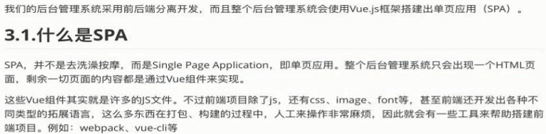
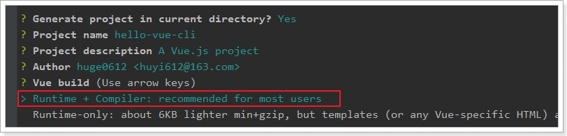
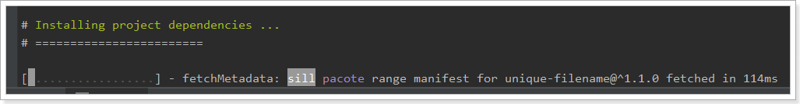
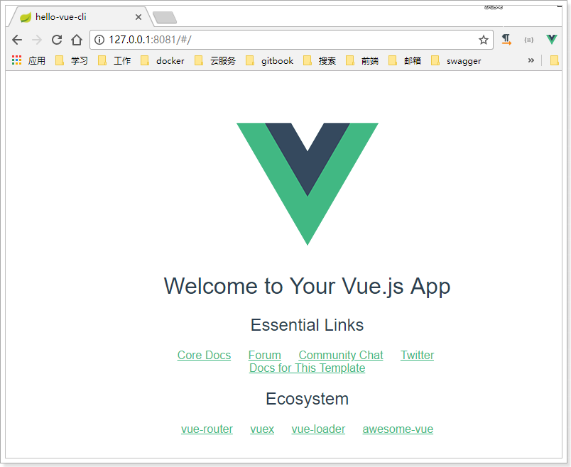
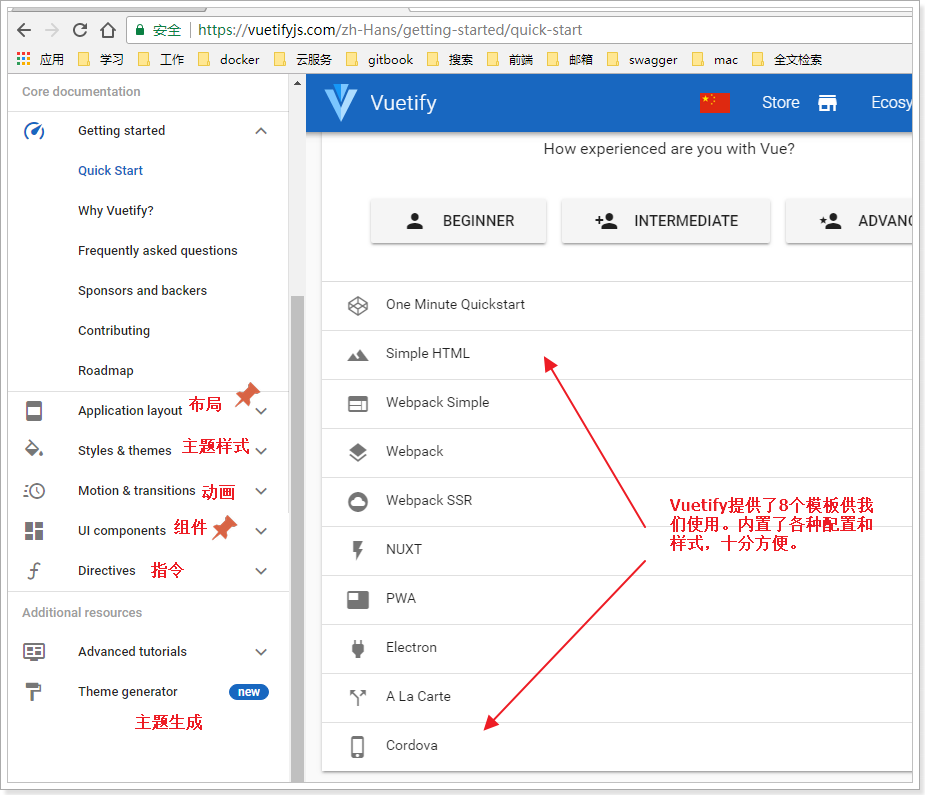
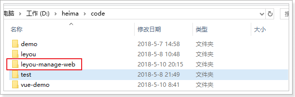
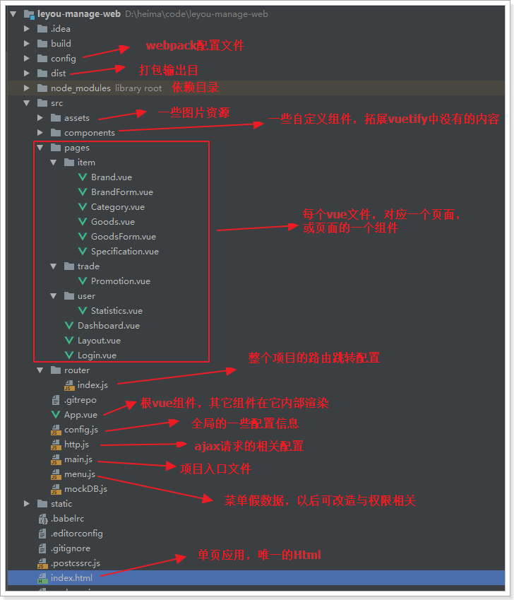
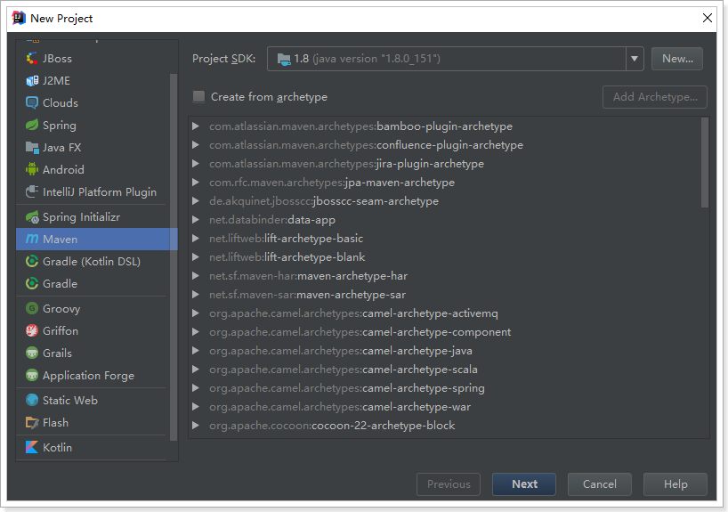
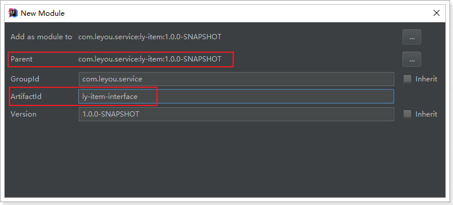
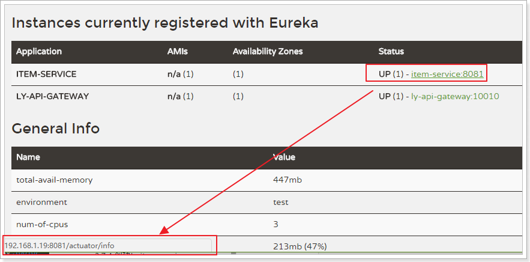

# Table of Contents

* [一、环境搭建](#一、环境搭建)
* [1.了解电商行业](#1了解电商行业)
  * [1.1.项目分类](#11项目分类)
    * [1.1.1.传统项目](#111传统项目)
    * [1.1.2.互联网项目](#112互联网项目)
  * [1.2.电商行业的发展](#12电商行业的发展)
    * [1.2.1.钱景](#121钱景)
    * [1.2.2.数据](#122数据)
    * [1.2.3.技术特点](#123技术特点)
  * [1.3.常见电商模式](#13常见电商模式)
  * [1.4.一些专业术语](#14一些专业术语)
* [2.乐优商城介绍](#2乐优商城介绍)
  * [2.1.项目介绍](#21项目介绍)
  * [2.2.系统架构](#22系统架构)
    * [2.2.1.架构图](#221架构图)
    * [2.2.2.系统架构解读](#222系统架构解读)
* [3.商城管理系统前端页面](#3商城管理系统前端页面)
  * [3.0.什么是SPA](#30什么是spa)
  * [3.1.认识webpack](#31认识webpack)
    * [2.2.四个核心概念](#22四个核心概念)
  * [3.2.vue-cli](#32vue-cli)
    * [3.1.介绍和安装](#31介绍和安装)
    * [3.2.快速上手](#32快速上手)
    * [3.3.项目结构](#33项目结构)
    * [3.4.单文件组件](#34单文件组件)
    * [3.5.运行](#35运行)
  * [3.3.Vuetify框架](#33vuetify框架)
    * [5.1.为什么要学习UI框架](#51为什么要学习ui框架)
    * [5.2.为什么是Vuetify](#52为什么是vuetify)
    * [5.3.怎么用？](#53怎么用？)
  * [3.4.后台管理页面](#34后台管理页面)
    * [3.4.1.导入已有资源](#341导入已有资源)
    * [3.4.2.运行一下看看](#342运行一下看看)
    * [3.4.3.项目结构](#343项目结构)
      * [6.1.目录结构](#61目录结构)
      * [6.2.调用关系](#62调用关系)
      * [6.3.页面布局](#63页面布局)
* [4.搭建基础服务](#4搭建基础服务)
  * [3.1.技术选型](#31技术选型)
  * [3.2.开发环境](#32开发环境)
  * [3.3.域名](#33域名)
  * [3.4.创建父工程](#34创建父工程)
  * [3.5.创建EurekaServer](#35创建eurekaserver)
    * [3.5.1.创建工程](#351创建工程)
    * [3.5.2.添加依赖](#352添加依赖)
    * [3.5.3.编写启动类](#353编写启动类)
    * [3.5.4.配置文件](#354配置文件)
    * [3.5.5.项目的结构：](#355项目的结构：)
  * [3.6.创建Zuul网关](#36创建zuul网关)
    * [3.6.1.创建工程](#361创建工程)
    * [3.6.2.添加依赖](#362添加依赖)
    * [3.6.3.编写启动类](#363编写启动类)
    * [3.6.4.配置文件](#364配置文件)
                                                            * [](#)
    * [3.6.5.项目结构](#365项目结构)
  * [3.7.创建商品微服务](#37创建商品微服务)
    * [3.7.1.微服务的结构](#371微服务的结构)
    * [3.7.2.创建父工程ly-item](#372创建父工程ly-item)
    * [3.7.3.创建ly-item-interface](#373创建ly-item-interface)
    * [3.7.4.创建ly-item-service](#374创建ly-item-service)
    * [3.7.5.整个微服务结构](#375整个微服务结构)
    * [3.7.6.添加依赖](#376添加依赖)
    * [3.7.7.编写启动和配置](#377编写启动和配置)
* [驱动IDEA自动引入了](#驱动idea自动引入了)
* [保证拿到127.0.0.1而不是localhost](#保证拿到127001而不是localhost)
* [lease-renewal-interval-in-seconds: 5 # 每隔5秒发送一次心跳](#lease-renewal-interval-in-seconds-5--每隔5秒发送一次心跳)
* [lease-expiration-duration-in-seconds: 10 # 10秒不发送就过期](#lease-expiration-duration-in-seconds-10--10秒不发送就过期)
  * [3.8.添加商品微服务的路由规则](#38添加商品微服务的路由规则)
                                                            * [](#-1)
  * [3.9.启动测试](#39启动测试)
  * [3.10.测试路由规则 ??是否需要？](#310测试路由规则-是否需要？)
  * [3.11.通用工具模块](#311通用工具模块)
* [5.通用异常处理](#5通用异常处理)
  * [目录结构：](#目录结构：)


# 一、环境搭建

- 了解电商行业
- 了解乐优商城项目结构
- 能独立搭建项目基本框架
- 能参考使用ES6的新语法


# 1.了解电商行业

学习电商项目，自然要先了解这个行业，所以我们首先来聊聊电商行业

## 1.1.项目分类

主要从需求方、盈利模式、技术侧重点这三个方面来看它们的不同

### 1.1.1.传统项目

各种企业里面用的管理系统（ERP、HR、OA、CRM、物流管理系统。。。。。。。）

- 需求方：公司、企业内部
- 盈利模式：项目本身卖钱
- 技术侧重点：业务功能

 

### 1.1.2.互联网项目

门户网站、电商网站：baidu.com、qq.com、taobao.com、jd.com  ...... 

- 需求方：广大用户群体
- 盈利模式：虚拟币、增值服务、广告收益......
- 技术侧重点：网站性能、业务功能


而我们今天要聊的就是互联网项目中的重要角色：电商


## 1.2.电商行业的发展

### 1.2.1.钱景

近年来，中国的电子商务快速发展，交易额连创新高，电子商务在各领域的应用不断拓展和深化、相关服务业蓬勃发展、支撑体系不断健全完善、创新的动力和能力不断增强。电子商务正在与实体经济深度融合，进入规模性发展阶段，对经济社会生活的影响不断增大，正成为我国经济发展的新引擎。

中国电子商务研究中心数据显示，截止到 2012 年底，中国电子商务市场交易规模达 7.85万亿人民币，同比增长 30.83%。其中，B2B 电子商务交易额达 6.25 万亿，同比增长 27%。而 2011 年全年，中国电子商务市场交易额达 6 万亿人民币，同比增长 33%，占 GDP 比重上升到 13%；2012 年，电子商务占 GDP 的比重已经高达 15%。

 	


### 1.2.2.数据

来看看双十一的成交数据：


2016双11开场30分钟，创造**每秒交易峰值17.5万笔**，**每秒**支付峰值**12万笔**的新纪录。菜鸟单日物流订单量超过**4.67亿**，创历史新高。


### 1.2.3.技术特点

从上面的数据我们不仅要看到钱，更要看到背后的技术实力。正是得益于电商行业的高强度并发压力，促使了BAT等巨头们的技术进步。电商行业有些什么特点呢？

- 技术范围广
- 技术新
- 高并发（分布式、静态化技术、CDN服务、缓存技术、异步并发、池化、队列）
- 高可用（集群、负载均衡、限流、降级、熔断）
- 数据量大
- 业务复杂
- 数据安全


## 1.3.常见电商模式

电商行业的一些常见模式：

- B2C：商家对个人，如：亚马逊、当当等
- C2C平台：个人对个人，如：咸鱼、拍拍网、ebay
- B2B平台：商家对商家，如：阿里巴巴、八方资源网等
- O2O：线上和线下结合，如：饿了么、电影票、团购等
- P2P：在线金融，贷款，如：网贷之家、人人聚财等。
- B2C平台：天猫、京东、一号店等


## 1.4.一些专业术语

- SaaS：软件即服务

- SOA：面向服务

- RPC：远程过程调用

- RMI：远程方法调用

- PV：(page view)，即页面浏览量；

  用户每1次对网站中的每个网页访问均被记录1次。用户对同一页面的多次访问，访问量累计

- UV：(unique visitor)，独立访客

  指访问某个站点或点击某条新闻的不同IP地址的人数。在同一天内，uv只记录第一次进入网站的具有独立IP的访问者，在同一天内再次访问该网站则不计数。

- PV与带宽：

  - 计算带宽大小需要关注两个指标：峰值流量和页面的平均大小。
  - 计算公式是：网站带宽= ( PV * 平均页面大小（单位MB）* 8 )/统计时间（换算到秒）
  - 为什么要乘以8？
    - 网站大小为单位是字节(Byte)，而计算带宽的单位是bit，1Byte=8bit
  - 这个计算的是平均带宽，高峰期还需要扩大一定倍数

- PV、QPS、并发

  - QPS：每秒处理的请求数量。8000/s

    - 比如你的程序处理一个请求平均需要0.1S，那么1秒就可以处理10个请求。QPS自然就是10，多线程情况下，这个数字可能就会有所增加。

  - 由PV和QPS如何需要部署的服务器数量？

    - 根据二八原则，80%的请求集中在20%的时间来计算峰值压力：
    - （每日PV * 80%） / （3600s * 24 * 20%） * 每个页面的请求数  = 每个页面每秒的请求数量
    - 然后除以服务器的QPS值，即可计算得出需要部署的服务器数量

    


# 2.乐优商城介绍

## 2.1.项目介绍

- 乐优商城是一个全品类的电商购物网站（B2C）。
- 用户可以在线购买商品、加入购物车、下单、秒杀商品
- 可以品论已购买商品
- 管理员可以在后台管理商品的上下架、促销活动
- 管理员可以监控商品销售状况
- 客服可以在后台处理退款操作
- 希望未来3到5年可以支持千万用户的使用


## 2.2.系统架构

### 2.2.1.架构图

乐优商城架构缩略图，大图请参考课前资料：


NPM:项目管理

WebPack：项目打包

 Vue.js：前端主框架，负责渲染

Vuetify：页面前端渲染(ui框架，做样式)，因为Vuetify基于Vue，所以我们选择这个技术，而不选择bootstrap

NUXT:服务端渲染

ajax：前端与后端的交互

nginx：Web服务器（部署前端的代码，资源及静态资源）

Zuul：后端的入口（也就是微服务集群的入口）

### 2.2.2.系统架构解读

整个乐优商城可以分为两部分：后台管理系统、前台门户系统。

- 后台管理：

  - 后台系统主要包含以下功能：
    - 商品管理，包括商品分类、品牌、商品规格等信息的管理
    - 销售管理，包括订单统计、订单退款处理、促销活动生成等
    - 用户管理，包括用户控制、冻结、解锁等
    - 权限管理，整个网站的权限控制，采用JWT鉴权方案，对用户及API进行权限控制
    - 统计，各种数据的统计分析展示
  - 后台系统会采用前后端分离开发，而且整个后台管理系统会使用Vue.js框架搭建出单页应用（SPA）。
  - 预览图：

  

- 前台门户

  - 前台门户面向的是客户，包含与客户交互的一切功能。例如：
    - 搜索商品
    - 加入购物车
    - 下单
    - 评价商品等等
  - 前台系统我们会使用Nuxt（服务端渲染）结合Vue完成页面开发。出于SEO优化的考虑，我们将不采用单页应用。

  


# 3.商城管理系统前端页面

## 3.0.什么是SPA




## 3.1.认识webpack

Webpack 是一个前端资源的打包工具，它可以将js、image、css等资源当成一个模块进行打包。

中文官方网站：https://www.webpackjs.com/


export:：导出

import：导入（文件的地址）

 

官网给出的解释：


为什么需要打包？

- 将许多碎小文件打包成一个整体，减少单页面内的衍生请求次数，提高网站效率。
- 将ES6的高级语法进行转换编译，以兼容老版本的浏览器。
- 将代码打包的同时进行混淆，提高代码的安全性。

### 2.2.四个核心概念

学习Webpack，你需要先理解四个**核心概念**：

- 入口(entry)

  webpack打包的启点，可以有一个或多个，一般是js文件。webpack会从启点文件开始，寻找启点直接或间接依赖的其它所有的依赖，包括JS、CSS、图片资源等，作为将来打包的原始数据

- 输出(output)

  出口一般包含两个属性：path和filename。用来告诉webpack打包的目标文件夹，以及文件的名称。目的地也可以有多个。

- 加载器（loader）

  webpack本身只识别Js文件，如果要加载非JS文件，必须指定一些额外的加载器（loader），例如css-loader。然后将这些文件转为webpack能处理的有效模块，最后利用webpack的打包能力去处理。

- 插件(plugins)

  插件可以扩展webpack的功能，让webpack不仅仅是完成打包，甚至各种更复杂的功能，或者是对打包功能进行优化、压缩，提高效率。

  

## 3.2.vue-cli

### 3.1.介绍和安装

在开发中，需要打包的东西不止是js、css、html。还有更多的东西要处理，这些插件和加载器如果我们一一去添加就会比较麻烦。

幸好，vue官方提供了一个快速搭建vue项目的脚手架：vue-cli

使用它能快速的构建一个web工程模板。

官网：https://github.com/vuejs/vue-cli


安装命令：

```
npm install -g vue-cli
```

### 3.2.快速上手

我们新建一个module：


 

打开终端并进入目录：

 

用vue-cli命令，快速搭建一个webpack的项目：

```
vue init webpack
```




 

前面几项都走默认或yes

下面这些我们选no

 

最后，再选yes，使用 npm安装

 





安装插件：


### 3.3.项目结构

安装好的项目结构：

 


入口文件：


### 3.4.单文件组件

需要注意的是，我们看到有一类后缀名为.vue的文件，我们称为单文件组件


每一个.vue文件，就是一个独立的vue组件。类似于我们刚才写的loginForm.js和registerForm.js

只不过，我们在js中编写 html模板和样式非常的不友好，而且没有语法提示和高亮。


而单文件组件中包含三部分内容：

- template：模板，支持html语法高亮和提示
- script：js脚本，这里编写的就是vue的组件对象，看到上面的data(){}了吧
- style：样式，支持CSS语法高亮和提示

每个组件都有自己独立的html、JS、CSS，互不干扰，真正做到可独立复用。


### 3.5.运行

看看生成的package.json：


我们执行`npm run dev` 或者 `npm start` 都可以启动项目：

 


页面：



## 3.3.Vuetify框架


### 5.1.为什么要学习UI框架

Vue负责的是虽然会帮我们进行视图的渲染，但是样式是有我们自己来完成。这显然不是我们的强项，因此后端开发人员一般都喜欢使用一些现成的UI组件，拿来即用，常见的例如：

- BootStrap
- LayUI
- EasyUI
- ZUI

然而这些UI组件的基因天生与Vue不合，因为他们更多的是利用DOM操作，借助于jQuery实现，而不是MVVM的思想。

而目前与Vue吻合的UI框架也非常的多，国内比较知名的如：

- element-ui：饿了么出品
- i-view：某公司出品

然而我们都不用，我们今天推荐的是一款国外的框架：Vuetify

官方网站：https://vuetifyjs.com/zh-Hans/


### 5.2.为什么是Vuetify

有中国的为什么还要用外国的？原因如下：

- Vuetify几乎不需要任何CSS代码，而element-ui许多布局样式需要我们来编写
- Vuetify从底层构建起来的语义化组件。简单易学，容易记住。
- Vuetify基于Material Design（谷歌推出的多平台设计规范），更加美观，动画效果酷炫，且风格统一

这是官网的说明：


缺陷：

- 目前官网虽然有中文文档，但因为翻译问题，几乎不太能看。


### 5.3.怎么用？

基于官方网站的文档进行学习：




我们重点关注`UI components`即可，里面有大量的UI组件，我们要用的时候再查看，不用现在学习，先看下有什么：

 


 

以后用到什么组件，就来查询即可。


## 3.4.后台管理页面

我们的后台管理系统就基于Vue，并使用Vuetify组件编写的。

tips : 设置IDEA


### 3.4.1.导入已有资源

后台项目相对复杂，为了有利于教学，我们不再从0搭建项目，而是直接使用课前资料中给大家准备好的源码：

 

我们解压缩，放到工作目录中：

 


然后在eclipse中导入新的工程：

 

选中我们的工程：

 


这正是一个用vue-cli构建的webpack工程，是不是与昨天的一样：

 

### 3.4.2.运行一下看看

输入命令：

```
npm run dev
```

 

发现默认的端口是9001。访问：http://localhost:9001

会自动进行跳转：


### 3.4.3.项目结构

开始编码前，我们先了解下项目的结构：

#### 6.1.目录结构

首先是目录结构图：




#### 6.2.调用关系

我们最主要理清index.html、main.js、App.vue之间的关系：


理一下：

- index.html中定义了空的`div`，其id为`app`。
- main.js中定义了Vue对象，并且绑定通过id选择器，绑定到index.html的div中，因此**main.js的内容都将在index.html的div中显示**。
- 而main.js中只有一行内容：`<App/>`,这是使用了App组件，即App.vue，也就是说index.html中最终展现的是App.vue中的内容。
- App.vue中也没有内容，而是定义了vue-router的锚点：`<router-view>`,我们之前讲过，vue-router路由后的组件将会在锚点展示。
- 最终的结论是：**一切路由后的内容都将通过App.vue在index.html中显示。**


#### 6.3.页面布局

接下来我们一起看下页面布局：

Layout组件是我们的整个页面的布局组件：


一个典型的三块布局。包含左，上，中三部分：

 


里面使用了Vuetify中的2个组件和一个布局元素：

- `v-navigation-drawer` ：导航抽屉，主要用于容纳应用程序中的页面的导航链接。 

  

- `v-toolbar `：工具栏通常是网站导航的主要途径。可以与导航抽屉一起很好地工作，动态选择是否打开导航抽屉，实现可伸缩的侧边栏。

  

- `v-content`：并不是一个组件，而是标记页面布局的元素。可以根据您指定的**app**组件的结构动态调整大小，使得您可以创建高度可定制的组件。

那么问题来了：`v-content`中的内容来自哪里？


- Layout映射的路径是`/`

- 除了Login以为的所有组件，都是定义在Layout的children属性，并且路径都是`/`的下面

- 因此当路由到子组件时，会在Layout中定义的锚点中显示。

- 并且Layout中的其它部分不会变化，这就实现了布局的共享。

  

# 4.搭建基础服务

先准备后台微服务集群的基本架构

## 3.1.技术选型

前端技术：

- 基础的HTML、CSS、JavaScript（基于ES6标准）
- JQuery
- Vue.js 2.0以及基于Vue的UI框架：Vuetify
- 前端构建工具：WebPack
- 前端安装包工具：NPM
- Vue脚手架：Vue-cli
- Vue路由：vue-router
- ajax框架：axios
- 基于Vue的富文本框架：quill-editor

后端技术：

- 基础的SpringMVC、Spring 5.0和MyBatis3
- Spring Boot 2.0.4版本
- Spring Cloud 最新版 Finchley.SR1
- Redis-4.0
- RabbitMQ-3.4
- Elasticsearch-5.6.8
- nginx-1.10.2
- FastDFS - 5.0.8
- MyCat
- Thymeleaf
- JWT

## 3.2.开发环境

为了保证开发环境的统一，希望每个人都按照我的环境来配置：

- IDE：我们使用Idea 2017.3 版本

- JDK：统一使用JDK1.8

- 项目构建：maven3.3.x以上版本即可

  //版本控制工具：git


idea大家可以在我的课前资料中找到。另外，使用帮助大家可以参考课前资料的《idea使用指南.md》


## 3.3.域名

我们在开发的过程中，为了保证以后的生产、测试环境统一。尽量都采用域名来访问项目。

一级域名：www.leyou.com

二级域名：manage.leyou.com , api.leyou.com

我们可以通过switchhost工具来修改自己的host对应的地址，只要把这些域名指向127.0.0.1，那么跟你用localhost的效果是完全一样的。

switchhost可以去课前资料寻找。


## 3.4.创建父工程

创建统一的父工程：leyou，用来管理依赖及其版本，注意是创建project，而不是moudle



填写工程信息：

 

保存的位置信息：


然后将pom文件修改成我这个样子：

```xml
<?xml version="1.0" encoding="UTF-8"?>
<project xmlns="http://maven.apache.org/POM/4.0.0"
         xmlns:xsi="http://www.w3.org/2001/XMLSchema-instance"
         xsi:schemaLocation="http://maven.apache.org/POM/4.0.0 http://maven.apache.org/xsd/maven-4.0.0.xsd">
    <modelVersion>4.0.0</modelVersion>

    <groupId>com.leyou.parent</groupId>
    <artifactId>leyou</artifactId>
    <version>1.0.0-SNAPSHOT</version>
    <packaging>pom</packaging>

    <name>leyou</name>
    <description>Demo project for Spring Boot</description>

    <!--spring-boot-2.0.4-->
    <parent>
        <groupId>org.springframework.boot</groupId>
        <artifactId>spring-boot-starter-parent</artifactId>
        <version>2.0.4.RELEASE</version>
        <relativePath/> <!-- lookup parent from repository -->
    </parent>

    <!--版本信息的控制和编码-->
    <properties>
        <project.build.sourceEncoding>UTF-8</project.build.sourceEncoding>
        <project.reporting.outputEncoding>UTF-8</project.reporting.outputEncoding>
        <java.version>1.8</java.version>
        <spring-cloud.version>Finchley.SR1</spring-cloud.version>
        <mapper.starter.version>2.0.3</mapper.starter.version>
        <mysql.version>5.1.32</mysql.version>
        <pageHelper.starter.version>1.2.5</pageHelper.starter.version>
        <leyou.latest.version>1.0.0-SNAPSHOT</leyou.latest.version>
        <fastDFS.client.version>1.26.1-RELEASE</fastDFS.client.version>
    </properties>

    <dependencyManagement>
        <dependencies>
            <!-- springCloud -->
            <dependency>
                <groupId>org.springframework.cloud</groupId>
                <artifactId>spring-cloud-dependencies</artifactId>
                <version>${spring-cloud.version}</version>
                <type>pom</type>
                <scope>import</scope>
            </dependency>
            <!-- 通用Mapper启动器 -->
            <dependency>
                <groupId>tk.mybatis</groupId>
                <artifactId>mapper-spring-boot-starter</artifactId>
                <version>${mapper.starter.version}</version>
            </dependency>
            <!-- 分页助手启动器 -->
            <dependency>
                <groupId>com.github.pagehelper</groupId>
                <artifactId>pagehelper-spring-boot-starter</artifactId>
                <version>${pageHelper.starter.version}</version>
            </dependency>
            <!-- mysql驱动 -->
            <dependency>
                <groupId>mysql</groupId>
                <artifactId>mysql-connector-java</artifactId>
                <version>${mysql.version}</version>
            </dependency>
            <!--FastDFS客户端-->
            <dependency>
                <groupId>com.github.tobato</groupId>
                <artifactId>fastdfs-client</artifactId>
                <version>${fastDFS.client.version}</version>
            </dependency>
        </dependencies>
    </dependencyManagement>
    <dependencies>
        <dependency>
            <groupId>org.apache.commons</groupId>
            <artifactId>commons-lang3</artifactId>
            <version>3.4</version>
        </dependency>
        <dependency>
            <groupId>org.projectlombok</groupId>
            <artifactId>lombok</artifactId>
        </dependency>
    </dependencies>

    <build>
        <plugins>
            <plugin>
                <groupId>org.springframework.boot</groupId>
                <artifactId>spring-boot-maven-plugin</artifactId>
            </plugin>
        </plugins>
    </build>
</project>
```

可以发现，我们在父工程中引入了SpringCloud等很多以后需要用到的依赖，以后创建的子工程就不需要自己引入了。

## 3.5.创建EurekaServer

### 3.5.1.创建工程

这个大家应该比较熟悉了。

我们的注册中心，起名为：ly-registry，直接创建maven项目，自然会继承父类的依赖：

选择新建module：

​	

选择maven安装，但是不要选择骨架：


以为是一个共	用工程，所以GroupId为x.x.common，然后填写项目坐标，我们的项目名称为ly-registry:


选择安装目录，因为是聚合项目，目录应该是在父工程leyou的下面：


### 3.5.2.添加依赖

添加EurekaServer的依赖：

```xml
<?xml version="1.0" encoding="UTF-8"?>
<project xmlns="http://maven.apache.org/POM/4.0.0"
         xmlns:xsi="http://www.w3.org/2001/XMLSchema-instance"
         xsi:schemaLocation="http://maven.apache.org/POM/4.0.0 http://maven.apache.org/xsd/maven-4.0.0.xsd">
    <parent>
        <artifactId>leyou</artifactId>
        <groupId>com.leyou.parent</groupId>
        <version>1.0.0-SNAPSHOT</version>
    </parent>
    <modelVersion>4.0.0</modelVersion>

    <groupId>com.leyou.common</groupId>
    <artifactId>ly-registry</artifactId>

    <dependencies>
        <!--eureka-->
        <dependency>
            <groupId>org.springframework.cloud</groupId>
            <artifactId>spring-cloud-starter-netflix-eureka-server</artifactId>
        </dependency>
    </dependencies>
</project>
```

### 3.5.3.编写启动类

```java
package com.leyou;

@SpringBootApplication
@EnableEurekaServer
public class LyRegistry {
    public static void main(String[] args) {
        SpringApplication.run(LyRegistry.class, args);
    }
}
```

### 3.5.4.配置文件

```yaml
server:
  port: 10086
spring:
  application:
    name: ly-registry
eureka:
  client:
    fetch-registry: false #是否拉取服务列表
    register-with-eureka: false #是否注册自己到Eureka
    service-url:
      defaultZone: http://127.0.0.1:10086/eureka
```

### 3.5.5.项目的结构：

目前，整个项目的结构如图：

 


## 3.6.创建Zuul网关

### 3.6.1.创建工程

与上面类似，选择maven方式创建Module，然后填写项目名称，我们命名为：ly-gateway


填写保存的目录：


### 3.6.2.添加依赖

这里我们需要添加Zuul和EurekaClient的依赖：

```xml
<?xml version="1.0" encoding="UTF-8"?>
<project xmlns="http://maven.apache.org/POM/4.0.0"
         xmlns:xsi="http://www.w3.org/2001/XMLSchema-instance"
         xsi:schemaLocation="http://maven.apache.org/POM/4.0.0 http://maven.apache.org/xsd/maven-4.0.0.xsd">
    <parent>
        <artifactId>leyou</artifactId>
        <groupId>com.leyou.parent</groupId>
        <version>1.0.0-SNAPSHOT</version>
    </parent>
    <modelVersion>4.0.0</modelVersion>

    <groupId>com.leyou.common</groupId>
    <artifactId>ly-gateway</artifactId>

    <dependencies>
        <!--zuul-->
        <dependency>
            <groupId>org.springframework.cloud</groupId>
            <artifactId>spring-cloud-starter-netflix-zuul</artifactId>
        </dependency>
        <!--eureka-client-->
        <dependency>
            <groupId>org.springframework.cloud</groupId>
            <artifactId>spring-cloud-starter-netflix-eureka-client</artifactId>
        </dependency>
    </dependencies>
</project>
```

### 3.6.3.编写启动类

```java
package com.leyou.gateway;

@EnableZuulProxy
@SpringCloudApplication
public class LyGateway {
    public static void main(String[] args) {
        SpringApplication.run(LyGateway.class, args);
    }
}
```


### 3.6.4.配置文件

```yaml
server:
  port: 10010
spring:
  application:
    name: api-gateway
eureka:
  client:
    service-url:
      defaultZone: http://127.0.0.1:10086/eureka
zuul:
  prefix: /api # 添加路由前缀
ribbon:
  ConnectTimeout: 1000 # 连接超时时间(ms)
  ReadTimeout: 3500 # 通信超时时间(ms)
  #重试功能可能导致添加两次的安全问题，所以我们设置为0关闭重试
  MaxAutoRetriesNextServer: 0 # 同一服务不同实例的重试次数
  MaxAutoRetries: 0 # 同一实例的重试次数
hystrix:
  command:
    default:
      execution:
        isolation:
          thread:
            timeoutInMillisecond: 5000 # 熔断超时时长：5000ms
```

### 3.6.5.项目结构

目前，leyou下有两个子模块：

- ly-registry：服务的注册中心（EurekaServer）
- ly-gateway：服务网关（Zuul）

目前，服务的结构如图所示：

 	

打开Maven，刷新，弹出Run Dashboard窗口,点击选择第一项


截止到这里，我们已经把基础服务搭建完毕，为了便于开发，统一配置中心（ConfigServer）我们留待以后添加。


## 3.7.创建商品微服务

既然是一个全品类的电商购物平台，那么核心自然就是商品。因此我们要搭建的第一个服务，就是商品微服务。其中会包含对于商品相关的一系列内容的管理，包括：

- 商品分类管理
- 品牌管理
- 商品规格参数管理
- 商品管理
- 库存管理

我们先完成项目的搭建：

### 3.7.1.微服务的结构

因为与商品的品类相关，我们的工程命名为`ly-item`.

需要注意的是，我们的ly-item是一个微服务，那么将来肯定会有其它系统需要来调用服务中提供的接口，因此肯定也会使用到接口中关联的实体类。

因此这里我们需要使用聚合工程，将要提供的接口及相关实体类放到独立子工程中，以后别人引用的时候，只需要知道坐标即可。

我们会在ly-item中创建两个子工程：

- ly-item-interface：主要是对外暴露的API接口及相关实体类
- ly-item-service：所有业务逻辑及内部使用接口

调用关系如图所示：


### 3.7.2.创建父工程ly-item

依然是使用maven构建：


保存的位置：


不需要任何依赖，我们可以把项目打包方式设置为pom

```xml
<?xml version="1.0" encoding="UTF-8"?>
<project xmlns="http://maven.apache.org/POM/4.0.0"
         xmlns:xsi="http://www.w3.org/2001/XMLSchema-instance"
         xsi:schemaLocation="http://maven.apache.org/POM/4.0.0 http://maven.apache.org/xsd/maven-4.0.0.xsd">
    <parent>
        <artifactId>leyou</artifactId>
        <groupId>com.leyou.parent</groupId>
        <version>1.0.0-SNAPSHOT</version>
    </parent>
    <modelVersion>4.0.0</modelVersion>

    <groupId>com.leyou.service</groupId>
    <artifactId>ly-item</artifactId>
    <!-- 打包方式为pom -->
    <packaging>pom</packaging>

</project>
```


### 3.7.3.创建ly-item-interface

在ly-item工程上点击右键，选择new > module:

 

依然是使用maven构建，注意父工程是ly-item：



**注意**：接下来填写的目录结构需要自己手动完成，保存到`ly-item`下的`ly-item-interface`目录中：


点击Finish完成。

此时的项目结构：

​	

### 3.7.4.创建ly-item-service

与`ly-item-interface`类似，我们选择在`ly-item`上右键，新建module，然后填写项目信息：


填写存储位置，是在`/ly-item/ly-item-service`目录


点击Finish完成。

### 3.7.5.整个微服务结构

如图所示：

​	


我们打开ly-item的pom查看，会发现ly-item-interface和ly-item-service都已经称为module了：

​	

### 3.7.6.添加依赖

接下来我们给`ly-item-service`中添加依赖：

思考一下我们需要什么？

- Eureka客户端
- web启动器
- 通用mapper启动器
- 分页助手启动器 
- mysql驱动
- 千万不能忘了，我们自己也需要`ly-item-interface`中的实体类

这些依赖，我们在顶级父工程：leyou中已经添加好了。所以直接引入即可：

```xml
<?xml version="1.0" encoding="UTF-8"?>
<project xmlns="http://maven.apache.org/POM/4.0.0"
         xmlns:xsi="http://www.w3.org/2001/XMLSchema-instance"
         xsi:schemaLocation="http://maven.apache.org/POM/4.0.0 http://maven.apache.org/xsd/maven-4.0.0.xsd">
    <parent>
        <artifactId>ly-item</artifactId>
        <groupId>com.leyou.service</groupId>
        <version>1.0.0-SNAPSHOT</version>
    </parent>
    <modelVersion>4.0.0</modelVersion>

    <groupId>com.leyou.service</groupId>
    <artifactId>ly-item-service</artifactId>

    <dependencies>
        <!--web启动器-->
        <dependency>
            <groupId>org.springframework.boot</groupId>
            <artifactId>spring-boot-starter-web</artifactId>
        </dependency>
        <!--eureka-client-->
        <dependency>
            <groupId>org.springframework.cloud</groupId>
            <artifactId>spring-cloud-starter-netflix-eureka-client</artifactId>
        </dependency>
        <!--通用mapper启动器-->
        <dependency>
            <groupId>tk.mybatis</groupId>
            <artifactId>mapper-spring-boot-starter</artifactId>
        </dependency>
        <!-- 分页助手启动器 -->
        <dependency>
            <groupId>com.github.pagehelper</groupId>
            <artifactId>pagehelper-spring-boot-starter</artifactId>
        </dependency>
        <!-- mysql驱动 -->
        <dependency>
            <groupId>mysql</groupId>
            <artifactId>mysql-connector-java</artifactId>
        </dependency>
        <!--实体类-->
        <dependency>
            <groupId>com.leyou.service</groupId>
            <artifactId>ly-item-interface</artifactId>
            <version>1.0.0-SNAPSHOT</version>
        </dependency>
    </dependencies>
</project>
```


ly-item-interface中需要什么我们暂时不清楚，所以先不管。


### 3.7.7.编写启动和配置

在整个`ly-item工程`中，只有`ly-item-service`是需要启动的。因此在其中编写启动类即可：

```java
package com.leyou;

@SpringBootApplication
@EnableDiscoveryClient //注册到Eureka上去
public class LyItemApplication {
    public static void main(String[] args) {
        SpringApplication.run(LyItemApplication.class, args);
    }
}
```


然后是全局属性文件：

```yaml
server:
  port: 8081
spring:
  application:
    name: item-service
  datasource:
#    驱动IDEA自动引入了
    url: jdbc:mysql://localhost:3306/yun6
    username: root
    password: root
eureka:
  client:
    service-url:
      defaultZone: http://127.0.0.1:10086/eureka
#    保证拿到127.0.0.1而不是localhost
  instance:
#    lease-renewal-interval-in-seconds: 5 # 每隔5秒发送一次心跳
#    lease-expiration-duration-in-seconds: 10 # 10秒不发送就过期
    prefer-ip-address: true
    ip-address: 127.0.0.1
```

**微服务搭建OK！**


## 3.8.添加商品微服务的路由规则

既然商品微服务已经创建，接下来肯定要添加路由规则到Zuul中，我们不使用默认的路由规则。

ly-gateway :

```yaml
server:
  port: 10010
spring:
  application:
    name: api-gateway
eureka:
  client:
    service-url:
      defaultZone: http://127.0.0.1:10086/eureka
     【1】
zuul:
  prefix: /api # 添加路由前缀
  routes:
    item-service: /item/**   # 将商品微服务映射到/item/**
    【1】
ribbon:
  ConnectTimeout: 1000 # 连接超时时间(ms)
  ReadTimeout: 3500 # 通信超时时间(ms)
  #重试功能可能导致添加两次的安全问题，所以我们设置为0关闭重试
  MaxAutoRetriesNextServer: 0 # 同一服务不同实例的重试次数
  MaxAutoRetries: 0 # 同一实例的重试次数
hystrix:
  command:
    default:
      execution:
        isolation:
          thread:
            timeoutInMillisecond: 5000 # 熔断超时时长：5000ms
```

刷新：


---


## 3.9.启动测试

我们分别启动：ly-registry，ly-item-service，ly-gateway

（我的计算机8081端口已被占用，所以ly-item-service我修改为8082）

 

查看Eureka面板：

tips ： 因为我们之前在配置Eureka时，配置了Eureka不注册自己，所以我们在Eureka面板看不到Eureka。


## 3.10.测试路由规则 ??是否需要？

为了测试路由规则是否畅通，我们是不是需要在item-service中编写一个controller接口呢？

其实不需要，Spring提供了一个依赖：actuator

只要我们添加了actuator的依赖，它就会为我们生成一系列的访问接口：

- /info
- /health
- /refresh
- ...

添加依赖：

```xml
<dependency>
    <groupId>org.springframework.boot</groupId>
    <artifactId>spring-boot-starter-actuator</artifactId>
</dependency>
```

重启后访问Eureka控制台：

鼠标悬停在item-service上，会显示一个地址：



这就是actuator提供的接口，我们点击访问：

 

因为我们没有添加信息，所以是一个空的json，但是可以肯定的是：我们能够访问到item-service了。

接下来我们通过路由访问试试，根据路由规则，我们需要访问的地址是：

http://127.0.0.1:10010/api/item/actuator/info

 


## 3.11.通用工具模块

有些工具（utils）或通用的约定内容，我们希望各个服务共享，因此需要创建一个工具模块：`ly-common`


使用maven来构建module：


位置信息：


结构：

 


然后把课前资料提供的工具类引入：

 

 

然后引入依赖：

```xml
<?xml version="1.0" encoding="UTF-8"?>
<project xmlns="http://maven.apache.org/POM/4.0.0"
         xmlns:xsi="http://www.w3.org/2001/XMLSchema-instance"
         xsi:schemaLocation="http://maven.apache.org/POM/4.0.0 http://maven.apache.org/xsd/maven-4.0.0.xsd">
    <parent>
        <artifactId>leyou</artifactId>
        <groupId>com.leyou.parent</groupId>
        <version>1.0.0-SNAPSHOT</version>
    </parent>
    <modelVersion>4.0.0</modelVersion>

    <groupId>com.leyou.common</groupId>
    <artifactId>ly-common</artifactId>
    <dependencies>
        <!--servlet-->
        <dependency>
            <groupId>org.apache.tomcat.embed</groupId>
            <artifactId>tomcat-embed-core</artifactId>
        </dependency>
        <!--所有日志相关依赖-->
        <dependency>
            <groupId>org.springframework.boot</groupId>
            <artifactId>spring-boot-starter-logging</artifactId>
        </dependency>
        <!--jackson-->
        <dependency>
            <groupId>com.fasterxml.jackson.core</groupId>
            <artifactId>jackson-databind</artifactId>
            <version>2.9.6</version>
        </dependency>
    </dependencies>
</project>
```


```java
package com.leyou.common.utlis;

import com.fasterxml.jackson.core.JsonProcessingException;
import com.fasterxml.jackson.core.type.TypeReference;
import com.fasterxml.jackson.databind.ObjectMapper;
import lombok.AllArgsConstructor;
import lombok.Data;
import lombok.NoArgsConstructor;
import lombok.extern.slf4j.Slf4j;

import java.io.IOException;
import java.util.List;
import java.util.Map;

/**
 * @author: HuYi.Zhang
 * @create: 2018-04-24 17:20
 **/
@Slf4j
public class JsonUtils {

    public static final ObjectMapper mapper = new ObjectMapper();

    public static String toString(Object obj) {
        if (obj == null) {
            return null;
        }
        if (obj.getClass() == String.class) {
            return (String) obj;
        }
        try {
            return mapper.writeValueAsString(obj);
        } catch (JsonProcessingException e) {
            log.error("json序列化出错：" + obj, e);
            return null;
        }
    }

    public static <T> T toBean(String json, Class<T> tClass) {
        try {
            return mapper.readValue(json, tClass);
        } catch (IOException e) {
            log.error("json解析出错：" + json, e);
            return null;
        }
    }

    public static <E> List<E> toList(String json, Class<E> eClass) {
        try {
            return mapper.readValue(json, mapper.getTypeFactory().constructCollectionType(List.class, eClass));
        } catch (IOException e) {
            log.error("json解析出错：" + json, e);
            return null;
        }
    }

    public static <K, V> Map<K, V> toMap(String json, Class<K> kClass, Class<V> vClass) {
        try {
            return mapper.readValue(json, mapper.getTypeFactory().constructMapType(Map.class, kClass, vClass));
        } catch (IOException e) {
            log.error("json解析出错：" + json, e);
            return null;
        }
    }

    public static <T> T nativeRead(String json, TypeReference<T> type) {
        try {
            return mapper.readValue(json, type);
        } catch (IOException e) {
            log.error("json解析出错：" + json, e);
            return null;
        }
    }

    //测试工具类
    @Data
    @AllArgsConstructor
    @NoArgsConstructor
    static class User{
        String name;
        Integer age;
    }

    public static void main(String[] args) {
        User user = new User("jack", 24);
        //toString()  序列化
//        String json = toString(user);
//        System.out.println("json : " + json);

        //toBean() 反序列化
//        User user1 = toBean(json, User.class);
//        System.out.println("user1 = " + user1);

        //toList()
//        String json = "[20, -10, 5, 15]";
//        List<Integer> list = toList(json, Integer.class);
//        System.out.println("list = " + list);

        //toMap()
        //language=JSON
//        String json = "{\"name\": \Jack\", \"age\": 24}";
//        Map<String, Object> map = toMap(json, String.class, Object.class);
//        System.out.println("map = " + map);

        //nativeRead()   类型里面有有类型
        String json = "[{\"name\": \"Jack\", \"age\": 24}, {\"name\": \"Bob\", \"age\": 21}]";
        List<Map<String, Object>> maps = nativeRead(json, new TypeReference<List<Map<String, Object>>>() {
        });
        for (Map<String, Object> map : maps) {
            System.out.println("map = " + map);
        }
    }
}

```


---


# 5.通用异常处理

**学习目标：**

- 自定义异常

- 枚举的使用

  


​	tips : 现在做一个Demo，将来是要删掉的。

实体类：ly-item-interface中

```java
package com.leyou.item.pojo;

import lombok.Data;

@Data
public class Item {
    private Integer id;
    private String name;
    private Long price;
}
```

service: ly-item-service中

```java
package com.leyou.item.service;

import com.leyou.item.pojo.Item;
import org.springframework.stereotype.Service;

import java.util.Random;

@Service
public class ItemService {
    public Item saveItem(Item item) {
        int id = new Random().nextInt(100);
        item.setId(id);
        return item;
    }
}
```

controller: ly-item-service中

```java
package com.leyou.item.controller;

import com.leyou.item.pojo.Item;
import com.leyou.item.service.ItemService;
import org.springframework.beans.factory.annotation.Autowired;
import org.springframework.http.HttpStatus;
import org.springframework.http.ResponseEntity;
import org.springframework.web.bind.annotation.PostMapping;
import org.springframework.web.bind.annotation.RequestMapping;
import org.springframework.web.bind.annotation.RestController;

@RequestMapping("item")
@RestController
public class ItemController {

    @Autowired
    private ItemService itemService;

    @PostMapping
    public ResponseEntity<Item> saveItem(Item item) {
        //校验价格
        if (item.getPrice() == null) {
            return ResponseEntity.status(HttpStatus.BAD_REQUEST).body(null);
        }
        item = itemService.saveItem(item);
        return ResponseEntity.status(HttpStatus.CREATED).body(item);
    }

}

```


修改controller，再测试：

```java
@PostMapping
public ResponseEntity<Item> saveItem(Item item) {
    //校验价格
    if (item.getPrice() == null) {
        throw new RuntimeException("价格不能为空");【1】
    }
    item = itemService.saveItem(item);
    return ResponseEntity.status(HttpStatus.CREATED).body(item);
}
```


我们在：ly-common

添加依赖：

```xml
<?xml version="1.0" encoding="UTF-8"?>
<project xmlns="http://maven.apache.org/POM/4.0.0"
         xmlns:xsi="http://www.w3.org/2001/XMLSchema-instance"
         xsi:schemaLocation="http://maven.apache.org/POM/4.0.0 http://maven.apache.org/xsd/maven-4.0.0.xsd">
    <parent>
        <artifactId>leyou</artifactId>
        <groupId>com.leyou.parent</groupId>
        <version>1.0.0-SNAPSHOT</version>
    </parent>
    <modelVersion>4.0.0</modelVersion>

    <groupId>com.leyou.common</groupId>
    <artifactId>ly-common</artifactId>
    <dependencies>
        <!--servlet-->
        <dependency>
            <groupId>org.apache.tomcat.embed</groupId>
            <artifactId>tomcat-embed-core</artifactId>
        </dependency>
        <!--所有日志相关依赖-->
        <dependency>
            <groupId>org.springframework.boot</groupId>
            <artifactId>spring-boot-starter-logging</artifactId>
        </dependency>
        <!--jackson-->
        <dependency>
            <groupId>com.fasterxml.jackson.core</groupId>
            <artifactId>jackson-databind</artifactId>
        </dependency>
        【1】
        <!--springMVC-->
        <dependency>
            <groupId>org.springframework</groupId>
            <artifactId>spring-webmvc</artifactId>
        </dependency>
        【1】
    </dependencies>
</project>
```

com.leyou.common.advice/ CommonExceptionHandler :

```java
package com.leyou.common.advice;

import org.springframework.http.HttpStatus;
import org.springframework.http.ResponseEntity;
import org.springframework.web.bind.annotation.ControllerAdvice;
import org.springframework.web.bind.annotation.ExceptionHandler;

@ControllerAdvice
public class CommonExceptionHandler {

    /**
     *  处理RuntimeException异常
     * @return 将来要返回到页面
     */
    @ExceptionHandler(RuntimeException.class)
    public ResponseEntity<String> handlerException(RuntimeException e) {
        return ResponseEntity.status(HttpStatus.BAD_GATEWAY).body(e.getMessage());
    }
}

```


在lt-item-service 引入ly-common

```xml
<?xml version="1.0" encoding="UTF-8"?>
<project xmlns="http://maven.apache.org/POM/4.0.0"
         xmlns:xsi="http://www.w3.org/2001/XMLSchema-instance"
         xsi:schemaLocation="http://maven.apache.org/POM/4.0.0 http://maven.apache.org/xsd/maven-4.0.0.xsd">
    <parent>
        <artifactId>ly-item</artifactId>
        <groupId>com.leyou.service</groupId>
        <version>1.0.0-SNAPSHOT</version>
    </parent>
    <modelVersion>4.0.0</modelVersion>

    <groupId>com.leyou.service</groupId>
    <artifactId>ly-item-service</artifactId>

    <dependencies>
        <!--web启动器-->
        <dependency>
            <groupId>org.springframework.boot</groupId>
            <artifactId>spring-boot-starter-web</artifactId>
        </dependency>
        <!--eureka-client-->
        <dependency>
            <groupId>org.springframework.cloud</groupId>
            <artifactId>spring-cloud-starter-netflix-eureka-client</artifactId>
        </dependency>
        <!--通用mapper启动器-->
        <dependency>
            <groupId>tk.mybatis</groupId>
            <artifactId>mapper-spring-boot-starter</artifactId>
        </dependency>
        <!-- 分页助手启动器 -->
        <dependency>
            <groupId>com.github.pagehelper</groupId>
            <artifactId>pagehelper-spring-boot-starter</artifactId>
        </dependency>
        <!-- mysql驱动 -->
        <dependency>
            <groupId>mysql</groupId>
            <artifactId>mysql-connector-java</artifactId>
        </dependency>
        <!--实体类-->
        <dependency>
            <groupId>com.leyou.service</groupId>
            <artifactId>ly-item-interface</artifactId>
            <version>1.0.0-SNAPSHOT</version>
        </dependency>
        【1】
        <!--ly-common-->
        <dependency>
            <groupId>com.leyou.common</groupId>
            <artifactId>ly-common</artifactId>
            <version>1.0.0-SNAPSHOT</version>
        </dependency>
        【1】
    </dependencies>
</project>
```

测试：返回友好的异常信息！


---

**此时是有问题的：**

- 状态码写死了：

- 返回的信息只是一个字符串太简陋

- 在java代码中出现“价格不能为空”这样的字符串是不合适的

  

**解决方法：自定义异常**

在ly-common 创建LyException

```java
package com.leyou.common.exception;

import com.leyou.common.enums.ExceptionEnum;
import lombok.AllArgsConstructor;
import lombok.Getter;
import lombok.NoArgsConstructor;

@NoArgsConstructor
@AllArgsConstructor
@Getter
public class LyException extends RuntimeException {

    private ExceptionEnum exceptionEnum;
}
```


在ly-common 创建ExceptionEnum

```java
package com.leyou.common.enums;

import lombok.AllArgsConstructor;
import lombok.Getter;
import lombok.NoArgsConstructor;

@Getter  //只能取
@NoArgsConstructor  //空构造函数
@AllArgsConstructor //所有参数构造函数
public enum ExceptionEnum {

    //枚举必须定义在最前边，枚举之间用逗号隔开，最后一个后面跟分号
    PRICE_CANNOT_BE_NULL(400, "价格不能为空")
    ;
    private int code;
    private String msg;
}

```

修改ItemController

```java
package com.leyou.item.controller;

import com.leyou.common.enums.ExceptionEnum;
import com.leyou.common.exception.LyException;
import com.leyou.item.pojo.Item;
import com.leyou.item.service.ItemService;
import org.springframework.beans.factory.annotation.Autowired;
import org.springframework.http.HttpStatus;
import org.springframework.http.ResponseEntity;
import org.springframework.web.bind.annotation.PostMapping;
import org.springframework.web.bind.annotation.RequestMapping;
import org.springframework.web.bind.annotation.RestController;

@RequestMapping("item")
@RestController
public class ItemController {

    @Autowired
    private ItemService itemService;

    @PostMapping
    public ResponseEntity<Item> saveItem(Item item) {
        //校验价格
        if (item.getPrice() == null) {
            【1】
            throw new LyException(ExceptionEnum.PRICE_CANNOT_BE_NULL);
            【1】
        }
        item = itemService.saveItem(item);
        return ResponseEntity.status(HttpStatus.CREATED).body(item);
    }

}
```

修改CommonExceptionHandler

```java
package com.leyou.common.advice;

import com.leyou.common.enums.ExceptionEnum;
import com.leyou.common.exception.LyException;
import org.springframework.http.HttpStatus;
import org.springframework.http.ResponseEntity;
import org.springframework.web.bind.annotation.ControllerAdvice;
import org.springframework.web.bind.annotation.ExceptionHandler;

@ControllerAdvice
public class CommonExceptionHandler {

    /**
     *  处理RuntimeException异常
     * @return 将来要返回到页面
     */
    【1】
    @ExceptionHandler(LyException.class)
    public ResponseEntity<String> handlerException(LyException e) {
        ExceptionEnum em = e.getExceptionEnum();
        return ResponseEntity.status(em.getCode()).body(em.getMsg());
    }
    【1】
}

```

==状态码问题已解决！==

---

在ly-common 创建ExceptionResult

```java
package com.leyou.common.vo;

import com.leyou.common.enums.ExceptionEnum;
import lombok.Data;

/**
 * 异常结果对象
 */
@Data
public class ExceptionResult {
    private int status;
    private String message;
    //时间戳
    private Long timestamp;

    public ExceptionResult(ExceptionEnum em) {
        this.status = em.getCode();
        this.message = em.getMsg();
        //拿到时间戳
        this.timestamp = System.currentTimeMillis();
    }
}
```

修改CommonExceptionHandler

```java
package com.leyou.common.advice;

import com.leyou.common.enums.ExceptionEnum;
import com.leyou.common.exception.LyException;
import com.leyou.common.vo.ExceptionResult;
import org.springframework.http.HttpStatus;
import org.springframework.http.ResponseEntity;
import org.springframework.web.bind.annotation.ControllerAdvice;
import org.springframework.web.bind.annotation.ExceptionHandler;

@ControllerAdvice
public class CommonExceptionHandler {

    /**
     *  处理RuntimeException异常
     * @return 将来要返回到页面
     */
    【1】
    @ExceptionHandler(LyException.class)
    public ResponseEntity<ExceptionResult> handlerException(LyException e) {
        ExceptionEnum em = e.getExceptionEnum();
        return ResponseEntity.status(e.getExceptionEnum().getCode())
                .body(new ExceptionResult(e.getExceptionEnum()));
    }
    【1】
}
```

测试：


==问题解决。==

如果觉得信息不够，还可以封装想要的信息进去。

**通用异常处理完成。**


## 目录结构：


---


 


