# 三、品牌管理

- 独立实现品牌新增
- 实现图片上传
- 了解FastDFS的安装
- 使用FastDFS客户端实现上传


# 1.品牌的新增

昨天我们完成了品牌的查询，接下来就是新增功能。

## 1.1.页面实现

### 1.1.1.初步编写弹窗

当我们点击新增按钮，应该出现一个弹窗，然后在弹窗中出现一个表格，我们就可以填写品牌信息了。

我们查看Vuetify官网，弹窗是如何实现：

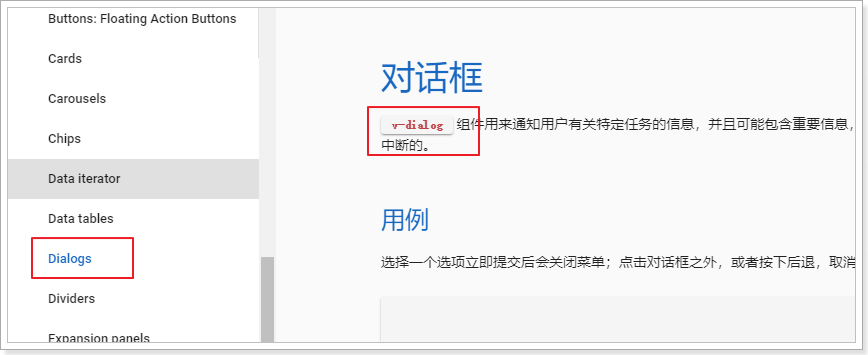

另外，我们可以通过文档看到对话框的一些属性：

- value：控制窗口的可见性，true可见，false，不可见
- max-width：控制对话框最大宽度
- scrollable ：是否可滚动，要配合v-card来使用，默认是false
- persistent ：点击弹窗以外的地方不会关闭弹窗，默认是false

现在，我们来使用一下。

首先，我们在data中定义一个show属性，来控制对话框的显示状态：

 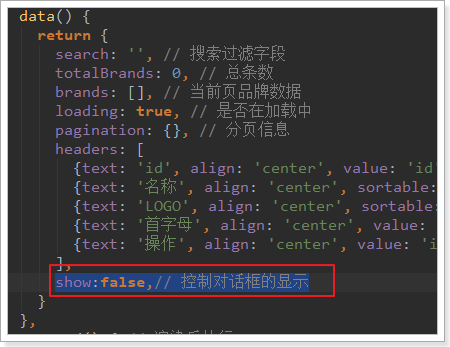

然后，在页面添加一个`v-dialog`

```html
<!--弹出的对话框-->
<v-dialog max-width="500" v-model="show" persistent>
    <v-card>
        <!--对话框的标题-->
        <v-toolbar dense dark color="primary">
            <v-toolbar-title>新增品牌</v-toolbar-title>
        </v-toolbar>
        <!--对话框的内容，表单-->
        <v-card-text class="px-5">
            我是表单
        </v-card-text>
    </v-card>
</v-dialog>
```

说明：

- 我们给dialog指定了3个属性，分别是

  - max-width：限制宽度
  - v-model：value值双向绑定到show变量，用来控制窗口显示
  - persisitent：控制窗口不会被意外关闭

- 因为可滚动需要配合`v-card`使用，因此我们在对话框中加入了一个`v-card`

  - 在`v-card`的头部添加了一个 `v-toolbar`，作为窗口的头部，并且写了标题为：新增品牌
    - dense：紧凑显示
    - dark：黑暗主题
    - color：颜色，primary就是整个网站的主色调，蓝色
  - 在`v-card`的内容部分，暂时空置，等会写表单

- `class=“px-5"`：vuetify的内置样式，含义是padding的x轴设置为5，这样表单内容会缩进一些，而不是顶着边框

  基本语法：`{property}{direction}-{size}`

  - property：属性，有两种`padding`和`margin`
    - `p`：对应`padding`
    - `m`：对应`margin`
  - direction：只padding和margin的作用方向，
    - `t` - 对应`margin-top`或者`padding-top`属性
    - `b` - 对应`margin-bottom` or `padding-bottom`
    - `l` - 对应`margin-left` or `padding-left`
    - `r` - 对应`margin-right` or `padding-right`
    - `x` - 同时对应`*-left`和`*-right`属性
    - `y` - 同时对应`*-top`和`*-bottom`属性
  - size：控制空间大小，基于`$spacer`进行倍增，`$spacer`默认是16px
    - `0`：将`margin`或padding的大小设置为0
    - `1` - 将`margin`或者`padding`属性设置为`$spacer * .25`
    - `2` - 将`margin`或者`padding`属性设置为`$spacer * .5`
    - `3` - 将`margin`或者`padding`属性设置为`$spacer`
    - `4` - 将`margin`或者`padding`属性设置为`$spacer * 1.5`
    - `5` - 将`margin`或者`padding`属性设置为`$spacer * 3`

### 1.1.2.实现弹窗的可见和关闭

> 窗口可见

接下来，我们要在点击新增品牌按钮时，将窗口显示，因此要给新增按钮绑定事件。

```js
<v-btn color="primary" @click="addBrand">新增品牌</v-btn>
```

然后定义一个addBrand方法：

```js
addBrand(){
    // 控制弹窗可见：
    this.show = true;
}
```

效果：


> 窗口关闭

现在，悲剧发生了，因为我们设置了persistent属性，窗口无法被关闭了。除非把show属性设置为false

因此我们需要给窗口添加一个关闭按钮：

```html
<!--对话框的标题-->
<v-toolbar dense dark color="primary">
    <v-toolbar-title>新增品牌</v-toolbar-title>
    <v-spacer/>
    <!--关闭窗口的按钮-->
    <v-btn icon @click="closeWindow"><v-icon>close</v-icon></v-btn>
</v-toolbar>
```

并且，我们还给按钮绑定了点击事件，回调函数为closeWindow。

接下来，编写closeWindow函数：

```js
closeWindow(){
    // 关闭窗口
    this.show = false;
}
```


效果：

 


### 1.1.3.新增品牌的表单页

接下来就是写表单了。我们有两种选择：

- 直接在dialog对话框中编写表单代码
- 另外编写一个组件，组件内写表单代码。然后在对话框引用组件

选第几种？


我们选第二种方案，优点：

- 表单代码独立组件，可拔插，方便后期的维护。
- 代码分离，可读性更好。


我们新建一个`MyBrandForm.vue`组件：

 

将MyBrandForm引入到MyBrand中，这里使用局部组件的语法：

先导入自定义组件：

```js
  // 导入自定义的表单组件
  import MyBrandForm from './MyBrandForm'
```

然后通过components属性来指定局部组件：

```js
components:{
    MyBrandForm
}
```

然后在页面中引用：


页面效果：

 

### 1.1.4.编写表单

#### 1.1.4.1.表单

查看文档，找到关于表单的部分：


`v-form`，表单组件，内部可以有许多输入项。`v-form`有下面的属性：

- value：true，代表表单验证通过；false，代表表单验证失败

`v-form`提供了两个方法：

- reset：重置表单数据
- validate：校验整个表单数据，前提是你写好了校验规则。返回Boolean表示校验成功或失败


我们在data中定义一个valid属性，跟表单的value进行双向绑定，观察表单是否通过校验，同时把等会要跟表单关联的品牌brand对象声明出来：

```js
  export default {
    name: "my-brand-form",
    data() {
      return {
        valid:false, // 表单校验结果标记
        brand:{
          name:'', // 品牌名称
          letter:'', // 品牌首字母
          image:'',// 品牌logo
          categories:[], // 品牌所属的商品分类数组
        }
      }
    }
  }
```

然后，在页面先写一个表单：

```html
<v-form v-model="valid">

</v-form>
```


#### 1.1.4.2.文本框

我们的品牌总共需要这些字段：

- 名称
- 首字母
- 商品分类，有很多个
- LOGO

表单项主要包括文本框、密码框、多选框、单选框、文本域、下拉选框、文件上传等。思考下我们的品牌需要哪些？

- 文本框：品牌名称、品牌首字母都属于文本框
- 文件上传：品牌需要图片，这个是文件上传框
- 下拉选框：商品分类提前已经定义好，这里需要通过下拉选框展示，提供给用户选择。

先看文本框，昨天已经用过的，叫做`v-text-field`：

 

查看文档，`v-text-field`有以下关键属性：

- **append-icon**：文本框后追加图标，需要填写图标名称。无默认值
- clearable：是否添加一个清空图标，点击会清空文本框。默认是false
- color：颜色
- counter：是否添加一个文本计数器，在角落显示文本长度，指定true或允许的组大长度。无默认值
- dark：是否应用黑暗色调，默认是false
- disable：是否禁用，默认是false
- flat：是否移除默认的动画效果，默认是false
- full-width：指定宽度为全屏，默认是false
- hide-details：是否因此错误提示，默认是false
- hint：输入框的提示文本
- **label**：输入框的标签
- **multi-line**：是否转为文本域，默认是false。文本框和文本域可以自由切换
- placeholder：输入框占位符文本，focus后消失
- **required**：是否为必填项，如果是，会在label后加*，不具备校验功能。默认是false
- **rows**：文本域的行数，`multi-line`为true时才有效
- **rules**：指定校验规则及错误提示信息，数组结构。默认[]
- **single-line**：是否单行文本显示，默认是false
- **suffix**：显示后缀

接下来，我们先添加两个字段：品牌名称、品牌的首字母，校验规则暂时不写：

```html
  <v-form v-model="valid">
    <v-text-field v-model="brand.name" label="请输入品牌名称" required />
    <v-text-field v-model="brand.letter" label="请输入品牌首字母" required />
  </v-form>
```

- 千万不要忘了通过`v-model`把表单项与`brand`的属性关联起来。

效果：


#### 1.1.4.3.级联下拉选框

接下来就是商品分类了，按照刚才的分析，商品分类应该是下拉选框。

但是大家仔细思考，商品分类包含三级。在展示的时候，应该是先由用户选中1级，才显示2级；选择了2级，才显示3级。形成一个多级分类的三级联动效果。

这个时候，就不是普通的下拉选框，而是三级联动的下拉选框！

这样的选框，在Vuetify中并没有提供（它提供的是基本的下拉框）。因此我已经给大家编写了一个无限级联动的下拉选框，能够满足我们的需求。

 

具体请参考课前资料的《自定义组件用法指南.md》

我们在代码中使用：

```js
    <v-cascader
      url="/item/category/list"
      multiple 
      required
      v-model="brand.categories"
      label="请选择商品分类"/>
```

- url：加载商品分类选项的接口路径
- multiple：是否多选，这里设置为true，因为一个品牌可能有多个分类
- requried：是否是必须的，这里为true，会在提示上加*，提醒用户
- v-model：关联我们brand对象的categories属性
- label：文字说明


效果：

 

data中获取的结果：

 


#### 1.1.4.4.文件上传项

在Vuetify中，也没有文件上传的组件。

还好，我已经给大家写好了一个文件上传的组件：

 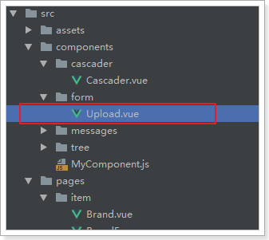

详细用法，参考《自定义组件使用指南.md》

我们添加上传的组件：

```html
<v-layout row>
    <v-flex xs3>
        <span style="font-size: 16px; color: #444">品牌LOGO：</span>
    </v-flex>
    <v-flex>
        <v-upload
             v-model="brand.image"
             url="/upload" 
             :multiple="false" 
             :pic-width="250" 
             :pic-height="90"
                  />
    </v-flex>
</v-layout>
```

注意：

- 文件上传组件本身没有提供文字提示。因此我们需要自己添加一段文字说明
- 我们要实现文字和图片组件左右放置，因此这里使用了`v-layout`布局组件：
  - layout添加了row属性，代表这是一行，如果是column，代表是多行
  - layout下面有`v-flex`组件，是这一行的单元，我们有2个单元
    - `<v-flex xs3>` ：显示文字说明，xs3是响应式布局，代表占12格中的3格
    - 剩下的部分就是图片上传组件了
- `v-upload`：图片上传组件，包含以下属性：
  - v-model：将上传的结果绑定到brand的image属性
  - url：上传的路径，我们先随便写一个。
  - multiple：是否运行多图片上传，这里是false。因为品牌LOGO只有一个
  - pic-width和pic-height：可以控制l图片上传后展示的宽高

最终结果：

 


#### 1.1.4.5.按钮

上面已经把所有的表单项写完。最后就差提交和清空的按钮了。

在表单的最下面添加两个按钮：

```html
    <v-layout class="my-4" row>
      <v-spacer/>
      <v-btn @click="submit" color="primary">提交</v-btn>
      <v-btn @click="clear" >重置</v-btn>
    </v-layout>
```

- 通过layout来进行布局，`my-4`增大上下边距
- `v-spacer`占用一定空间，将按钮都排挤到页面右侧
- 两个按钮分别绑定了submit和clear事件

我们先将方法定义出来：

```js
methods:{
    submit(){
        // 提交表单
    },
    clear(){
        // 重置表单
    }
}
```

重置表单相对简单，因为v-form组件已经提供了reset方法，用来清空表单数据。只要我们拿到表单组件对象，就可以调用方法了。

我们可以通过`$refs`内置对象来获取表单组件。

首先，在表单上定义`ref`属性：

 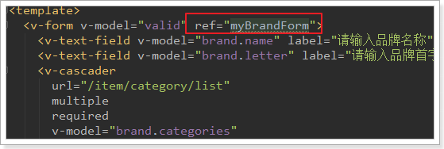

然后，在页面查看`this.$refs`属性：


看到`this.$refs`中只有一个属性，就是`myBrandForm`

我们在clear中来获取表单对象并调用reset方法：

```js
    methods:{
      submit(){
        // 提交表单
        console.log(this);
      },
      clear(){
        // 重置表单
        this.$refs.myBrandForm.reset();
        // 需要手动清空商品分类
        this.categories = [];
      }
    }
```

要注意的是，这里我们还手动把this.categories清空了，因为我写的级联选择组件并没有跟表单结合起来。需要手动清空。

### 1.1.5.表单校验

#### 1.1.5.1.校验规则

Vuetify的表单校验，是通过rules属性来指定的：


校验规则的写法：

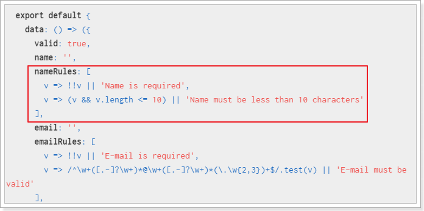

说明：

- 规则是一个数组
- 数组中的元素是一个函数，该函数接收表单项的值作为参数，函数返回值两种情况：
  - 返回true，代表成功，
  - 返回错误提示信息，代表失败

#### 1.1.5.2.项目中代码

我们有四个字段：

- name：做非空校验和长度校验，长度必须大于1
- letter：首字母，校验长度为1，非空。
- image：图片，不做校验，图片可以为空
- categories：非空校验，自定义组件已经帮我们完成，不用写了

首先，我们定义规则：

```js
nameRules:[
    v => !!v || "品牌名称不能为空",
    v => v.length > 1 || "品牌名称至少2位"
],
letterRules:[
    v => !!v || "首字母不能为空",
    v => /^[A-Z]{1}$/.test(v) || "品牌字母只能是A~Z的大写字母"
]
```

然后，在页面标签中指定：

```html
<v-text-field v-model="brand.name" label="请输入品牌名称" required :rules="nameRules" />
<v-text-field v-model="brand.letter" label="请输入品牌首字母" required :rules="letterRules" />
```

效果：

 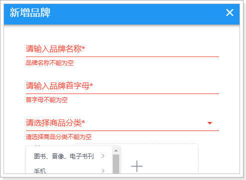


### 1.1.6.表单提交

在submit方法中添加表单提交的逻辑：

```js
submit() {
    // 1、表单校验
    if (this.$refs.myBrandForm.validate()) {
        // 2、定义一个请求参数对象，通过解构表达式来获取brand中的属性
        const {categories ,letter ,...params} = this.brand;
        // 3、数据库中只要保存分类的id即可，因此我们对categories的值进行处理,只保留id，并转为字符串
        params.cids = categories.map(c => c.id).join(",");
        // 4、将字母都处理为大写
        params.letter = letter.toUpperCase();
        // 5、将数据提交到后台
        this.$http.post('/item/brand', params)
            .then(() => {
            // 6、弹出提示
            this.$message.success("保存成功！");
        })
            .catch(() => {
            this.$message.error("保存失败！");
        });
    }
}
```

- 1、通过`this.$refs.myBrandForm`选中表单，然后调用表单的`validate`方法，进行表单校验。返回boolean值，true代表校验通过

- 2、通过解构表达式来获取brand中的值，categories和letter需要处理，单独获取。其它的存入params对象中

- 3、品牌和商品分类的中间表只保存两者的id，而brand.categories中保存的数对象数组，里面有id和name属性，因此这里通过数组的map功能转为id数组，然后通过join方法拼接为字符串

- 4、首字母都处理为大写保存

- 5、发起请求

- 6、弹窗提示成功还是失败，这里用到的是我们的自定义组件功能message组件：

  

  这个插件把`$message`对象绑定到了Vue的原型上，因此我们可以通过`this.$message`来直接调用。

  包含以下常用方法：

- info、error、success、warning等，弹出一个带有提示信息的窗口，色调与为普通（灰）、错误（红色）、成功（绿色）和警告（黄色）。使用方法：this.$message.info("msg")
- confirm：确认框。用法：`this.$message.confirm("确认框的提示信息")`，返回一个Promise

## 1.2.后台实现新增

### 1.2.1.controller

还是一样，先分析四个内容：

- 请求方式：刚才看到了是POST
- 请求路径：/brand
- 请求参数：brand对象，外加商品分类的id数组cids
- 返回值：无

代码：BrandController

```java
package com.leyou.item.web;

@RestController
@RequestMapping("brand")
public class BrandController {

    @Autowired
    private BrandService brandService;

    /**
     * 分页查询品牌
     * @param page
     * @param rows
     * @param sortBy
     * @param desc
     * @param key
     * @return
     */
    @GetMapping("page")
    public ResponseEntity<PageResult<Brand>> queryBrandByPage(
            @RequestParam(value = "page", defaultValue = "1") Integer page,
            @RequestParam(value = "rows", defaultValue = "5") Integer rows,
            @RequestParam(value = "sortBy", required = false) String sortBy,
            @RequestParam(value = "desc", defaultValue = "false") Boolean desc,
            @RequestParam(value = "key", required = false) String key
    ){
        PageResult<Brand> result = brandService.queryBrandByPage(page, rows, sortBy, desc, key);
        return ResponseEntity.ok(result);
    }
【1】
    /**
     * 新增品牌
     * @param brand
     * @param cids
     * @return
     */
    @PostMapping
    public ResponseEntity<Void> saveBrand(Brand brand, @RequestParam("cids") List<Long> cids){
        //如果有返回体写body（），如果没有就写build（）
        brandService.saveBrand(brand, cids);
        return ResponseEntity.status(HttpStatus.CREATED).build();
    }
【1】
}
```


### 1.2.2.Service

这里要注意，我们不仅要新增品牌，还要维护品牌和商品分类的中间表。

```java
@Transactional
public void saveBrand(Brand brand, List<Long> cids) {
    // 新增品牌信息
    this.brandMapper.insertSelective(brand);
    // 新增品牌和分类中间表
    for (Long cid : cids) {
        this.brandMapper.insertCategoryBrand(cid, brand.getId());
    }
}
```

这里调用了brandMapper中的一个自定义方法，来实现中间表的数据新增

添加自定义异常：


### 1.2.3.Mapper

通用Mapper只能处理单表，也就是Brand的数据，因此我们手动编写一个方法及sql，实现中间表的新增：

```java
public interface BrandMapper extends Mapper<Brand> {
    /**
     * 新增商品分类和品牌中间表数据
     * @param cid 商品分类id
     * @param bid 品牌id
     * @return
     */
    @Insert("INSERT INTO tb_category_brand (category_id, brand_id) VALUES (#{cid},#{bid})")
    int insertCategoryBrand(@Param("cid") Long cid, @Param("bid") Long bid);
}
```

## 1.3.请求参数格式错误

### 1.3.1.原因分析

我们填写表单并提交，发现报错了：

 

查看控制台的请求详情：

 


发现请求的数据格式是JSON格式。

> 原因分析：

axios处理请求体的原则会根据请求数据的格式来定：

- 如果请求体是对象：会转为json发送

- 如果请求体是String：会作为普通表单请求发送，但需要我们自己保证String的格式是键值对。

  如：name=jack&age=12

### 1.3.2.QS工具

query string

QS是一个第三方库，我们可以用`npm install qs --save`来安装。不过我们在项目中已经集成了，大家无需安装：

 

这个工具的名字：QS，即Query String，请求参数字符串。

什么是请求参数字符串？例如： name=jack&age=21

QS工具可以便捷的实现 JS的Object与QueryString的转换。


在我们的项目中，将QS注入到了Vue的原型对象中，我们可以通过`this.$qs`来获取这个工具：

我们将`this.$qs`对象打印到控制台：

```js
created(){
    console.log(this.$qs);
}
```

发现其中有3个方法：

 

这里我们要使用的方法是stringify，它可以把Object转为QueryString。


测试一下，使用浏览器工具，把qs对象保存为一个临时变量：

 

然后调用stringify方法：

 

成功将person对象变成了 name=jack&age=21的字符串了


### 1.3.3.解决问题

修改页面，对参数处理后发送：


然后再次发起请求：

 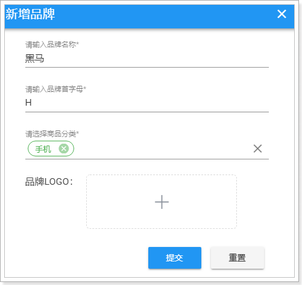

发现请求成功：

 

参数格式：

 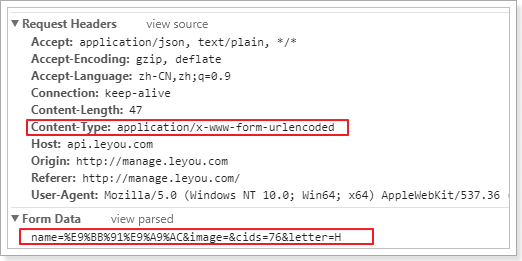

数据库：

 


## 1.4.新增完成后关闭窗口

我们发现有一个问题：新增不管成功还是失败，窗口都一致在这里，不会关闭。

这样很不友好，我们希望如果新增失败，窗口保持；但是新增成功，窗口关闭才对。


因此，我们需要**在新增的ajax请求完成以后，关闭窗口**

但问题在于，控制窗口是否显示的标记在父组件：MyBrand.vue中。子组件如何才能操作父组件的属性？或者告诉父组件该关闭窗口了？


之前我们讲过一个父子组件的通信，有印象吗？

- 第一步，在父组件中定义一个函数，用来关闭窗口，不过之前已经定义过了，我们优化一下，关闭的同时重新加载数据：

```js
closeWindow(){
    // 关闭窗口
    this.show = false;
    // 重新加载数据
    this.getDataFromServer();
}
```

- 第二步，父组件在使用子组件时，绑定事件，关联到这个函数：

```html
<!--对话框的内容，表单-->
<v-card-text class="px-5">
    <my-brand-form @close="closeWindow"/>
</v-card-text>
```

- 第三步，子组件通过`this.$emit`调用父组件的函数：

 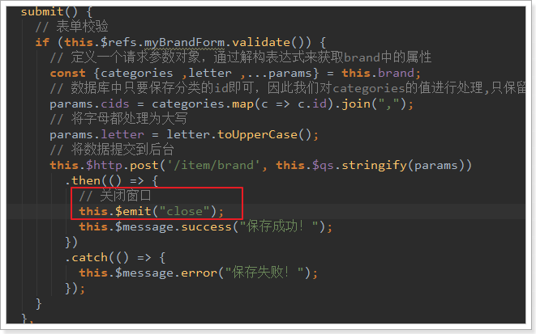


测试一下


# 2.实现图片上传

刚才的新增实现中，我们并没有上传图片，接下来我们一起完成图片上传逻辑。

**文件的上传并不只是在品牌管理中有需求，以后的其它服务也可能需要，因此我们创建一个独立的微服务，专门处理各种上传。**

## 2.1.搭建项目

### 2.1.1.创建module


### 2.1.2.依赖

我们需要EurekaClient和web依赖：

```xml
<?xml version="1.0" encoding="UTF-8"?>
<project xmlns="http://maven.apache.org/POM/4.0.0"
         xmlns:xsi="http://www.w3.org/2001/XMLSchema-instance"
         xsi:schemaLocation="http://maven.apache.org/POM/4.0.0 http://maven.apache.org/xsd/maven-4.0.0.xsd">
    <parent>
        <artifactId>leyou</artifactId>
        <groupId>com.leyou.parent</groupId>
        <version>1.0.0-SNAPSHOT</version>
    </parent>
    <modelVersion>4.0.0</modelVersion>

    <groupId>com.leyou.service</groupId>
    <artifactId>ly-upload</artifactId>


    <dependencies>
        <dependency>
            <groupId>org.springframework.cloud</groupId>
            <artifactId>spring-cloud-starter-netflix-eureka-client</artifactId>
        </dependency>
        <dependency>
            <groupId>org.springframework.boot</groupId>
            <artifactId>spring-boot-starter-web</artifactId>
        </dependency>
        <dependency>
            <groupId>org.springframework.boot</groupId>
            <artifactId>spring-boot-starter-test</artifactId>
        </dependency>
        <dependency>
            <groupId>com.leyou.common</groupId>
            <artifactId>ly-common</artifactId>
            <version>1.0.0-SNAPSHOT</version>
        </dependency>
    </dependencies>
</project>
```

### 2.1.3.编写配置

```yaml
server:
  port: 8083
spring:
  application:
    name: upload-service
  servlet:
    multipart:
      max-file-size: 5MB # 限制文件上传的大小
# Eureka
eureka:
  client:
    service-url:
      defaultZone: http://127.0.0.1:10086/eureka
  instance:
    #lease-renewal-interval-in-seconds: 5 # 每隔5秒发送一次心跳
    #lease-expiration-duration-in-seconds: 10 # 10秒不发送就过期
    prefer-ip-address: true
    ip-address: 127.0.0.1
    #instance-id: ${spring.application.name}:${server.port}
```

需要注意的是，我们应该添加了限制文件大小的配置

### 2.1.4.启动类

```java
package com.leyou;

import org.springframework.boot.SpringApplication;
import org.springframework.boot.autoconfigure.SpringBootApplication;
import org.springframework.cloud.client.discovery.EnableDiscoveryClient;

@SpringBootApplication
@EnableDiscoveryClient
public class LyUploadApplication {
    public static void main(String[] args) {
        SpringApplication.run(LyUploadApplication.class, args);
    }
}
```

结构：

 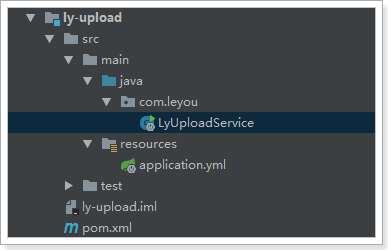


## 2.2.编写上传功能

### 2.2.1.controller

编写controller需要知道4个内容：

- 请求方式：上传肯定是POST
- 请求路径：/upload/image
- 请求参数：文件，参数名是file，SpringMVC会封装为一个接口：MultipleFile
- 返回结果：上传成功后得到的文件的url路径

代码如下：

```java
package com.leyou.web;

@RestController
@RequestMapping("upload")
public class UploadController {

    @Autowired
    private UploadService uploadService;

    /**
     * 上传图片
     * @param file
     * @return 返回图片URL
     */
    @PostMapping("image")
    public ResponseEntity<String> uploadImage(@RequestParam("file") MultipartFile file) {
        String url = uploadService.uploadImage(file);
        return ResponseEntity.ok(url);
    }
}

```


### 2.2.2.service

在上传文件过程中，我们需要对上传的内容进行校验：

1. 校验文件大小
2. 校验文件的媒体类型
3. 校验文件的内容

文件大小在Spring的配置文件中设置，因此已经会被校验，我们不用管。

具体代码：

```java
package com.leyou.service;

@Service
@Slf4j
public class UploadService {

    private static final List<String> ALLOW_TYPES = Arrays.asList("image/png", "image/jpeg", "image/bmp");

    public String uploadImage(MultipartFile file) {

        try {
            //校验文件类型
            String contentType = file.getContentType();
            if (!ALLOW_TYPES.contains(contentType)){
                throw new LyException(ExceptionEnum.INVALID_FILE_TYPE);
            }


            //校验文件内容
            BufferedImage image = ImageIO.read(file.getInputStream());
            if (image == null) {
                throw new LyException(ExceptionEnum.INVALID_FILE_TYPE);
            }

            //准备目标路径
            File dest = new File("E:/Develop/Projects/IdeaProjects/leyou_upload", file.getOriginalFilename());
            //保存文件到本地
            file.transferTo(dest);

            //返回路径（先写一个假的返回路径）
            return "http://image.leyou.com/" + file.getOriginalFilename();
        } catch (IOException e) {
            //上传失败
            log.error("上传文件失败!", e);
            throw new LyException(ExceptionEnum.UPLOAD_FILE_ERROR);
        }
    }
}
```


这里有一个问题：为什么图片地址需要使用另外的url？

- 图片不能保存在服务器内部，这样会对服务器产生额外的加载负担
- 一般静态资源都应该使用独立域名，这样访问静态资源时不会携带一些不必要的cookie，减小请求的数据量

当前目录结构：

 

### 2.2.3.测试上传

我们通过RestClient工具来测试：

 

结果：

 

去目录下查看：

 

上传成功！


### 忽略路由前缀


------

### 2.2.4.绕过网关缓存

网关是我们整个微服务的入口，所有的服务都经过网关。


nginx.conf

```nginx
#user  nobody;
worker_processes  1;

events {
    worker_connections  1024;
}


http {
    include       mime.types;
    default_type  application/octet-stream;

    sendfile        on;
    
    keepalive_timeout  65;

    #gzip  on;
	server {
        listen       80;
        server_name  manage.leyou.com;
        
        proxy_set_header X-Forwarded-Host $host;
        proxy_set_header X-Forwarded-Server $host;
        proxy_set_header X-Forwarded-For $proxy_add_x_forwarded_for;
        
    	location / {
            proxy_pass http://192.168.1.105:9001; #主机地址 下的9001端口
            proxy_connect_timeout 600;
            proxy_read_timeout 600;
        }    
    }
    server {
        listen       80;
        server_name  api.leyou.com;
        
        proxy_set_header X-Forwarded-Host $host;
        proxy_set_header X-Forwarded-Server $host;
        proxy_set_header X-Forwarded-For $proxy_add_x_forwarded_for;
        
		【1】
		location /api/upload {
			rewrite "^/(.*)$" /zuul/$1;
		}
		【1】
		
    	location / {
            proxy_pass http://192.168.1.105:10010; #主机地址 下的10010端口
            proxy_connect_timeout 600;
            proxy_read_timeout 600;
        } 
    }
    server {
        listen       80;
        server_name  localhost;

        location / {
            root   html;
            index  index.html index.htm;
        }
        
        error_page   500 502 503 504  /50x.html;
        location = /50x.html {
            root   html;
        }
    }
}
```


### 2.2.6.之前上传的缺陷

先思考一下，之前上传的功能，有没有什么问题？

上传本身没有任何问题，问题出在保存文件的方式，我们是保存在服务器机器，就会有下面的问题：

- 单机器存储，存储能力有限
- 无法进行水平扩展，因为多台机器的文件无法共享,会出现访问不到的情况
- 数据没有备份，有单点故障风险
- 并发能力差

这个时候，最好使用分布式文件存储来代替本地文件存储。

# 3.FastDFS

## 3.1.什么是分布式文件系统

分布式文件系统（Distributed File System）是指文件系统管理的物理存储资源不一定直接连接在本地节点上，而是通过计算机网络与节点相连。 

通俗来讲：

- 传统文件系统管理的文件就存储在本机。
- 分布式文件系统管理的文件存储在很多机器，这些机器通过网络连接，要被统一管理。无论是上传或者访问文件，都需要通过管理中心来访问

## 3.2.什么是FastDFS

FastDFS是由淘宝的余庆先生所开发的一个轻量级、高性能的开源分布式文件系统。用纯C语言开发，功能丰富：

- 文件存储
- 文件同步
- 文件访问（上传、下载）
- 存取负载均衡
- 在线扩容

适合有大容量存储需求的应用或系统。同类的分布式文件系统有谷歌的GFS、HDFS（Hadoop）、TFS（淘宝）等。

## 3.3.FastDFS的架构

### 3.3.1.架构图

先上图：

 

FastDFS两个主要的角色：Tracker Server 和 Storage Server 。

- Tracker Server：跟踪服务器，主要负责调度storage节点与client通信，在访问上起负载均衡的作用，和记录storage节点的运行状态，是连接client和storage节点的枢纽。 

- Storage Server：存储服务器，保存文件和文件的meta data（元数据），每个storage server会启动一个单独的线程主动向Tracker cluster中每个tracker server报告其状态信息，包括磁盘使用情况，文件同步情况及文件上传下载次数统计等信息

- Group：文件组，多台Storage Server的集群。上传一个文件到同组内的一台机器上后，FastDFS会将该文件即时同步到同组内的其它所有机器上，起到备份的作用。不同组的服务器，保存的数据不同，而且相互独立，不进行通信。 

- Tracker Cluster：跟踪服务器的集群，有一组Tracker Server（跟踪服务器）组成。

- Storage Cluster ：存储集群，有多个Group组成。

  ### 3.3.2.上传和下载流程

> 上传

 

1. Client通过Tracker server查找可用的Storage server。
2. Tracker server向Client返回一台可用的Storage server的IP地址和端口号。
3. Client直接通过Tracker server返回的IP地址和端口与其中一台Storage server建立连接并进行文件上传。
4. 上传完成，Storage server返回Client一个文件ID，文件上传结束。

> 下载

 

1. Client通过Tracker server查找要下载文件所在的的Storage server。
2. Tracker server向Client返回包含指定文件的某个Storage server的IP地址和端口号。
3. Client直接通过Tracker server返回的IP地址和端口与其中一台Storage server建立连接并指定要下载文件。
4. 下载文件成功。


## 3.4.Centos下安装和使用FastDFS(也有nginx的安装)

==安装之前，先做快照，如果失败还有备份。==

### 1.1 上传


（创建用户leyou之前已经做过了。）

将课前资料中的文件上传到linux下的`/home/leyou/fdfs`目录:**没有fdfs目录要先创建**

`mkdir /home/leyou/fdfs`

 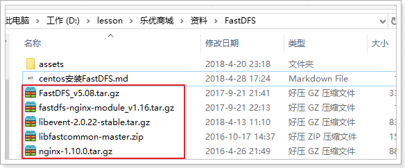

（nginx之前已经装过了，所以装上传前四个就行。）

### 1.2 安装依赖

**做这些步骤之前，建议做个快照：（相当于备份）安装失败可以转到最初的样子，避免不必要的重装系统。**

( tips: 安装过程中注意出错，有错解决再继续。)

FastDFS运行需要一些依赖，在课前资料提供的虚拟中已经安装好了这些依赖，如果大家想要从头学习，可以按下面方式安装：

#### 1.2.1 安装GCC依赖

GCC用来对C语言代码进行编译运行，使用yum命令安装：

```shell
yum -y install gcc
```

#### 1.2.2 安装unzip工具

unzip工具可以帮我们对压缩包进行解压

```shell
yum install -y unzip zip
```

#### 1.2.3 安装libevent

```shell
yum -y install libevent
```

#### 1.2.4 安装Nginx所需依赖

```shell
yum -y install pcre pcre-devel zlib zlib-devel openssl openssl-devel
```


#### 1.2.5 安装libfastcommon-master

这个没有yum包，只能通过编译安装：

- 解压刚刚上传的`libfastcommon-master.zip`

  ```shell
  unzip libfastcommon-master.zip
  ```

- 进入解压完成的目录：

  ```shell
  cd libfastcommon-master
  ```

- 编译并且安装：

  ```shell
  ./make.sh 
  ./make.sh install
  ```


到这里为止，所有依赖都已经安装完毕，接下来我们安装FastDFS：

### 1.3 安装FastDFS

#### 1.3.1 编译安装

这里我们也采用编译安装，步骤与刚才的编译安装方式一样：

`cd /home/leyou/fdfs`

- 解压

  ```shell
  tar -xvf FastDFS_v5.08.tar.gz
  ```

- 进入目录

  ```he
  cd FastDFS
  ```

- 编译并安装

  ```shell
  ./make.sh 
  ./make.sh install
  ```

- 校验安装结果

1）安装完成，我们应该能在`/etc/init.d/`目录，通过命令`ll /etc/init.d/ | grep fdfs`看到FastDFS提供的启动脚本：

 

其中：

- `fdfs_trackerd` 是tracker启动脚本
- `fdfs_storaged` 是storage启动脚本


2）我们可以在 `/etc/fdfs`目录，通过` ll `命令查看到以下配置文件模板：

 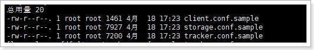

其中：

- `tarcker.conf.sample` 是tracker的配置文件模板
- `storage.conf.sample` 是storage的配置文件模板
- `client.conf.sample` 是客户端的配置文件模板


#### 1.3.2 启动tracker

FastDFS的tracker和storage在刚刚的安装过程中，都已经被安装了，因此我们安装这两种角色的方式是一样的。不同的是，两种需要不同的配置文件。

我们要启动tracker，就修改刚刚看到的`tarcker.conf`，并且启动`fdfs_trackerd`脚本即可。

```
cd /etc/fdfs

```

- 编辑tracker配置

首先我们将模板文件进行赋值和重命名：

```shell
cp tracker.conf.sample tracker.conf
vim tracker.conf
```

打开`tracker.conf`，修改`base_path`配置：

```shell
base_path=/leyou/fdfs/tracker # tracker的数据和日志存放目录
```

- 创建目录

刚刚配置的目录可能不存在，我们创建出来

```shell
mkdir -p /leyou/fdfs/tracker
```

- 启动tracker

  我们可以使用 `sh /etc/init.d/fdfs_trackerd` 启动，不过安装过程中，fdfs已经被设置为系统服务，我们可以采用熟悉的服务启动方式：

```shell
service fdfs_trackerd start # 启动fdfs_trackerd服务，停止用stop
```

启动后，`ps -ef | grep fdfs`查看是否启动。

 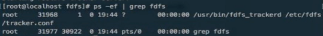

另外，我们可以通过以下命令，设置tracker开机启动：  

```shell
chkconfig fdfs_trackerd on
```


#### 1.3.3 启动storage


我们要启动tracker，就修改刚刚看到的`tarcker.conf`，并且启动`fdfs_trackerd`脚本即可。

- 编辑storage配置

首先我们将模板文件进行赋值和重命名：

```shell
cp storage.conf.sample storage.conf
vim storage.conf
```

打开`storage.conf`，修改`base_path`配置：应用`/`搜索功能寻找相应位置

```shell
base_path=/leyou/fdfs/storage # storage的数据和日志存放目录
store_path0=/leyou/fdfs/storage # storage的上传文件存放路径
tracker_server=192.168.50.128:22122 # tracker的地址
```

- 创建目录

刚刚配置的目录可能不存在，我们创建出来

```shell
mkdir -p /leyou/fdfs/storage
```

- 启动storage

  我们可以使用 `sh /etc/init.d/fdfs_storaged` 启动，同样我们可以用服务启动方式：

```shell
service fdfs_storaged start  # 启动fdfs_storaged服务，停止用stop
```

另外，我们可以通过以下命令，设置tracker开机启动：

```shell
chkconfig fdfs_storaged on
```


最后，通过`ps -ef | grep fdfs` 查看进程：


#### 1.3.4利用提供的客户端测试文件上传

- 编辑client配置，进入 `/etc/fdfs`目录，修改client.conf

首先我们将模板文件进行赋值和重命名：

```shell
cp client.conf.sample client.conf
vim client.conf
```

打开`client.conf`，修改`base_path`配置：应用`/`搜索功能寻找相应位置

```shell
base_path=/tmp    # 放在临时目录
tracker_server=192.168.50.128:22122  # tracker的地址
```

在` /tmp` 目录下用 Filezilla 放入一张图片 : 例如 `1.jpeg   `

然后，运行：

```
cd /etc/fdfs

```

```shell
/usr/bin/fdfs_upload_file client.conf /tmp/1.jpeg
```

返回了一个文件的id，证明文件上传成功

 

 

`group1/M00/00/00/wKgygFy7sOWAAfKtAAD3YcnJuXk00.jpeg`

根据文件的id信息，可以找到文件：

 


继续：


### 1.4 安装Nginx及FastDFS模块


#### 1.4.1 FastDFS的Nginx模块


```
cd /home/leyou/fdfs

```

- 解压

  ```shell
  tar -xvf fastdfs-nginx-module_v1.16.tar.gz
  ```

  

- 配置config文件

  ```shell
  # 进入配置目录
  cd /home/leyou/fdfs/fastdfs-nginx-module/src/
  # 修改配置
  vim config
  # 直接在最下面执行下面命令，保存退出（将配置中的/usr/local改为/usr）：
  :%s+/usr/local/+/usr/+g
  ```

  

- 配置mod_fastdfs.conf

  ```shell
  # 将src目录下的mod_fastdfs.conf复制到 /etc/fdfs目录：
  cp mod_fastdfs.conf /etc/fdfs/
  # 编辑该文件
  cd /etc/fdfs/
  vim mod_fastdfs.conf
  ```

- 修改一下配置：

  ```shell
  connect_timeout=10                  		# 客户端访问文件连接超时时长（单位：秒）
  tracker_server=192.168.50.128:22122  	# tracker服务IP和端口
  url_have_group_name=true            		# 访问链接前缀加上组名
  store_path0=/leyou/fdfs/storage        		# 文件存储路径
  ```

- 复制 FastDFS的部分配置文件到/etc/fdfs目录

  ```shell
  cd /home/leyou/fdfs/FastDFS/conf/
  cp http.conf mime.types /etc/fdfs/
  ```

  `cd /etc/fdfs/` 用`ll`命令查看


继续：

#### 1.4.2 安装Nginx

==是否安装过nginx？==

依赖安装：

```
Linux下切记不能乱删东西！我把pcre强制删除后，什么命令都不能使用了，系统奔溃，血的教训！


nginx是C语言开发，建议在linux上运行，本教程使用Centos6.4作为安装环境。

**一、  gcc**

       安装nginx需要先将官网下载的源码进行编译，编译依赖gcc环境，如果没有gcc环境，需要安装gcc：

　　yum install gcc-c++

**二、  PCRE**

       PCRE(Perl Compatible Regular Expressions)是一个Perl库，包括 perl 兼容的正则表达式库。nginx的http模块使用pcre来解析正则表达式，所以需要在linux上安装pcre库。

　　yum install -y pcre pcre-devel

注：pcre-devel是使用pcre开发的一个二次开发库。nginx也需要此库。

**三、  zlib**

       zlib库提供了很多种压缩和解压缩的方式，nginx使用zlib对http包的内容进行gzip，所以需要在linux上安装zlib库。

　　yum install -y zlib zlib-devel

 

**四、  openssl**

       OpenSSL 是一个强大的安全套接字层密码库，囊括主要的密码算法、常用的密钥和证书封装管理功能及SSL协议，并提供丰富的应用程序供测试或其它目的使用。

       nginx不仅支持http协议，还支持https（即在ssl协议上传输http），所以需要在linux安装openssl库。

　　yum install -y openssl openssl-devel


```


##### 没有安装过nginx

> 如果==没有安装==过nginx

- 解压：进入/home/leyou/目录

  ```shell
  tar -xvf nginx-1.10.0.tar.gz
  ```

  

- 配置

  进入nginx目录

  `cd  nginx-1.10.0`

  ```shell
  ./configure --prefix=/opt/nginx --sbin-path=/usr/bin/nginx --add-module=/home/leyou/fdfs/fastdfs-nginx-module/src
  ```

  这里指定安装的目录是在：  /opt/nginx 下。

  

- 编译安装

  ```shell
  make && sudo make install
  ```

  

  

##### 已经安装过nginx

> 如果==已经安装==过nginx

进入解压好的安装包

`cd  /home/leyou/nginx-1.10.0`


配置

```shell
./configure --prefix=/opt/nginx --sbin-path=/usr/bin/nginx --add-module=/home/leyou/fdfs/fastdfs-nginx-module/src
```


**编译，不要安装**

```
make

```

 

cd objs/ 看到nginx运行脚本，证明编译没有问题。


因为要用现在的nginx替换以前的，备份之前的nginx，以防出现问题：

```
cp /usr/bin/nginx /usr/bin/nginx-bck

```


把刚刚编译的nginx替换之前安装过的nginx ：

替换之前先停掉 ： `nginx -s stop`

`cd /home/leyou/nginx-1.10.0/objs/`

```
cp nginx /usr/bin/

```


##### 配置nginx和FastDFS模块

> 配置nginx和FastDFS模块

添加虚拟机监听的域名：192.168.50.128 image.leyou.com，然后把它指向FastDFS

 


- 配置nginx整合fastdfs-module模块

  我们需要修改nginx配置文件，在/opt/nginx/conf/nginx.conf文件中：

  ```shell
  vim  /opt/nginx/conf/nginx.conf
  ```

  我们也可以使用Filezilla软件修改。

  在文件中，添加如下代码：

  ```nginx
      server {
          listen       80;
          server_name  image.leyou.com;
  
      	# 监听域名中带有group的，交给FastDFS模块处理
          location ~/group([0-9])/ {
              ngx_fastdfs_module;
          }
  
          location / {
              root   html;
              index  index.html index.htm;
          }
  
          error_page   500 502 503 504  /50x.html;
          location = /50x.html {
              root   html;
          }
      }
  ```

- 启动nginx

  ```
  nginx
  
  ```

  如果看到这行代码，证明你的FastDFS的nginx模块已经运行起来了。

   

  然后访问：http://image.leyou.com/group1/M00/00/00/wKgygFy7sOWAAfKtAAD3YcnJuXk00.jpeg

  

   

  成功看到图片。

  

  ```shell
  nginx # 启动
  nginx -s stop # 停止
  nginx -s reload # 重新加载配置
  ```


- 设置nginx开机启动

  创建一个开机启动的脚本：

  ```shell
  vim /etc/init.d/nginx
  ```

  添加以下内容：（这是一个自启动脚本，注意下面那两个地址，如果不一致需要修改）

  ```sh
  #!/bin/sh
  #
  # nginx - this script starts and stops the nginx daemon
  #
  # chkconfig:   - 85 15
  # description:  NGINX is an HTTP(S) server, HTTP(S) reverse \
  #               proxy and IMAP/POP3 proxy server
  # processname: nginx
  # config:      /etc/nginx/nginx.conf
  # config:      /etc/sysconfig/nginx
  # pidfile:     /var/run/nginx.pid
  
  # Source function library.
  . /etc/rc.d/init.d/functions
  
  # Source networking configuration.
  . /etc/sysconfig/network
  
  # Check that networking is up.
  [ "$NETWORKING" = "no" ] && exit 0
  
  nginx="/usr/bin/nginx"  			 #nginx脚本文件的地址
  prog=$(basename $nginx)
  
  NGINX_CONF_FILE="/opt/nginx/conf/nginx.conf"    			#ngin配置文件的地址
  
  [ -f /etc/sysconfig/nginx ] && . /etc/sysconfig/nginx
  
  lockfile=/var/lock/subsys/nginx
  
  make_dirs() {
     # make required directories
     user=`$nginx -V 2>&1 | grep "configure arguments:.*--user=" | sed 's/[^*]*--user=\([^ ]*\).*/\1/g' -`
     if [ -n "$user" ]; then
        if [ -z "`grep $user /etc/passwd`" ]; then
           useradd -M -s /bin/nologin $user
        fi
        options=`$nginx -V 2>&1 | grep 'configure arguments:'`
        for opt in $options; do
            if [ `echo $opt | grep '.*-temp-path'` ]; then
                value=`echo $opt | cut -d "=" -f 2`
                if [ ! -d "$value" ]; then
                    # echo "creating" $value
                    mkdir -p $value && chown -R $user $value
                fi
            fi
         done
      fi
  }
  
  start() {
      [ -x $nginx ] || exit 5
      [ -f $NGINX_CONF_FILE ] || exit 6
      make_dirs
      echo -n $"Starting $prog: "
      daemon $nginx -c $NGINX_CONF_FILE
      retval=$?
      echo
      [ $retval -eq 0 ] && touch $lockfile
      return $retval
  }
  
  stop() {
      echo -n $"Stopping $prog: "
      killproc $prog -QUIT
      retval=$?
      echo
      [ $retval -eq 0 ] && rm -f $lockfile
      return $retval
  }
  
  restart() {
      configtest || return $?
      stop
      sleep 1
      start
  }
  
  reload() {
      configtest || return $?
      echo -n $"Reloading $prog: "
      killproc $nginx -HUP
      RETVAL=$?
      echo
  }
  
  force_reload() {
      restart
  }
  
  configtest() {
    $nginx -t -c $NGINX_CONF_FILE
  }
  
  rh_status() {
      status $prog
  }
  
  rh_status_q() {
      rh_status >/dev/null 2>&1
  }
  
  case "$1" in
      start)
          rh_status_q && exit 0
          $1
          ;;
      stop)
          rh_status_q || exit 0
          $1
          ;;
      restart|configtest)
          $1
          ;;
      reload)
          rh_status_q || exit 7
          $1
          ;;
      force-reload)
          force_reload
          ;;
      status)
          rh_status
          ;;
      condrestart|try-restart)
          rh_status_q || exit 0
              ;;
      *)
          echo $"Usage: $0 {start|stop|status|restart|condrestart|try-restart|reload|force-reload|configtest}"
          exit 2
  esac
  
  ```

- 修改文件权限，并加入服务列表

  ```shell
  # 修改权限   777为最高权限
  chmod 777 /etc/init.d/nginx 
  # 添加到服务列表
  chkconfig --add /etc/init.d/nginx 
  ```

- 设置开机启动

  ```shell
  chkconfig nginx on
  ```

  


## 3.5.java客户端

余庆先生提供了一个Java客户端，但是作为一个C程序员，写的java代码可想而知。而且已经很久不维护了。

这里推荐一个开源的FastDFS客户端，支持最新的SpringBoot2.0。

配置使用极为简单，支持连接池，支持自动生成缩略图，狂拽酷炫吊炸天啊，有木有。

地址：[tobato/FastDFS_client](https://github.com/tobato/FastDFS_Client)

 

### 3.5.1.引入依赖

在父工程中，我们已经管理了依赖，版本为：

```xml
<fastDFS.client.version>1.26.2</fastDFS.client.version>
```

因此，这里我们直接引入坐标即可：在ly-upload

```xml
<!--FastDFS客户端-->
<dependency>
    <groupId>com.github.tobato</groupId>
    <artifactId>fastdfs-client</artifactId>
</dependency>
```


### 3.5.2.引入配置类

纯java配置：在ly-upload

```java
@Configuration
@Import(FdfsClientConfig.class)
// 解决jmx重复注册bean的问题
@EnableMBeanExport(registration = RegistrationPolicy.IGNORE_EXISTING)
public class FastClientImporter {
}
```

### 3.5.3.编写FastDFS属性

在ly-upload

```yaml
server:
  port: 8083
spring:
  application:
    name: upload-service
  servlet:
    multipart:
      max-file-size: 5MB # 限制文件上传的大小
# Eureka
eureka:
  client:
    service-url:
      defaultZone: http://127.0.0.1:10086/eureka
  instance:
    #lease-renewal-interval-in-seconds: 5 # 每隔5秒发送一次心跳
    #lease-expiration-duration-in-seconds: 10 # 10秒不发送就过期
    prefer-ip-address: true
    ip-address: 127.0.0.1
    #instance-id: ${spring.application.name}:${server.port}
 【1】
fdfs:
  so-timeout: 2500
  connect-timeout: 600
  thumb-image: # 图片展示缩略图
    width: 60
    height: 60
  tracker-list: # tracker地址
    - 192.168.50.128:22122
 【1】
```

### 3.5.4.测试

```java
package com.leyou.upload;

import com.github.tobato.fastdfs.domain.StorePath;
import com.github.tobato.fastdfs.domain.ThumbImageConfig;
import com.github.tobato.fastdfs.service.FastFileStorageClient;
import org.junit.Test;
import org.junit.runner.RunWith;
import org.springframework.beans.factory.annotation.Autowired;
import org.springframework.boot.test.context.SpringBootTest;
import org.springframework.test.context.junit4.SpringRunner;

import java.io.File;
import java.io.FileInputStream;
import java.io.FileNotFoundException;

@RunWith(SpringRunner.class)
@SpringBootTest
public class FdfsTest {

    @Autowired
    private FastFileStorageClient storageClient;

    @Autowired
    private ThumbImageConfig thumbImageConfig;

    @Test
    public void testUpload() throws FileNotFoundException {
        File file = new File("E:\\Develop\\Projects\\IdeaProjects\\leyou_upload\\1.jpeg");
        // 上传并且生成缩略图
        StorePath storePath = this.storageClient.uploadFile(
                new FileInputStream(file), file.length(), "jpeg", null);
        // 带分组的路径
        System.out.println(storePath.getFullPath());
        // 不带分组的路径
        System.out.println(storePath.getPath());
    }

    @Test
    public void testUploadAndCreateThumb() throws FileNotFoundException {
        File file = new File("E:\\Develop\\Projects\\IdeaProjects\\leyou_upload\\1.jpeg");
        // 上传并且生成缩略图
        StorePath storePath = this.storageClient.uploadImageAndCrtThumbImage(
                new FileInputStream(file), file.length(), "jpeg", null);
        // 带分组的路径
        System.out.println(storePath.getFullPath());
        // 不带分组的路径
        System.out.println(storePath.getPath());
        // 获取缩略图路径
        String path = thumbImageConfig.getThumbImagePath(storePath.getPath());
        System.out.println(path);
    }
}
```

结果：

```java
group1/M00/00/00/wKgygFy7v3CARejxAAD3YcnJuXk27.jpeg
M00/00/00/wKgygFy7v3CARejxAAD3YcnJuXk27.jpeg
M00/00/00/wKgygFy7v3CARejxAAD3YcnJuXk27_60x60.jpeg
```

访问第一个路径：


访问最后一个路径（缩略图路径），注意加组名：

 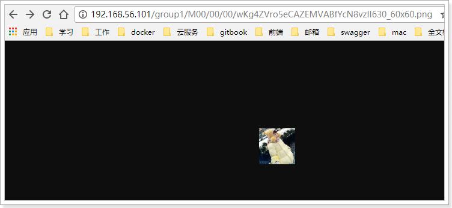


### 3.5.5.改造上传逻辑

UploadService

```java
package com.leyou.upload.service;

@Service
@Slf4j
public class UploadService {

    @Autowired
    private FastFileStorageClient storageClient;

    private static final List<String> ALLOW_TYPES = Arrays.asList("image/png", "image/jpeg", "image/bmp");

    public String uploadImage(MultipartFile file) {

        try {
            //校验文件类型
            String contentType = file.getContentType();
            if (!ALLOW_TYPES.contains(contentType)){
                throw new LyException(ExceptionEnum.INVALID_FILE_TYPE);
            }


            //校验文件内容
            BufferedImage image = ImageIO.read(file.getInputStream());
            if (image == null) {
                throw new LyException(ExceptionEnum.INVALID_FILE_TYPE);
            }

            //上传到FastDFS
            // 获取图片后缀名jpeg
            String extension = StringUtils.substringAfterLast(file.getOriginalFilename(), ".");
            StorePath storePath = storageClient.uploadFile(file.getInputStream(), file.getSize(), extension, null);

            //返回路径
            return "http://image.leyou.com/" + storePath.getFullPath();
        } catch (IOException e) {
            //上传失败
            log.error("上传文件失败!", e);
            throw new LyException(ExceptionEnum.UPLOAD_FILE_ERROR);
        }
    }
}

```


#### 将配置上传到yaml文件

只需要把原来保存文件的逻辑去掉，然后上传到FastDFS即可。

但此时的//返回路径 和 ALLOW_TYPES都是写死的，我们要把他们抽取到application.yaml中：

```
server:
  port: 8083
spring:
  application:
    name: upload-service
  servlet:
    multipart:
      max-file-size: 5MB # 限制文件上传的大小
# Eureka
eureka:
  client:
    service-url:
      defaultZone: http://127.0.0.1:10086/eureka
  instance:
    #lease-renewal-interval-in-seconds: 5 # 每隔5秒发送一次心跳
    #lease-expiration-duration-in-seconds: 10 # 10秒不发送就过期
    prefer-ip-address: true
    ip-address: 127.0.0.1
    #instance-id: ${spring.application.name}:${server.port}
fdfs:
  so-timeout: 2500
  connect-timeout: 600
  thumb-image: # 缩略图
    width: 60
    height: 60
  tracker-list: # tracker地址
    - 192.168.50.128:22122
【1】
#返回路径 和 ALLOW_TYPES都是写死的，我们要把他们抽取,自定义的
ly:
  upload:
    baseUrl: http://image.leyou.com/
    allowTypes:    #allowTypes是一个数组，这样写
      - image/png
      - image/jpeg
      - image/bmp
 【1】

```

加载配置：

创建UploadProperties

```java
package com.leyou.upload.config;

import lombok.Data;
import org.springframework.boot.context.properties.ConfigurationProperties;

import java.util.List;

@Data
@ConfigurationProperties(prefix = "ly.upload")
public class UploadProperties {
    private String baseUrl;
    private List<String> allowTypes;
}

```


发现警告，去掉√ 即可

 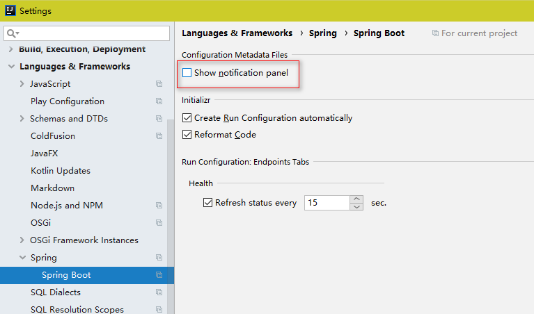

修改UploadService：

```java
package com.leyou.upload.service;

@Service
@Slf4j
@EnableConfigurationProperties(UploadProperties.class)  		【1】
public class UploadService {

    @Autowired
    private FastFileStorageClient storageClient;
【2】
    @Autowired
    private UploadProperties prop;

    //private static final List<String> ALLOW_TYPES = Arrays.asList("image/png", "image/jpeg", "image/bmp");
【2】
    public String uploadImage(MultipartFile file) {

        try {
            //校验文件类型
            String contentType = file.getContentType();
            if (!prop.getAllowTypes().contains(contentType)){			【3】
                throw new LyException(ExceptionEnum.INVALID_FILE_TYPE);
            }


            //校验文件内容
            BufferedImage image = ImageIO.read(file.getInputStream());
            if (image == null) {
                throw new LyException(ExceptionEnum.INVALID_FILE_TYPE);
            }

            //上传到FastDFS
            // 获取图片后缀名jpeg
            String extension = StringUtils.substringAfterLast(file.getOriginalFilename(), ".");
            StorePath storePath = storageClient.uploadFile(file.getInputStream(), file.getSize(), extension, null);

            //返回路径
            return prop.getBaseUrl() + storePath.getFullPath();			【4】
        } catch (IOException e) {
            //上传失败
            log.error("[文件上传] 上传文件失败!", e);
            throw new LyException(ExceptionEnum.UPLOAD_FILE_ERROR);
        }
    }
}

```

目前的目录结构：

 


### 3.5.6.测试

#### nginx文件大小限制

 通过Insomnia测试，图片4.jpg（1.9M），显示图片Too Large太大

 

问题解决：

```
vim /opt/nginx/conf/nginx.conf

```

```nginx
#user  nobody;
worker_processes  1;

events {
    worker_connections  1024;
}


http {
    include       mime.types;
    default_type  application/octet-stream;
	client_max_body_size 10m;   		#限制上传文件大小               【1】

    sendfile        on;
    #tcp_nopush     on;

    #keepalive_timeout  0;
    keepalive_timeout  65;

    #gzip  on;
	server {
        listen       80;
        server_name  manage.leyou.com;
        
        proxy_set_header X-Forwarded-Host $host;
        proxy_set_header X-Forwarded-Server $host;
        proxy_set_header X-Forwarded-For $proxy_add_x_forwarded_for;
        
    	location / {
            proxy_pass http://192.168.1.105:9001; #主机地址 下的9001端口
            proxy_connect_timeout 600;
            proxy_read_timeout 600;
        }    
    }
    server {
        listen       80;
        server_name  api.leyou.com;
        
        proxy_set_header X-Forwarded-Host $host;
        proxy_set_header X-Forwarded-Server $host;
        proxy_set_header X-Forwarded-For $proxy_add_x_forwarded_for;
		
		location /api/upload {
			rewrite "^/(.*)$" /zuul/$1;
		}

    	location / {
            proxy_pass http://192.168.1.105:10010; #主机地址 下的10010端口
            proxy_connect_timeout 600;
            proxy_read_timeout 600;
        } 
    }
	server {
        listen       80;
        server_name  image.leyou.com;

    	# 监听域名中带有group的，交给FastDFS模块处理
        location ~/group([0-9])/ {
            ngx_fastdfs_module;
        }

        location / {
            root   html;
            index  index.html index.htm;
        }

        error_page   500 502 503 504  /50x.html;
        location = /50x.html {
            root   html;
        }
    }
    server {
        listen       80;
        server_name  localhost;

        location / {
            root   html;
            index  index.html index.htm;
        }

        error_page   500 502 503 504  /50x.html;
        location = /50x.html {
            root   html;
        }
    }
}

```

```
nginx -s reload

```

再次测试：

 

成功。

用得到的地址在浏览器访问：

http://image.leyou.com/group1/M00/00/00/wKgygFy78wqAEggGAB5phhYg2CY487.jpg


成功！没有问题。


品牌logo上传测试：成功。

 

------

 

返回结果：

 

没有问题！完成文件上传功能。


#### 解决热更新失败

之前的红色警告是热更新失败：因为url中的9001没有被监听。

 

解决方法：在nginx中添加配置，代理9001

```java
#user  nobody;
worker_processes  1;

#error_log  logs/error.log;
#error_log  logs/error.log  notice;
#error_log  logs/error.log  info;

#pid        logs/nginx.pid;

events {
    worker_connections  1024;
}


http {
    include       mime.types;
    default_type  application/octet-stream;
	client_max_body_size 10m;   		#限制上传文件大小

    #access_log  logs/access.log  main;

    sendfile        on;
    #tcp_nopush     on;

    #keepalive_timeout  0;
    keepalive_timeout  65;

    #gzip  on;
	【1】
	server {
        listen       9001;
        server_name  manage.leyou.com;
        
    	location / {
            proxy_pass http://192.168.1.105:9001; #主机地址 下的9001端口
        }    
    }
    【1】
	server {
        listen       80;
        server_name  manage.leyou.com;
        
        proxy_set_header X-Forwarded-Host $host;
        proxy_set_header X-Forwarded-Server $host;
        proxy_set_header X-Forwarded-For $proxy_add_x_forwarded_for;
        
    	location / {
            proxy_pass http://192.168.1.105:9001; #主机地址 下的9001端口
            proxy_connect_timeout 600;
            proxy_read_timeout 600;
        }    
    }
    server {
        listen       80;
        server_name  api.leyou.com;
        
        proxy_set_header X-Forwarded-Host $host;
        proxy_set_header X-Forwarded-Server $host;
        proxy_set_header X-Forwarded-For $proxy_add_x_forwarded_for;
		
		location /api/upload {
			rewrite "^/(.*)$" /zuul/$1;
		}

    	location / {
            proxy_pass http://192.168.1.105:10010; #主机地址 下的10010端口
            proxy_connect_timeout 600;
            proxy_read_timeout 600;
        } 
    }
	server {
        listen       80;
        server_name  image.leyou.com;

    	# 监听域名中带有group的，交给FastDFS模块处理
        location ~/group([0-9])/ {
            ngx_fastdfs_module;
        }

        location / {
            root   html;
            index  index.html index.htm;
        }

        error_page   500 502 503 504  /50x.html;
        location = /50x.html {
            root   html;
        }
    }
    server {
        listen       80;
        server_name  localhost;

        #charset koi8-r;

        #access_log  logs/host.access.log  main;

        location / {
            root   html;
            index  index.html index.htm;
        }

        error_page   500 502 503 504  /50x.html;
        location = /50x.html {
            root   html;
        }
    }
}

```

`nginx -s reload`重新启动

------

 

热更新成功！


## 3.6.导入图片到虚拟机

之前我们已经在数据库导入了数百条品牌及商品数据，不过这些数据中所需要的图片是无法访问的，需要我们把图片放到虚拟机对应的nginx服务器。

 访问数据库中的图片地址：失败

 


在课前资料中可以找到：

 

我们将其上传到Linux的 `/leyou/static`目录，并通过`unzip`命令解压：先新建static目录

```sh
mkdir static
unzip images.zip
```

`rm -rf images.zip` 压缩后删除压缩包

 

大家可以看到，这里边做了目录打散

 

 


然后修改linux中的nginx配置：

```shell
vim /opt/nginx/conf/nginx.conf
```

将以image开头的地址代理到本地路径：

```nginx
#user  nobody;
worker_processes  1;

events {
    worker_connections  1024;
}


http {
    include       mime.types;
    default_type  application/octet-stream;
	client_max_body_size 10m;   		#限制上传文件大小

    sendfile        on;
    #tcp_nopush     on;

    #keepalive_timeout  0;
    keepalive_timeout  65;

    #gzip  on;
	
	server {
        listen       9001;
        server_name  manage.leyou.com;
        
    	location / {
            proxy_pass http://192.168.1.105:9001; #主机地址 下的9001端口
        }    
    }
	server {
        listen       80;
        server_name  manage.leyou.com;
        
        proxy_set_header X-Forwarded-Host $host;
        proxy_set_header X-Forwarded-Server $host;
        proxy_set_header X-Forwarded-For $proxy_add_x_forwarded_for;
        
    	location / {
            proxy_pass http://192.168.1.105:9001; #主机地址 下的9001端口
            proxy_connect_timeout 600;
            proxy_read_timeout 600;
        }    
    }
    server {
        listen       80;
        server_name  api.leyou.com;
        
        proxy_set_header X-Forwarded-Host $host;
        proxy_set_header X-Forwarded-Server $host;
        proxy_set_header X-Forwarded-For $proxy_add_x_forwarded_for;
		
		location /api/upload {
			rewrite "^/(.*)$" /zuul/$1;
		}

    	location / {
            proxy_pass http://192.168.1.105:10010; #主机地址 下的10010端口
            proxy_connect_timeout 600;
            proxy_read_timeout 600;
        } 
    }
	server {
        listen       80;
        server_name  image.leyou.com;

    	# 监听域名中带有group的，交给FastDFS模块处理
        location ~/group([0-9])/ {
            ngx_fastdfs_module;
        }
【1】
        location / {
            root   /leyou/static;
            index  index.html index.htm;
        }
【1】
        error_page   500 502 503 504  /50x.html;
        location = /50x.html {
            root   html;
        }
    }
    server {
        listen       80;
        server_name  localhost;

        location / {
            root   html;
            index  index.html index.htm;
        }
        error_page   500 502 503 504  /50x.html;
        location = /50x.html {
            root   html;
        }
    }
}
```

`nginx -s reload`配置完重启

再次访问数据库中图片地址：OK成功！

 


# 4.修改品牌（作业）

前端页面一些地方需要修改，我们把之前已有的代码备份，用于修改失败后的恢复。然后修改路由，把我们新建的文件改进去： 以后有需要在创建备份即可。

我们使用My.....

 


修改的难点在于回显。

当我们点击编辑按钮，希望弹出窗口的同时，看到原来的数据：

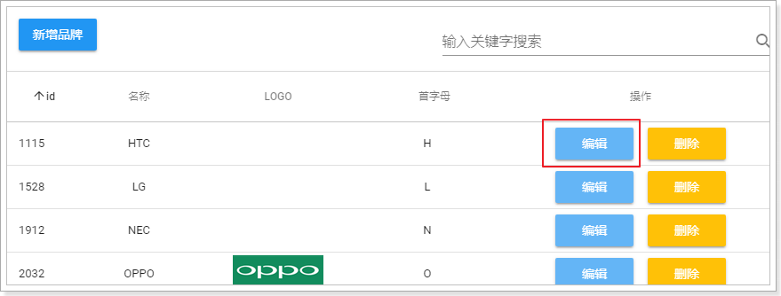


## 4.1.点击编辑出现弹窗

这个比较简单，修改show属性为true即可实现，我们绑定一个点击事件：

```html
<v-btn color="info" @click="editBrand">编辑</v-btn>
```

然后编写事件，改变show 的状态：

 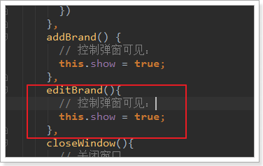

如果仅仅是这样，编辑按钮与新增按钮将没有任何区别，关键在于，如何回显呢？

## 4.2.回显数据

回显数据，就是把当前点击的品牌数据传递到子组件（MyBrandForm）。而父组件给子组件传递数据，通过props属性。

- 第一步：在编辑时获取当前选中的品牌信息，并且记录到data中

  先在data中定义属性，用来接收用来编辑的brand数据：

   

  我们在页面触发编辑事件时，把当前的brand传递给editBrand方法：

  ```html
  <v-btn color="info" @click="editBrand(props.item)">编辑</v-btn>
  ```

  然后在editBrand中接收数据，赋值给oldBrand：

  ```js
  editBrand(oldBrand){
    // 控制弹窗可见：
    this.show = true;
    // 获取要编辑的brand
    this.oldBrand = oldBrand;
  },
  ```

- 第二步：把获取的brand数据 传递给子组件

  ```html
  <!--对话框的内容，表单-->
  <v-card-text class="px-5">
      <my-brand-form @close="closeWindow" :oldBrand="oldBrand"/>
  </v-card-text>
  ```

- 第三步：在子组件中通过props接收要编辑的brand数据，Vue会自动完成回显

  接收数据：

   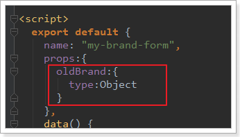

  通过watch函数监控oldBrand的变化，把值copy到本地的brand：

  ```js
  watch: {
      oldBrand: {// 监控oldBrand的变化
          handler(val) {
              if(val){
                  // 注意不要直接复制，否则这边的修改会影响到父组件的数据，copy属性即可
                  this.brand =  Object.deepCopy(val)
              }else{
                  // 为空，初始化brand
                  this.brand = {
                      name: '',
                      letter: '',
                      image: '',
                      categories: [],
                  }
              }
          },
              deep: true
      }
  }
  ```

  - Object.deepCopy 自定义的对对象进行深度复制的方法。
  - 需要判断监听到的是否为空，如果为空，应该进行初始化


测试：发现数据回显了，除了商品分类以外：

 


## 4.3.商品分类回显

为什么商品分类没有回显？

因为品牌中并没有商品分类数据。我们需要在进入编辑页面之前，查询商品分类信息：

### 4.3.1.后台提供接口

> #### controller

```java
/**
     * 通过品牌id查询商品分类
     * @param bid
     * @return
     */
@GetMapping("bid/{bid}")
public ResponseEntity<List<Category>> queryByBrandId(@PathVariable("bid") Long bid) {
    List<Category> list = this.categoryService.queryByBrandId(bid);
    if (list == null || list.size() < 1) {
        return new ResponseEntity<>(HttpStatus.NOT_FOUND);
    }
    return ResponseEntity.ok(list);
}
```


> Service

```java
public List<Category> queryByBrandId(Long bid) {
    return this.categoryMapper.queryByBrandId(bid);
}
```


> mapper

因为需要通过中间表进行子查询，所以这里要手写Sql：

```java
/**
     * 根据品牌id查询商品分类
     * @param bid
     * @return
     */
@Select("SELECT * FROM tb_category WHERE id IN (SELECT category_id FROM tb_category_brand WHERE brand_id = #{bid})")
List<Category> queryByBrandId(Long bid);
```

### 4.3.2.前台查询分类并渲染

我们在编辑页面打开之前，先把数据查询完毕：

```js
editBrand(oldBrand){
    // 根据品牌信息查询商品分类
    this.$http.get("/item/category/bid/" + oldBrand.id)
        .then(({data}) => {
        // 控制弹窗可见：
        this.show = true;
        // 获取要编辑的brand
        this.oldBrand = oldBrand
        // 回显商品分类
        this.oldBrand.categories = data;
    })
}
```


再次测试：数据成功回显了

 


### 4.3.3.新增窗口数据干扰

但是，此时却产生了新问题：新增窗口竟然也有数据？

原因：

​	如果之前打开过编辑，那么在父组件中记录的oldBrand会保留。下次再打开窗口，如果是编辑窗口到没问题，但是新增的话，就会再次显示上次打开的品牌信息了。


解决：

​	新增窗口打开前，把数据置空。

```js
addBrand() {
    // 控制弹窗可见：
    this.show = true;
    // 把oldBrand变为null
    this.oldBrand = null;
}
```


### 4.3.4.提交表单时判断是新增还是修改

新增和修改是同一个页面，我们该如何判断？

父组件中点击按钮弹出新增或修改的窗口，因此父组件非常清楚接下来是新增还是修改。

因此，最简单的方案就是，在父组件中定义变量，记录新增或修改状态，当弹出页面时，把这个状态也传递给子组件。

第一步：在父组件中记录状态：

 


第二步：在新增和修改前，更改状态：

 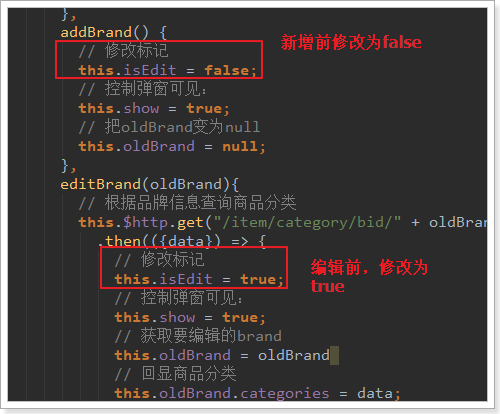

第三步：传递给子组件

 

第四步，子组件接收标记：

 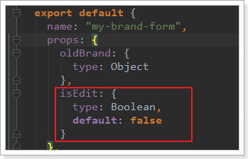


标题的动态化：

 

表单提交动态：

axios除了get和post外，还有一个通用的请求方式：

```js
// 将数据提交到后台
// this.$http.post('/item/brand', this.$qs.stringify(params))
this.$http({
    method: this.isEdit ? 'put' : 'post', // 动态判断是POST还是PUT
    url: '/item/brand',
    data: this.$qs.stringify(this.brand)  //？？？？  this.brand 还是params？？？
}).then(() => {
    // 关闭窗口
    this.$emit("close");
    this.$message.success("保存成功！");
})
    .catch(() => {
    this.$message.error("保存失败！");
});
```

将前端的put 修改为get（写put会报错，修改失败）

 


# 5.删除（作业）

 