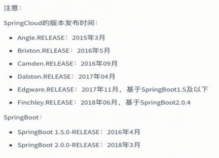

# 1.乐优商城介绍

## 1.1.项目介绍

 

## 1.2.系统架构

### 1.2.1.架构图

乐优商城架构图：

DevOps

nginx的负载均衡

CDN

### 1.2.2.系统架构解读

整个乐优商城可以分为两部分：后台管理系统、前台门户系统。

- 后台管理：

  - 后台系统主要包含以下功能：
    - 商品管理，包括商品分类、品牌、商品规格等信息的管理
    - 销售管理，包括订单统计、订单退款处理、促销活动生成等
    - 用户管理，包括用户控制、冻结、解锁等
    - 权限管理，整个网站的权限控制，采用JWT鉴权方案，对用户及API进行权限控制
    - 统计，各种数据的统计分析展示
  - 后台系统会采用前后端分离开发，而且整个后台管理系统会使用Vue.js框架搭建出单页应用（SPA）。
  - 预览图：

  

- 前台门户

  - 前台门户面向的是客户，包含与客户交互的一切功能。例如：
    - 搜索商品
    - 加入购物车
    - 下单
    - 评价商品等等
  - 前台系统我们会使用Nuxt结合Vue完成页面开发。出于SEO优化的考虑，我们将不采用单页应用。

  

无论是前台还是后台系统，都共享相同的微服务集群，包括：

- 商品微服务：商品及商品分类、品牌、库存等的服务
- 搜索微服务：实现搜索功能
- 订单微服务：实现订单相关
- 购物车微服务：实现购物车相关功能
- 用户中心：用户的登录注册等功能
- 认证中心：用户权限及服务权限认证
- Eureka注册中心
- Zuul网关服务
- Spring Cloud Config配置中心
- ...

## 1.3.技术选型

### 1.3.1.相关技术

前端技术：

- 基础的HTML、CSS、JavaScript（基于ES6标准）
- Vue.js 2.0以及基于Vue的UI框架：Vuetify
- 前端构建工具：WebPack
- 前端安装包工具：NPM
- Vue脚手架：Vue-cli
- Vue路由：vue-router
- ajax框架：axios
- 基于Vue的富文本框架：quill-editor
- Nuxt：服务端渲染

后端技术：

- 基础的SpringMVC、Spring 5.0.8和MyBatis 3.2.8
- Spring Boot 2.0.4版本
- Spring Cloud 最新版 Finchley.SR1
- Redis-4.0
- RabbitMQ-3.4
- Elasticsearch-6.2.4
- nginx-1.10.2
- FastDFS - 5.0.8
- Thymeleaf 3.0
- JWT

 

### 1.3.2.技术解读

上面的技术组合可以在项目中解决以下电商中的典型问题：

- 利用Node.js及Vue.js技术栈，实现前后端分离开发
- 利用SpringCloud技术栈，实现真正的微服务实战开发
- 贴近真实的电商数据库设计，解决全品类电商的SPU和SKU管理问题
- 基于FastDFS解决大数据量的分布式文件存储问题
- 基于Elasticsearch高级聚合功能，实现商品的智能过滤搜索
- 基于Elasticsearch高级聚合功能，实现销售业务的复杂统计及报表输出
- 基于LocalStorage实现离线客户端购物车，减轻服务端压力。
- 基于JWT技术及RSA非对称加密实现真正无状态的单点登录。
- 结合JWT和RSA非对称加密，自定义Feign过滤器实现自动化服务间鉴权，解决服务对外暴露的安全问题
- 基于阿里大于实现SMS功能，解决电商短信通知问题
- 基于RabbitMQ实现可靠消息服务，解决服务间通信问题
- 基于RabbitMQ实现可靠消息服务，解决分布式事务问题
- 使用微信SDK实现微信扫码支付，符合主流付款方式
- 基于Redis搭建高可用集群，实现可靠缓存服务即热点数据保存。

- 基于Redis和Mq来应对高可用高并发的秒杀场景
- 基于MyCat实现数据库的读写分离和分库分表

- 基于Thymeleaf实现页面模板和静态化，提高页面响应速度和并发能力
- 基于Nginx实现初步的请求负载均衡和请求限流
- 基于可靠消息系统实现分布式系统的柔性事务处理

 

 

 

 

 

 

# 2.有关面试

## 2.1、 自我介绍

简短，自然，突出要点。

- 个人信息
  -  简短，快速过。没人在意你叫什么，你老家是哪里的。
- 项目经验
  - 工作时长
  - 突出重点的项目，电商项目。简短描述即可，主要说下项目中的技术架构，亮点

 

## 1.2.你们项目的架构是怎样的？

我们整个项目采用的是前后端分离开发模式。

- 前端分为两部分：

  - 后台管理：主要面向的是数据管理人员，采用基于Vue的单页应用开发方式
  - 门户系统：面向的是客户，门户采用的是Vue结合Nuxt实现服务端渲染方式

- 后端

  后端采用基于SpringCloud的微服务架构，统一对外提供Rest风格接口，无论是后台管理还是门户系统都共享这些微服务接口，而微服务中通过JWT方式来识别用户身份，开放不同接口。

  到这里先不说了。如果继续追问微服务拆分粒度或者SpringCloud细节，再接着回答我们的服务拆分。

 

 

## 1.3、 公司的性质是什么？

外包（注意：最好说是外包公司，否则下面很多问题不好回答）

 

## 1.4、 你们开发的项目上线了吗？

上线了

## 1.5、 你们的项目能访问吗？域名是多少？

由于是外包项目、项目卖给谁都不知道、域名也不知道

 

 

## 1.6、 你们的项目卖了多少钱？

本人只是开发人员、并没有看到公司的合同、不知道卖了多少钱

 

## 1.7、 你们生产环境的服务器有多少台？

计划是20多台。具体不清楚，因为是外包

devops

32核 128G内存

整个微服务部署在docker环境下。

给客户计划是这样的：初期，除了nginx和Eureka及Zuul以外，其它服务基本都是单节点运行，大概有20左右台服务器，如果后续压力过大， 可以继续增加某些服务的节点备份。

计划的服务节点数量：

- nginx：1主，1备

- Eureka集群：2台
- Zuul集群：2台
- 配置中心（ConfigServer）：1台
- RabbitMQ：2台
- Redis：3台
- FastDFS：2台tracker，2台storage
- mysql数据库：1主，1备，2从
- elasticsearch：3台

- 商品服务：1台
- 文件上传服务：1台
- SMS服务：2台
- 搜索服务：2台
- 静态页服务：1台
- 用户中心：1
- 授权中心：2
- 购物车：1
- 订单：2

共计36个服务节点。

 

## 1.8、 你在项目中主要负责什么

我所在的小组主要负责后台系统的开发， 我主要做的是商品管理模块，不过也参与过一些 搜索系统、购物车系统的部分功能。

 

## 1.9、 你们团队有多少人？

四十多人。 

后端：不到30人吧，测试：5人，前端：5人，运维：3人，产品经理3人，项目经理：1人

后端团队又分为5组，每组负责一部分服务。

