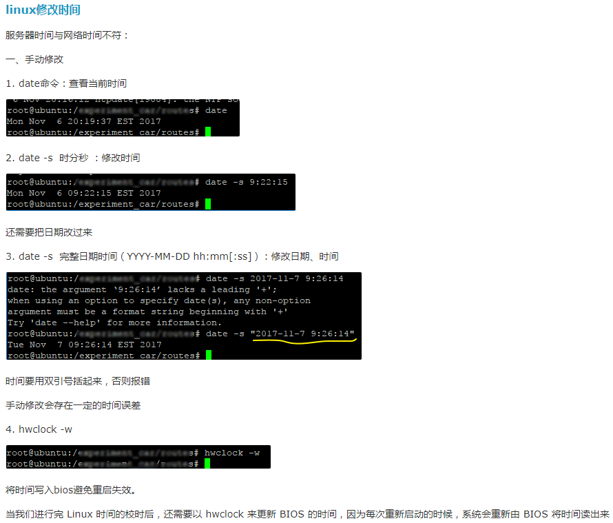

# 1.快照

安装软件之前，先做快照，如果失败还有备份，可以退回重新开始。


# 2.检查网卡ip

```
这时使用工具来连接linux进行操作
首先要获取虚拟机的IP地址，使用ifconfig命令，如果没有IP地址，则是没有设置开机时启动网上,设置操作如下
vim /etc/sysconfig/network-scripts/ifcfg-eth0 

TYPE=Ethernet  #以太网
BOOTPROTO=DHCP 	#dhcp方式分配网址           
NAME=eth0	#网卡名字
ONBOOT=yes #启动网卡：

:wq！保存并强制退出
:wq保存并退出

重启网络服务的命令：
service network restart


使用putty.exe连接linux

```

如果是==克隆虚拟机==，还需要修改MAC地址。（见《VMvare克隆虚拟机》）

。


**根据物理主机的ip地址，设置linux虚拟机的ip地址，并且网络设置为桥接模式。**

```
修改IP永久生效按以下方法
vi /etc/sysconfig/network-scripts/ifcfg-eth0（eth0，第一块网卡，如果是第二块则为eth1）

DEVICE=eth0        #虚拟机网卡名称。
TYPE=Ethernet
ONBOOT=yes　　      #开机启用网络配置。
NM_CONTROLLED=yes
BOOTPROTO=static      #static，静态ip，而不是dhcp，自动获取ip地址。
IPADDR=192.168.31.77　　#设置我想用的静态ip地址，要和物理主机在同一网段，但又不能相同。
NETMASK=255.255.255.0  #子网掩码，和物理主机一样就可以了。
GETWAY=192.168.31.1   #和物理主机一样
DNS1=8.8.8.8　　　　　　#DNS，写谷歌的地址就可以了。
HWADDR=00:0c:29:22:05:4c
IPV6INIT=no
USERCTL=no

IP地址生效，重启系统后不变

如果是临时修改IP重启系统后恢复原始IP则用以下命令
ifconfig IP地址 netmask 子网掩码


ifconfig eth0 up  #开启网卡
ifconfig eth0 down #关闭网卡


```

====网络设置为桥接模式==。才能联网

==然后重启服务==
service network restart





==Reboot [重启虚拟机]==


# 3.修改防火墙配置

1) 永久性生效，重启后不会复原

开启： chkconfig iptables on

关闭： chkconfig iptables off

 

需要重启电脑！

==Reboot [重启虚拟机]==

 

2) 即时生效，重启后复原

开启： service iptables start

关闭： service iptables stop

service iptables status可以查看到iptables服务的当前状态

 

 

3）打开防火墙指定端口：

防火墙打开3306端口

/sbin/iptables -I INPUT -p tcp --dport 3306 -j ACCEPT  

保存修改

/etc/rc.d/init.d/iptables save

查看状态

/etc/init.d/iptables status


# 4.Linux安装环境要求

Linux下切记不能乱删东西！我把pcre强制删除后，什么命令都不能使用了，系统奔溃，血的教训！


nginx是C语言开发，建议在linux上运行，本教程使用Centos6.4作为安装环境。

**一、  gcc**

       安装nginx需要先将官网下载的源码进行编译，编译依赖gcc环境，如果没有gcc环境，需要安装gcc：

　　yum install gcc-c++

**二、  PCRE**

       PCRE(Perl Compatible Regular Expressions)是一个Perl库，包括 perl 兼容的正则表达式库。nginx的http模块使用pcre来解析正则表达式，所以需要在linux上安装pcre库。

　　yum install -y pcre pcre-devel

注：pcre-devel是使用pcre开发的一个二次开发库。nginx也需要此库。

**三、  zlib**

       zlib库提供了很多种压缩和解压缩的方式，nginx使用zlib对http包的内容进行gzip，所以需要在linux上安装zlib库。

　　yum install -y zlib zlib-devel

 

**四、  openssl**

       OpenSSL 是一个强大的安全套接字层密码库，囊括主要的密码算法、常用的密钥和证书封装管理功能及SSL协议，并提供丰富的应用程序供测试或其它目的使用。
    
       nginx不仅支持http协议，还支持https（即在ssl协议上传输http），所以需要在linux安装openssl库。

　　yum install -y openssl openssl-devel


# 5.安装JDK

首先需要安装依赖：（这样安装完后才能查到java）

`yum install glibc.i686`


安装完Centos6.5的Base Server版会默认安装OpenJDK，首先需要删除OpenJDK

 

1、查看以前是不是安装了openjdk

如果不是root用户需要切换到root用户（su - root）

 

命令：rpm -qa | grep java

 

显示如下：（有则卸载，没有就不用），注意版本可能会有些不一样，以实际操作的为准。

tzdata-java-2013g-1.el6.noarch

java-1.7.0-openjdk-1.7.0.45-2.4.3.3.el6.x86_64

java-1.6.0-openjdk-1.6.0.0-1.66.1.13.0.el6.x86_64

 

2、卸载openjdk：

（其中参数“tzdata-java-2013j-1.el6.noarch”为上面查看中显示的结果，粘进来就行，如果你显示的不一样，请复制你查询到的结果）

 

rpm -e --nodeps  tzdata-java-2013g-1.el6.noarch

rpm -e --nodeps  java-1.7.0-openjdk-1.7.0.45-2.4.3.3.el6.x86_64

rpm -e --nodeps  java-1.6.0-openjdk-1.6.0.0-1.66.1.13.0.el6.x86_64

 

 

3、安装jdk

（1）、切换到root用户并进入usr目录： cd /usr

（2）、在usr目录下创建java文件夹： mkdir java

（3）、将jdk-7u71-linux-x64.tar.gz拷贝或上传到java目录下（也可以用工具）

 

（4）、进入/usr/java文件夹下：cd /usr/java/

（5）、修改权限，参数“jdk-7u71-linux-x64.tar.gz”为你自己上传的jdk安装文件

chmod 755 jdk-7u71-linux-x64.tar.gz

（6）、解压：tar –zxvf jdk-7u71-linux-x64.tar.gz

（7）、配置环境变量

vi /etc/profile

添加内容：

```
#set java environment
export JAVA_HOME=/usr/java/jdk1.8.0_201
export PATH=$PATH:$JAVA_HOME/bin
export CLASSPATH=.:$JAVA_HOME/lib/dt.jar:$JAVA_HOME/lib/tools.jar
export JAVA_HOME PATH CLASSPATH
```


（8）、重新编译环境变量

source /etc/profile


查看安装的版本：

java -version


# (未安装)6.安装Tomcat


 

1、进入tomcat压缩文件的目录中：cd /usr/local/myapp/

2、解压tomcat压缩文件：tar -zxvf apache-tomcat-7.0.57.tar.gz

 

3、关闭防火墙（永久，需要重启）：chkconfig iptables off

4、重启机器：reboot

 

注意，这里也可以只打开tomcat所需端口：8080

/sbin/iptables -I INPUT -p tcp --dport 8080 -j ACCEPT

/etc/rc.d/init.d/iptables save

/etc/init.d/iptables status

 

5、启动tomcat：

进入tomcat的bin目录：cd /usr/local/myapp/apache-tomcat-7.0.57/bin/

启动tomcat web服务器：./startup.sh

 

访问：192.168.56.101:8080

 

6、停止tomcat：./shutdown.sh

7、查看tomcat日志信息：

tail -200f /usr/local/myapp/apache-tomcat-7.0.57/logs/catalina.out

200表示最后显示行数

 

也可以用组合命令，启动并查看日志：

进入tomcat的bin目录

./startup.sh && tail -200f ../logs/catalina.out

 

设置tomcat开机启动

在/etc/rc.d/rc.local文件最后添加

export JAVA_HOME=/usr/java/jdk1.7.0_71

/usr/local/myapp/apache-tomcat-7.0.57/bin/startup.sh start

 

# (未安装)7.Linux下安装Mysql

1、查看是否有自带的MySql

查看：rpm -qa | grep mysql

                                                  

2、卸载自带的MySql

删除：rpm -e --nodeps 查看到的选项

   

3、解压缩

进入MySql目录 : cd /usr/local/myapp/

解压安装包：得到安装文件：

   

4、安装服务端

修改权限：chmod 777 MySQL-server-5.6.34-1.rhel5.x86_64.rpm

执行安装：rpm -ivh MySQL-server-5.6.34-1.rhel5.x86_64.rpm --nodeps --force

注：--nodeps --force 表示不检查依赖

 

 

5、安装客户端：client

修改权限：     chmod 777 MySQL-client-5.6.34-1.rhel5.x86_64.rpm

执行安装：     rpm -ivh MySQL-client-5.6.34-1.rhel5.x86_64.rpm --nodeps --force

 

 6、启动和关闭mysql

启动mysql：   service mysql start

关闭mysql：   service mysql stop

重启mysql:    service mysql restart

 

 

7、添加密码

/usr/bin/mysqladmin -u root password '123456'


 

错误1：

如果是安装的5.6，会生成随机密码：

                                                  

1）进入该文件查看密码

​         vi /root/.mysql_secret

2）使用这个密码登录mysql

​         mysql –uroot –p密码

3）修改密码

​         SET PASSWORD = PASSWORD('123');

 

 

错误2：

/usr/bin/mysqladmin: connect to server at 'localhost' failed

error: 'Can't connect to local MySQL server through socket '/var/lib/mysql/mysql.sock' (2)'

Check that mysqld is running and that the socket: '/var/lib/mysql/mysql.sock' exists!

可能是mysql服务启动失败，或者没有启动

 

ps –ef | grep mysql查看一下，是否有进程，如果没有，重新启动mysql服务

如果有，使用kill -9 进程id 来杀死mysql进程，重新启动

 

 

8、修改mysql的编码表

1）查看/etc下是否有my.cnf文件，如果有则删除

2）上传课前资料中的my.cnf到/etc下

3）重启mysql服务

​    service mysql restart

4）登录mysql,查看编码表

​    先登录mysql：

​    mysql –uroot –p123

查看编码表：

​    show variables like “%char%”;

 

5.5版本的同学：

1）切换到mysql目录：

​    cd /usr/share/mysql

2）复制my-small.cnf 到 /etc/my.cnf

​    cp my-small.cnf /etc/my.cnf

3）修改my.cnf,添加一些内容：

​    【client】下面添加：default-character-set = utf8

【mysqld】下面添加：character_set_server = utf8 

 

 

 

9、设置允许远程连接mysql

尝试使用远程连接，发现报错：

                                                  

 

 

（1）进入 mysql：

mysql -u root -p

（2）使用 mysql库 ：

use mysql;

（3）查看用户表 ：

SELECT `Host`,`User` FROM user;

（4）授权用户 ：

grant all privileges on *.* to root@'%' identified by '123456';

（5）强制刷新权限 ：

flush privileges;

 

10、配置MySQL自启动(可选操作)

1）加入到系统服务：

chkconfig --add mysql

2）自动启动：

chkconfig mysql on

3）查询列表：

chkconfig

 

 

在linux中执行shell脚本文件：

 

1、./xxx.sh

2、sh xxx.sh

 

# (未安装)8.部署项目到tomcat，并访问

 

1）将我们的usermanager.sql导入MySQL

​                                                           

 

2）将ROOT.war上传到tomcat下面的webapps目录

​    注意数据库的连接密码是否一致

3）访问192.168.56.101:8080/

 

# 9.创建用户

 

设置密码

`passwd leyou`


切换用户

```
su leyou
```


# 10.安装nginx

见笔记《6_商品分类及品牌查询》


# 11.Centos下安装和使用FastDFS

见笔记《7_品牌管理》

11.1.Centos下安装和使用FastDFS

11.2.导入图片到虚拟机

配置文件的配置，一定要cd到相应的目录。

# 12.安装elasticsearch和ik分词器

《10_Elasticsearch》

添加索引goods


# 13.nginx代理静态页面

《13_商品详情及静态化》

nginx代理静态页面